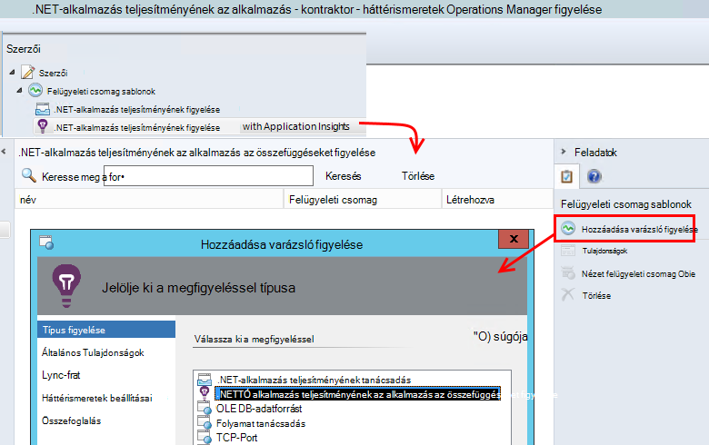
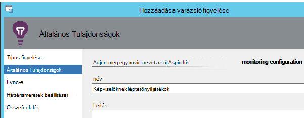
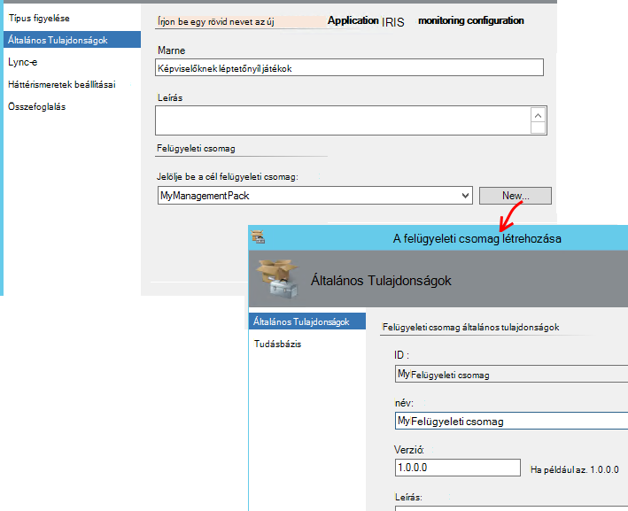
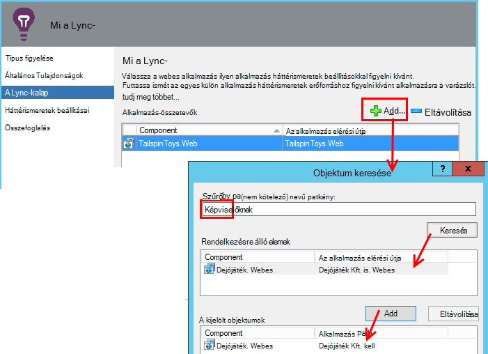
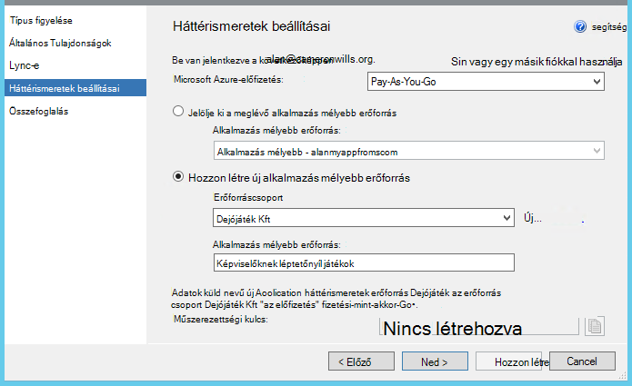
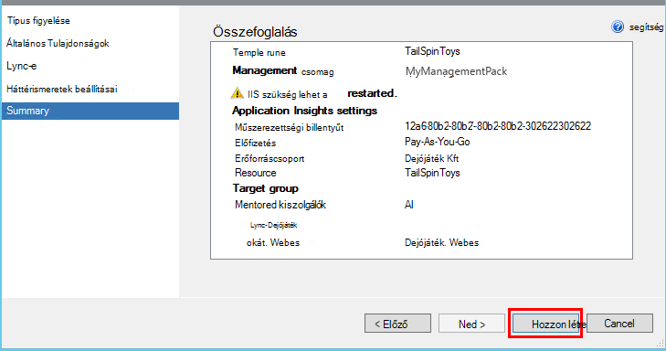
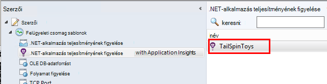
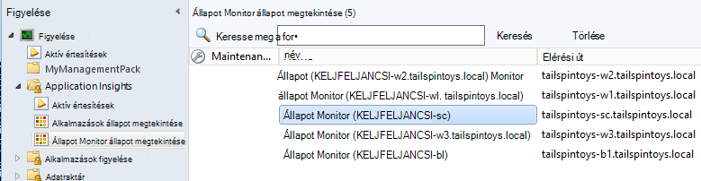

<properties 
    pageTitle="Alkalmazás háttérismeretek SCOM integrációja |} Microsoft Azure" 
    description="Ha egy SCOM-felhasználó, teljesítmény figyelését, és az összefüggéseket alkalmazás problémáinak diagnosztizálása. Teljes irányítópultok, intelligens riasztások, hatékony diagnosztikai eszközökkel és elemzési lekérdezések." 
    services="application-insights" 
    documentationCenter=""
    authors="alancameronwills" 
    manager="douge"/>

<tags 
    ms.service="application-insights" 
    ms.workload="tbd" 
    ms.tgt_pltfrm="ibiza" 
    ms.devlang="na" 
    ms.topic="article" 
    ms.date="08/12/2016" 
    ms.author="awills"/>
 
# Alkalmazás teljesítményét figyelve alkalmazás háttérismeretek SCOM verzióval

Ha System Center műveletek Manager (SCOM) használatával kezelheti a kiszolgálókat, teljesítmény figyelését, és [A Visual Studio alkalmazás háttérismeretek](app-insights-asp-net.md)segítségével teljesítménybeli problémáinak diagnosztizálása. Alkalmazás az összefüggéseket a webalkalmazás bejövő felkérést, figyeli a többi és a SQL hívásokat, a kivételek és a napló halad kimenő. A telemetriai fölé metrikus diagramok és intelligens értesítések, valamint hatékony keresés: a diagnosztikai és elemzési lekérdezések biztosít irányítópultok. 

A alkalmazás mélyebb figyelését egy SCOM felügyeleti csomag használatával válthat.

## Előzetes teendők

Feltételezzük:

* Már jól ismert SCOM és SCOM 2012 R2 vagy 2016-ban való használható kezelése az IIS webkiszolgálóhoz.
* Már telepítette az kiszolgálókon alkalmazás az összefüggéseket a figyelni kívánt webalkalmazás.
* Alkalmazás keretrendszer verziója .NET 4,5 vagy újabb verziója.
* Előfizetéshez hozzáférése van a [Microsoft Azure](https://azure.com) -ban és az [Azure portál](https://portal.azure.com)jelentkezhetnek be. A szervezet lehetnek az előfizetést, és tudja hozzáadni a Microsoft-fiókjával.

(A fejlesztőcsapatához létrehozhat az [Alkalmazás az összefüggéseket SDK](app-insights-asp-net.md) a webalkalmazásba. A Szerkesztés idejű műszerezettségi kattintanak egyéni telemetriai írásban nagyobb rugalmasság érdekében. Azonban nem számít: lépésekkel az itt leírt vagy anélkül a beépített SDK csomagjában talál.)

## (Egy idő) Telepítse az alkalmazást az összefüggéseket felügyeleti csomag

A számítógépen, ahová Operations Manager futtatása:

2. A felügyeleti csomag bármely régebbi verzióját eltávolítása:
 1. Operations Manager nyissa meg a felügyelet, Management csomagok. 
 2. Törölje a régi verzióját.
1. Töltse le és telepítse a felügyeleti csomag a katalógusról.
2. Indítsa újra az Operations Manager.

## A felügyeleti csomag létrehozása

1. Operations Manager nyissa meg a **létrehozást**, **... alkalmazás az összefüggéseket a .NET**, **Hozzáadása figyelése varázsló**, és ismét válassza a **.NET... az alkalmazás az összefüggéseket**.

    

2. A konfiguráció után az alkalmazás neve. (Kell egy alkalmazás eszköz egyszerre.)
    
    

3. Ugyanazon az oldalon varázsló hozzon létre egy új felügyeleti csomag, vagy jelöljön ki egyet, amely a korábban létrehozott az alkalmazás az összefüggéseket.

     (Az alkalmazás az összefüggéseket [felügyeleti csomag](https://technet.microsoft.com/library/cc974491.aspx) a egy sablont, amelyből példányt hoz létre. Újra felhasználhatja a példányt később.)

    

4. Válassza ki a figyelni kívánt egy alkalmazást. A keresés funkció keres az kiszolgálókon-alkalmazás között.

    

    A választható figyelés hatókör mezőben megadhatja a kiszolgálók, csak egy részhalmazát használható, ha azt szeretné, az alkalmazás az összes kiszolgálón a Lync.

5. A varázsló következő lapján meg kell adnia a hitelesítő adatait, és jelentkezzen be a Microsoft Azure.

    Ezen a lapon válassza az alkalmazás az összefüggéseket erőforrás, amelyhez elemezni, és megjelenik a telemetriai adatokat. 

 * Ha az alkalmazás lett állítva az alkalmazás az összefüggéseket fejlesztés során, jelölje ki a meglévő erőforrás.
 * Egyéb esetben hozzon létre egy új erőforrást, az alkalmazás neve. Ha más alkalmazásokat, amelyek azonos rendszer összetevői, akkor tegye a azonos erőforráscsoport könnyebb hozzáférés a telemetriai való kezelése.

    Később is módosíthatja ezeket a beállításokat.

    

6. A varázsló.

    
    
Ismételje meg ezt az eljárást mindegyik figyelni kívánt alkalmazásra.

Ha később beállításainak módosítása van szüksége, nyissa meg újra a létrehozást ablakból a monitor tulajdonságait.

## Ellenőrizze, hogy figyelése

A monitor, hogy telepítve van az alkalmazás keres az összes kiszolgálón. Ha úgy találja, hogy az alkalmazást, akkor adja meg az alkalmazás Hírcsatornájában állapot Monitor az alkalmazás figyelése. Ha szükséges, azt először telepíti az állapot Monitor a kiszolgálón.

Ellenőrizheti, hogy az alkalmazás melyik példányok azt talált:

## Az alkalmazás mélyebb megtekintése telemetriai

Keresse meg az alkalmazás az erőforrás az [Azure-portálon](https://portal.azure.com). [Lásd: telemetriai ábrázoló diagramok](app-insights-dashboards.md) , az alkalmazás. (Ha a meg nem a lapon látható fő még, kattintson élő mértékek adatfolyam.)

## Következő lépések

* A [irányítópult beállítása](app-insights-dashboards.md) a legfontosabb diagramok Ez és más alkalmazások figyelése eredményét.
* [Tudnivalók a mértékek](app-insights-metrics-explorer.md)
* [Értesítések beállítása](app-insights-alerts.md)
* [Teljesítménnyel kapcsolatos problémák diagnosztizálása](app-insights-detect-triage-diagnose.md)
* [Hatékony elemzés lekérdezések](app-insights-analytics.md)
* [Elérhetőség webes vizsgálatok](app-insights-monitor-web-app-availability.md)
