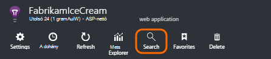
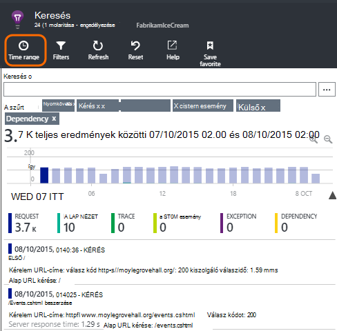
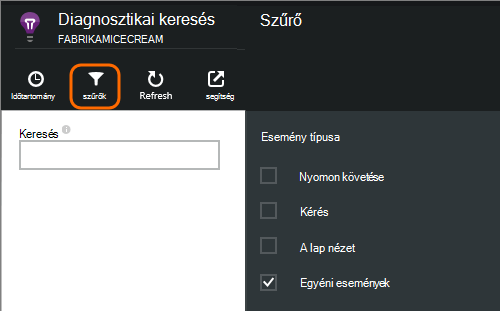
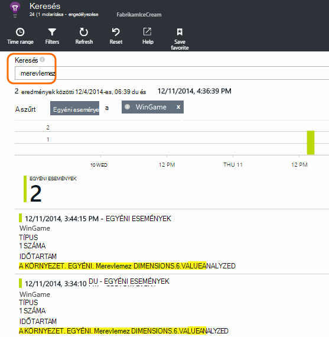
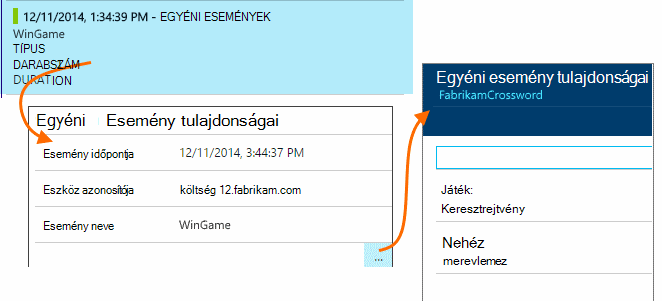
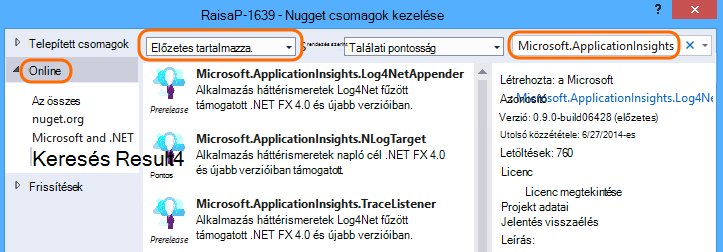
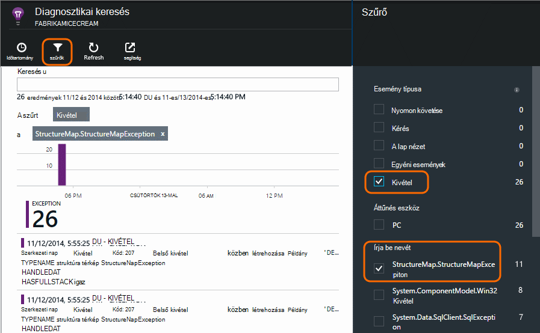

<properties 
    pageTitle="Naplók kivételeket és az alkalmazás az összefüggéseket ASP.NET egyéni diagnosztika" 
    description="ASP.NET webes alkalmazás problémáinak diagnosztizálása kérések kivételeket és nyomon követése, NLog vagy Log4Net létrehozott naplók kereséssel." 
    services="application-insights" 
    documentationCenter=""
    authors="alancameronwills" 
    manager="douge"/>

<tags 
    ms.service="application-insights" 
    ms.workload="tbd" 
    ms.tgt_pltfrm="ibiza" 
    ms.devlang="na" 
    ms.topic="article" 
    ms.date="04/08/2016" 
    ms.author="awills"/>
 
# Naplók kivételeket és az alkalmazás az összefüggéseket ASP.NET egyéni diagnosztika

[Alkalmazás háttérismeretek] [ start] tartalmaz egy hatékony [Diagnosztikai keresési] [ diagnostic] eszköz, amely lehetővé teszi, hogy feltárása és a levelezőprogramból az alkalmazás az összefüggéseket SDK által küldött telemetriai részletezést. Sok eseményt, például a felhasználói lap nézetek automatikusan küldik a SDK csomagjában talál.

Egyéni események, a kivétel jelentések és a nyomkövetési naplók küldése kód is írhat. És ha már használja például log4J, log4net, NLog vagy System.Diagnostics.Trace naplózás keretet, ezeket a naplók rögzíteni, és vegye fel őket a keresésbe. Ezzel megkönnyíti az napló halad összehangolására felhasználói műveletek, kivétel és más eseményeket.

## Egyéni telemetriai megírása előtt

Ha még még nem [állíthatja be az alkalmazás az összefüggéseket a projekt][start], most megtennie.

Küldésekor futtassa az alkalmazást, azt fog néhány telemetriai jelennek meg a diagnosztikai keresési, beleértve a kiszolgálóra, érkező kérések, oldal bejelentkezett, az ügyfél, a nézetek, és nem kivételek.

Nyissa meg a diagnosztikai keresés a telemetriai, amely automatikusan elküldi a SDK megjelenítéséhez.

A részletek eltérőek egy alkalmazás típusa között. Minden egyes esemény részletesebb megszerezni keresztül kattinthat.

## Mintavételnél 

Ha az alkalmazás küld az adatokat, és használja az alkalmazás az összefüggéseket SDK ASP.NET verzió 2.0.0-beta3 vagy újabb, a adaptív mintavételnél funkció működjön és küldése csak a telemetriai százalékában. [További tudnivalók a mintavételnél.](app-insights-sampling.md)

##Egyéni események

Egyéni események jelenik meg a [Diagnosztikai keresési] egyaránt[ diagnostic] és [Metrikus]Intézőben[metrics]. Az eszközök, a weblapok és a kiszolgáló alkalmazások elküldheti őket. Használt diagnosztikai célokra mind [szokásai]megértéséhez[track].

Egyéni esemény neve, és is végezheti tulajdonságok együtt a numerikus értékek, a szűrést.

JavaScript-ügyfél

    appInsights.trackEvent("WinGame",
         // String properties:
         {Game: currentGame.name, Difficulty: currentGame.difficulty},
         // Numeric measurements:
         {Score: currentGame.score, Opponents: currentGame.opponentCount}
         );

C# kiszolgálón

    // Set up some properties:
    var properties = new Dictionary <string, string> 
       {{"game", currentGame.Name}, {"difficulty", currentGame.Difficulty}};
    var measurements = new Dictionary <string, double>
       {{"Score", currentGame.Score}, {"Opponents", currentGame.OpponentCount}};

    // Send the event:
    telemetry.TrackEvent("WinGame", properties, measurements);

Visual Basic kiszolgálón

    ' Set up some properties:
    Dim properties = New Dictionary (Of String, String)
    properties.Add("game", currentGame.Name)
    properties.Add("difficulty", currentGame.Difficulty)

    Dim measurements = New Dictionary (Of String, Double)
    measurements.Add("Score", currentGame.Score)
    measurements.Add("Opponents", currentGame.OpponentCount)

    ' Send the event:
    telemetry.TrackEvent("WinGame", properties, measurements)

### Futtassa az alkalmazást, és tekintse meg az eredményeket.

Nyissa meg a diagnosztikai keresés.

Jelölje ki az egyéni esemény, és jelöljön ki egy adott esemény nevet.

Szűrheti az adatokat több keresési kifejezés beírásával a tulajdonság értéke.  

Lehatolhatnak egyes eseményre kattintva megtekintheti annak részletes tulajdonságait.

##Lap nézetek

Lap nézet telemetriai küldi el a trackPageView() hívás [a JavaScript kódtöredékének a weblapokhoz szúr be]a által[usage]. A fő célja, hogy szerkeszthetik azokat az Áttekintés oldalon megjelenő lap nézetek számát.

Általában ennek neve egyszer az egyes HTML-lap, de több hívást fogadni – például is beszúrhat, ha egy egyoldalas alkalmazás, és jelentkezzen be az új lap, valahányszor a felhasználó megkapja további adatokat szeretne.

    appInsights.trackPageView(pageSegmentName, "http://fabrikam.com/page.htm"); 

Érdemes időnként csatolása tulajdonságaik vannak, amelyek a diagnosztikai keresési szűrőket is használhatja:

    appInsights.trackPageView(pageSegmentName, "http://fabrikam.com/page.htm",
     {Game: currentGame.name, Difficulty: currentGame.difficulty});

##Telemetriai nyomon követése

Nyomkövetés telemetriai kódot, amely a diagnosztikai naplók létrehozásához kifejezetten beszúrása. 

Ha például sikerült beszúrása hívások jelennek meg:

    var telemetry = new Microsoft.ApplicationInsights.TelemetryClient();
    telemetry.TrackTrace("Slow response - database01");

####  A naplózás keretrendszer kártya telepítése

A naplózás keretrendszert - létrehozott naplók is kereshet log4Net, NLog vagy System.Diagnostics.Trace. 

1. Ha log4Net vagy NLog szeretne használni, akkor telepítse újra a projektben. 
2. A megoldás Intézőben kattintson a jobb gombbal a projekt, és válassza a **NuGet csomagok kezelése**.
3. Jelölje ki az Online > az összes, jelölje be a **Előzetes tartalmazza** , és keressen a "Microsoft.ApplicationInsights"

    

4. Jelölje ki a megfelelő csomag - egyikét:
  + Microsoft.ApplicationInsights.TraceListener (System.Diagnostics.Trace hívások rögzítéséhez)
  + Microsoft.ApplicationInsights.NLogTarget
  + Microsoft.ApplicationInsights.Log4NetAppender

A NuGet csomag telepíti a szükséges szerelvények, és is módosítja a web.config vagy app.config.

#### Diagnosztikai naplókban hívások beszúrása

System.Diagnostics.Trace használ, akkor tipikus hívást:

    System.Diagnostics.Trace.TraceWarning("Slow response - database01");

Ha jobban szereti a log4net és NLog:

    logger.Warn("Slow response - database01");

Az alkalmazás hibakeresési módban, vagy az üzembe.

Az üzenetek a diagnosztikai keresési megjelenik, akkor jelölje be a nyomkövetési szűrőt.

### A kivételek

Az alkalmazás az összefüggéseket a kivétel jelentések első nagyon nagy teljesítményű rendszer élményt biztosít, különösen akkor nyissa meg a sikertelen kérelmek és a kivételek között, és olvassa el a kivétel Papírhalom óta.

Egyes esetekben kell [néhány kódsorokat beszúrása] [ exceptions] , hogy a kivételek automatikusan úthasználóknak vannak.

Kivétel telemetriai küldése explicit kód is írhat:

A JavaScript

    try 
    { ...
    }
    catch (ex)
    {
      appInsights.TrackException(ex, "handler loc",
        {Game: currentGame.Name, 
         State: currentGame.State.ToString()});
    }

C#

    var telemetry = new TelemetryClient();
    ...
    try 
    { ...
    }
    catch (Exception ex)
    {
       // Set up some properties:
       var properties = new Dictionary <string, string> 
         {{"Game", currentGame.Name}};

       var measurements = new Dictionary <string, double>
         {{"Users", currentGame.Users.Count}};

       // Send the exception telemetry:
       telemetry.TrackException(ex, properties, measurements);
    }

VISUAL BASIC

    Dim telemetry = New TelemetryClient
    ...
    Try
      ...
    Catch ex as Exception
      ' Set up some properties:
      Dim properties = New Dictionary (Of String, String)
      properties.Add("Game", currentGame.Name)

      Dim measurements = New Dictionary (Of String, Double)
      measurements.Add("Users", currentGame.Users.Count)
  
      ' Send the exception telemetry:
      telemetry.TrackException(ex, properties, measurements)
    End Try

A tulajdonságok és mértékek paraméterek nem kötelező, de hasznos szűrés, és további információk hozzáadásához. Például ha az alkalmazás, amely futtatását is lehetővé teszi, hogy több játékok, találta a kivétel kapcsolódó összes jelentés egy adott mérkőzés szavakat. Annyi elemek szótárakat tetszés szerint hozzáadhat.

#### A kivételek megtekintése

Megjelenik a jelentett az Áttekintés lap kivételek összefoglalását, és kattinthat végig kapcsolatban további részletekre kíváncsi. Példa:

[]

Kattintson a kivétel bármilyen lásd: az adott előfordulás:

[]

Nyissa meg a diagnosztikai keresési közvetlenül, a kivételek szűrése, és válassza ki a használni kívánt kivétel.

### Kezelt kivételek jelentése

Alkalmazás háttérismeretek jelentések nem kezelt kivételek ahol azt is, eszközökről [böngészők][usage], vagy webkiszolgálóhoz, hogy [Állapota] felügyelő rendszereken[ redfield] vagy [Alkalmazás háttérismeretek SDK][greenbrown]. 

Azonban nem mindig tudni művelet bizonyos esetekben, mert a .NET-keretrendszer kezeli a kivételek.  Ellenőrizze, hogy látható, hogy az összes kivétel, ezért kell egy kis kivétel kezelő írni. Ajánlott eljárás a technológiával változik. Lásd: [az ASP.NET kivétel telemetriai] [ exceptions] további információt. 

### A építés használatával történik

A diagnosztikai naplók olvasása, akkor valószínű, hogy a forráskód óta a élő kódot telepítették fog megváltoztak.

Éppen ezért hasznos lehet ahhoz, hogy build adatai, például az URL-CÍMÉT az aktuális verziójának üzembe együtt minden egyes kivétel, illetve a nyomkövetési tulajdonságait. 

Helyett ad külön-külön a tulajdonság minden kivétel hívás, beállíthatja, hogy az adatokat az alapértelmezett környezetben. 

    // Telemetry initializer class
    public class MyTelemetryInitializer : ITelemetryInitializer
    {
        public void Initialize (ITelemetry telemetry)
        {
            telemetry.Properties["AppVersion"] = "v2.1";
        }
    }

Kattintson az alkalmazás inicializálója Global.asax.cs például:

    protected void Application_Start()
    {
        // ...
        TelemetryConfiguration.Active.TelemetryInitializers
        .Add(new MyTelemetryInitializer());
    }

###Webes kéréseket

Telemetriai küldi automatikusan mikor kérése [állapot Monitor webkiszolgálón telepíthető][redfield], vagy [adja hozzá az alkalmazás az összefüggéseket a webes projekthez][greenbrown]. Azt is hírcsatornák be a kérelem és válasz idő diagramok metrikus Explorer és az Áttekintés oldalon.

Ha szeretne további események küldése, a TrackRequest() API is használhatja.

## A kérdések és válaszok

### Hibaüzenet "műszerezettségi kulcs nem lehet üres"

Tűnik telepítve naplózás kártya Nuget háttérismeretek alkalmazás telepítése nélkül.

A megoldás Intézőben kattintson a jobb gombbal `ApplicationInsights.config` , és válassza a **Frissítés alkalmazása az összefüggéseket**. Szerezze be a párbeszédpanelt, amely felajánlja a jelentkezzen be az Azure, és hozza létre az alkalmazás az összefüggéseket erőforrás, vagy újra felhasználhat egy meglévőt. Ez célszerű oldja meg.

### Mennyi adatok megőrződnek?

Legfeljebb 500 események másodpercenként minden alkalmazásból. Események hét napig megőrződnek.

### Az események és a nyomkövetési naplók részét nem jelennek meg

Ha az alkalmazás küld az adatokat, és használja az alkalmazás az összefüggéseket SDK ASP.NET verzió 2.0.0-beta3 vagy újabb, a adaptív mintavételnél funkció működjön és küldése csak a telemetriai százalékában. [További tudnivalók a mintavételnél.](app-insights-sampling.md)

## Következő lépések

* [Elérhetőség és válaszidő vizsgálatok beállítása][availability]
* [Hibaelhárítás][qna]

<!--Link references-->

[availability]: app-insights-monitor-web-app-availability.md
[diagnostic]: app-insights-diagnostic-search.md
[exceptions]: app-insights-asp-net-exceptions.md
[greenbrown]: app-insights-asp-net.md
[metrics]: app-insights-metrics-explorer.md
[qna]: app-insights-troubleshoot-faq.md
[redfield]: app-insights-monitor-performance-live-website-now.md
[start]: app-insights-overview.md
[track]: app-insights-api-custom-events-metrics.md
[usage]: app-insights-web-track-usage.md

 
