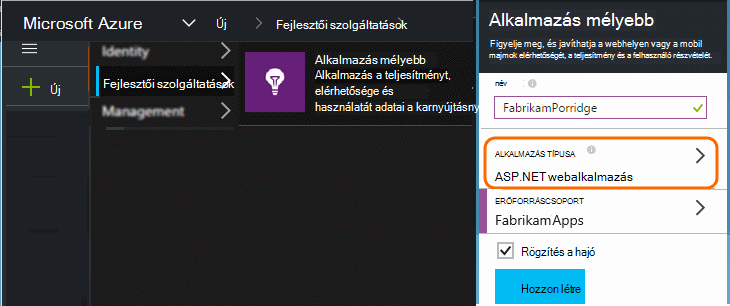
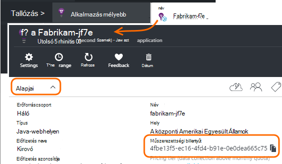

<properties 
    pageTitle="A fejlesztők, tesztelése és termelési külön alkalmazás háttérismeretek erőforrások" 
    description="A teljesítmény és az alkalmazás különböző szakaszaiban fejlesztés használatát figyelése" 
    services="application-insights" 
    documentationCenter=""
    authors="alancameronwills" 
    manager="douge"/>

<tags 
    ms.service="application-insights" 
    ms.workload="tbd" 
    ms.tgt_pltfrm="ibiza" 
    ms.devlang="na" 
    ms.topic="article" 
    ms.date="05/04/2016" 
    ms.author="awills"/>

# Elválasztó alkalmazás háttérismeretek erőforrások

Kell a különféle összetevőket és az alkalmazás verzióinak telemetriai másik alkalmazás háttérismeretek erőforrások küldött, vagy egy egyesítve? Ez a cikk a eljárások és a szükséges eljárások legjobb formátumban.

Először nézzük megérteni a kérdés. A alkalmazástól kapott adatokat tárolja, és a Microsoft Azure *erőforrás*alkalmazás háttérismeretek által feldolgozott. Az egyes erőforrások azonosítjuk *műszerezettségi kulcs* (iKey). Az alkalmazást, az a billentyűt kapja meg az alkalmazást az összefüggéseket SDK, hogy az adatokat gyűjt a megfelelő erőforrásnézethez küldhet. A kulcs biztosítható, hogy a kód vagy a ApplicationInsights.config. A kulcs a SDK módosításával irányítsa át más erőforrások az adatokat. 

Egy egyszerű lehetőséget választja amikor létrehoz egy új alkalmazáshoz a kódot is létrehozhat új erőforrás az alkalmazás az összefüggéseket. A Visual Studióban az *Új projekt* párbeszédpanel végzi meg.

Ha nagy mennyiségű webhelye, akkor a egynél több kiszolgálói példány előfordulhat, hogy telepíthető.

Összetettebb esetekben tevődnek össze több összetevők – például egy olyan webhelyet, és a háttéradatbázist feldolgozó rendszer van. 

## Mikor érdemes használni a külön iKeys

Az alábbiakban néhány tippet olvashat:

* Hol van a független telepíthető alkalmazás egységhez futtat kiszolgálókhoz definiálhat példányok felfelé/lefelé más összetevő, függetlenül a, majd meg szeretné általában feleltesse meg, hogy egy erőforrás - Ez azt jelenti, hogy lesz egy egyetlen műszerezettségi kulcs (iKey).
* Ezzel ellentétben külön iKeys használatának okai:
 - Egyszerűen olvasható külön mértékek külön összetevői.
 - Alsó – mennyiségi telemetriai, hogy szabályozásának, kvótákat, és kattintson egy adatfolyam mintavételnél nem befolyásolja a másik származó nagy mennyiségű, külön megtartani.
 - Külön riasztások, exportálása és elem konfigurációk működnek.
 - Húzza szét [korlátozások](app-insights-pricing.md#limits-summary) , például telemetriai kvóta, a szabályozási és a webes tesztelése száma.
 - Kód fejlesztés alatt és próba küldjön egy külön iKey, mint a termelési időbélyeg.  

Sok alkalmazás háttérismeretek portál tapasztalok a jelen irányelveket szem előtt készültek. Például a kiszolgálókat server-példányt végez azon a feltételezésen adott telemetriai kapcsolatos egy logikai összetevő származhatnak több kiszolgálói példány megtekintése szakaszokat.

## Egyetlen iKey

Ha elküldi telemetriai a több összetevők egy egyetlen iKey:

* Egy tulajdonságot, amely lehetővé teszi, hogy a szakasz és az összetevő identitás szűrő összes telemetriai hozzáadni. A szerepkör azonosító program automatikusan hozzáadja telemetriai kiszolgálói szerepkör-példányok, de más esetben a tulajdonság hozzáadása egy [telemetriai inicializálója](app-insights-api-filtering-sampling.md#add-properties) is használhatja.
* Frissítse az alkalmazás az összefüggéseket SDK a különböző összetevői egy időben. Az egyik iKey telemetriai SDK ugyanazzal a verzióval kell származnak.

## Külön iKeys

Hol van a különböző alkalmazásösszetevők több iKeys:

* A fő telemetriai nézetének [Irányítópult](app-insights-dashboards.md) létrehozása a logikai alkalmazásból, az eltérő alkalmazásösszetevők össze. Az irányítópultok megosztható, így a rendszer egyetlen logikai nézet használható különböző csoportok.
* [Az erőforrás csoportok](app-insights-resources-roles-access-control.md) csoport szintjén rendszerezheti. A hozzáférési engedélyek erőforráscsoport rendeli hozzá, és ezek közé tartozik az engedélyeket állíthat be értesítéseket. 
* [Azure erőforrás-kezelő sablonok és a Powershell](app-insights-powershell.md) használatával eltéréseket, például a riasztási szabályok kezelése, valamint a webes tesztek segítségével.

## A fejlesztők/próba és termelési külön iKeys

Az alkalmazás megjelenésekor automatikusan változtassa meg az kulcsot könnyebb beállíthatja a kód, a iKey helyett ApplicationInsights.config.

### Dinamikus műszerezettségi billentyűt

Egy inicializálni módszer, például egy ASP.NET szolgáltatásban global.aspx.cs kulcs beállítása:

*C#*

    protected void Application_Start()
    {
      Microsoft.ApplicationInsights.Extensibility.
        TelemetryConfiguration.Active.InstrumentationKey = 
          // - for example -
          WebConfigurationManager.AppSettings["ikey"];
      ...

Ebben a példában a különböző erőforrás ikeys kerülnek a webes konfigurációs fájl különböző verziói. A webes konfigurációs fájl – amelyek végezheti el a Megjelenés parancsfájl részeként - lecserélése a cél erőforrás cseréje jelölőnégyzetet.

### Weblapok

A iKey is használatban van az alkalmazás weblapok a [parancsfájlt, az első lépések lap kapott](app-insights-javascript.md). Helyett kódolási azt betűhíven be a parancsfájlt, készítése a kiszolgáló állam. Ha például az ASP.NET-alkalmazásokban:

*JavaScript Razor*

    <script type="text/javascript">
    // Standard Application Insights web page script:
    var appInsights = window.appInsights || function(config){ ...
    // Modify this part:
    }({instrumentationKey:  
      // Generate from server property:
      "@Microsoft.ApplicationInsights.Extensibility.
         TelemetryConfiguration.Active.InstrumentationKey"
    }) // ...

## További alkalmazások háttérismeretek erőforrás létrehozása
  
Ha úgy dönt, hogy a különböző alkalmazásösszetevők telemetriai külön, vagy az azonos összetevő különböző bélyegzőket (fejlesztők/próba/gyártási), majd, hogy hozzon létre egy új alkalmazás háttérismeretek erőforrást.

A [portal.azure.com](https://portal.azure.com), az alkalmazás az összefüggéseket erőforrás hozzáadása:

* **Alkalmazás típusa** hatással van az Áttekintés lap és a Tulajdonságok érhető el a [metrikus Intézőben](app-insights-metrics-explorer.md)megjelenő. Ha nem látja a alkalmazástípust, válassza a weblapokhoz típusok közül.
* **Erőforráscsoport** a könnyebb tulajdonságait, például a [hozzáférés-vezérlés](app-insights-resources-roles-access-control.md)kezelésére szolgáló. Fejlesztési, tesztelése és munkakörnyezeti használhatja is külön erőforrás csoportokat.
* **Előfizetés** a Azure fizetési-fiókjába.
* **Ha azt szeretné tartani az adatokat helye.** Jelenleg nem módosítható. 
* **Irányítópult hozzáadása** egy gyors elérést csempe az erőforrás helyezi az Azure kezdőlapját. 

Néhány másodpercet létrehozása az erőforrás vesz igénybe. Ha elkészült, látni fogja az értesítés.

(Egy [PowerShell-parancsprogramot,](app-insights-powershell-script-create-resource.md) hozzon létre egy erőforrást automatikusan írhat).

## Bevezetés a műszerezettségi billentyűt

A műszerezettségi billentyűt az Ön által létrehozott erőforrás azonosítja. 

Szüksége van a műszerezettségi kulcsok, amelyhez a erőforrások az alkalmazás elküldi az adatokat.

 
