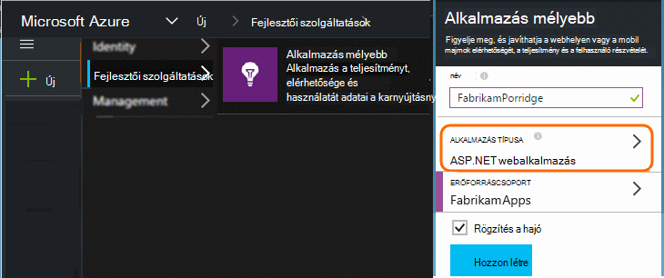
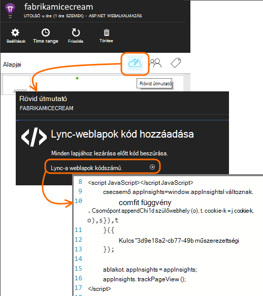
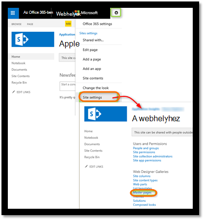
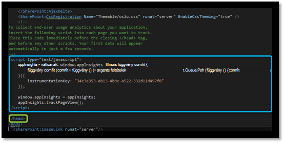
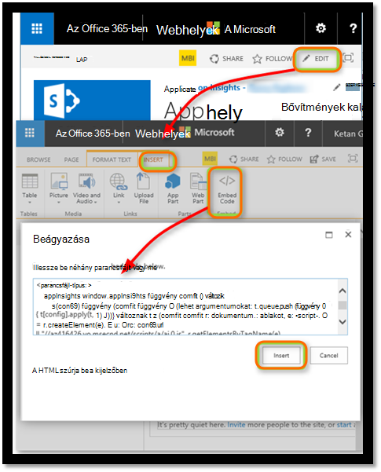
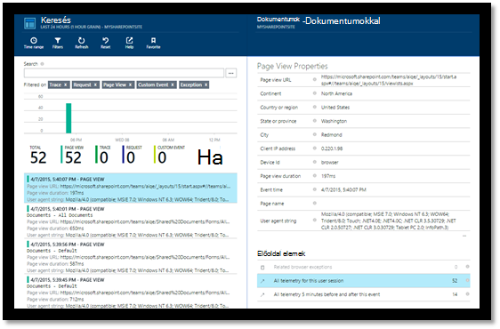
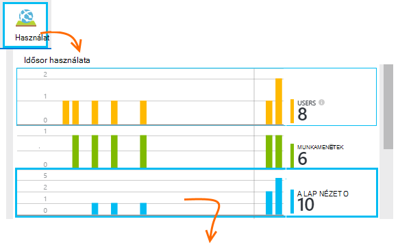
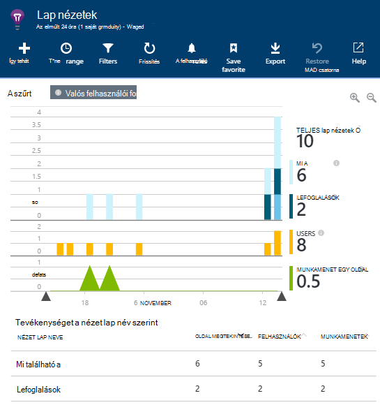
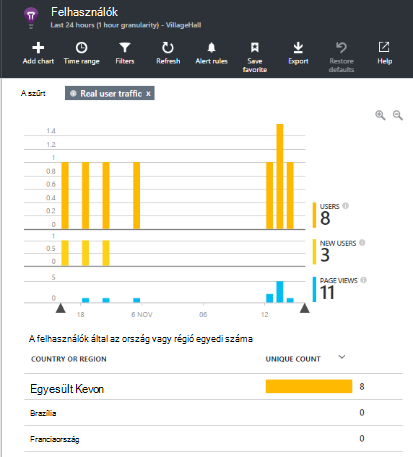
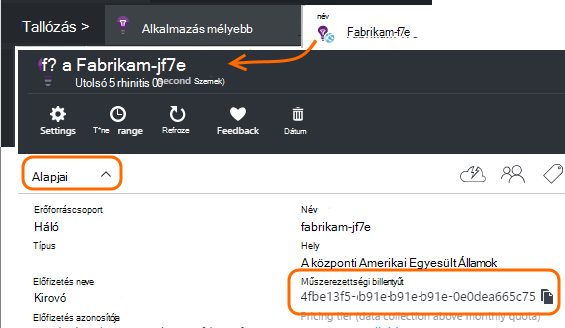

<properties 
    pageTitle="Lync-alkalmazás az összefüggéseket a SharePoint-webhelyen" 
    description="Új alkalmazás figyelése új műszerezettségi használatával" 
    services="application-insights" 
    documentationCenter=""
    authors="alancameronwills" 
    manager="douge"/>

<tags 
    ms.service="application-insights" 
    ms.workload="tbd" 
    ms.tgt_pltfrm="ibiza" 
    ms.devlang="na" 
    ms.topic="article" 
    ms.date="03/24/2016" 
    ms.author="awills"/>

# <a name="monitor-a-sharepoint-site-with-application-insights"></a>Lync-alkalmazás az összefüggéseket a SharePoint-webhelyen


Visual Studio alkalmazás háttérismeretek figyeli az elérhetőség, teljesítményét és -alkalmazások használatát. Itt kell megtudhatja, hogy miként SharePoint-webhely tagjának beállítja.


## <a name="create-an-application-insights-resource"></a>Hozzon létre egy alkalmazás háttérismeretek erőforrás


Az [Azure portál](https://portal.azure.com)hozzon létre egy új alkalmazás háttérismeretek erőforrás. ASP.NET válassza az alkalmazás típusa.




A megjelenő lap arra a helyre, ahol megjelenik teljesítményét és használati adatainak megtudni az alkalmazásról. Ha vissza szeretne lépni, következő bejelentkezéskor az Azure, keresse meg a mozaik, a kezdőképernyőn. Másik lehetőségként kattintson a Tallózás gombra, keresse meg azt.
    


## <a name="add-our-script-to-your-web-pages"></a>A parancsprogram hozzáadása a weblapokhoz

Első lépések a parancsfájl beszerzése a weblapok:



A parancsprogram csak előtt beszúrása a &lt;/központi&gt; minden oldalon, amelyeket nyomon szeretne követni a címkét. Ha a webhely mesterlap van, van elhelyezheti a parancsfájl. Például ASP.NET MVC projektben szeretne helyezi azt View\Shared\_Layout.cshtml

A parancsfájlt, amely arra utasítja az alkalmazás az összefüggéseket erőforrás a telemetriai műszerezettségi kulcsot tartalmazza.

### <a name="add-the-code-to-your-site-pages"></a>A kód hozzáadása a webhelylapok

#### <a name="on-the-master-page"></a>A diaminta lapon

Ha a hely mesterlap szerkesztéséhez, amely biztosít figyelése a webhely minden oldalán.

Nézze meg a mesterlapot, és a SharePoint Designer vagy bármely más szerkesztő szerkeszthető.




Adja hozzá a kódrészletet előtt csak a </head> címke. 




#### <a name="or-on-individual-pages"></a>Be- és oldalakra

Lync-lapok korlátozott számú, adja meg a parancsfájlt külön-külön minden lapjához. 

Kijelző beszúrása és beágyazása a kódtöredék bele.





## <a name="view-data-about-your-app"></a>Az alkalmazás kapcsolatos adatok megtekintése

Telepítsen újra az alkalmazást.

Térjen vissza az alkalmazás fel az [Azure-portálon](https://portal.azure.com).

Az első események keresési fog megjelenni. 



Ha több adatot várt, kattintson a frissítés néhány másodperc után.

Kattintson a **használati analitikát** látni, hogy a felhasználók, a munkamenetek és a lap nézetek diagramok az Áttekintés lap:



Kattintson az egyes diagramokra kattintva tekintse meg további részleteket – például lap nézetek:



Vagy a felhasználók:





## <a name="capturing-user-id"></a>Rögzítés a felhasználói azonosító


A szokásos weblap kódrészletet nem rögzítése a SharePoint-webhelyről a felhasználói azonosító, de egy kis módosítással végezheti el, amely.


1. Másolja az alkalmazás műszerezettségi billentyűt a Essentials legördülő menü az alkalmazás az összefüggéseket. 


    

2. Az alábbi kódtöredékének a "XXXX" helyettesítése a műszerezettségi billentyűt. 
3. A parancsprogram beágyazása a SharePoint-alkalmazás helyett a kódtöredék, letölthető a portálon.


```


<SharePoint:ScriptLink ID="ScriptLink1" name="SP.js" runat="server" localizable="false" loadafterui="true" /> 
<SharePoint:ScriptLink ID="ScriptLink2" name="SP.UserProfiles.js" runat="server" localizable="false" loadafterui="true" /> 
  
<script type="text/javascript"> 
var personProperties; 
  
// Ensure that the SP.UserProfiles.js file is loaded before the custom code runs. 
SP.SOD.executeOrDelayUntilScriptLoaded(getUserProperties, 'SP.UserProfiles.js'); 
  
function getUserProperties() { 
    // Get the current client context and PeopleManager instance. 
    var clientContext = new SP.ClientContext.get_current(); 
    var peopleManager = new SP.UserProfiles.PeopleManager(clientContext); 
     
    // Get user properties for the target user. 
    // To get the PersonProperties object for the current user, use the 
    // getMyProperties method. 
    
    personProperties = peopleManager.getMyProperties(); 
  
    // Load the PersonProperties object and send the request. 
    clientContext.load(personProperties); 
    clientContext.executeQueryAsync(onRequestSuccess, onRequestFail); 
} 
     
// This function runs if the executeQueryAsync call succeeds. 
function onRequestSuccess() { 
var appInsights=window.appInsights||function(config){
function s(config){t[config]=function(){var i=arguments;t.queue.push(function(){t[config].apply(t,i)})}}var t={config:config},r=document,f=window,e="script",o=r.createElement(e),i,u;for(o.src=config.url||"//az416426.vo.msecnd.net/scripts/a/ai.0.js",r.getElementsByTagName(e)[0].parentNode.appendChild(o),t.cookie=r.cookie,t.queue=[],i=["Event","Exception","Metric","PageView","Trace"];i.length;)s("track"+i.pop());return config.disableExceptionTracking||(i="onerror",s("_"+i),u=f[i],f[i]=function(config,r,f,e,o){var s=u&&u(config,r,f,e,o);return s!==!0&&t["_"+i](config,r,f,e,o),s}),t
    }({
        instrumentationKey:"XXXX"
    });
    window.appInsights=appInsights;
    appInsights.trackPageView(document.title,window.location.href, {User: personProperties.get_displayName()});
} 
  
// This function runs if the executeQueryAsync call fails. 
function onRequestFail(sender, args) { 
} 
</script> 


```


## <a name="next-steps"></a>Következő lépések

* [Webes vizsgálatok](app-insights-monitor-web-app-availability.md) az a webhelyen elérhető Lync.

* [Alkalmazás háttérismeretek](app-insights-overview.md) alkalmazás más típusú.


<!--Link references-->


 