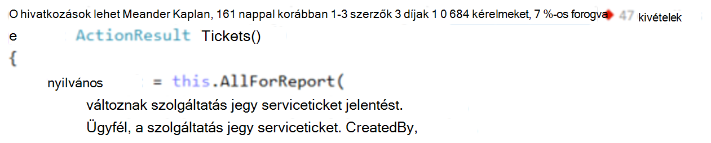
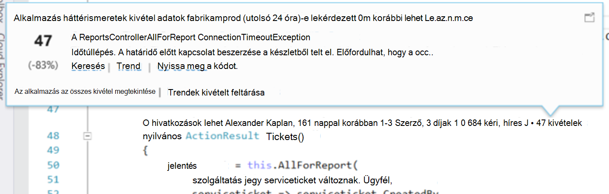
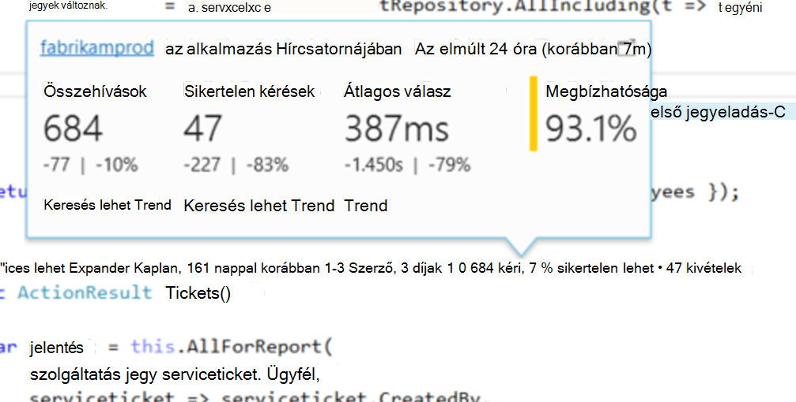
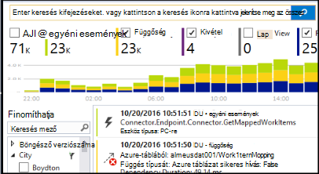
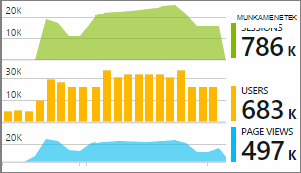

<properties 
    pageTitle="Alkalmazás háttérismeretek telemetriai a Visual Studio CodeLens |} Microsoft Azure" 
    description="Az alkalmazás az összefüggéseket kérést, és a kivétel telemetriai a Visual Studio CodeLens gyorsan elérhesse." 
    services="application-insights" 
    documentationCenter=".net"
    authors="numberbycolors" 
    manager="douge"/>

<tags 
    ms.service="application-insights" 
    ms.workload="tbd" 
    ms.tgt_pltfrm="ibiza" 
    ms.devlang="na" 
    ms.topic="get-started-article" 
    ms.date="08/30/2016" 
    ms.author="daviste"/>
    
# Alkalmazás háttérismeretek telemetriai a Visual Studio CodeLens

Módszerek a kódot a web App is kell vezetni telemetriai futási idejű kivételek adatai, és kérje a válaszidő. Ha telepíti a [Visual Studio alkalmazás háttérismeretek](app-insights-overview.md) az alkalmazásban, a telemetriai megjelenik Visual Studio [CodeLens](https://msdn.microsoft.com/library/dn269218.aspx) - tetején látható minden függvény, ahol Ön megszokott hasznos információt, például a helyek számát a függvény hivatkozott vagy az utolsó személy, aki szerkesztette a jegyzeteket.

> [AZURE.NOTE] Alkalmazás az összefüggéseket a CodeLens nem érhető el a Visual Studio 2015 frissítés 3 és újabb, vagy [Analytics Fejlesztőeszközök mellékre](https://visualstudiogallery.msdn.microsoft.com/82367b81-3f97-4de1-bbf1-eaf52ddc635a)legújabb verziójának. A Visual Studio vállalati és Professional kiadásában CodeLens érhető el.

## Alkalmazás háttérismeretek adatok megkeresése

Keresse meg a nyilvános kérelem módszerek a webalkalmazás CodeLens mutatók alkalmazás háttérismeretek telemetriai. CodeLens jelölők a fenti módszer és C# és a Visual Basic kód más deklarációs jelennek meg. Alkalmazás háttérismeretek adatok mód érhető el, ha látni fogja a jelölők kérelmek és a kivételek, például a "100 kéri, 1 %-os nem sikerült" vagy "10 kivételek." Kattintson egy CodeLens jelölő további információt. 

> [AZURE.TIP] Alkalmazás háttérismeretek kér, és a kivétel jelölők betöltése után jelennek meg a többi CodeLens mutató néhány további másodpercbe telhet.

## Kivételek a CodeLens

A kivétel CodeLens jelző, amely a leggyakrabban előforduló kivételeket az adott időszak alatt, a felszolgált módszerrel kérés feldolgozása közben alkalmazásban 15 az elmúlt 24 óra történtek kivételek számát mutatja.

További részletek megtekintéséhez kattintson a kivételek CodeLens mutató:

* A legutóbbi 24 óra viszonyított előzetes 24 órán belül alóli kivételek száma százalékos módosítása
* **Nyissa meg a kód** választva nyissa meg azt a függvény a kivétel értesítő a Forráskód
* Válassza a **Keresés** a kivétel összes előfordulását az elmúlt 24 óra történtek lekérdezése
* Válassza a **Trend** az elmúlt 24 órán belül a kivétel előfordulásait a trend adatábrázolás megtekintése
* Válassza **az alkalmazás az összes kivétel megtekintése** az elmúlt 24 óra előfordult összes kivétel lekérdezése
* Válassza a **Tallózás kivétel trendek** az összes kivételek az elmúlt 24 óra történtek trend megjelenítés megtekintéséhez. 

> [AZURE.TIP] Ha "0 kivételek" CodeLens látható, de tudja, hogy a kivételek kell lennie, ellenőrizze, hogy a megfelelő alkalmazás háttérismeretek erőforrás be van jelölve, a CodeLens. Jelölje ki a másik erőforrást, kattintson a jobb gombbal a projekt a megoldást Intéző, és válassza **alkalmazás háttérismeretek > Telemetriai forrás válassza a**. CodeLens csak akkor jelenik meg a 15 a legtöbb gyakran előforduló kivétel az elmúlt 24 órát, Igen, ha a kivételt 16 leggyakrabban vagy annál kisebb az alkalmazásban, látni fogja a "0 kivételek." ASP.NET-nézetek alóli kivételek a előfordulhat, hogy nem jelennek meg a vezérlő módszerek által generált ezeket a nézeteket.

> [AZURE.TIP] Ha megjelenik "? a kivételek"a CodeLens, meg kell feleltetnie az Azure-fiók a Visual Studio, vagy valószínűleg lejárt az Azure-fiók hitelesítő adatait. Bármelyik lehetőséget választja, kattintson a "? kivételek"és a hitelesítő adatok a **... fiók hozzáadása** gombra.

## CodeLens kérések

A kérés CodeLens jelző számát mutatja a HTTP-kérések, amely már az elmúlt 24 óra, valamint azokat a kérelmeket, amely nem sikerült százalékos módszerrel kiszolgált.

További részletek megtekintéséhez kattintson a kérések CodeLens jelző:

* A kérelmeket, sikertelen kérelmek és átlag válaszidő az elmúlt 24 óra és összehasonlítása az előzetes 24 órán keresztül szám abszolút és a százalékos megváltoztatása
* A módszer, a megbízhatóság függvény számítási módja: a százalékos kérést, amely nem fejeződött sikertelen az elmúlt 24 órán belül.
* Válassza a **Keresés** kérések és sikertelen kérelmek történt az elmúlt 24 órán belül (sikertelen) kérések lekérdezendő
* Válassza a **Trend** kérelmeket, sikertelen kérelmek vagy átlagos válaszidő trend adatábrázolás tekintheti meg az elmúlt 24 óra.
* Kattintson az alkalmazás az összefüggéseket erőforrás a CodeLens Részletek nézet módosítása melyik erőforrás CodeLens adatok forrása bal felső sarkában.

## Következő lépések

||
|---|---
|**[A Visual Studio alkalmazás háttérismeretek használata](app-insights-visual-studio.md)** Telemetriai keresése, CodeLens adatokat, és állítsa be az alkalmazás az összefüggéseket. Mindez a Visual Studio. |
|**[További adatok hozzáadása](app-insights-asp-net-more.md)** Lync-használatát, elérhetőségét, függőségek, a kivételek. Integráció a naplózás keretek nyomkövetések. Egyéni telemetriai írni. | 
|**[Az alkalmazás az összefüggéseket portál használata](app-insights-dashboards.md)** Az irányítópultok, sokoldalú analitikus és a diagnosztikai eszközök, értesítések, az alkalmazás és a telemetriai élő függőség térkép exportálhatja. |
