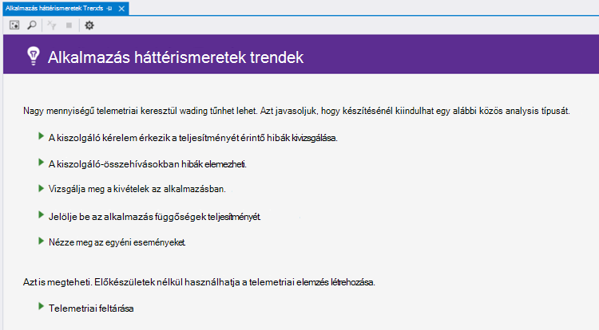
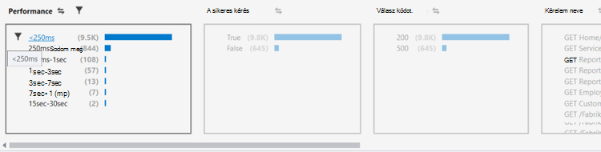
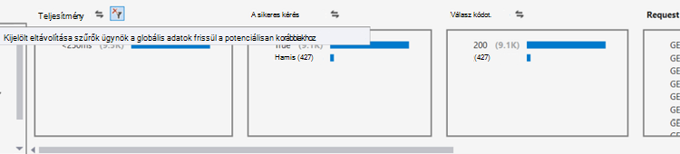
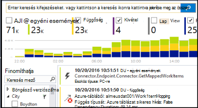

<properties 
    pageTitle="A Visual Studióban trendek elemzése |} Microsoft Azure" 
    description="Elemezni, feltárása és ábrázolása az alkalmazás az összefüggéseket telemetriai a Visual Studióban trendeket." 
    services="application-insights" 
    documentationCenter=".net"
    authors="numberbycolors" 
    manager="douge"/>

<tags 
    ms.service="application-insights" 
    ms.workload="tbd" 
    ms.tgt_pltfrm="ibiza" 
    ms.devlang="na" 
    ms.topic="get-started-article" 
    ms.date="10/25/2016" 
    ms.author="daviste"/>
    
# A Visual Studióban trendek elemzése

Az alkalmazás az összefüggéseket trendek eszköz megjeleníti, hogy hogyan az alkalmazás fontos telemetriai események időbeli változását, ezzel megkönnyítve gyors azonosítását problémák és anomáliák. Diagnosztikai részletesen mutató hivatkozással, trendek segítséget nyújtanak az alkalmazás teljesítményének javítása, a kivételek okok nyomon követése és az összefüggéseket a egyéni események Kihúzás.

> [AZURE.NOTE] Alkalmazás háttérismeretek trendek nem érhető el a Visual Studio 2015 frissítés 3 és újabb, vagy [Analytics Fejlesztőeszközök bővítmény](https://visualstudiogallery.msdn.microsoft.com/82367b81-3f97-4de1-bbf1-eaf52ddc635a) verziójával 5.209 vagy újabb verzió.

## Nyissa meg az alkalmazást az összefüggéseket trendek

Az alkalmazás az összefüggéseket trendek ablak megnyitásához:

* Válassza az alkalmazás az összefüggéseket eszköztárgombra **Telemetriai trendek Fedezze fel**, vagy
* A projekt helyi menüből válassza a **alkalmazás háttérismeretek > feltárása Telemetriai trendek**, vagy
* Válassza a Visual Studio menüsor **Nézet > egyéb Windows > alkalmazás háttérismeretek trendek**.

Jelölje ki az adott erőforrás egy üzenet jelenhet meg. Kattintson a **Válasszon egy erőforrást**, jelentkezzen be az Azure előfizetéssel, majd az alkalmazás az összefüggéseket erőforrás válassza a listából, amelynek meg szeretné telemetriai trendek elemzése.

## Válassza ki a trend-elemzés

Első lépések a öt gyakori tendenciát elemzések, minden az elmúlt 24 óra átláthatóbbá adatainak kiválasztása:

* **Vizsgálat teljesítménnyel kapcsolatos problémák a kiszolgáló kéréseivel** - kérések a szolgáltatásban, válaszidő csoportosítva.
* **A kiszolgáló-összehívásokban elemzés hibák** - kérések a szolgáltatásban, csoportosítva vannak HTTP válasz kódot.
* **Vizsgálja meg a kivételek az alkalmazás** - kivételeket a szolgáltatásból csoportosítva vannak kivételtípus
* **Jelölje be az alkalmazás függőségek teljesítményének** - szolgáltatások a szolgáltatás által nevű csoportosítva vannak válaszidő
* Esemény típusa szerint csoportosítva, **nézze meg az egyéni események** - egyéni események be van állítva a szolgáltatáshoz.

Beépített elemzések közül lehet választani később a trendek ablak bal felső sarkában a **telemetriai analysis elterjedt típusú nézet** gombra.

## Az alkalmazás trendek ábrázolása

Alkalmazás háttérismeretek trendek sorozat időmegjelenítés az alkalmazás telemetriai hoz létre. Adatsor minden időmegjelenítés egy adott típusú telemetriai, néhány időtartomány fölé, hogy a telemetriai egy tulajdonsága szerint csoportosítva jeleníti meg. Érdemes lehet például kiszolgáló kérelmeket, azok származási, az elmúlt 24 óra fölé ország szerint csoportosított megtekintéséhez. Ebben a példában egyes a megjelenítést a buborék volna jelenítik meg a kiszolgáló kéréseket néhány országhoz vagy régióhoz számának során egy órával.

Az ablak tetején a vezérlők használatával módosíthatja, milyen típusú telemetriai megtekintése. Első lépésként válassza ki a telemetriai, amelyben érdekli:

* **Telemetriai típus** - kiszolgálói kérelmek kivételeket, depdendencies és egyéni események
* **Időtartomány** - bárhol az utolsó 30 percig az utóbbi 3 napból
* **Csoportosítási szempont** - kivétel típusa, probléma azonosítója, ország/régió és az egyéb.

Kattintson az **Elemzés Telemetriai** futtassa a lekérdezést.

Keresse meg az ábrázolást buborékok között:

* Kattintással jelölje ki a buborék, amelyek csak egy adott időtartományban történt eseményeket összegzése, az ablak alján a szűrők frissíti
* Kattintson duplán egy buborék, nyissa meg azt a keresési eszközt, és látható a teljes az egyes telemetriai eseményeket, hogy mikor történt adott időszakon belül
* CTRL + kattintás egy buborék vonja jelölje ki a képi megjelenítésben.

> [AZURE.TIP] A trendek és a keresési eszközök segítséget nyújtanak a szolgáltatás között telemetriai események ezer problémák okait pinpoint közös munka. Ha például ha ügyfelei figyelje meg az alkalmazást egy délután folyamatban van kisebb válaszol, kezdje a trendek. Elemzése kérések a szolgáltatásban az elmúlt órákat fölé válaszidő szerint csoportosítva. Látható, hogy van-e egy rendkívül nagy fürthöz lassú megkeresések. Ezután kattintson duplán kattintva nyissa meg a keresési eszközben szűrve kérelem események adott buborék. A keresést ismerje meg azokat a kérelmeket tartalmát, és nyissa meg azt a részt vevő a probléma megoldásához a kódot.

## Szűrő

Fedezze fel az ablak alján a szűrő vezérlőket tartalmazó pontosabb trendek. A szűrő alkalmazásához kattintson a nevére. Különböző szűrők, előfordulhat, hogy az adott képpont a telemetriai kell elrejtésével trendek felderítésére könnyedén válthat. Kivételtípus, például a egyik dimenziója szűrő alkalmazása más dimenziók szűrők még kattintható annak ellenére, hogy jelennek meg szürkén jelenik meg. ENSZ-szűrő, kattintson rá. CTRL + kattintás, jelölje be az azonos dimenzió több szűrőt.

Mi történik, ha szeretne több szűrőt alkalmazni? 

1. Az első szűrő alkalmazása 
2. A **kijelölt szűrők és a lekérdezés ismételt alkalmazása** gombra a nevét az első szűrő dimenzió. A program újra lekérdezés a telemetriai csak az első szűrő egyező eseményekre vonatkozóan. 
3. A második szűrőt alkalmazni. 
4. Ismételje meg a trendek keresse meg a telemetriai adott részhalmazának folyamatot. Például kéréseket "GET-kezdőlap/Index" nevű _és_ Németország _és_ 500 válasz kódot fogadott kapott. 

ENSZ – ezek a szűrők valamelyikének alkalmazásával, a dimenzió a **kijelölt szűrők és lekérdezések újra eltávolítása** gombra.

## Rendellenességeinek megkeresése

A trendek eszköz kiemelheti a buborékok események, amelyek anomalous és összehasonlítása más buborékok az azonos idősorokat. A nézet típusa legördülő válassza **megszámolja az idő gyűjtő (kiemelés rendellenességeinek)** vagy a **százalékos arányt a time gyűjtő (kiemelés rendellenességeinek)**. Piros buborékok anomalous. Rendellenességeinek meghatározásuk szerint módosíthatja a 2.1-es időpontok szórását múltbeli megszámolja/százalékértékek meghaladó száma és százalékos értékekkel két időszakaira (48 óra Ha tekinti a legutóbbi 24 óra stb.).

> [AZURE.TIP] Kiemelés rendellenességeinek kiugró keresése az idősorok kis buborékok, egyéb esetben nézhetnek ki, különösen akkor hasznos hasonlóképpen melynek a mérete megegyezik.  

## Következő lépések

||
|---|---
|**[A Visual Studio alkalmazás háttérismeretek használata](app-insights-visual-studio.md)** Telemetriai keresése, CodeLens adatokat, és állítsa be az alkalmazás az összefüggéseket. Mindez a Visual Studio. |
|**[További adatok hozzáadása](app-insights-asp-net-more.md)** Lync-használatát, elérhetőségét, függőségek, a kivételek. Integráció a naplózás keretek nyomkövetések. Egyéni telemetriai írni. | 
|**[Az alkalmazás az összefüggéseket portál használata](app-insights-dashboards.md)** Az irányítópultok, sokoldalú analitikus és a diagnosztikai eszközök, értesítések, az alkalmazás és a telemetriai élő függőség térkép exportálhatja. |
