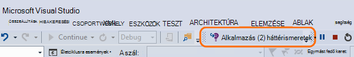
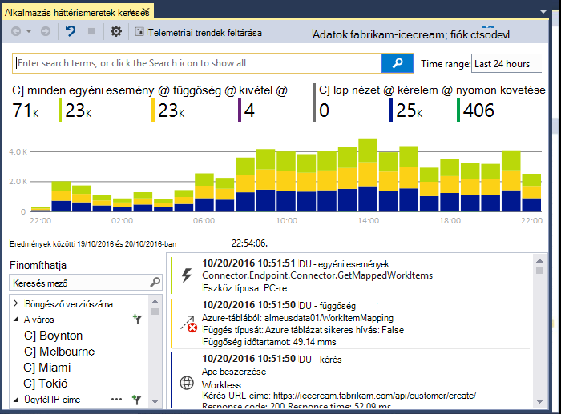
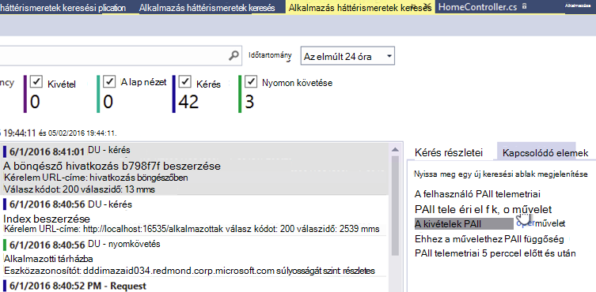
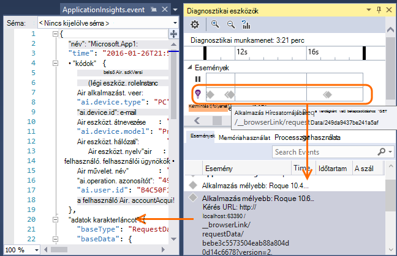
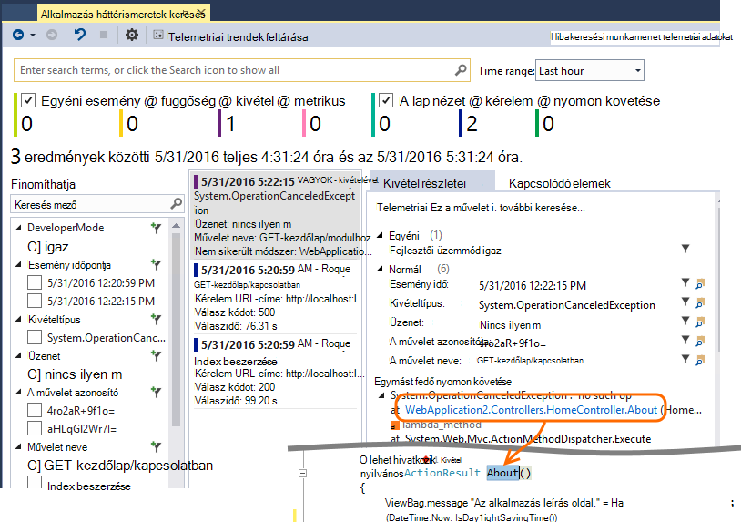
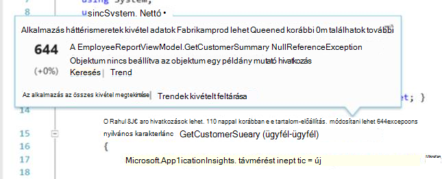
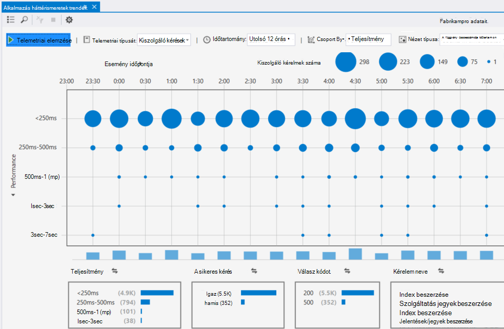

<properties 
    pageTitle="A Visual Studio háttérismeretek alkalmazás használata" 
    description="Teljesítményét elemzés és hibakeresés során, és a diagnosztikai." 
    services="application-insights" 
    documentationCenter=".net"
    authors="alancameronwills" 
    manager="douge"/>

<tags 
    ms.service="application-insights" 
    ms.workload="tbd" 
    ms.tgt_pltfrm="ibiza" 
    ms.devlang="na" 
    ms.topic="get-started-article" 
    ms.date="06/21/2016" 
    ms.author="awills"/>

# A Visual Studio alkalmazás háttérismeretek használata

A Visual Studióban (2015-ös vagy újabb verzió) teljesítményelemző, és a hibakereséshez és munkakörnyezeti, problémáinak diagnosztizálása, használja a [Visual Studio alkalmazás háttérismeretek](app-insights-overview.md)telemetriai.

Ha még még nem [Telepített alkalmazás háttérismeretek az alkalmazásban](app-insights-asp-net.md), hogy most tegye.

## A projekt hibakeresése

Futtassa az alkalmazást az F5 billentyűt, és próbálja ki: Nyissa meg a különböző lapokon néhány telemetriai létrehozásához.

A Visual Studióban látni fogja a naplózott események száma.

Erre a gombra kattintva nyissa meg a diagnosztikai keresés. 

## Diagnosztikai keresés

A Keresés ablak naplózott események jeleníti meg. (Ha bejelentkezik Azure alkalmazás háttérismeretek beállításakor, is kereshet az azonos események a portálon.)

Az események mezőinek működnek a szabad szöveges keresés. Például az oldal; az URL-cím keresése a visszaadott érték egy tulajdonság, például az ügyfél település; vagy nyomkövetési napló adott szavakat tartalmaz.

Kattintson bármelyik eseményre kattintva megtekintheti annak részletes tulajdonságait.

A kapcsolódó elemek lap sikertelen kérelmek vagy kivételeket diagnosztizálása segítségével is megnyithatja.

## Diagnosztikai központi

A diagnosztikai központi (a Visual Studio 2015 vagy újabb) látható az alkalmazás az összefüggéseket kiszolgáló telemetriai jön létre. Ez a módszer akkor is, ha azt választotta csak a SDK csomagjában talál, telepítése, ha egy erőforrás az Azure-portálon való csatlakozás nélkül.

## A kivételek

Ha [kivétel figyelése beállítása](app-insights-asp-net-exceptions.md), kivétel jelentések jelennek meg a Keresés ablakban. 

Kattintson a kivétel a Papírhalom nyomkövetési napló létrehozására. Ha az alkalmazás a kód nyissa meg a Visual Studióban, kattinthat végig a Papírhalom megrajzolt a megfelelő sorban, a kód.

Ezenkívül a kód Lens sorában mindegyik módszernek fölött, megjelenik az alkalmazás az összefüggéseket a az elmúlt 24 óra bejelentkezve kivételek számának.

## Helyi figyelése

(A Visual Studio 2015 Update 2) Ha még nem konfigurálta a SDK telemetriai küldeni az alkalmazás az összefüggéseket portal (, hogy nincs műszerezettségi kulcs a ApplicationInsights.config) a diagnosztika ablak megjelenítése a legújabb hibakeresési munkamenetből telemetriai. 

Ez akkor célszerű, ha már közzétett az alkalmazás egy korábbi verzióját. Nem szeretné, hogy a telemetriai a hibakeresési tanfolyamainkat, kell vegyesen a telemetriai az alkalmazás az összefüggéseket a portálon a közzétett alkalmazásból, az.

Érdemes emellett hasznos, ha van néhány [egyéni telemetriai](app-insights-api-custom-events-metrics.md) szeretné hibakeresése, mielőtt elküldené telemetriai a portálon.

* *Kezdetben e teljesen konfigurálva a telemetriai küldeni a portál alkalmazást az összefüggéseket. De most szeretném lásd: a csak a Visual Studio telemetriai.*

 * A Keresés ablak beállításai a rendszer felajánlja helyi diagnosztika keresni, akkor is, ha az alkalmazás telemetriai küld a portálon.
 * A portál küldött telemetriai leállításához megjegyzést, a sor `<instrumentationkey>...` a ApplicationInsights.config. Amikor készen áll a telemetriai ismét elküldeni a portálra, rész megjegyzésének törlése.

## Trendek

Trendek egy olyan eszköz, megjelenítésére, az alkalmazás működése idővel. 

Válasszon **Telemetriai trendek feltárása** az alkalmazás az összefüggéseket eszköztárgomb vagy alkalmazás háttérismeretek keresőablak. Válasszon egyet az öt általános lekérdezések kezdéshez. Telemetriai típusú, az idő tartományait és az egyéb tulajdonságokat alapján más adatkészleteket elemezheti. 

Az adatok rendellenességeinek megkereséséhez válassza a a rendellenességet beállítások területen az "Nézet típusa" legördülő menü. Az ablak alján a szűrési lehetőségek megkönnyítik az adott részhalmazának a telemetriai a hone.

[További információ a trendeket](app-insights-visual-studio-trends.md).

## Mi az következő?

||
|---|---
|**[További adatok hozzáadása](app-insights-asp-net-more.md)** Lync-használatát, elérhetőségét, függőségek, a kivételek. Integráció a naplózás keretek nyomkövetések. Egyéni telemetriai írni. | 
|**[Az alkalmazás az összefüggéseket portál használata](app-insights-dashboards.md)** Az irányítópultok, sokoldalú analitikus és a diagnosztikai eszközök, értesítések, az alkalmazás és a telemetriai élő függőség térkép exportálhatja. |

 
