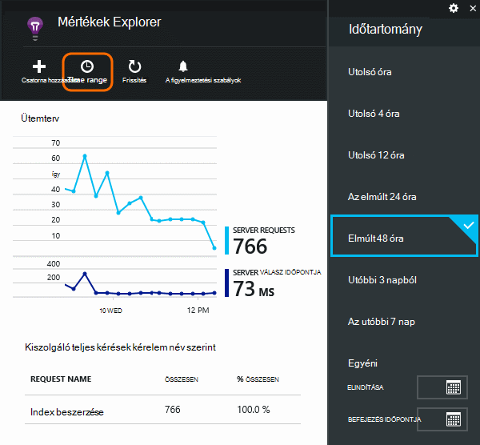
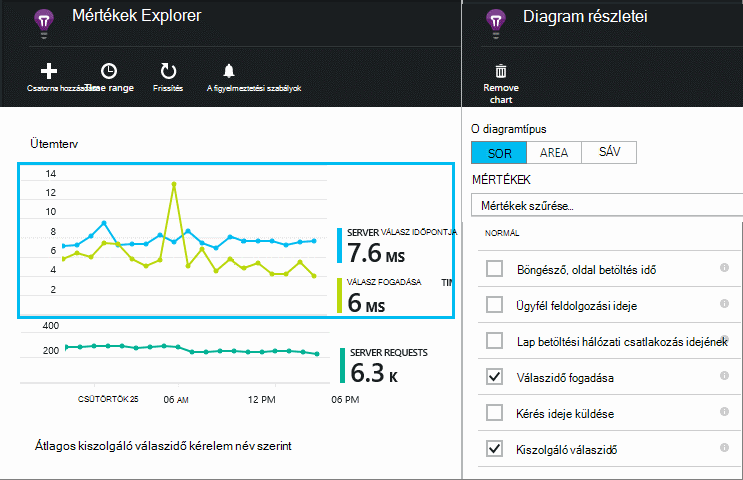
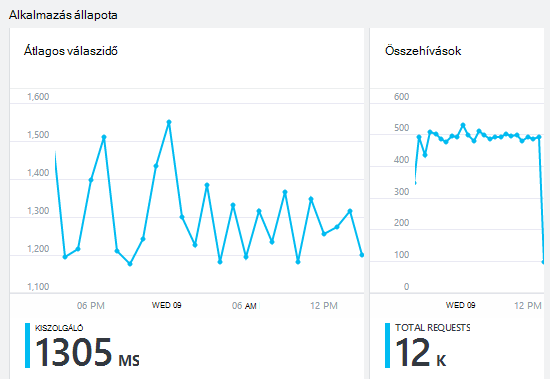
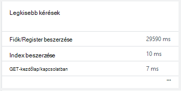
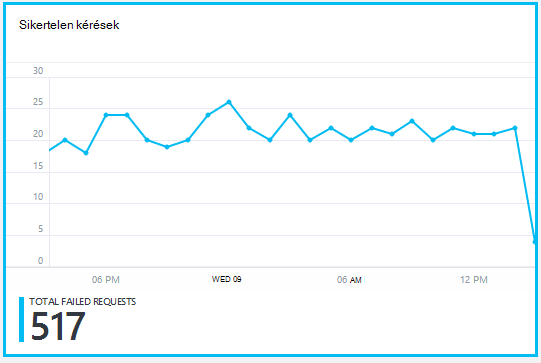
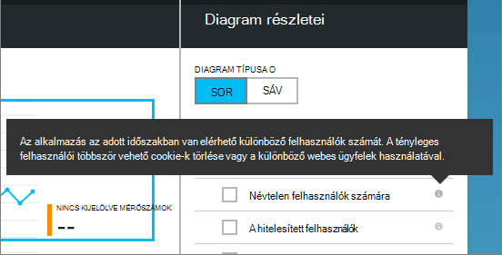
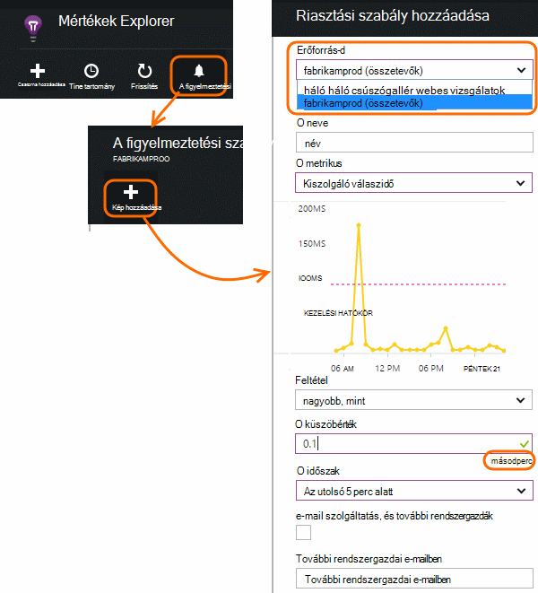

<properties 
    pageTitle="Az alkalmazás állapot és az alkalmazás az összefüggéseket használatát figyelése" 
    description="Első lépések az alkalmazás az összefüggéseket. Használatát, elérhetősége és a helyszíni, vagy a Microsoft Azure-alkalmazások teljesítmény elemzése." 
    services="application-insights" 
    documentationCenter=""
    authors="alancameronwills" 
    manager="douge"/>

<tags 
    ms.service="application-insights" 
    ms.workload="tbd" 
    ms.tgt_pltfrm="ibiza" 
    ms.devlang="na" 
    ms.topic="article" 
    ms.date="11/25/2015" 
    ms.author="awills"/>
 
# A webalkalmazások teljesítményének figyelése

*Alkalmazás háttérismeretek az előzetes verzióban.*

Győződjön meg arról, hogy az alkalmazás rosszul, és ismerje meg gyorsan kapcsolatos hibák. [Alkalmazás háttérismeretek] [ start] tájékoztatása az teljesítménnyel kapcsolatos problémák és a kivételek, és keresse meg és a legfelső szintű okok diagnosztizálása.

Alkalmazás háttérismeretek figyelheti Java- és ASP.NET webalkalmazások és a szolgáltatások, a WCF-szolgáltatások. Ez lehet helyszíni, vagy a Microsoft Azure-webhelyek virtuális gépeken futó. 

Az ügyféloldalon alkalmazás az összefüggéseket a weblapok és számos különböző eszköz, többek között az iOS, Androidon és Windows áruház-alkalmazás telemetriai is tarthat.

## Teljesítményét figyelve beállítása

Ha még nem vett alkalmazás az összefüggéseket a projekthez (ha ApplicationInsights.config nincsenek), hajtsa végre az alábbi módszerek kezdéshez:

* [ASP.NET web Apps alkalmazások](app-insights-asp-net.md)
 * [Adja hozzá a kivétel figyelése](app-insights-asp-net-exceptions.md)
 * [Adja hozzá a függőség figyelése](app-insights-monitor-performance-live-website-now.md)
* [J2EE web Apps alkalmazások](app-insights-java-get-started.md)
 * [Adja hozzá a függőség figyelése](app-insights-java-agent.md)

## Teljesítménymutatók felfedezése

Keresse meg az alkalmazást az összefüggéseket erőforrás, hogy az alkalmazás beállítása [az Azure-portálra](https://portal.azure.com). Az Áttekintés lap egyszerű teljesítménnyel kapcsolatos adatokat jeleníti meg:

Kattintson az egyes diagramokra részletek megtekintéséhez, és az eredmények megtekintéséhez hosszabb ideig. Kattintson például a kérések csempét, és válassza a egy időtartományt:

Kattintson egy diagramra, mely akkor jelenik meg, vagy új diagram hozzáadása és jelölje ki a mértékek Mértékek kiválasztása:

> [AZURE.NOTE] **Törölje a jelet az összes mértékek** a teljes kijelölés elérhető megjelenítéséhez. A mérési módja miatt; csoportokba tartoznak Ha bármely tagja csoport ki van jelölve, csak a csoport többi tagja, hogy jelennek meg.

## Mit jelent ez az összes? Csempék teljesítmény és a jelentések

Nincs elérheti teljesítménymutatók számos. Kezdjük azokat, amelyek alapértelmezés szerint az alkalmazás lap a jelennek meg.

### Kérések

Az adott időszakra fogadott HTTP kérelmek száma. Összehasonlítása a más jelentésekben, hogy hogyan az alkalmazás úgy viselkednek, mint a betöltés az eredmények változik.

HTTP-kérések lapokat, az adatok és a képeket az összes GET- vagy BEJEGYZÉSBE kérelem tartalmazzák.

Kattintson a megszámolja beszerzése adott URL-címek csempére.

### Átlagos válaszidő

Az alkalmazás és a visszaadott válasz webes kérelem között eltelt idő intézkedéseket.

A címzett pontok megjelenítése mozgó átlag. Ha sok kérelmeket, előfordulhat, hogy bizonyos, amelyek eltérnek a egy egyértelmű csúcs nélkül az átlag vagy a diagram mártsuk.

Keresse meg a szokatlan csúcsok. Az általános várt válaszidő a kérések növekvő növekszik. Ha az okot aránytalan, előfordulhat, hogy az alkalmazás szerezze erőforrás korlátozott például Processzor vagy egy szolgáltatást, akkor használja a kapacitása.

Kattintson a hányszor beszerzése adott URL-címek csempére.

### Legkisebb kérések

Jeleníti meg, amelyekhez teljesítményhangolás lehet szükség.

### Sikertelen kérések

Nem kivételek okozott összehívások számát.

A csempére kattintva a részleteinek adott hibákat, és válassza a felkérés egyes a részletek megjelenítéséhez. 

Csak példákat hibák tartja meg az egyes ellenőrzésre.

### Más mérőszámok

Olvassa el a mi egyéb mértékek megjeleníteni, kattintson a diagram, és törölje a jelölést a rendelkezésre álló teljes megtekintéséhez minden mérőszám értékre. Minden egyes metrikus meghatározása megtekintéséhez kattintson az (i).

Tetszőleges metrikus kijelölése letiltása a többi, amelyek nem jelennek meg a ugyanezen a diagramon.

## Értesítések beállítása

Ha értesítést szeretne kapni minden olyan mérőszám szokatlan értékek mailben, értesítés hozzáadása Megadhatja, akár az e-mailt küldeni, a fiók rendszergazdái, illetve bizonyos e-mail címét.

Állítsa az erőforrás, mielőtt a Tulajdonságok parancsot. Ne válassza ki az webtest erőforrásokat, ha be szeretné állítani az értesítések használatát és működésére mérési módja miatt.

Vigyázzon, vegye figyelembe az erőforrás-mennyiség, amelyben megkérdezi, hogy írja be a küszöbértéket.

*Nem látható a felhasználó hozzáadása gombra.* -Csoport, akkor a fiókot, amely csak olvasható hozzáféréssel rendelkezik? Kérdezze meg a fiók rendszergazda.

## Problémák diagnosztizálása

Íme néhány tipp való megkereséséről és teljesítménnyel kapcsolatos problémák diagnosztizálása:

* Állítsa be a [webes vizsgálatok] [ availability] értesítést, ha a webhely megszakad, vagy válaszoljon helytelen vagy lassabban. 
* Összehasonlíthatja a kérelem számát adja meg a többi mértékek betöltése kapcsolatos hibák vagy lassú válasz megtekintéséhez.
* [Beszúrása és a keresés nyomkövetési kimutatások] [ diagnostic] kódban problémák pinpoint érdekében.

## Következő lépések

[Teszteket a webes] [ availability] – az alkalmazás a világon a rendszeres időközönként web-összehívások van.

[Rögzíthet és diagnosztikai halad keresése] [ diagnostic] - hívások nyomon beszúrása és az eredmények problémák pinpoint átfésülendő.

[Követés használatát] [ usage] -meg, hogy miképpen használják az alkalmazást.

[Hibaelhárítás] [ qna] - és a kérdések és válaszok

## A videó

[AZURE.VIDEO performance-monitoring-application-insights]

<!--Link references-->

[availability]: app-insights-monitor-web-app-availability.md
[diagnostic]: app-insights-diagnostic-search.md
[greenbrown]: app-insights-asp-net.md
[qna]: app-insights-troubleshoot-faq.md
[redfield]: app-insights-monitor-performance-live-website-now.md
[start]: app-insights-overview.md
[usage]: app-insights-web-track-usage.md

 
