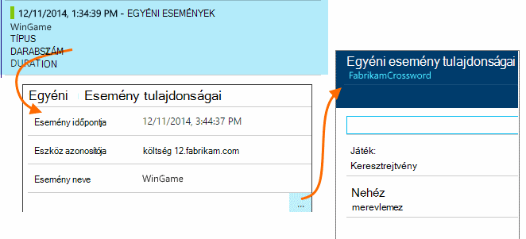

<properties 
    pageTitle="Az alkalmazás az összefüggéseket a webalkalmazások használatát-elemzés" 
    description="Használati elemzésének az alkalmazás az összefüggéseket a web Apps alkalmazások áttekintése" 
    services="application-insights" 
    documentationCenter=""
    authors="alancameronwills" 
    manager="douge"/>

<tags 
    ms.service="application-insights" 
    ms.workload="tbd" 
    ms.tgt_pltfrm="ibiza" 
    ms.devlang="na" 
    ms.topic="article" 
    ms.date="06/12/2016" 
    ms.author="awills"/>
 
# <a name="usage-analysis-for-web-applications-with-application-insights"></a>Az alkalmazás az összefüggéseket a webalkalmazások használatát-elemzés

Arra, hogy miképpen használják a alkalmazás lehetővé teszi a fejlesztés munka koncentráljon az jelenik meg, hogy a legfontosabbak őket, és szerezhet be, hogy könnyebben vagy nehezebben eléréséhez megtalálják a célok az összefüggéseket. 

Visual Studio alkalmazás háttérismeretek nyújt kétszintű követés használatát:

* **A felhasználók, a munkamenet és a lapon megtekintheti az adatokat** - beépített megadva.  
* **Egyéni telemetriai** - [kódírás] [ api] az alkalmazás felhasználói felület és a felhasználók nyomon követéséhez. 

## <a name="setting-up"></a>Beállítása

Nyissa meg az alkalmazás az összefüggéseket erőforrás az [Azure-portálon](https://portal.azure.com)kattintson a böngésző lap üres terhelések diagramot, és végezze el a beállítási lépéseket.

[tudj meg többet](app-insights-javascript.md) 


## <a name="how-popular-is-my-web-application"></a>Hogyan népszerű van a saját webalkalmazás?

Jelentkezzen be az [Azure portál][portal], tallózással keresse meg az alkalmazás erőforrást, és kattintson a használat elemre:


* **Felhasználók:** A diagram időtartomány fölé különböző az aktív felhasználók számát. 
* **Munkamenetek:** Az aktív munkamenet darabszámát
* **Lap nézetek** Megszámolja a számot trackPageView(), neve általában egyszer minden az weblapon hívásainak.

Kattintson a részletek megtekintéséhez diagramokat. Figyelje meg, hogy a diagramok időtartomány módosíthatja.

### <a name="where-do-my-users-live"></a>Ha live a a felhasználók számára?

A felhasználók diagram részletek megtekintéséhez kattintson a használat lap:


 
### <a name="what-browsers-or-operating-systems-do-they-use"></a>Milyen böngészőket és operációs rendszerek végezze el őket használni?

Csoport (a szakasz) adatok egy tulajdonság, például a böngészőben, az operációs rendszer vagy a város szerint:


## <a name="sessions"></a>Munkamenetek

Munkamenet alapvető fogalma a nagy hangsúlyt fektet társítása minden telemetriai esemény – például kérések, oldal nézetek, kivételeket, vagy egyéni események, kódot saját maga – egy adott munkamenetben, az alkalmazás összefüggéseket. 

Rich helyi adatait rögzíti minden munkamenethez, például eszköz jellemzői, geo helyét, operációs rendszer és így tovább.

Az ügyfél és a kiszolgáló eszköz, ha ([ASP.NET] [ greenbrown] vagy [J2EE][java]), akkor az SDK fog propagálása közötti ügyfél- és kiszolgálóoldali, a munkamenet-azonosító, hogy mindkét oldalon események hozhatók összefüggésbe.

Ha [problémáinak diagnosztizálása][diagnostic], a probléma merült fel, amelyben, többek között az összes kérelmet és eseményeket, kivételek munkamenet vagy a nyomkövetési naplók naplózott kapcsolódó összes telemetriai talál.

Munkamenetek adja meg a Népszerűségi, például az eszközön, operációs rendszer vagy a hely környezetek egy jó mértéke. Szerint csoportosítva vannak eszköz tanfolyamainkat a számának megjelenítése, például hogy megszámlálása pontosabb arról, hogy milyen gyakran, hogy az eszköz használható az alkalmazást, mint lap nézetek megszámlálása útján. Ez akkor hasznos beviteli, bármilyen eszközről-specifikus probléma mailjei.


#### <a name="whats-a-session"></a>Mi az a munkamenet?

A munkamenet jelöl egy egyetlen esetlegesen fellépő a felhasználó és az alkalmazás között. Legegyszerűbb formájában a munkamenet egy felhasználóhoz, az alkalmazás indítása kezdődik, és fejeződik be, amikor a felhasználó elhagyja a alkalmazást. Web Apps alkalmazások alapértelmezés szerint a megszakad 30 perc inaktivitás után, illetve a tevékenység 24 óra elteltével. 

Ezeket az alapértelmezett beállításokat módosíthatja a kódtöredék szerkesztése:

    <script type="text/javascript">
        var appInsights= ... { ... }({
            instrumentationKey: "...",
            sessionRenewalMs: 3600000,
            sessionExpirationMs: 172800000
        });

* `sessionRenewalMs`: Az idő ezredmásodpercben, a munkamenet felhasználó inaktivitás miatt lejár. Alapértelmezés: 30 percig tart.
* `sessionExpirationMs`: Munkamenet maximális hossza ezredmásodpercben. Ha a felhasználó aktív marad, ezt követően, egy másik munkamenet számít. Alapértelmezés: 24 óra.

**Munkamenet időtartama** egy [mérőszám] [ metrics] , amely rekordokat, hogy az első és utolsó telemetriai elemeket a munkamenet közötti időtartamot. (Ez nem terjed ki az időkorlát.)

**Munkamenetek száma** egy bizonyos intervallum definíciója a számot az egyes tevékenységek egyedi tanfolyamainkat a megadott időintervallum alatt. A múlt héten megkeresni egy hosszú időt tartományt, így például a napi munkamenet számát, amikor az általában egyenértékű munkamenetek száma. 

Azonban rövidebb idő tartományok, például az óránkénti szemek ismerje meg, ha egy hosszú munkamenet több óra tartó lesznek megszámlálva az órát, amelyben a munkamenet aktív volt. 

## <a name="users-and-user-counts"></a>Felhasználók és felhasználói száma


Egyes felhasználói munkamenet hozzárendelve egy egyedi felhasználóazonosító. 

Alapértelmezés szerint a felhasználó úgy, hogy a cookie-k azonosítja. A felhasználó, aki használja a több böngészők vagy eszközök többször lesznek megszámlálva. (De látható a [hitelesített felhasználók](#authenticated-users))


A **felhasználók számát** mérőszám egy bizonyos intervallum definíciója egyedi felhasználók számát a rögzített tevékenység megadott időintervallum alatt. Emiatt hosszú munkameneteket rendelkező felhasználók is kell vezetni többször, beállíthat egy időtartományt, hogy a szemek a kisebb, mint egy óra vagy, ha.

**Új felhasználók** megszámolja a felhasználókat, akiknek – az alkalmazás első munkamenetek történt a megadott időintervallum alatt. Ha az alapértelmezett cookie-k által a felhasználók által számítási módszert, akkor ez tartalmazzák a felhasználók ki van bejelölve a cookie-k és az alkalmazás első alkalommal eléréséhez akadálymentesebbek egy új eszköz vagy a böngészőben.


### <a name="authenticated-users"></a>A hitelesített felhasználók

A web app lehetővé teszi a felhasználóknak, jelentkezzen be, ha a pontosabb száma elérheti, mert az alkalmazás az összefüggéseket egyedi felhasználói azonosítóval. A nevére, vagy az alkalmazást használó ugyanazt az azonosítót nincsenek. Az alkalmazás a felhasználó észlelt, amint használandó kód:


*JavaScript-ügyfél*

      appInsights.setAuthenticatedUserContext(userId);

Ha az alkalmazás felhasználók csoportosítja fiókok, is átadhatja az azonosító a fiókhoz. 

      appInsights.setAuthenticatedUserContext(userId, accountId);

A felhasználó és a fiók azonosítói nem tartalmazhat szóközt és a karakterek`,;=|`


A [Mértékek explorer](app-insights-metrics-explorer.md)a **Hitelesített felhasználók** és - **fiókok**diagram is létrehozhat. 

## <a name="synthetic-traffic"></a>Szintetikus forgalom

Szintetikus forgalom az elérhetőség és betöltés kísérletek, a keresési bejáróit és a más ügynökök kérések tartalmazza. 

Alkalmazás háttérismeretek próbálkozás automatikusan meghatározása és szintetikus forgalom sorolják be, és jelölje meg megfelelően nagy hangsúlyt fektet. A legtöbb esetben szintetikus forgalom nem indítható el a JavaScript SDK, hogy a tevékenység nem szerepel a felhasználó és a munkamenet számolva. 

Azonban a alkalmazás háttérismeretek [webes vizsgálatok][availability], a felhasználói azonosító értéke automatikusan alapján POP helyen és munkamenet-azonosító van beállításokon alapulnak útszakasz azonosítója. Az alapértelmezett jelentések, kizárja a felhasználók és a munkamenetek alapértelmezés szerint kiszűrte szintetikus forgalmat. Azonban szintetikus forgalom része, ha okozhat a kis növelése az általános felhasználók és a munkamenet száma.
 
## <a name="page-usage"></a>Lap használata

Kattintson a lap nézetek diagram egy további nagyított verzióhoz együtt részletezzük, hogy a leggyakrabban használt lapok megszerezni keresztül:


 
A fenti példa játékok webhelyről van. Azt is azonnal láthatja:

* Használatát nem javítani a múlt héten. Esetleg azt érdemes megfontolni a keresőprogram-optimalizálás?
* Sokan kevesebb mint a Kezdőlap lap lásd: a játékok oldalakat. Miért nem a Kezdőlap lap vonzhat webhelyére mások is lejátszhatják játékok?
* "Keresztrejtvény" a leggyakrabban használt játék. Azt meg kell adnia prioritás új ötleteket, és ott javítása.

## <a name="custom-tracking"></a>Egyéni nyomon követése

Tegyük fel, hogy, hogy minden játék végrehajtása az weblapon külön, hanem úgy dönt, hogy a legtöbb szolgáltatását az weblapon mint Javascript kódolt összes alkalmazásba a ugyanazt az egyoldalas elrendezésű oldalakat, refactor őket. A felhasználó gyors váltás egyik mérkőzés szavakat, és egy másik, vagy akár több játékok egy oldalra. 

De továbbra is szeretné alkalmazás háttérismeretek hányszor bejelentkezni minden mérkőzés szavakat az nyitja meg, pontosan megegyező módon voltak külön weblapokon. Ez az egyszerű: csak a JavaScript, ahová a rekord, amely új "lap" meg van nyitva a hívást kezdeményez, a telemetriai modul beillesztése:

    appInsights.trackPageView(game.Name);

## <a name="custom-events"></a>Egyéni események

Írja be az adott naplózása egyéni telemetriai. Egy egyoldalas alkalmazást, különösen szeretné, hogy milyen gyakran felhasználó adott műveleteket hajtja végre, vagy meghatározott célok éri el: 

    appInsights.trackEvent("GameEnd");

Tegyük fel például, jelentkezzen be a hivatkozás gombra kattintva:

    <a href="target.htm" onclick="appInsights.trackEvent('linkClick');return true;">my link</a>


## <a name="view-counts-of-custom-events"></a>Egyéni események megszámolja megtekintése

Nyissa meg a mértékek Intézőt, és események megjelenítése diagram hozzáadása. Név szerint oszthatja fel:


## <a name="drill-into-specific-events"></a>Adott események lehatolhatnak

Úgy juthat, hogyan egy tipikus munkamenet Ugrás jobban ismertetése, érdemes lehet egy adott munkamenetben, amely tartalmazza az egy bizonyos típusú esemény kiemelése. 

Ebben a példában egy egyéni esemény "NoGame", ha a felhasználó bejelentkezik anélkül, hogy valójában egy játék meghívott kódolt azt. Miért kellene felhasználó van, amely? Esetleg néhány adott előfordulás lehatolhatnak azt, ha azt vissza egy clue. 

Az egyéni események kapott az alkalmazást az Áttekintés lap a név szerint jelennek meg:


 
Kattintson az esemény érdeklődésre számot tartó keresztül, és jelölje ki a legutóbbi adott előfordulás:


 
Nézzük meg az összes telemetriai a munkamenet adott NoGame esemény lépett fel. 


 
Kivételek, hiba történt, így a felhasználó nem lett akadályozni lejátszásával valamilyen hiba.
 
Azt is szűrheti telemetriai lap nézetek kivételével az összes típusú meg ebben a munkamenetben:


 
És most is láthatja, hogy a felhasználó bejelentkezve egyszerűen jelölje be a legújabb eredmények. Esetleg akkor vegye figyelembe, amely megkönnyíti, hogy egy felhasználó történetet elkészítésének. (És azt végre kell hajtania a jelentés egy egyéni esemény Ez a cikk bekövetkezésekor.)

## <a name="filter-search-and-segment-your-data-with-properties"></a>Szűrés, keresés és oszthatja fel az adatok tulajdonságok
Események tetszőleges címkék és numerikus értékek csatolhat.
 

*JavaScript-ügyfél*

```JavaScript

    appInsights.trackEvent("WinGame",
        // String properties:
        {Game: currentGame.name, Difficulty: currentGame.difficulty},
        // Numeric measurements:
        {Score: currentGame.score, Opponents: currentGame.opponentCount}
    );
```

*C# kiszolgálón*

```C#

    // Set up some properties:
    var properties = new Dictionary <string, string> 
        {{"game", currentGame.Name}, {"difficulty", currentGame.Difficulty}};
    var measurements = new Dictionary <string, double>
        {{"Score", currentGame.Score}, {"Opponents", currentGame.OpponentCount}};

    // Send the event:
    telemetry.TrackEvent("WinGame", properties, measurements);
```

*Visual Basic kiszolgálón*

```VB

    ' Set up some properties:
    Dim properties = New Dictionary (Of String, String)
    properties.Add("game", currentGame.Name)
    properties.Add("difficulty", currentGame.Difficulty)

    Dim measurements = New Dictionary (Of String, Double)
    measurements.Add("Score", currentGame.Score)
    measurements.Add("Opponents", currentGame.OpponentCount)

    ' Send the event:
    telemetry.TrackEvent("WinGame", properties, measurements)
```

Tulajdonságok csatolása lap nézetek hasonló módon:

*JavaScript-ügyfél*

```JS

    appInsights.trackPageView("Win", 
        url,
        {Game: currentGame.Name}, 
        {Score: currentGame.Score});
```

A diagnosztikai keresés tulajdonságainak megtekintése esemény egy egyedi előfordulását keresztül gombra kattintva.



 
A Keresés mező segítségével lásd: az esemény előfordulást, egy adott tulajdonság értékkel.


## <a name="a--b-testing"></a>A |} B tesztelése

Ha nem tudja, hogy mely variant funkció sikeresebb lesz, engedje fel őket, így minden elérhető különböző felhasználók mindkét. A sikeres az egyes mérje, és helyezze át egy egyesített verzióját.

Ennek a módszernek az alkalmazás minden verziója által küldött összes telemetriai egyedi címkék csatolása meg. Végezheti el, hogy az az aktív TelemetryContext tulajdonságok megadásával. Alapértelmezett tulajdonságokból telemetriai üzenetek, amely a kérelem küld - nem csak az egyéni üzenetek, de a szabványos telemetriai ad hozzá. 

Az alkalmazás az összefüggéseket portálon majd is a szűrés és csoportosítás (szakasz) az adatok, a címkék annak érdekében, hogy a különböző verziójának összehasonlítása című témakört.

*C# kiszolgálón*

```C#

    using Microsoft.ApplicationInsights.DataContracts;

    var context = new TelemetryContext();
    context.Properties["Game"] = currentGame.Name;
    var telemetry = new TelemetryClient(context);
    // Now all telemetry will automatically be sent with the context property:
    telemetry.TrackEvent("WinGame");
```

*Visual Basic kiszolgálón*

```VB

    Dim context = New TelemetryContext
    context.Properties("Game") = currentGame.Name
    Dim telemetry = New TelemetryClient(context)
    ' Now all telemetry will automatically be sent with the context property:
    telemetry.TrackEvent("WinGame")
```

Egyes telemetriai felülbírálhatják az alapértelmezett értékeket.

Egy univerzális inicializálója beállíthatja, hogy az összes új TelemetryClients automatikusan használja a környezetben.

```C#


    // Telemetry initializer class
    public class MyTelemetryInitializer : ITelemetryInitializer
    {
        public void Initialize (ITelemetry telemetry)
        {
            telemetry.Properties["AppVersion"] = "v2.1";
        }
    }
```

Kattintson az alkalmazás inicializálója Global.asax.cs például:

```C#

    protected void Application_Start()
    {
        // ...
        TelemetryConfiguration.Active.TelemetryInitializers
        .Add(new MyTelemetryInitializer());
    }
```


## <a name="build---measure---learn"></a>Ismerje meg, - mérték - összeállítás

Analytics használatakor úgy gondolja, hogy körülbelül kapcsolatos problémák megoldásához szerves része a fejlesztési ciklus - valami nem csak lesz. Az alábbiakban néhány tippet:

* Határozza meg a fő mérőszám az alkalmazás. Kíváncsi, annyi felhasználók lehető, vagy inkább Boldog nagyon kicsi meg? Szeretne tartománynevére vagy értékesítési maximalizálása?
* Tervezze meg minden szövegegység mérésére. Ha meg egy új felhasználói szövegegység vázlatot vagy funkcióval vagy a terv egy meglévő frissítése, hogy mindig megfontolni hogyan fog mérésére egyik módosítása. Mielőtt kódolási elindul, kérje meg a "milyen hatással ez lesz a mérési módja miatt, ha működik? Érdemes azt a nyomon követés minden új események?"
És természetesen, ha a szolgáltatás élő, győződjön meg arról, tekintse meg a analytics, és az eredmények működésbe lépnek. 
* A fő mérőszám más mértékek vonatkoznak. Például ad hozzá egy "Kedvencek" szolgáltatást, ha szeretné, hogy milyen gyakran felhasználók felvétele a Kedvencek között. De akár több segítségével tudja, milyen gyakran azok térjen vissza a Kedvencek közé. És a legfontosabb, végezze el a Kedvencek használók végül vásárlása több terméket?
* Tesztelés Kanári. Állítsa be a szolgáltatás kapcsoló, amely lehetővé teszi, hogy egy új szolgáltatást láthatóvá szeretné tenni a csak néhány felhasználó. Háttérismeretek alkalmazás segítségével látható, hogy az új szolgáltatás, a tervezett módon van használatban. Módosításokat, majd engedje el szélesebb közönségnek.
* A-felhasználóval beszélgetni! Analytics nem elég a saját, de kiegészítő jó ügyfélkapcsolat fenntartására.


## <a name="references"></a>Hivatkozások

* [A API - – áttekintés][api]
* [A JavaScript API-hivatkozás](https://github.com/Microsoft/ApplicationInsights-JS/blob/master/API-reference.md)

## <a name="video"></a>A videó

> [AZURE.VIDEO usage-monitoring-application-insights]


<!--Link references-->

[api]: app-insights-api-custom-events-metrics.md
[availability]: app-insights-monitor-web-app-availability.md
[client]: app-insights-javascript.md
[diagnostic]: app-insights-diagnostic-search.md
[greenbrown]: app-insights-asp-net.md
[java]: app-insights-java-get-started.md
[metrics]: app-insights-metrics-explorer.md
[portal]: http://portal.azure.com/
[windows]: app-insights-windows-get-started.md

 
