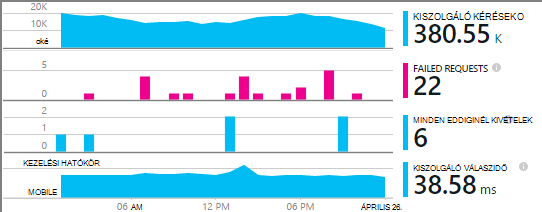
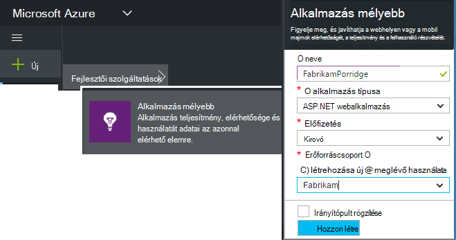
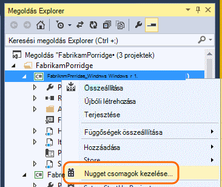
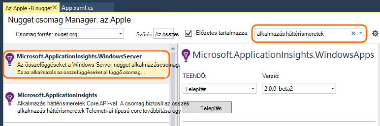
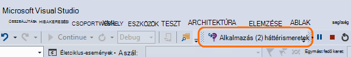
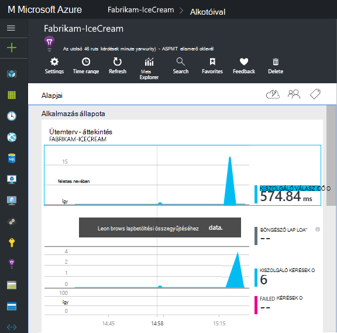
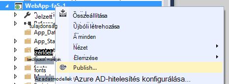

<properties
    pageTitle="Alkalmazás az összefüggéseket a Windows-szolgáltatások és dolgozó szerepkörök |} Microsoft Azure"
    description="Az alkalmazás az összefüggéseket SDK manuális felvétele a ASP.NET-alkalmazások használatát, az elérhetőség és a teljesítmény elemzése."
    services="application-insights"
    documentationCenter=".net"
    authors="alancameronwills"
    manager="douge"/>

<tags
    ms.service="application-insights"
    ms.workload="tbd"
    ms.tgt_pltfrm="ibiza"
    ms.devlang="na"
    ms.topic="get-started-article"
    ms.date="08/30/2016"
    ms.author="awills"/>

# Kézi megadása az alkalmazás az összefüggéseket ASP.NET-4-alkalmazásokhoz

*Alkalmazás háttérismeretek az előzetes verzióban.*

[AZURE.INCLUDE [app-insights-selector-get-started](../../includes/app-insights-selector-get-started.md)]

Manuálisan beállíthatja a [Visual Studio alkalmazás háttérismeretek](app-insights-overview.md) Windows szolgáltatások, dolgozó szerepkörök és más ASP.NET-alkalmazások figyelése. Web Apps alkalmazások a manuális konfiguráció ahelyett, hogy a Visual Studio által kínált [automatikus beállítási](app-insights-asp-net.md) .

Alkalmazás háttérismeretek segít diagnosztizálása problémák és teljesítményének figyelése és az élő alkalmazás használatát.

#### Előzetes teendők

szükséged van:

* [Microsoft Azure](http://azure.com)-előfizetést. A csoportwebhelyen vagy a szervezete rendelkezik egy Azure-előfizetést, ha a tulajdonos is fel kell vennie Önt, a [Microsoft-fiókjával](http://live.com).
* Visual Studio 2013-at vagy újabb verziója.

## 1. a alkalmazás háttérismeretek erőforrás létrehozása

Jelentkezzen be az [Azure-portálra](https://portal.azure.com/), és hozzon létre egy új alkalmazás háttérismeretek erőforrást. ASP.NET válassza az alkalmazás típusa.

Egy [erőforrás](app-insights-resources-roles-access-control.md) az Azure szolgáltatás egy példánya. Ez az erőforrás pedig az alkalmazás telemetriai fog kell elemezni jelenik meg.

A választási lehetőségek alkalmazás típusú állítja be az alapértelmezett tartalom erőforrás rögzítéséhez és a Tulajdonságok [Mértékek Explorer](app-insights-metrics-explorer.md)látható.

#### Másolja a műszerezettségi billentyűt

A kulcs az erőforrás azonosítására és az hamarosan fogja a SDK irányítsa át az adatokat az erőforráshoz telepítését.

A lépéseket, de csak elemeket hozhat létre új erőforrás bármely alkalmazás figyelése jó módszer. Most már küldhet adatokat is.

## 2. a SDK telepítse az alkalmazásban

Való telepítéséről és konfigurálásáról az alkalmazás az összefüggéseket SDK a platformot az aktív függően változik. Az ASP.NET-alkalmazások használata egyszerű.

1. A Visual Studióban szerkesztheti a web app projekt NuGet csomagokat.

    

2. Telepítse a Web Apps alkalmazások alkalmazás háttérismeretek SDK csomagjában talál.

    

    *Használhatom-e más csomagok?*

    igen. Ha csak az API segítségével küldje el saját telemetriai, válassza a Core API-val (Microsoft.ApplicationInsights). A Windows Server csomag automatikusan tartalmazza az alapvető API és számos más csomagok, például a teljesítmény számláló webhelycsoport és függőség figyelése. 

#### A későbbi SDK verzióinak frissítése

Azt engedje fel az SDK új verziója időről-időre.

Egy [új kiadását az SDK](https://github.com/Microsoft/ApplicationInsights-dotnet-server/releases/)frissítéséhez nyissa meg a NuGet csomag újra manager és a telepített csomagok szűrő. Jelölje ki a **Microsoft.ApplicationInsights.Web** , és válassza a **frissítés**.

Végrehajtott testreszabások ApplicationInsights.config, ha egy példányának mentése, frissítés, és ezt követően a módosítások egyesítése az új verzió előtt.

## 3. telemetriai küldése

**Ha telepítette az core API-csomag:**

* A műszerezettségi billentyűt a kódot, például beállítása a `main()`: 

    `TelemetryConfiguration.Active.InstrumentationKey = "`*a kulcs*`";` 

* [Írja be a saját a API telemetriai](app-insights-api-custom-events-metrics.md#ikey).

**Ha más alkalmazás háttérismeretek csomagok telepítve** van lehetősége, ha azt szeretné, a .config fájl segítségével műszerezettségi kulcs beállítása:

* ApplicationInsights.config szerkesztése (amely hozzá lett adva a NuGet telepített szerint). Szúrja be a közvetlenül a záró címke elé:

    `<InstrumentationKey>`*a másolt műszerezettségi billentyűt*`</InstrumentationKey>`

* Győződjön meg róla, hogy a megoldás Intézőben ApplicationInsights.config tulajdonságainak vannak **összeállítása művelettel = tartalom, a kimeneti könyvtár másolás másolás =**.

## A projekt futtatása

Futtassa az alkalmazást, és próbálja ki az **F5** használatával: Nyissa meg a különböző lapokon néhány telemetriai létrehozásához.

A Visual Studióban látni fogja az elküldött események száma.

## A telemetriai megtekintése

Térjen vissza az [Azure-portálra](https://portal.azure.com/) , és keresse meg az alkalmazást az összefüggéseket erőforrás.

Keresse meg az Áttekintés diagramok az adatokat. Az első egyszerűen csak megjelenik egy vagy két pontját. Példa:

Kattintson az egyes diagramokra kattintva tekintse részletesebb mértékek keresztül. [További tudnivalók a mértékek.](app-insights-web-monitor-performance.md)

#### Adatok nélkül?

* Használja az alkalmazás, a Megnyitás a különböző lapokon, hogy az egyes telemetriai hoz létre.
* Nyissa meg a [keresési](app-insights-diagnostic-search.md) csempére kattintva megtekintheti az egyes események. Előfordul, hogy tart események kissé közben hosszabb a mértékek folyamat olvas be.
* Várjon néhány másodpercig, és kattintson a **frissítés**parancsra. Diagramok rendszeres időközönként frissítse maguk, de frissítheti manuálisan, ha bizonyos adatok megjelennek az Ön várakozik.
* Lásd: a [Hibaelhárítás](app-insights-troubleshoot-faq.md).

## Az alkalmazás közzététele

Most az alkalmazások telepítése, a kiszolgáló vagy Azure, és az adatok gyűjteniük megtekintés.

Hibakeresési módban futtatásakor telemetriai végezhető el a továbbítási folyamatát, hogy meg kell jelennie másodpercek szereplő adatokat. Megjelenés konfigurációban az alkalmazás telepítésekor lassabban összegzi az adatokat.

#### Nincsenek adatok közzététele a kiszolgálón után?

Nyissa meg a kiszolgáló tűzfalában ezeket a kimenő forgalmához portokat:

+ `dc.services.visualstudio.com:443`
+ `f5.services.visualstudio.com:443`

#### Problémái vannak az összeállítás kiszolgálóra?

Tanulmányozza [a hibaelhárítás elemre](app-insights-asp-net-troubleshoot-no-data.md#NuGetBuild).

> [AZURE.NOTE]Ha az alkalmazás telemetriai sok hoz létre (és használ, akkor a ASP.NET SDK verzió 2.0.0-beta3 vagy újabb), a adaptív mintavételnél modul automatikusan csökkenti a kötet, amely csak egy jellemző törtet események küldésével a rendszer elküldi a portálon. Azonban kapcsolódó eseményeket rögzítő ugyanazon kérésére kijelölt lesz, vagy csoportként kijelöletlen, hogy meg tudja nyitni kapcsolódó eseményeket között. 
> [Megtudhatja, hogy mintavételnél](app-insights-sampling.md).

## Következő lépések

* Az alkalmazás 360 fokos áttekintést kaphat a [További telemetriai hozzáadása](app-insights-asp-net-more.md) .

