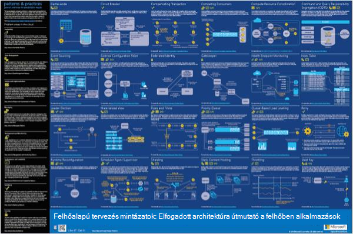
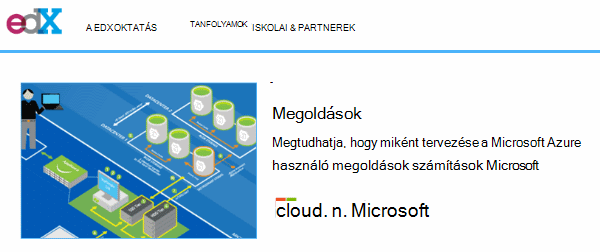
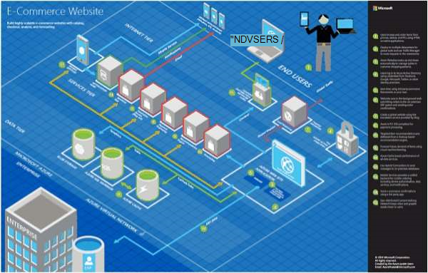
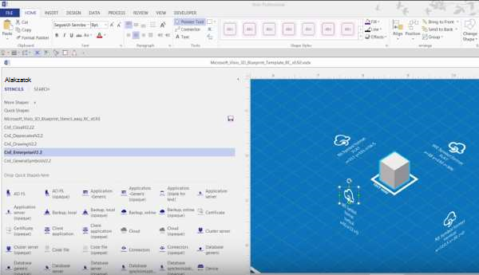
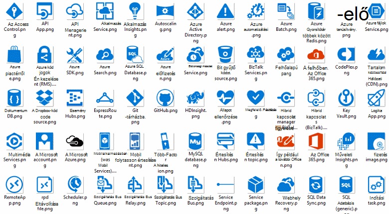
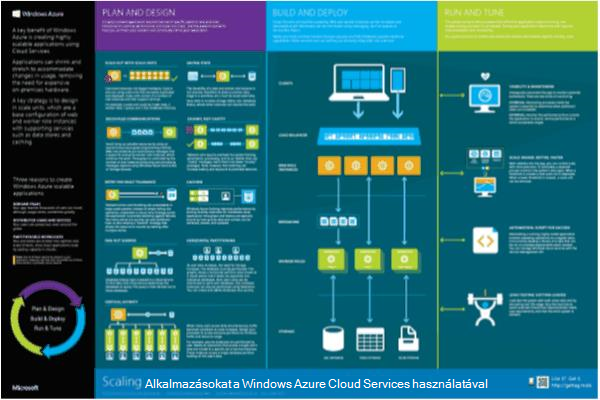

<properties 
    pageTitle="Microsoft Azure architektúrája alkalmazás |} Microsoft Azure" 
    description="Általános tervezési mintázatok eltakaró architektúra – áttekintés" 
    services="" 
    documentationCenter="" 
    authors="Rboucher" 
    manager="jwhit" 
    editor="mattshel"/>

<tags 
    ms.service="multiple" 
    ms.workload="na" 
    ms.tgt_pltfrm="na" 
    ms.devlang="na" 
    ms.topic="article" 
    ms.date="09/13/2016" 
    ms.author="robb"/>

#A Microsoft Azure alkalmazás architektúra
Források a Microsoft Azure használó alkalmazások készítéséhez. Ide tartoznak a segít vizuálisan leírására szoftver rendszerek diagramok rajzolása eszközök. 

##Tervező mintázatok plakát

A Microsoft mintázatok és eljárások tett közzé a könyv elérhető MSDN- és PDF-fájl letöltése [Felhő tervezés mintázatok](http://msdn.microsoft.com/library/dn568099.aspx) . Egy nagy formátumú plakát érhető el, amely felsorolja minden mintát is van. 

##A Microsoft architektúra hitelesítő tanfolyam

Microsoft-architektúra tanfolyam támogatja a hitelesítő vizsgálatához 70-534 Microsoft hozta létre. Érhető el [az ingyenes EDX.ORG](https://www.edx.org/course/architecting-microsoft-azure-solutions-microsoft-dev205x).  A [3D tervrajz Visio-sablon](#3d-blueprint-visio-template)használ. 

##A Microsoft-megoldások

A Microsoft közzététele egy sor olyan magas szintű [megoldás architektúrákban](http://aka.ms/azblueprints) ábrázoló rendszerek Microsoft-termékek használata bizonyos típusú összeállítása. 

A korábban Microsoft kiadott egy példa architektúrákban megjelenítő tervrajzokat. Azok a korábban említett megoldás architektúrákban helyettesíti, és a tervrajz hivatkozás rámutatva átirányítva. Ha valamilyen oknál fogva az előző tervrajzokat anyagok hozzáféréssel kell rendelkeznie, kérjük, e-mailben [CnESymbols@microsoft.com](mailto:CnESymbols@microsoft.com) a kérésével.   

A tervrajzokat és a megoldás architektúrákban diagramok is használja az a [felhő és vállalati szimbólum](#Drawing-symbol-and-icon-sets)részei.   

##3D tervrajz Visio-sablon

A most már inaktív [Microsoft architektúra tervrajzokat](http://aka.ms/azblueprints) 3D verziói eredetileg létrehozott egy-Microsoft eszközt. A Visio 2013-at (vagy újabb verzió) sablonhoz teljesült gyel 5, 2015 egy [Microsoft-architektúra hitelesítő tanfolyam elosztva EDX.ORG](#microsoft-architecture-certification-course)részeként a.

A sablon a tanfolyam kívüli is érhető el. 

- [A videó képzés nézet](http://aka.ms/3dBlueprintTemplateVideo) első, így megtudhatja, mit tehet   
- Töltse le a [Microsoft 3d tervrajz Visio-sablon](http://aka.ms/3DBlueprintTemplate)
- Töltse le a [felhőben, és a vállalati szimbólumok](#drawing-symbol-and-icon-sets) a 3D sablon használatára. 

A kapcsolatfelvételi e-mail [CnESymbols@microsoft.com](mailto:CnESymbols@microsoft.com) speciális kérdésekkel nem érkezett válasz a képzési anyagok szerint, vagy ha visszajelzést szeretne küldeni. A sablon már nem aktív fejlesztés alatt, de továbbra is hasznos és lényeges használhatná bármely PNG vagy a [felhő és a vállalati szimbólumokat](#drawing-symbol-and-icon-sets), amely frissülnek, mert.  

##Rajz szimbólum és ikon beállítása 

[A Visio és a videó képzési szimbólumok megjelenítése](http://aka.ms/CnESymbolsVideo) , majd [Töltse le a felhőben, és a vállalati szimbólum beállítása](http://aka.ms/CnESymbols) támaszkodva hoznak létre technikai anyagok, amelyek bemutatják Azure, Windows Server, SQL Server és további. A szimbólumok hálózatarchitektúrát ábrázoló diagramokat, oktatóanyagok, bemutatókban, adatlapok, infographics, tanulmányok és 3 akár fél könyvek is használhatja, ha a könyv emberek használjanak, Microsoft-termékek betanítja. Azonban nem használhatók a felhasználói felülete való használatra.

A CnE szimbólumok Visio SVG és PNG formátumban vannak. Egyszerűen használatáról további tudnivalókat a PowerPointban használható a szimbólumok megadása tartalmaz. 

A szimbólum szállított negyedéves és frissül, amint az új szolgáltatások kiadott. 

A Microsoft Office és a kapcsolódó technológiák további szimbólumok érhetők el a [Microsoft Office Visio rajzsablon](http://www.microsoft.com/en-us/download/details.aspx?id=35772), azonban nem optimalizálva építészeti diagramok a like CnE megadása.   

**Visszajelzés:** Ha már használta a CnE szimbólumok, adja meg a rövid [felmérés](http://aka.ms/azuresymbolssurveyv2) 5 kérdést, vagy e-mailek velünk a [CnESymbols@microsoft.com](mailto:CnESymbols@microsoft.com) az adott kérdések és problémák. Azt szeretné, hogy milyen úgy gondolja, hogy, pozitív visszajelzést, hogy tudjuk egyesével őket fektetni továbbra is beleértve. 

##Architektúra Infographics

Microsoft közzé, több architektúra poszterek/infographics kapcsolatos. Beállítások az alábbiak [Épület valós Életből felhő alkalmazások](https://azure.microsoft.com/documentation/infographics/building-real-world-cloud-apps/) és a [Méretezés a Felhőszolgáltatásaihoz](https://azure.microsoft.com/documentation/infographics/cloud-services/) . 

