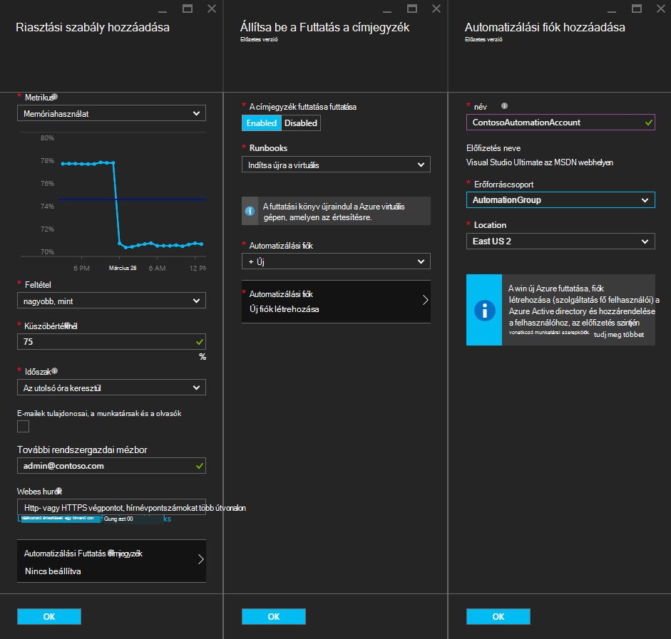
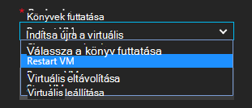
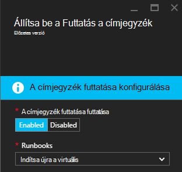
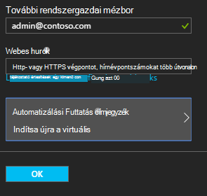

<properties
    pageTitle=" Az automatizálási Runbooks Azure virtuális értesítések ismételt |} Microsoft Azure"
    description="Ez a cikk bemutatja, hogyan Azure virtuális gép riasztások integrálása az Azure automatizálási runbooks és automatikus ismételt kérdések"
    services="automation"
    documentationCenter=""
    authors="mgoedtel"
    manager="jwhit"
    editor="tysonn" />    
<tags
    ms.service="automation"
    ms.devlang="na"
    ms.topic="article"
    ms.tgt_pltfrm="na"
    ms.workload="infrastructure-services"
    ms.date="06/14/2016"
    ms.author="csand;magoedte" />

# <a name="azure-automation-scenario---remediate-azure-vm-alerts"></a>Azure automatizálást forgatókönyv - ismételt Azure virtuális értesítések

Azure automatizálási és Azure virtuális gépeken futó kiadott egy új szolgáltatást, lehetővé téve automatizálási runbooks futtatásához virtuális gép (virtuális) értesítések konfigurálása. Ez a képesség lehetővé teszi, hogy automatikusan virtuális riasztás, például újraindítását vagy a virtuális leállítása a szabványos remediation végezheti el.

Korábban virtuális riasztási szabály létrehozása során volt egy runbook szeretne, [Adjon meg egy automatizálási webhook](https://azure.microsoft.com/blog/using-azure-automation-to-take-actions-on-azure-alerts/) annak érdekében, hogy a runbook elindul, ha a figyelmeztetés. Azonban ez szükséges, hogy végezze el a runbook létrehozása, létrehozása a webhook esetében a runbook, majd másolást és beillesztést a webhook riasztási szabály létrehozása során a munkáját. A új verziójának megjelenése a folyamat oka sokkal egyszerűbb közvetlenül választhat egy runbook lista riasztási szabály létrehozása során, és megadhatja, amelyek az eszközzel egyszerűen készíthet egy fiókot, illetve a runbook futtatása automatizálást fiók.

Ebben a cikkben fog bemutatjuk, hogy milyen könnyen Azure virtuális értesítés beállítása és állítsa be az automatizálási runbook futtatásához, valahányszor elindítja az értesítésre. Példák olyan újraindítását egy virtuális, amikor a memóriahasználata bizonyos küszöbértéket miatt a virtuális fejlesztő az alkalmazás, vagy egy virtuális leállítása, amikor a Processzor felhasználói 1 %-os alább órával korábbi volt és nem lesz használatban. Hogyan egyszerűbbé teszi a fő automatizálási fiókban szolgáltatás automatikus létrehozása az Azure riasztási remediation runbooks e is megismerheti.

## <a name="create-an-alert-on-a-vm"></a>Egy virtuális szóló értesítés létrehozása

A következő lépésekkel állítsa be a saját küszöb teljesülésekor, indítsa el a runbook figyelmeztető üzenet.

>[AZURE.NOTE] Az ebben a kiadásban csak támogatjuk V2 virtuális gépeken futó és támogatási klasszikus VMs hamarosan hozzáadódik az.  

1. Jelentkezzen be az Azure-portálra, és kattintson a **virtuális gépeken futó**.  
2. Jelölje ki azt a virtuális gépeken futó.  A virtuális gép irányítópult lap fog megjelenni, és a **Beállítások** lap pedig tőle jobbra.  
3. A **Beállítások** lap figyelés csoportjában kattintson a **figyelmeztetési szabályokat**.
4. Kattintson a **riasztási szabályok** lap **Hozzáadás értesítés**.

Ekkor megnyílik a felfelé a **riasztási szabály hozzáadása** lap, ahol a feltételeknek meg az értesítés beállítása és egy vagy összes, az alábbi lehetőségek közül választhat: e-mailek küldése más személynek, egy webhook továbbítása egy másik rendszer a riasztást és/vagy egy automatizálást runbook futtatja a válasz a probléma ismételt megkísérlése segítségével.

## <a name="configure-a-runbook"></a>Egy runbook konfigurálása

Adja meg a runbook futtatásához a virtuális riasztási küszöbérték teljesülése esetén, jelölje be az **Automatizálási Runbook**. A **beállítás runbook** lap közül választhat a runbook futtatásához és az automatizálási fiók a runbook futtatásához.



>[AZURE.NOTE] Ebben a kiadásban választhat három runbooks, ahol a szolgáltatás – indítsa újra a virtuális, virtuális leállítása vagy eltávolítása virtuális (törölje).  Jelölje ki a többi runbooks vagy az egyik saját runbooks képesek érhetők el az elkövetkező kiadásokban.



Miután kiválasztotta a három elérhető runbooks közül, megjelenik az **automatizálási fiók** legördülő lista, és választhatja a runbook fog futni, és automatizálási fiók. Az [automatizálási fiók](automation-security-overview.md) Azure-előfizetése van összefüggésben futtatásához szükséges Runbooks. Automatizálási fiók, hogy már létrehozott, vagy lehet, hogy Ön által létrehozott új automatizálási fiók kiválasztása

A runbooks biztosított szeretné egy szolgáltatás egyszerű használatával Azure hitelesítést végezni. Ha úgy dönt, hogy a meglévő automatizálási fiókokra futtassa a runbook, hogy automatikusan a szolgáltatás fő hozza létre. Ha úgy dönt, hogy hozzon létre egy új automatizálási fiókot, majd azt automatikusan létrehozza a fiók, és a szolgáltatás egyszerű. Mindkét esetben két eszközöket is létrejön automatizálási fiók – a tanúsítvány eszköz **AzureRunAsCertificate** nevű és a kapcsolat eszköz **AzureRunAsConnection**nevű. A runbooks annak érdekében, hogy kezelése a virtuális elleni művelet végrehajtása az Azure hitelesítő **AzureRunAsConnection** fogja használni.

>[AZURE.NOTE] A szolgáltatás egyszerű az előfizetés hatókör jön létre, és a vonatkozó munkatársi szerepkörök van hozzárendelve. A fiók automatizálási runbooks futtatásához engedéllyel kell rendelkeznie ahhoz, hogy az Azure VMs kezelése a szerepkör szükséges.  Egy Automaton fiók és/vagy a szolgáltatás fő kibocsátása egyszeri esemény. A létrehozásuk után a fiókhoz társított futtatásához runbooks más Azure virtuális nyomon követése riasztásokkal parancsát is használhatja.

Amikor az **OK** gombra a figyelmeztető van-e beállítva, és ha automatizálást új fiók létrehozása lehetőséget választotta, a rendszer létrehozza együtt a szolgáltatás fő.  Jelképező néhány másodpercet befejezéséhez.  



A konfiguráció befejeződése után jelenik meg a nevét a runbook jelennek meg a **riasztási szabály hozzáadása** lap.



Kattintson az **OK gombra** az **értesítési szabály hozzáadása** lap és a szabályt létrejön, és bekapcsolhatja, ha a virtuális gépen futó állapotban van.

### <a name="enable-or-disable-a-runbook"></a>Engedélyezheti vagy letilthatja az egy runbook

Ha egy runbook jelzést be van állítva, letilthatja a runbook konfiguráció törlése nélkül. Lehetővé teszi, hogy az operációs rendszert futtató értesítést megőrzése és talán néhány olyan értesítési szabályt, és majd később újra engedélyezheti a runbook.

## <a name="create-a-runbook-that-works-with-an-azure-alert"></a>Hozzon létre egy runbook az Azure jelzést használható

Egy runbook egy Azure figyelmeztetést részeként kiválasztásakor az, hogy a neki átadott riasztási adatok kezelése logika kell szerepelnie, a runbook.  Amikor egy runbook van beállítva egy szabályt, egy webhook létrejön a runbook; adott webhook használják majd indítsa el a runbook minden alkalommal, amikor elindítja az értesítésre.  A tényleges hívás indítása a runbook HTTP POST felkérés webhook URL-CÍMÉT. A bejegyzés összehívás törzsében az értesítésre kapcsolatos hasznos tulajdonságokat tartalmazó JSON formátumú objektumot tartalmaz.  Amint alább látható, az értesítési adatokat a részleteket, például subscriptionID, resourceGroupName, erőforrásnév és erőforrástípus tartalmazza.

### <a name="example-of-alert-data"></a>Riasztási-adatok
```
{
    "WebhookName": "AzureAlertTest",
    "RequestBody": "{
    \"status\":\"Activated\",
    \"context\": {
        \"id\":\"/subscriptions/<subscriptionId>/resourceGroups/MyResourceGroup/providers/microsoft.insights/alertrules/AlertTest\",
        \"name\":\"AlertTest\",
        \"description\":\"\",
        \"condition\": {
            \"metricName\":\"CPU percentage guest OS\",
            \"metricUnit\":\"Percent\",
            \"metricValue\":\"4.26337916666667\",
            \"threshold\":\"1\",
            \"windowSize\":\"60\",
            \"timeAggregation\":\"Average\",
            \"operator\":\"GreaterThan\"},
        \"subscriptionId\":\<subscriptionID> \",
        \"resourceGroupName\":\"TestResourceGroup\",
        \"timestamp\":\"2016-04-24T23:19:50.1440170Z\",
        \"resourceName\":\"TestVM\",
        \"resourceType\":\"microsoft.compute/virtualmachines\",
        \"resourceRegion\":\"westus\",
        \"resourceId\":\"/subscriptions/<subscriptionId>/resourceGroups/TestResourceGroup/providers/Microsoft.Compute/virtualMachines/TestVM\",
        \"portalLink\":\"https://portal.azure.com/#resource/subscriptions/<subscriptionId>/resourceGroups/TestResourceGroup/providers/Microsoft.Compute/virtualMachines/TestVM\"
        },
    \"properties\":{}
    }",
    "RequestHeader": {
        "Connection": "Keep-Alive",
        "Host": "<webhookURL>"
    }
}
```

Ha az automatizálási webhook szolgáltatás kap a HTTP-bejegyzés kibontja az értesítési adatokat, és átadja a runbook a WebhookData runbook bemeneti paraméter.  Az alábbi képen egy minta runbook, amely bemutatja, hogyan WebhookData paraméter használatával, a riasztási adatok kibontása és kezelése az Azure erőforrás a figyelmeztetést kiváltó használatával.

### <a name="example-runbook"></a>Példa runbook

```
#  This runbook will restart an ARM (V2) VM in response to an Azure VM alert.

[OutputType("PSAzureOperationResponse")]

param ( [object] $WebhookData )

if ($WebhookData)
{
    # Get the data object from WebhookData
    $WebhookBody = (ConvertFrom-Json -InputObject $WebhookData.RequestBody)

    # Assure that the alert status is 'Activated' (alert condition went from false to true)
    # and not 'Resolved' (alert condition went from true to false)
    if ($WebhookBody.status -eq "Activated")
    {
        # Get the info needed to identify the VM
        $AlertContext = [object] $WebhookBody.context
        $ResourceName = $AlertContext.resourceName
        $ResourceType = $AlertContext.resourceType
        $ResourceGroupName = $AlertContext.resourceGroupName
        $SubId = $AlertContext.subscriptionId

        # Assure that this is the expected resource type
        Write-Verbose "ResourceType: $ResourceType"
        if ($ResourceType -eq "microsoft.compute/virtualmachines")
        {
            # This is an ARM (V2) VM

            # Authenticate to Azure with service principal and certificate
            $ConnectionAssetName = "AzureRunAsConnection"
            $Conn = Get-AutomationConnection -Name $ConnectionAssetName
            if ($Conn -eq $null) {
                throw "Could not retrieve connection asset: $ConnectionAssetName. Check that this asset exists in the Automation account."
            }
            Add-AzureRMAccount -ServicePrincipal -Tenant $Conn.TenantID -ApplicationId $Conn.ApplicationID -CertificateThumbprint $Conn.CertificateThumbprint | Write-Verbose
            Set-AzureRmContext -SubscriptionId $SubId -ErrorAction Stop | Write-Verbose

            # Restart the VM
            Restart-AzureRmVM -Name $ResourceName -ResourceGroupName $ResourceGroupName
        } else {
            Write-Error "$ResourceType is not a supported resource type for this runbook."
        }
    } else {
        # The alert status was not 'Activated' so no action taken
        Write-Verbose ("No action taken. Alert status: " + $WebhookBody.status)
    }
} else {
    Write-Error "This runbook is meant to be started from an Azure alert only."
}
```

## <a name="summary"></a>Összefoglalás

Ha egy Azure virtuális jelzést állítja be, most már rendelkezik az azt jelenti, hogy könnyen állítsa be az automatizálási runbook automatikusan remediation művelet végrehajtásához, amikor elindítja az értesítésre. Ebben a kiadásban választhat runbooks újraindítása, leállítása vagy egy virtuális az értesítési esete törlése. Ez a csak a kezdet, ahol Ön a műveletek (értesítés, hibaelhárítás, remediation) kell tenni automatikusan amikor jelzést eseményindítók forgatókönyvek engedélyezése.

## <a name="next-steps"></a>Következő lépések

- Első lépések a grafikus runbooks, lásd: [az első grafikus runbook](automation-first-runbook-graphical.md)
- Első lépések a PowerShell munkafolyamat runbooks, lásd: [az első PowerShell munkafolyamat runbook](automation-first-runbook-textual.md)
- Runbook típusú, a előnyei és korlátai kapcsolatos további tudnivalókért lásd: [Azure automatizálási runbook típusai](automation-runbook-types.md)
