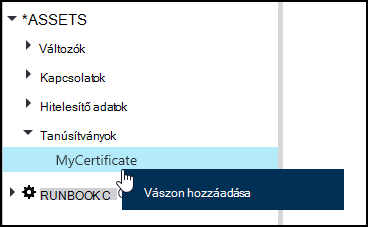
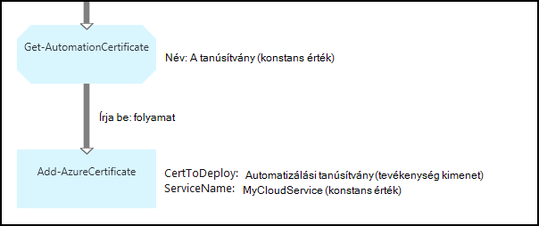

<properties 
   pageTitle="Tanúsítvány-eszközök Azure automatizálási |} Microsoft Azure"
   description="Tanúsítványok tárolható biztonságosan Azure automatizálást úgy is érhetők el az runbooks és DSC konfigurációk Azure és a külső erőforrások elleni hitelesítést végezni.  Ez a cikk ismerteti a tanúsítványok és hogyan kell használni őket a szöveges és a grafikus szerzői részleteit."
   services="automation"
   documentationCenter=""
   authors="mgoedtel"
   manager="stevenka"
   editor="tysonn" />
<tags 
   ms.service="automation"
   ms.devlang="na"
   ms.topic="article"
   ms.tgt_pltfrm="na"
   ms.workload="infrastructure-services"
   ms.date="02/23/2016"
   ms.author="magoedte;bwren" />

# Azure automatizálási tanúsítvány eszközök

Tanúsítványok tárolhatók biztonságosan az Azure automatizálás, azok runbooks, vagy használja a **Get-AutomationCertificate** tevékenység DSC konfigurációk is elérhető. Ebben a runbooks, valamint a tanúsítványok hitelesítéshez használt DSC konfigurációk létrehozását teszi lehetővé, illetve ezek felvétele Azure vagy harmadik fél erőforrásokat.

>[AZURE.NOTE] Azure automatizálási biztonságos eszközök hitelesítő adatokat, a tanúsítványok, a kapcsolatok és a titkosított változók tartalmazza. Ezek az eszközök titkosított és tárolja az Azure automatizálási generált egyedi kulcs minden automatizálási fiók segítségével. A kulcs fő tanúsítvány által titkosított és Azure automatizálási tárolja. Egy biztonságos eszköz tárolja, mielőtt a kulcs az automatizálási fiók visszafejtett fő tanúsítvány használatával, és kattintson az eszköz titkosítására használt.

## A Windows PowerShell-parancsmagok

A parancsmagok az alábbi táblázat létrehozása és kezelése a Windows PowerShell automatizálási tanúsítvány eszközök segítségével. Azok az automatizálási runbooks és DSC konfigurációk használható [Azure PowerShell-modult](../powershell-install-configure.md) részét képezi.

|A parancsmagok|Leírás|
|:---|:---|
|[Get-AzureAutomationCertificate](http://msdn.microsoft.com/library/dn913765.aspx)|Olvassa be a tanúsítvány adatait. A tanúsítvány magát a Get-AutomationCertificate tevékenységből csak meghallgathatja.|
|[Új AzureAutomationCertificate](http://msdn.microsoft.com/library/dn913764.aspx)|Új tanúsítvány importálása Azure automatizálási.|
|[Eltávolítás - AzureAutomationCertificate](http://msdn.microsoft.com/library/dn913773.aspx)|Eltávolítja a tanúsítvány Azure automatizálást.|
|[Set - AzureAutomationCertificate](http://msdn.microsoft.com/library/dn913763.aspx)|Egy meglévő tanúsítvány, beleértve a biztonságitanúsítvány-fájl feltöltése, és állítsa a .pfx jelszavának tulajdonságainak beállítása|

## Tevékenységek tanúsítványok eléréséhez

Az alábbi táblázat a tevékenységek tanúsítványok DSC konfigurálása vagy runbook eléréséhez használt.

|Tevékenységek|Leírás|
|:---|:---|
|Get-AutomationCertificate|Egy tanúsítványt használatához runbook vagy DSC konfigurációs kap.|

>[AZURE.NOTE] Változók kerülje a – név paraméterben a Get-AutomationCertificate, mivel ez felfedezése függőségeket runbooks vagy DSC konfigurációk bonyolult lesz, és eszközök tanúsítvány-tervezéskor.

## Új tanúsítvány létrehozása

Új tanúsítvány létrehozásakor .cer és .pfx fájl feltöltése Azure az automatizálás. Ha bejelöli a tanúsítvány exportálható, majd azt át is ki az Azure automatizálást tanúsítvány áruházból. Ha még nem exportálható, majd azt csak használható a runbook vagy DSC konfigurációs aláíráshoz.

### Új tanúsítvány létrehozása az Azure klasszikus portálján

1. Automatizálási fiókjából kattintson az **eszközök** , az ablak tetején.
1. Az ablak alján kattintson a **Beállítás hozzáadása**lehetőséget.
1. Kattintson a **hitelesítő adatok hozzáadása**gombra.
2. A **Hitelesítő adatok típusát** tartalmazó legördülő listára válassza ki a **tanúsítványt**.
3. Írja be a tanúsítvány nevét a **név** mezőbe, majd kattintson a jobbra mutató nyílra.
4. Keresse meg a .cer vagy .pfx fájl.  .Pfx fájl választása esetén adja meg a jelszót, és azt deklarálhatják exportálhatók.
1. Kattintson a jelölőnégyzet be van jelölve a biztonságitanúsítvány-fájl feltöltése, és mentse az új tanúsítvány eszközre.

### Új tanúsítvány létrehozása az Azure portálján

1. Automatizálási fiókjából kattintson a kattintva nyissa meg az **eszközök** lap **eszközök** részére.
1. Kattintson a **tanúsítványok** részére a **tanúsítványok** lap megnyitásához.
1. Kattintson a **Hozzáadás tanúsítvány** elemre a lap tetején.
2. Írja be a tanúsítvány nevét a **név** mezőbe.
2. **Jelöljön ki egy fájlt** kattintson **biztonságitanúsítvány-fájl feltöltése** .cer vagy .pfx fájl tallózásához.  .Pfx fájl választása esetén adja meg a jelszót, és azt deklarálhatják exportálhatók.
1. Kattintson a **Létrehozás** menti az új tanúsítvány eszközre.

### A Windows PowerShell új tanúsítvány létrehozása

A következő példa parancsok bemutatják, hogyan hozhat létre egy új automatizálási tanúsítvány, és exportálható jelöli. Ez a meglévő .pfx fájl importálja.

    $certName = 'MyCertificate'
    $certPath = '.\MyCert.pfx'
    $certPwd = ConvertTo-SecureString -String 'P@$$w0rd' -AsPlainText -Force
    
    New-AzureAutomationCertificate -AutomationAccountName "MyAutomationAccount" -Name $certName -Path $certPath –Password $certPwd -Exportable

## A tanúsítvány használatával

A **Get-AutomationCertificate** tevékenység egy tanúsítvánnyal kell használnia. A [Get-AzureAutomationCertificate](http://msdn.microsoft.com/library/dn913765.aspx) parancsmag nem használható, mivel a tanúsítvány eszköz, de nem magának a tanúsítvány adatokat ad eredményül..

### Szöveges runbook minta

A következő példa kódot tanúsítvány hozzáadása egy felhőalapú szolgáltatásba, a egy runbook mutatja. Az ebben a példában a jelszó beolvasása egy titkosított automatizálási változó.

    $serviceName = 'MyCloudService'
    $cert = Get-AutomationCertificate -Name 'MyCertificate'
    $certPwd = Get-AutomationVariable –Name 'MyCertPassword'
    Add-AzureCertificate -ServiceName $serviceName -CertToDeploy $cert

### Runbook grafikus minta

A grafikus runbook a **Get-AutomationCertificate** hozzáadása a tanúsítvány grafikus szerkesztő a könyvtár ablakban a jobb gombbal, és válassza a **Hozzáadás a vászon**.

Az alábbi képen látható példa egy grafikus runbook a tanúsítvány használatával.  Ez a tanúsítvány hozzáadása egy felhőalapú szolgáltatásba egy szöveges runbook alapján a fent látható előző példát.  

Ez a példa a **Küldés-TwilioSMS** tevékenység a szolgáltatás hitelesítéshez kapcsolati objektum használó a **UseConnectionObject** paraméter.  [Folyamat hivatkozás](automation-graphical-authoring-intro.md#links-and-workflow) itt kell használni, mivel szekvencia hivatkozást tartalmazó egy objektumra, amely az adatkapcsolat paramétere nem meglepő. gyűjtemény adja vissza.

## Lásd még:

- [A grafikus létrehozáshoz használható hivatkozások](automation-graphical-authoring-intro.md#links-and-workflow) 
