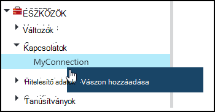
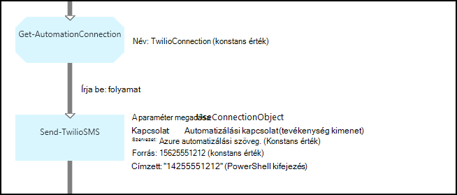
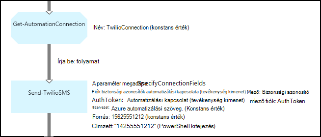

<properties 
   pageTitle="Azure automatizálási kapcsolat eszközök |} Microsoft Azure"
   description="Azure automatizálást kapcsolat eszközök csatlakozni egy külső szolgáltatásból vagy alkalmazásból a runbook, vagy a DSC konfiguráció szükséges adatokat tartalmazzák. Ez a cikk ismerteti, kapcsolatok és hogyan kell használni őket a szöveges és a grafikus szerzői részleteit."
   services="automation"
   documentationCenter=""
   authors="bwren"
   manager="stevenka"
   editor="tysonn" />
<tags 
   ms.service="automation"
   ms.devlang="na"
   ms.topic="article"
   ms.tgt_pltfrm="na"
   ms.workload="infrastructure-services"
   ms.date="01/27/2016"
   ms.author="bwren" />

# Azure automatizálási kapcsolat eszközök

Automatizálási kapcsolat tárgyi eszköz egy runbook vagy DSC konfigurációs egy külső szolgáltatásból vagy alkalmazásból való kapcsolódáshoz szükséges információkat tartalmazza. Ez például felhasználónév és jelszó nemcsak a kapcsolat adatait, például egy URL-címet, vagy olyan portot hitelesítés szükséges adatokat tartalmazhat. A kapcsolat előnyeiről van továbbra is a tulajdonságok egy tárgyi eszköz, nem pedig a több változót létrehozása az adott alkalmazás csatlakozhat. A felhasználó szerkesztheti egy helyen kapcsolat értékeket, és a kapcsolat neve átadni a runbook vagy a DSC konfiguráció egyetlen paramétert. Kapcsolat tulajdonságainak a runbook vagy a **Get-AutomationConnection** tevékenység DSC konfigurációban is elérhető.

Amikor létrehoz egy kapcsolatot, meg kell adnia a *kapcsolat típusa*. A kapcsolat típusát, egy sablon, amely definiálja tulajdonságait. A kapcsolat határozza meg, hogy minden kapcsolat típusának megfelelő definiált a tulajdonság értékeit. Kapcsolatok típusai adott Azure automatizálási integrációs modulok vagy a [Azure automatizálási API](http://msdn.microsoft.com/library/azure/mt163818.aspx)-val létrehozott. A csak kapcsolat rendelkezésre álló típusokat kapcsolat létrehozásakor azok telepítve van a automatizálási-fiókjában.

>[AZURE.NOTE] Azure automatizálási biztonságos eszközök hitelesítő adatokat, a tanúsítványok, a kapcsolatok és a titkosított változók tartalmazza. Ezek az eszközök titkosított és tárolja az Azure automatizálási generált egyedi kulcs minden automatizálási fiók segítségével. A kulcs fő tanúsítvány által titkosított és Azure automatizálási tárolja. Egy biztonságos eszköz tárolja, mielőtt a kulcs az automatizálási fiók visszafejtett fő tanúsítvány használatával, és kattintson az eszköz titkosítására használt.

## A Windows PowerShell-parancsmagok

A parancsmagok az alábbi táblázat létrehozása és kezelése a Windows PowerShell automatizálási kapcsolatokat szolgálnak. Azok az automatizálási runbooks és DSC konfigurációk használható [Azure PowerShell-modult](../powershell-install-configure.md) részét képezi.

|Parancsmag|Leírás|
|:---|:---|
|[Get-AzureAutomationConnection](http://msdn.microsoft.com/library/dn921828.aspx)|Olvassa be a kapcsolatot. A kapcsolat mezők értékű egy kivonat táblázatot tartalmaz.|
|[Új AzureAutomationConnection](http://msdn.microsoft.com/library/dn921825.aspx)|Új kapcsolatot hoz létre.|
|[Eltávolítás-AzureAutomationConnection](http://msdn.microsoft.com/library/dn921827.aspx)|Egy meglévő kapcsolat eltávolítása.|
|[Set-AzureAutomationConnectionFieldValue](http://msdn.microsoft.com/library/dn921826.aspx)|Egy meglévő kapcsolat egy adott mező értékének beállítása.|

## Tevékenységek

Az alábbi táblázat a tevékenységek használt kapcsolatok runbook vagy DSC konfigurációs eléréséhez.

|Tevékenységek|Leírás|
|---|---|
|Get-AutomationConnection|Kap egy kapcsolatot használja. A kapcsolat tulajdonságai egy kivonat táblázatot ad vissza.|

>[AZURE.NOTE] Kerülendő változók használata a – név paraméterben, mivel ez megnehezítheti felfedezése függőségeket runbooks, vagy a DSC beállításokat és a kapcsolat eszközök tervezéskor **Get-AutomationConnection** .

## Az új kapcsolat létrehozása

### Új kapcsolat létrehozása az Azure klasszikus portálján

1. Automatizálási fiókjából kattintson az **eszközök** , az ablak tetején.
1. Az ablak alján kattintson a **Beállítás hozzáadása**lehetőséget.
1. Kattintson a **kapcsolat hozzáadása**gombra.
2. A **Kapcsolat típusa** legördülő válassza ki a létrehozni kívánt kapcsolatot.  A varázsló bemutatja, hogy bizonyos típusú tulajdonságait.
1. A varázsló, és jelölje be az új kapcsolat mentése jelölőnégyzetet.

### Új kapcsolat létrehozása az Azure portálján

1. Automatizálási fiókjából kattintson a kattintva nyissa meg az **eszközök** lap **eszközök** részére.
1. Kattintson a **kapcsolatok** lap megnyitása **kapcsolatok** részére.
1. Kattintson a **kapcsolat hozzáadása** a lap tetején.
2. A **típus** legördülő válassza ki a létrehozni kívánt kapcsolatot. Az űrlap bemutatja, hogy bizonyos típusú tulajdonságait.
1. Töltse ki az űrlapot, és kattintson a Mentés az új kapcsolat **létrehozása** gombra.

### A Windows PowerShell új kapcsolat létrehozása

A [New-AzureAutomationConnection](http://msdn.microsoft.com/library/dn921825.aspx) parancsmaggal a Windows PowerShell új kapcsolatot létrehozni. Ezzel a parancsmaggal értékek megadása a kapcsolat típusának által meghatározott tulajdonságok [kivonat táblázat](http://technet.microsoft.com/library/hh847780.aspx) vár **ConnectionFieldValues** nevű paraméter tartalmaz.

A következő példa parancsok új kapcsolatot létrehozni, a telefonos szolgáltatás, amely lehetővé teszi, hogy a szöveges üzenetek küldése és fogadása [Twilio](http://www.twilio.com) .  Egy minta integrációs modul, amely tartalmaz egy Twilio kapcsolattípusokra [Parancsfájl](http://gallery.technet.microsoft.com/scriptcenter/Twilio-PowerShell-Module-8a8bfef8)központban érhető el.  A kapcsolat típusú fiók biztonsági AZONOSÍTÓK és engedélyezési jogkivonat, amely a fiók érvényesítéséhez Twilio való csatlakozáskor szükséges tulajdonságok határozza meg.  [Töltse le a modul](http://gallery.technet.microsoft.com/scriptcenter/Twilio-PowerShell-Module-8a8bfef8) kell, és telepítse a minta kód használata az automatizálási-fiókjában.

    $AccountSid = "DAf5fed830c6f8fac3235c5b9d58ed7ac5"
    $AuthToken  = "17d4dadfce74153d5853725143c52fd1"
    $FieldValues = @{"AccountSid" = $AccountSid;"AuthToken"=$AuthToken}

    New-AzureAutomationConnection -AutomationAccountName "MyAutomationAccount" -Name "TwilioConnection" -ConnectionTypeName "Twilio" -ConnectionFieldValues $FieldValues

## Runbook vagy DSC konfigurációs kapcsolaton keresztül

Beolvashatja egy runbook, vagy a **Get-AutomationConnection** parancsmag DSC konfigurálása kapcsolat.  Ez a tevékenység a különböző mezők a kapcsolat, és az vissza őket egy [kivonat táblázat](http://go.microsoft.com/fwlink/?LinkID=324844) , amely ezután kínál a runbook, vagy DSC konfigurálása a megfelelő parancsot.

### Szöveges runbook minta
A következő példa parancsok Twilio kapcsolatot használja az előző példában szöveges üzenet küldése egy runbook módját mutatják.  A Küldés-TwilioSMS tevékenység használja az alábbi két paraméter beállítása, hogy minden használja egy másik módszert a Twilio szolgáltatás hitelesítése tartalmaz.  Egy használja egy kapcsolat-objektum, valamint egy másik egyes paraméterek a fiók biztonsági AZONOSÍTÓK és engedélyezési jogkivonat.  Ez a példa látható mindkét módszerhez.

    $Con = Get-AutomationConnection -Name "TwilioConnection"
    $NumTo = "14255551212"
    $NumFrom = "15625551212"
    $Body = "Text from Azure Automation."

    #Send text with connection object.
    Send-TwilioSMS -Connection $Con -From $NumFrom -To $NumTo -Body $Body

    #Send text with connection properties.
    Send-TwilioSMS -AccountSid $Con.AccountSid -AuthToken $Con.AuthToken -From $NumFrom -To $NumTo -Body $Body

### A grafikus runbook minták

A grafikus runbook **Get-AutomationConnection** tevékenység hozzáadása a grafikus szerkesztő kapcsolaton a könyvtár ablakban kattintson a jobb gombbal, és válassza a **Hozzáadás a vászon**.

Az alábbi képen látható példa egy grafikus runbook a kapcsolaton keresztül.  Ez az, hogy az azonos példa Twilio felhasználásával egy szöveges runbook szöveges üzenet küldésének fent látható.  Ez a példa a **Küldés-TwilioSMS** tevékenység a szolgáltatás hitelesítéshez kapcsolati objektum használó a **UseConnectionObject** paraméter.  Mivel a kapcsolat paraméterrel vár egyetlen objektum [folyamat hivatkozás](automation-graphical-authoring-intro.md#links-and-workflow) itt használják.

Az OK, amely egy PowerShell kifejezés helyett egy konstans érték **a** paraméter értéke szolgál, hogy a paraméter egy tömb érték karakterlánc típusú vár, hogy a számok küldhet.  Egy PowerShell-kifejezés lehetővé teszi, hogy meg kell adnia egy egyedi érték vagy egy tömb.

Az alábbi képen látható, hogy a fenti példában, de a használja a **SpecifyConnectionFields** paraméter megadása, hogy vár a AccountSid és AuthToken paramétereket, nem pedig a kapcsolati objektum használatának hitelesítési külön-külön kell megadni.  Ebben az esetben a kapcsolat mezőt az objektum helyett.  

## Kapcsolódó cikkek

- [A grafikus létrehozáshoz használható hivatkozások](automation-graphical-authoring-intro.md#links-and-workflow)
 
