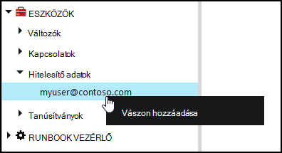
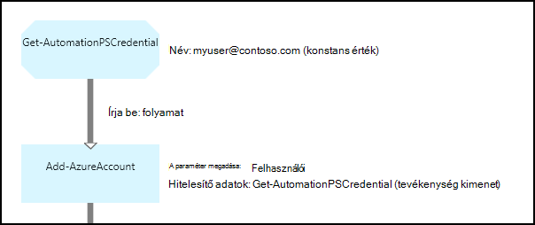

<properties 
   pageTitle="A hitelesítő adatok Azure automatizálási eszközök |} Microsoft Azure"
   description="Azure automatizálást hitelesítő eszközök runbook és DSC konfigurációs szerint elérhető forrá hitelesítést végezni használható hitelesítő adatokat tartalmazzák. Ez a cikk ismerteti, hogyan hozhat létre hitelesítőadat-eszközök, és segítségükkel runbook vagy DSC konfigurációs."
   services="automation"
   documentationCenter=""
   authors="mgoedtel"
   manager="jwhit"
   editor="tysonn" />
<tags 
   ms.service="automation"
   ms.devlang="na"
   ms.topic="article"
   ms.tgt_pltfrm="na"
   ms.workload="infrastructure-services"
   ms.date="06/09/2016"
   ms.author="bwren" />

# Az Azure automatizálás hitelesítőadat-eszközök

Automatizálási hitelesítő adatok tárgyi eszköz egy [PSCredential](http://msdn.microsoft.com/library/system.management.automation.pscredential) objektum, például a felhasználónév és jelszó hitelesítő adatokat tartalmazó tárolja. Runbooks és DSC beállításokat használhatja, fogadja el a PSCredential objektum hitelesítéshez parancsmagok, vagy azok is bontsa ki a felhasználónév és jelszó ahhoz, hogy néhány alkalmazás vagy szolgáltatás hitelesítést igénylő PSCredential objektum. A tulajdonságok egy hitelesítőadat-Azure automatizálási biztonságos tárolása, illetve a runbook vagy a [Get-AutomationPSCredential](http://msdn.microsoft.com/library/system.management.automation.pscredential.aspx) tevékenység DSC konfigurációban elérhetők.

>[AZURE.NOTE] Azure automatizálási biztonságos eszközök hitelesítő adatokat, a tanúsítványok, a kapcsolatok és a titkosított változók tartalmazza. Ezek az eszközök titkosított és tárolja az Azure automatizálási generált egyedi kulcs minden automatizálási fiók segítségével. A kulcs fő tanúsítvány által titkosított és Azure automatizálási tárolja. Egy biztonságos eszköz tárolja, mielőtt a kulcs az automatizálási fiók visszafejtett fő tanúsítvány használatával, és kattintson az eszköz titkosítására használt. 

## A Windows PowerShell-parancsmagok

A parancsmagok az alábbi táblázat létrehozása és kezelése a Windows PowerShell automatizálási hitelesítőadat-eszközök használatával.  Azok az automatizálási runbooks és DSC konfigurációk használható [Azure PowerShell-modult](../powershell-install-configure.md) részét képezi.

|A parancsmagok|Leírás|
|:---|:---|
|[Get-AzureAutomationCredential](http://msdn.microsoft.com/library/dn913781.aspx)|Olvassa be a hitelesítő adatok eszköz adatainak. A hitelesítő adatait, magát a **Get-AutomationPSCredential** tevékenység csak meghallgathatja.|
|[Új AzureAutomationCredential](http://msdn.microsoft.com/library/azure/jj554330.aspx)|Létrehoz egy új automatizálási hitelesítő adatait.|
|[Eltávolítás - AzureAutomationCredential](http://msdn.microsoft.com/library/azure/jj554330.aspx)|Az automatizálási hitelesítő eltávolítja.|
|[Set - AzureAutomationCredential](http://msdn.microsoft.com/library/azure/jj554330.aspx)|A tulajdonságok egy meglévő automatizálási hitelesítőadat-akkor állítja be.|

## Runbook tevékenységek

A tevékenységek, az alábbi táblázat olyan runbook és DSC konfigurációk hitelesítő adatok eléréséhez használt.

|Tevékenységek|Leírás|
|:---|:---|
|Get-AutomationPSCredential|A hitelesítő adatok használata runbook vagy DSC konfigurációs kap. Egy [System.Management.Automation.PSCredential](http://msdn.microsoft.com/library/system.management.automation.pscredential) objektumot adja vissza.|

>[AZURE.NOTE] Változók kerülje a – név paraméterben a Get-AutomationPSCredential, mivel ez felfedezése függőségeket runbooks vagy DSC konfigurációk bonyolult lesz, és hitelesítő adatok eszközök tervezéskor.

## Egy új hitelesítőadat-eszköz létrehozása

### Egy új hitelesítőadat-eszköz létrehozása az Azure klasszikus portálján

1. Automatizálási fiókjából kattintson az **eszközök** , az ablak tetején.
1. Az ablak alján kattintson a **Beállítás hozzáadása**lehetőséget.
1. Kattintson a **hitelesítő adatok hozzáadása**gombra.
2. A **Hitelesítőadat-típus** tartalmazó legördülő listára válassza a **PowerShell hitelesítő adatait**.
1. A varázsló, és mentse az új hitelesítő adatokhoz jelölőnégyzetre.

### Egy új hitelesítőadat-eszköz létrehozása az Azure portálján

1. Automatizálási fiókjából kattintson a kattintva nyissa meg az **eszközök** lap **eszközök** részére.
1. Kattintson a **hitelesítő adatok** rész a **hitelesítő adatok** lap megnyitásához.
1. Kattintson a **Hozzáadás a hitelesítő adatok** a lap tetején.
1. Töltse ki az űrlapot, és kattintson a **Létrehozás** menti az új hitelesítő adatokhoz.

### Egy új hitelesítőadat-eszköz létrehozása a Windows PowerShell

A következő példa parancsok bemutatják, hogyan hozhat létre egy új automatizálási hitelesítő adatait. Egy PSCredential objektum első létrehozásakor a felhasználónevét és jelszavát, és kattintson a hitelesítő adatok eszköz létrehozásához használt. Másik lehetőségként a **Get-hitelesítőadat** -parancsmag segítségével rendszer rákérdez, hogy írja be a nevét és jelszavát.

    $user = "MyDomain\MyUser"
    $pw = ConvertTo-SecureString "PassWord!" -AsPlainText -Force
    $cred = New-Object –TypeName System.Management.Automation.PSCredential –ArgumentList $user, $pw
    New-AzureAutomationCredential -AutomationAccountName "MyAutomationAccount" -Name "MyCredential" -Value $cred

## Egy PowerShell hitelesítő adatok használata

Beolvashatja a hitelesítő adatok eszköz runbook vagy a **Get-AutomationPSCredential** tevékenység DSC konfigurálása. Ez a egy tevékenység vagy PSCredential paramétert igényel parancsmag használhatja [PSCredential objektum](http://msdn.microsoft.com/library/system.management.automation.pscredential.aspx) adja eredményül. A hitelesítő adatok objektum használatához külön-külön tulajdonságait is meghallgathatja. Az objektumnak a felhasználónév és a biztonságos jelszó tulajdonságait, vagy lépjen vissza egy, a jelszó nem biztonságos változatának biztosítása fog [NetworkCredential](http://msdn.microsoft.com/library/system.net.networkcredential.aspx) objektum **GetNetworkCredential** módszer is használhatja.

### Szöveges runbook minta

A következő példa parancsok megjelenítése egy PowerShell hitelesítő adatok használata az egy runbook. Ebben a példában a hitelesítő adatok veszi, és a felhasználónév és jelszó rendelt változók.

    $myCredential = Get-AutomationPSCredential -Name 'MyCredential'
    $userName = $myCredential.UserName
    $securePassword = $myCredential.Password
    $password = $myCredential.GetNetworkCredential().Password

### Runbook grafikus minta

A grafikus runbook **Get-AutomationPSCredential** tevékenység hozzáadása a hitelesítő adatok grafikus szerkesztő a könyvtár ablakban a jobb gombbal, és válassza a **Hozzáadás a vászon**.

Az alábbi képen látható példa a hitelesítő adatok használata egy grafikus runbook.  Ebben az esetben használja a hitelesítés egy runbook Azure erőforrásokhoz tartozó [Hitelesítő Runbooks az Azure Active Directory felhasználói fiók](automation-sec-configure-aduser-account.md)ismertetett módon.  Az első tevékenységhez olvassa be a hitelesítő adatait, amely az Azure előfizetés hozzáféréssel rendelkezik.  A **Hozzáadás-AzureAccount** tevékenység kattintson a hitelesítő adatok biztosítására használja, amely beépített részei, és azt követő tevékenységek hitelesítést.  Mivel a **Get-AutomationPSCredential** vár egyetlen objektum itt van [folyamat hivatkozásra](automation-graphical-authoring-intro.md#links-and-workflow) .  

## DSC egy PowerShell hitelesítő adatok használata
DSC konfigurációk az Azure automatizálás hivatkozhat hitelesítőadat-eszközök **Get-AutomationPSCredential**használatával, miközben hitelesítőadat-eszközök is továbbíthatók a keresztül paraméterek, ha szükségesnek látja. További tudnivalókért olvassa el a [Azure automatizálási DSC Compiling beállításai](automation-dsc-compile.md#credential-assets)című témakört.

## Következő lépések

- A grafikus szerzői hivatkozásokkal kapcsolatos további információért lásd: a [hivatkozások a grafikus szerzői](automation-graphical-authoring-intro.md#links-and-workflow)
- A különböző hitelesítési módszereket automatizálást, című cikkben talál részletes [Azure automatizálási biztonsági](automation-security-overview.md)
- Első lépések a grafikus runbooks, lásd: [az első grafikus runbook](automation-first-runbook-graphical.md)
- Első lépések a PowerShell munkafolyamat runbooks, lásd: [az első PowerShell munkafolyamat runbook](automation-first-runbook-textual.md) 

 
