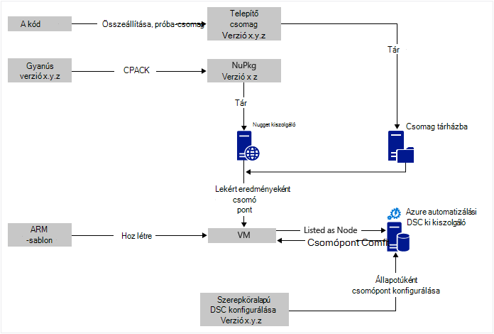
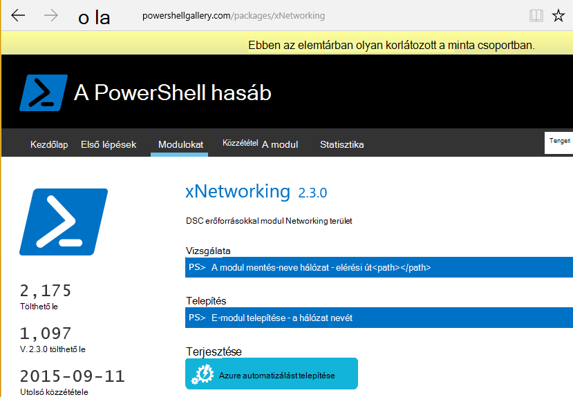

<properties
   pageTitle="Azure automatizálási DSC a folyamatos alapú környezet, amelyben Chocolatey |} Microsoft Azure"
   description="DevOps folyamatos telepítési Azure automatizálási DSC és Chocolatey csomag manager használatával.  Példa teljes JSON ARM sablon és PowerShell forrás."
   services="automation"
   documentationCenter=""
   authors="sebastus"
   manager="stevenka"
   editor=""/>

<tags
   ms.service="automation"
   ms.devlang="na"
   ms.topic="article"
   ms.tgt_pltfrm="vm-windows"
   ms.workload="na"
   ms.date="08/08/2016"
   ms.author="golive"/>

# Példa: Folytonos telepítés virtuális gépeken futó automatizálási DSC és Chocolatey használatával

Egy DevOps világ különböző pontok megkönnyítése a folyamatos integrációs során számos eszköz közül.  Azure automatizálási kívánt állapota (DSC) konfigurációja Üdvözöljük újdonság a beállítások, amely DevOps csoportoknak is alkalmazhat.  Ez a cikk bemutatja, hogyan Windows rendszerű számítógépről felfelé folyamatos telepítő CD-beállítását.  Egyszerűen bővítheti a technika annyi Windows operációs rendszert szükséges felvenni, a szerepkör (a webhely, például), és onnan, valamint a további szerepkörök.

## Magas szintű

Meglehetősen bit megy, itt, de Szerencsére azt is lehet osztani két fő folyamat: 

  - Kódírás és tesztelés, majd létrehozásáról és közzétételéről telepítési csomagok a rendszer a fő- és alverziók verzióit. 
  - Létrehozása és kezelése, telepítése, és hajtsa végre a kódot a csomagokban VMs.  

Mindkét core eljárás vannak, ha automatikusan szeretne frissíteni a csomagot, az új verzió létrehozása és üzembe bármely adott virtuális futó rövid lépés.

## Összetevő – áttekintés

Például [apt get](https://en.wikipedia.org/wiki/Advanced_Packaging_Tool) csomag menedzserek meglehetősen jól ismert a Linux világ, de nem annyira a Windows világ.  [Chocolatey](https://chocolatey.org/) ilyen valamilyen dolog, Scott Hanselman [blog](http://www.hanselman.com/blog/IsTheWindowsUserReadyForAptget.aspx) című témakör pedig egy remek – bevezetés.  Rövid Chocolatey lehetővé teszi olyan központi adattárban csomagok csomagok telepítse a parancssorból a Windows rendszerbe.  Létrehozhat és kezelheti a saját tárházba, és Chocolatey csomagokat, amely kijelölhet tárházakban tetszőleges számú telepítheti.

A kívánt állapotot konfigurációs (DSC) ([Áttekintés](https://technet.microsoft.com/library/dn249912.aspx)), amely lehetővé teszi, hogy a gép kívánt konfiguráció deklarálhatnak PowerShell eszköz.  Ha például ki kell mondani, "telepítve Chocolatey szeretném, szeretném IIS telepítve van, 80-as port megnyitott szeretném, verziójának 1.0.0 webhelyemre telepített szeretném."  A DSC helyi konfigurációs Manager (LKT), hogy a konfigurációs hajtja végre. DSC lekérés kiszolgáló tárolja a gépekhez konfigurációk összegyűjti. Az egyes gépen LKT ellenőrzi rendszeres időközönként, ha saját konfigurációt egyezik-e a tárolt konfigurációt. Azt is állapotjelentés, vagy próbálja meg a számítógépen tárolt konfigurációval igazítás vissza összhangba. Az adott gépi vagy az Igazítás az módosított beállításokkal hamarosan gépek okozhat a leküldéses kiszolgálón tárolt beállítások módosítására.

Azure automatizálási olyan felügyelt szolgáltatás, amellyel automatizálhatja a különböző runbooks, csomópontok, hitelesítő adatokat, erőforrások és eszközök, például a kimutatások és a globális változók használata a Microsoft Azure-ban. Azure automatizálási DSC kiterjed automatizálási képessége PowerShell DSC eszközöket is tartalmazza.  Az alábbiakban [áttekintése](automation-dsc-overview.md).

DSC erőforrás egy kódot, amely tartalmazza az adott szolgáltatásait, például az Active Directory vagy SQL Server hálózati kezelése modulra.  A Chocolatey DSC erőforrás tudja, hogyan kell fér hozzá egy NuGet kiszolgálóhoz (többek között) csomagok letöltése, a csomagok telepítése, és így tovább.  A [PowerShell gyűjtemény](http://www.powershellgallery.com/packages?q=dsc+resources&prerelease=&sortOrder=package-title)DSC számos más források találhatók.  Ezeket a modulokat telepítését be az Azure automatizálási DSC lekérés webkiszolgálóra (,), ezek a konfigurációk használható.

ARM sablonok adja meg a infrastruktúra - összetevőjét, például a hálózatok, alhálózat, hálózati biztonsági létrehozása a deklaráció útján, és a továbbítás, töltse be balancers, hálózati kártyák, VMs és így tovább.  Íme egy [cikk](../resource-manager-deployment-model.md) , hogy miben más a ARM telepítési modell (deklaráció)-ös az Azure Service (ASM vagy klasszikus) telepítési modell (elengedhetetlen).  És egy másik [cikk](../virtual-machines/virtual-machines-windows-compare-deployment-models.md) kapcsolatos alapvető erőforrás szolgáltatók, számítási, tárolási és hálózati.

Több fő ARM-sablon funkció az azt jelenti, hogy egy virtuális bővítmény telepítése a virtuális be, ahogy azt már kiépítve.  A virtuális kiterjesztéssel adott funkciókat, például futtathatnak egyéni parancsfájlokat egy, a víruskereső szoftver telepítése vagy DSC konfigurációs parancsfájl futtatása tartalmaz.  Virtuális bővítmények számos más típusát különböztethetjük meg.

## A diagram körül rövid út

Kezdési tetején, a kódírás összeállítása tesztelése, majd telepítőcsomag létrehozása.  Chocolatey telepítési csomagok, például az MSI-fájlt, MSU, ZIP különböző típusú képes kezelni.  És a tényleges telepítést végzi teendő, ha a Chocolatey a natív funkciók nem igazán felfelé a teljes power PowerShell kell.  A csomag üzembe valahol elérhető – egy csomag tárban tárolnak.  Ez a példa használja az Azure blob-tároló fiók nyilvános mappa, de tetszőleges lehet.  Chocolatey natív módon működik-e a NuGet kiszolgálók és néhány mások csomag metaadatok kezeléséhez.  [Ez a cikk](https://github.com/chocolatey/choco/wiki/How-To-Host-Feed) ismerteti a beállításokat.  Ez a példa NuGet használja.  Egy Nuspec a csomagok metaadatait.  A Nuspec "lefordítva" NuPkg képére, és egy NuGet kiszolgálón tárolt.  Amikor a konfigurációban csomag kéri a név szerint, és NuGet kiszolgáló hivatkozik, a Chocolatey DSC erőforrás (ekkor a virtuális) grabs a csomag, és telepíti.  Egy adott verziójához csomagot is kérhet.

A bal alsó részén lévő nem az Azure erőforrás Manager (ARM) sablon.  Használatát ebben a példában a virtuális kiterjesztés regisztrálja a virtuális a kiszolgálóval Azure automatizálást DSC ki (Ez azt jelenti, hogy ki kiszolgáló) csomópontot.  A konfiguráció a leküldéses kiszolgáló tárolja.  Valójában azonban van tárolva kétszer: egyszerű szövegként és összeállítani MOF fájlként (amelyek ilyen dolog, amit tudni.) miután egyszer  A portálon a MOF beállítás a "csomópont" (nem pedig egyszerűen "konfigurációs").  Az eltérés, így a csomópont tudni fogja, hogy a konfigurációs csomópont tartozó.  Az alábbi részleteket bemutatják, hogyan csomópont konfigurációját hozzárendelése a csomópontot.

Feltehetően máris a bit, vagy azt a legtöbb tetején.  A nuspec létrehozása, összeállítása NuGet kiszolgáló tárolja az kis valamilyen dolog.  És VMs már kezeli.  Írása a következő lépésben folyamatos példányhoz szükséges, állítsa be a leküldéses server (egyszer), regisztráló a csomópontok (egyszer), és létrehozásáról és a konfigurációs van (az eredetileg) tárolásához.  Csomagok frissített, és a tárházba rendszerbe, majd frissítse a beállításait, illetve a csomópont beállításait ki Server (ismétlés szükség szerint).

Ha nem indítja el egy ARM sablonnal, amely is az OK gombra.  Vannak olyan segítséget nyújt a VMs regisztrálása a leküldéses kiszolgáló és az összes többi PowerShell-parancsmagok. További részletekért olvassa el ezt a cikket: [Azure automatizálási DSC kezelésére bevezetési gépekhez](automation-dsc-onboarding.md)

## Lépés: 1: A leküldéses kiszolgálóra telepített és automatizálási fiók beállítása

Egy hitelesített (Hozzáadás-AzureRmAccount) PowerShell parancssorból: (eltarthat néhány percet, amíg a leküldéses kiszolgáló van beállítva)

    New-AzureRmResourceGroup –Name MY-AUTOMATION-RG –Location MY-RG-LOCATION-IN-QUOTES
    New-AzureRmAutomationAccount –ResourceGroupName MY-AUTOMATION-RG –Location MY-RG-LOCATION-IN-QUOTES –Name MY-AUTOMATION-ACCOUNT 

Automatizálási fiókja írható sem a következő régiók (más néven hely): Kelet-amerikai 2, Dél központi US, US Gov Virginia, nyugati Europe, Délkelet-ázsiai, japán keleti, központi indiai és Ausztrália Délkelet.

## Lépés: 2: Virtuális bővítmény beállításokból állnak a ARM sablonba

Virtuális regisztrációs (bővítményében PowerShell DSC virtuális) a [Azure quickstart útmutató sablon](https://github.com/Azure/azure-quickstart-templates/tree/master/dsc-extension-azure-automation-pullserver)megadott részleteit.  Ebben a lépésben az új virtuális regisztrálja a leküldéses kiszolgáló DSC csomópontok a listában.  Ez a bejegyzés részében határozza meg a csomópont konfiguráció alkalmazható a csomópontot.  A csomópont konfiguráció olyan még a leküldéses kiszolgálóhoz, így az OK gombra, amely lépés: 4 amikor ez történik az első alkalommal nem tartozik.  De itt a 2 kell döntött, a csomópont neve és a konfigurációs nevét.  Használatát ebben a példában a csomópont "isvbox" és a beállítás "ISVBoxConfig".  Ezért a csomópont konfigurációs névre (DeploymentTemplate.json kell megadni) "ISVBoxConfig.isvbox".  

## 3 lépés: A leküldéses kiszolgáló szükséges DSC erőforrások hozzáadása

A PowerShell gyűjtemény van rendszereken DSC erőforrások telepítéséhez az automatizálási Azure-fiókjába.  Nyissa meg az erőforráshoz szeretne, és kattintson a "Üzembe az Azure automatizálási" gombra.

Az Azure-portálra nemrégiben egy másik módszerrel lekérje a új modulok és frissítheti a meglévő modulok teszi lehetővé. Az automatizálási fiók erőforrás, a Webhelyeszközök csempét, végül a modulokat csempére kattintva.  A Tallózás gombra a gyűjtemény ikon lehetővé teszi, hogy a tárban modulokat listájának megjelenítéséhez, részletek részletezést, és végül a automatizálási fiókba importálandó. Az a modulokat naprakészen tartása időről-időre kiválóan használhatók. És az import funkció függőségek miatt nincs szinkronban amellyel más modulok ellenőrzi.

Vagy a manuális módon van.  A Windows rendszerű számítógépről egy PowerShell-integráció modult mappa felépítésének kissé eltér a mappastruktúra az Azure automatizálási által elvárt.  Ehhez a kijelző kis színcsúszkákkal.  De még nem kemény, és az áttelepítés csak egyszer / erőforrás (kivéve, ha frissíteni szeretné azt a jövőben.)  A PowerShell integrációs modulok létrehozásával kapcsolatos további tudnivalókért lásd: Ez a cikk: [Az Azure automatizálási szerzői integrációs modulok](https://azure.microsoft.com/blog/authoring-integration-modules-for-azure-automation/)

-   Telepítse a modul, amely a következőképpen kell a számítógépen:
    -   Telepítse a [Windows Management Framework, v5](http://aka.ms/wmf5latest) (nem szükséges, a Windows 10)
    -   `Install-Module –Name MODULE-NAME`< – grabs a modul a PowerShell-dokumentumtárból 
-   Másolja a modul mappát a `c:\Program Files\WindowsPowerShell\Modules\MODULE-NAME` temp mappába 
-   Minták és dokumentáció törlése a fő mappából 
-   Zip-mappáját, a ZIP-fájl elnevezési pontosan ugyanaz, mint a mappa 
-   A ZIP-fájl üzembe elérhető HTTP helyre, például a blob-tárolóhoz az Azure tárterület-fiókokban található.
-   A PowerShell futtatása:

        New-AzureRmAutomationModule `
            -ResourceGroupName MY-AUTOMATION-RG -AutomationAccountName MY-AUTOMATION-ACCOUNT `
            -Name MODULE-NAME –ContentLink "https://STORAGE-URI/CONTAINERNAME/MODULE-NAME.zip"
        

A mellékelve példa cChoco és xNetworking hajt végre ezeket a lépéseket. A [jegyzetek](#notes) speciális kezelésére vonatkozó cChoco témakörben talál.

## Lépés: 4: A leküldéses kiszolgáló a csomópont konfiguráción hozzáadása

Nincs kapcsolatban a konfigurációban a ki- és a fordítási programba importált először speciális.  Minden későbbi importálási/lefordítja az azonos konfiguráció lesz pontosan azonos.  Minden alkalommal, amikor frissíti a csomag és az kell nyomni termelési érheti el ezt a lépést követően, hogy helyes-e a konfigurációs fájl biztosítva – beleértve a csomag új verziója.  Az alábbiakban a konfigurációs fájl- és PowerShell:

ISVBoxConfig.ps1:

    Configuration ISVBoxConfig 
    { 
        Import-DscResource -ModuleName cChoco 
        Import-DscResource -ModuleName xNetworking
    
        Node "isvbox" {   
    
            cChocoInstaller installChoco 
            { 
                InstallDir = "C:\choco" 
            }
    
            WindowsFeature installIIS 
            { 
                Ensure="Present" 
                Name="Web-Server" 
            }
    
            xFirewall WebFirewallRule 
            { 
                Direction = "Inbound" 
                Name = "Web-Server-TCP-In" 
                DisplayName = "Web Server (TCP-In)" 
                Description = "IIS allow incoming web site traffic." 
                DisplayGroup = "IIS Incoming Traffic" 
                State = "Enabled" 
                Access = "Allow" 
                Protocol = "TCP" 
                LocalPort = "80" 
                Ensure = "Present" 
            }
    
            cChocoPackageInstaller trivialWeb 
            {            
                Name = "trivialweb" 
                Version = "1.0.0" 
                Source = “MY-NUGET-V2-SERVER-ADDRESS” 
                DependsOn = "[cChocoInstaller]installChoco", 
                "[WindowsFeature]installIIS" 
            } 
        }    
    }

Új-ConfigurationScript.ps1:

    Import-AzureRmAutomationDscConfiguration ` 
        -ResourceGroupName MY-AUTOMATION-RG –AutomationAccountName MY-AUTOMATION-ACCOUNT ` 
        -SourcePath C:\temp\AzureAutomationDsc\ISVBoxConfig.ps1 ` 
        -Published –Force
    
    $jobData = Start-AzureRmAutomationDscCompilationJob ` 
        -ResourceGroupName MY-AUTOMATION-RG –AutomationAccountName MY-AUTOMATION-ACCOUNT ` 
        -ConfigurationName ISVBoxConfig 
    
    $compilationJobId = $jobData.Id
    
    Get-AzureRmAutomationDscCompilationJob ` 
        -ResourceGroupName MY-AUTOMATION-RG –AutomationAccountName MY-AUTOMATION-ACCOUNT ` 
        -Id $compilationJobId

E lépések eredménye egy új csomópont konfigurációban a leküldéses kiszolgálón helyezés "ISVBoxConfig.isvbox" nevű.  A csomópont konfigurációs neve "configurationName.nodeName" mint épül.

## Lépés 5: Létrehozása és fenntartása csomag metaadatok

Az egyes csomagok történő csomag tárházba elhelyezett egy nuspec azt ismerteti, hogy szüksége van.  Adott nuspec lefordított legyen, és a NuGet kiszolgáló tárolja. Ez a folyamat leírása [Itt](http://docs.nuget.org/create/creating-and-publishing-a-package).  Egy NuGet kiszolgálójával MyGet.org is használhatja.  Ez a szolgáltatás értékesítés, de rendelkezik, amelyek szabadon Termékváltozat alapszintű.  NuGet.org saját NuGet kiszolgálót, a személyes csomagok telepítésével kapcsolatos találhatók.

## Lépés a 6: Az összes közös és

Minden alkalommal, amikor egy verzió átadja a kérdések és válaszok és bonyolíthat le telepítéshez, a csomag jön létre, nuspec és nupkg frissülnek, és a NuGet kiszolgálóra rendszerbe.  Ezeken kívül az konfiguráció (lépés: 4 fenti) kell frissíteni fogadja el az új verziószámot.  Meg kell a leküldéses kiszolgálóra küldött és lefordított.  Ettől kezdve azt is a VMs, húzza a frissítés, és telepítse a konfigurációjától függ.  Az összes alábbi frissítéseket kell egyszerű – csak egy sort, vagy két PowerShell.  Visual Studio Team Services, amíg egy részüket vannak beágyazva is lehet módszere során közös építés az összeállítás feladatokat.  Ez a [cikk](https://www.visualstudio.com/en-us/docs/alm-devops-feature-index#continuous-delivery) részletesen ismerteti.  A [GitHub repó](https://github.com/Microsoft/vso-agent-tasks) a különböző elérhető build feladatok adatait.

## Jegyzetek

Ez a példa egy virtuális egy általános Windows Server 2012 R2 kép az Azure gyűjteményből kezdődik.  Indulás a bármely tárolt kép, és kattintson az animáció működését a DSC beállításokkal onnan.  Módosítása a beállításokat, amelyek sütik képbe viszont sokkal nehezebb, mint a konfiguráció használata DSC dinamikusan frissítése.

Nem kell ezzel a módszerrel nemcsak használata a VMs egy ARM sablon és a virtuális bővítmény használatával.  És a VMs nem kell Azure a CD-kezelés kell lennie.  Minden szükséges Chocolatey telepített és az LKT konfigurálva a a virtuális, így megtudhatja, a ki kiszolgálót.  

Természetesen Ha egy gyártási lévő virtuális a csomagot, akkor kell venni, hogy ki a Forgatás virtuális telepítve van a frissítés során.  Hogyan teheti ezt körben változik.  Például az Azure terheléselosztó mögött virtuális, az is felvehet egy egyéni Probe.  A virtuális frissítésekor van egy 400 visszatérési vizsgálati végpontot.  Az animáció működését okozhat a módosítás szükséges lehet belül a konfigurálás is, ha vissza szeretne váltani egy 200 visszaadása, amikor befejeződik a frissítés működését.

Ez a példa teljes forrás GitHub [a Visual Studio projekt](https://github.com/sebastus/ARM/tree/master/CDIaaSVM) szerepel.

##Kapcsolódó cikkek##

- [Azure automatizálási DSC áttekintése] (automatizálási dsc, overview.md)
- [Azure automatizálási DSC parancsmagok] (https://msdn.microsoft.com/library/mt244122.aspx)
- [Azure automatizálási DSC kezelésére bevezetési gépekhez] (automatizálási dsc, onboarding.md)
