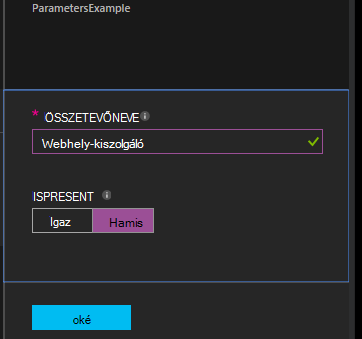

<properties 
   pageTitle="Az Azure automatizálást DSC konfigurációk lefordítása |} Microsoft Azure" 
   description="Kétféle módon állíthat össze a kívánt állapotot konfigurációs (DSC) konfigurációk áttekintése: az Azure-portálra, és a Windows PowerShell. " 
   services="automation" 
   documentationCenter="na" 
   authors="coreyp-at-msft" 
   manager="stevenka" 
   editor="tysonn"/>

<tags
   ms.service="automation"
   ms.devlang="na"
   ms.topic="article"
   ms.tgt_pltfrm="powershell"
   ms.workload="na" 
   ms.date="01/25/2016"
   ms.author="coreyp"/>
   
#Az Azure automatizálási DSC konfigurációk lefordítása#

Azure automatizálást kétféleképpen adatközpontokban állam konfigurációs (DSC) konfigurációk fordíthat: az Azure-portálra, és a Windows PowerShell. Az alábbi táblázat segítségével eldöntheti, hogy mikor érdemes használni az egyes jellemzők alapján módszer: 

###Azure megtekintése a portálon###
- Interaktív felhasználói felülettel legegyszerűbb módja
- Egyszerű paraméteres értékek megadását űrlap
- Könnyen nyomon követheti a feladat állapota
- Azure bejelentkezési hitelesíteni Access

###A Windows PowerShell###
- Hívja fel a parancssorból a Windows PowerShell-parancsmagok
- Beépíthetők automatikus megoldás több lépésben
- Egyszerű vagy összetett paraméterértékek megadása
- Nyomon követheti a feladat állapota
- Ügyfél szükséges: PowerShell-parancsmagok
- A sikeres ConfigurationData
- Hitelesítő adatok használó konfigurációk összeállítása

Miután eldöntötte, az összeállítás módszer, kövesse az alábbi indítása lefordítása megfelelő eljárások.

##Az Azure portálján DSC konfiguráció lefordítása##

1.  Az automatizálási fiókját kattintson a **Beállítások**elemre.
2.  Kattintson a konfiguráció saját lap megnyitásához.
3.  Kattintson a **fordítási**.
4.  Ha a konfigurációs paraméterek tartalmaz, a rendszer kéri győződjön meg arról, hogy szeretné-e fordítsa. Konfiguráció paraméterek tartalmaz, ha a **Konfigurációs összeállítása** a lap nyílik meg, a paraméter értéke lehet nyújtani. Című <a href="#basic-parameters">**Alapvető paramétereket**</a> alatti további részleteket a paraméterek.
5.  A **Fordítás feladat** lap van megnyitva, így nyomon követheti a fordítás feladat állapotát és azt a kiszolgálón Azure automatizálási DSC lekérés helyét okozott csomópont konfigurációk (MOF konfigurációs dokumentumok).

##A Windows PowerShell DSC konfiguráció lefordítása##

Használható [`Start-AzureRmAutomationDscCompilationJob`](https://msdn.microsoft.com/library/mt244118.aspx) indítása a Windows PowerShell összeállítása. A példa a **SampleConfig**nevű DSC konfiguráció összeállítása kezdődik.

    Start-AzureRmAutomationDscCompilationJob -ResourceGroupName "MyResourceGroup" -AutomationAccountName "MyAutomationAccount" -ConfigurationName "SampleConfig" 
 
`Start-AzureRmAutomationDscCompilationJob`a fordítás feladat objektumot állapotát nyomon követésére használható adja vissza. Ezután felhasználhatja a fordítás feladat objektum [`Get-AzureRmAutomationDscCompilationJob`](https://msdn.microsoft.com/library/mt244120.aspx) határozza meg a fordítási feladat állapotának és [`Get-AzureRmAutomationDscCompilationJobOutput`](https://msdn.microsoft.com/library/mt244103.aspx) megtekintése a adatfolyamok (kibocsátás). A következő mintát elindítja a **SampleConfig** konfiguráció összeállítása, megvárja, amíg a befejeződött, és akkor jeleníti meg az adatfolyam megjelenítését.
    
    $CompilationJob = Start-AzureRmAutomationDscCompilationJob -ResourceGroupName "MyResourceGroup" -AutomationAccountName "MyAutomationAccount" -ConfigurationName "SampleConfig"
    
    while($CompilationJob.EndTime –eq $null -and $CompilationJob.Exception –eq $null)           
    {
        $CompilationJob = $CompilationJob | Get-AzureRmAutomationDscCompilationJob
        Start-Sleep -Seconds 3
    }
    
    $CompilationJob | Get-AzureRmAutomationDscCompilationJobOutput –Stream Any 

##Alapvető paraméterei##

DSC beállításokat, beleértve a paraméter típusok és tulajdonságai, paraméter deklaráció azonos Azure automatizálást runbooks működik. Lásd: [az Azure automatizálást egy runbook indítása](automation-starting-a-runbook.md) bővebb információkat runbook paramétereket.

Az alábbi példában **ÖsszetevőNeve** és **IsPresent**, két paramétereket határozza meg a fordításkor generált **ParametersExample.sample** csomópont konfigurálása a tulajdonság értékét.

    Configuration ParametersExample
    {
        param(
            [Parameter(Mandatory=$true)]
    
            [string] $FeatureName,
    
            [Parameter(Mandatory=$true)]
            [boolean] $IsPresent
        )
    
        $EnsureString = "Present"
        if($IsPresent -eq $false)
        {
            $EnsureString = "Absent"
        }
    
        Node "sample"
        {
            WindowsFeature ($FeatureName + "Feature")
            {
                Ensure = $EnsureString
                Name = $FeatureName
            }
        }
    }

Az Azure automatizálást DSC portálon vagy a Azure PowerShell egyszerű paramétereket használó DSC konfigurációk állíthat össze:

###Portál###

A portálon adja meg paraméterértékeket **fordítása**gombra kattint.

###A PowerShell###

A PowerShell, ahol az a billentyűt a paraméter neve megegyezik és a paraméter értéke egy [hashtable](http://technet.microsoft.com/library/hh847780.aspx) paraméterek szükséges.

    $Parameters = @{
            "FeatureName" = "Web-Server"
            "IsPresent" = $False
    }
    
    
    Start-AzureRmAutomationDscCompilationJob -ResourceGroupName "MyResourceGroup" -AutomationAccountName "MyAutomationAccount" -ConfigurationName "ParametersExample" -Parameters $Parameters 
    

PSCredentials átadása paraméterként kapcsolatos tudnivalókért lásd: az alábbi <a href="#credential-assets">**Hitelesítőadat-eszközök**</a> .

##ConfigurationData##

**ConfigurationData** lehetővé teszi, hogy minden olyan környezetben adott konfigurációs PowerShell DSC használata közben a szerkezeti konfigurációs külön. Lásd: [a PowerShell DSC "Ha" a "Mi" Különválasztó](http://blogs.msdn.com/b/powershell/archive/2014/01/09/continuous-deployment-using-dsc-with-minimal-change.aspx) **ConfigurationData**olvashat.

>[AZURE.NOTE] **ConfigurationData** is használhatja, ha lefordítása Azure automatizálási DSC Azure PowerShell használatával, de nem az Azure-portálon.

Az alábbi példa DSC konfiguráció **ConfigurationData** használja, az **$ConfigurationData** és **$AllNodes** kulcsszavak keresztül. Is szüksége lesz a [ **xWebAdministration** modul](https://www.powershellgallery.com/packages/xWebAdministration/) ebben a példában:

     Configuration ConfigurationDataSample
     {
        Import-DscResource -ModuleName xWebAdministration -Name MSFT_xWebsite
    
        Write-Verbose $ConfigurationData.NonNodeData.SomeMessage 
    
        Node $AllNodes.Where{$_.Role -eq "WebServer"}.NodeName
        {
            xWebsite Site
            {
                Name = $Node.SiteName
                PhysicalPath = $Node.SiteContents
                Ensure   = "Present"
            }
        }
    }

A PowerShell feletti DSC konfigurációs fordíthat. Az alábbi PowerShell ad hozzá az Azure automatizálási DSC lekérés kiszolgálóhoz két csomópont konfiguráció: **ConfigurationDataSample.MyVM1** és **ConfigurationDataSample.MyVM3**:

    $ConfigData = @{
        AllNodes = @(
            @{
                NodeName = "MyVM1"
                Role = "WebServer"
            },
            @{
                NodeName = "MyVM2"
                Role = "SQLServer"
            },
            @{
                NodeName = "MyVM3"
                Role = "WebServer"
    
            }
    
        )
    
        NonNodeData = @{
            SomeMessage = "I love Azure Automation DSC!"
    
        }
    
    } 
    
    Start-AzureRmAutomationDscCompilationJob -ResourceGroupName "MyResourceGroup" -AutomationAccountName "MyAutomationAccount" -ConfigurationName "ConfigurationDataSample" -ConfigurationData $ConfigData

##Eszközök##

Digitáliseszköz-hivatkozások megegyeznek az Azure automatizálási DSC konfigurációk és runbooks. Lásd: további információt a következő:

- [Tanúsítványok](automation-certificates.md)
- [Kapcsolatok](automation-connections.md)
- [Hitelesítő adatok](automation-credentials.md)
- [Változók](automation-variables.md)

###Hitelesítő adatok eszközök###
DSC konfigurációk az Azure automatizálás hivatkozhat hitelesítőadat-eszközök **Get-AzureRmAutomationCredential**használatával, miközben hitelesítőadat-eszközök is továbbíthatók a keresztül paraméterek, ha szükségesnek látja. Ha a konfiguráció **PSCredential** típusú paramétert, majd meg kell adják át a karakterlánc neve Azure automatizálási hitelesítő adatok tárgyi eszköz egy PSCredential objektum helyett a paraméter. A háttérben az Azure automatizálási hitelesítő eszköz ilyen nevű fog beolvasott és a konfigurációs átadott.

Megőrzési hitelesítő adatok biztonságos (MOF konfigurációs dokumentumok) csomópontot konfiguráció szükséges a hitelesítő adatok a csomópont konfigurációs MOF fájl titkosítása. Azure automatizálást Ez egy lépésben tovább tart, és a teljes MOF fájl titkosítja. Azonban jelenleg meg kell, hogy PowerShell DSC nem probléma során MOF csomópont konfigurációját, egyszerű szöveg gyártandó hitelesítő adatok, mert a PowerShell DSC nem tudja, hogy Azure automatizálást fog kell a teljes MOF fájl titkosítása után a generációs a fordítás feladat keresztül.

Beállíthatja, hogy PowerShell DSC, hogy az rendben egyszerű szöveges formátumban MOF-ot <a href="#configurationdata">**ConfigurationData**</a>használatával létrehozott csomópont konfigurációban gyártandó hitelesítő adatokat. A sikeres kell `PSDscAllowPlainTextPassword = $true` keresztül **ConfigurationData** minden csomópont blokk jelölőnégyzetét, amelyek az DSC beállítás jelenik meg, és a hitelesítő adatokkal.

A következő példa bemutatja a hitelesítő adatok automatizálási eszköz használó DSC konfiguráció.

    Configuration CredentialSample
    {
       $Cred = Get-AzureRmAutomationCredential -Name "SomeCredentialAsset"
    
        Node $AllNodes.NodeName
        { 
            File ExampleFile
            { 
                SourcePath = "\\Server\share\path\file.ext" 
                DestinationPath = "C:\destinationPath" 
                Credential = $Cred 
            }
        }
    }

A PowerShell feletti DSC konfigurációs fordíthat. Az alábbi PowerShell ad hozzá az Azure automatizálási DSC lekérés kiszolgálóhoz két csomópont konfiguráció: **CredentialSample.MyVM1** és **CredentialSample.MyVM2**.

    $ConfigData = @{
        AllNodes = @(
            @{
                NodeName = "*"
                PSDscAllowPlainTextPassword = $True
            },
            @{
                NodeName = "MyVM1"
            },
            @{
                NodeName = "MyVM2"
            }
        )
    }
    
    Start-AzureRmAutomationDscCompilationJob -ResourceGroupName "MyResourceGroup" -AutomationAccountName "MyAutomationAccount" -ConfigurationName "CredentialSample" -ConfigurationData $ConfigData
