<properties
   pageTitle="Azure automatizálást DSC – első lépések"
   description="MAGYARÁZAT és a leggyakoribb feladatok a Azure automatizálási kívánt állam konfigurációs (DSC) példák"
   services="automation" 
   documentationCenter="na" 
   authors="eslesar" 
   manager="dongill" 
   editor="tysonn"/>

<tags
   ms.service="automation"
   ms.devlang="na"
   ms.topic="article"
   ms.tgt_pltfrm="powershell"
   ms.workload="na" 
   ms.date="06/06/2016"
   ms.author="magoedte;eslesar"/>
   

# <a name="getting-started-with-azure-automation-dsc"></a>Azure automatizálási DSC – első lépések

Ebből a témakörből megtudhatja, hogy hogyan végezhető el a leggyakoribb feladatok a Azure automatizálási kívánt állam konfigurációs (DSC), például hozhat létre, a importálja, és a konfigurációk esetén bevezetési gépek kezeléséhez, összeállítása és a jelentések megtekintése. Mi az Azure automatizálási DSC áttekintést [Azure automatizálási DSC áttekintése](automation-dsc-overview.md)című témakörben találhat. DSC dokumentációt a [Windows PowerShell kívánt állam konfigurációs áttekintése](https://msdn.microsoft.com/PowerShell/dsc/overview)című témakörben találhat.

Ez a témakör részletes útmutatásra Azure automatizálási DSC használatával. Ha azt szeretné, hogy a minta-környezetekben, a cikkben ismertetett lépéseket követve nélkül már be van állítva, [a következő ARM sablont](https://github.com/azureautomation/automation-packs/tree/master/102-sample-automation-setup)is használhatja. Ez a sablon egy befejezett Azure automatizálási DSC környezet kialakítása, többek között az Azure virtuális Azure automatizálási DSC által kezelt beállítja.
 
## <a name="prerequisites"></a>Előfeltételek

Ebben a témakörben ismertetett példák elvégzéséhez a következők szükségesek:

- Azure automatizálási fiókkal. Azure automatizálási futtatása, fiók létrehozása, tanulmányozza [Azure Futtatás másként fiókot](automation-sec-configure-azure-runas-account.md).
- Az erőforrás-kezelő Azure virtuális (klasszikus) fut a Windows Server 2008 R2 vagy újabb verziójában. Egy virtuális létrehozása, tanulmányozza [az első Windows virtuális gép az Azure portál létrehozása](../virtual-machines/virtual-machines-windows-hero-tutorial.md)

## <a name="creating-a-dsc-configuration"></a>DSC konfiguráció létrehozása

Egy egyszerű [DSC konfigurációs](https://msdn.microsoft.com/powershell/dsc/configurations) , amely biztosítja a jelenléti vagy a távolléti, a **Webkiszolgáló** Windows szolgáltatás (IIS), attól függően, hogy hogyan rendelhet csomópontok hozunk létre.

1. Indítsa el a Windows PowerShell ISE (vagy bármilyen szövegszerkesztővel).

2. Írja be a következőket:

    ```powershell
    configuration TestConfig
    {
        Node WebServer
        {
            WindowsFeature IIS
            {
                Ensure               = 'Present'
                Name                 = 'Web-Server'
                IncludeAllSubFeature = $true

            }
        }

        Node NotWebServer
        {
            WindowsFeature IIS
            {
                Ensure               = 'Absent'
                Name                 = 'Web-Server'

            }
        }
        }
    ```
3. Mentse a fájlt `TestConfig.ps1`.

Ebben a konfigurációban minden csomópont blokk, az [erőforrás WindowsFeature](https://msdn.microsoft.com/powershell/dsc/windowsfeatureresource)jelenléti vagy hiányában a **Webkiszolgáló** szolgáltatás garantálja, egy erőforrás felvételét.

## <a name="importing-a-configuration-into-azure-automation"></a>A konfiguráció importálása az Azure automatizálási

Ezután azt fogja konfigurációt importálni az automatizálási figyelembe.

1. Jelentkezzen be az [Azure-portálon](https://portal.azure.com).

2. Központi menüben kattintson a **összes erőforrás** , majd az automatizálási fiókja nevét.

3. Kattintson az **automatizálás fiók** lap **DSC konfigurációk**.

4. A **DSC beállítások** lap kattintson a **Hozzáadás a konfiguráció**gombra.

5. A **Konfiguráció importálása** a lap, tallózással keresse meg a `TestConfig.ps1` fájlt a számítógépen.
    
    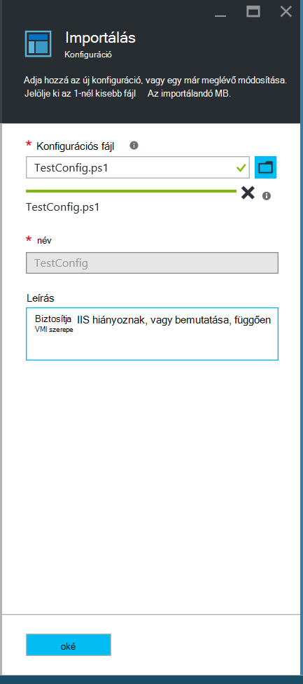
    

6. Kattintson az **OK gombra**.

## <a name="viewing-a-configuration-in-azure-automation"></a>A konfiguráció Azure automatizálási megtekintése

Miután a konfiguráció importálása, megtekintheti az Azure-portálon.

1. Jelentkezzen be az [Azure-portálon](https://portal.azure.com).

2. Központi menüben kattintson a **összes erőforrás** , majd a automatizálást fiók nevére.

3. Kattintson a **fiók automatizálást** lap **DSC konfigurációk**

4. Kattintson a **DSC konfigurációk** lap **TestConfig** (Ez az a név, a konfiguráció importálásakor az előző eljárás).

5. Kattintson a **TestConfig konfigurációs** lap **konfigurációs forrás megtekintése**.

    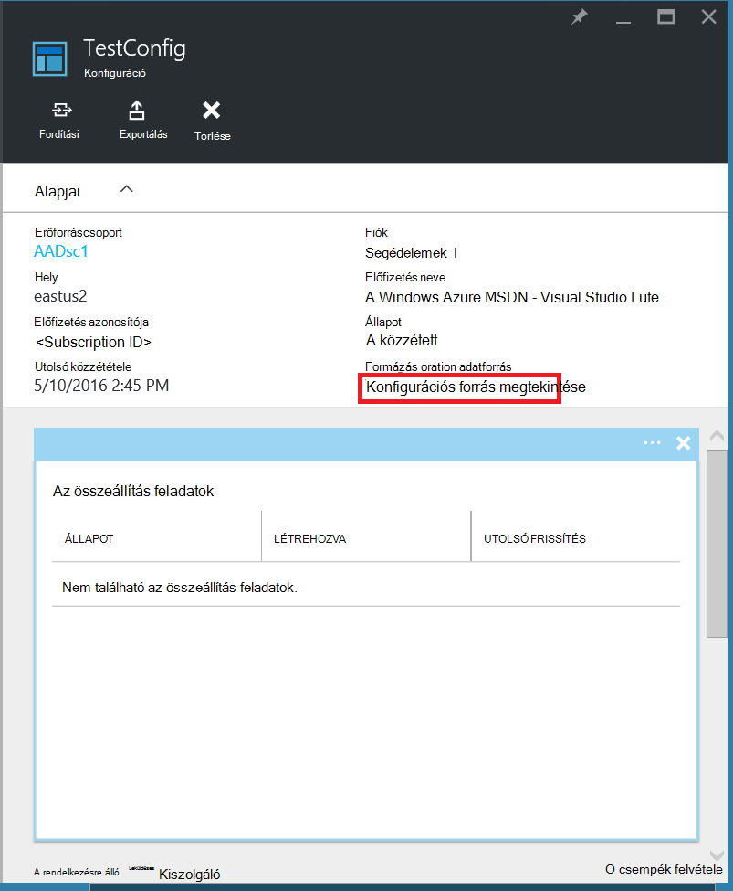
    
    Egy **TestConfig konfigurációs forrásban** lap megnyílik, és megjeleníti a PowerShell-kódot a konfiguráción.
    
## <a name="compiling-a-configuration-in-azure-automation"></a>A konfiguráció az Azure automatizálást lefordítása

A kívánt állapotot alkalmazhat egy csomópontot, mielőtt a DSC konfiguráció, hogy az állapot megadása kell lefordítva egy vagy több csomópont konfigurációk (MOF dokumentum), és az automatizálási DSC lekérés kiszolgáló helyezett el. Részletesebb leírását az Azure automatizálást DSC konfigurációk lefordítása olvassa el a [lefordítása Azure automatizálást DSC beállításai](automation-dsc-compile.md)című témakört. Konfigurációk lefordítása kapcsolatos további tudnivalókért olvassa el a [DSC konfigurációk](https://msdn.microsoft.com/PowerShell/DSC/configurations)című témakört.

1. Jelentkezzen be az [Azure-portálon](https://portal.azure.com).

2. Központi menüben kattintson a **összes erőforrás** , majd az automatizálási fiókja nevét.

3. Kattintson az **automatizálás fiók** lap **DSC konfigurációk**

4. Kattintson a **DSC konfigurációk** lap **TestConfig** (az előzőleg importált kereséskonfigurációs neve).

5. A **TestConfig konfigurációs** lap a kattintson a **fordítási**, és kattintson az **Igen gombra**. Ez a parancs elindítja az összeállítás feladatot.
    
    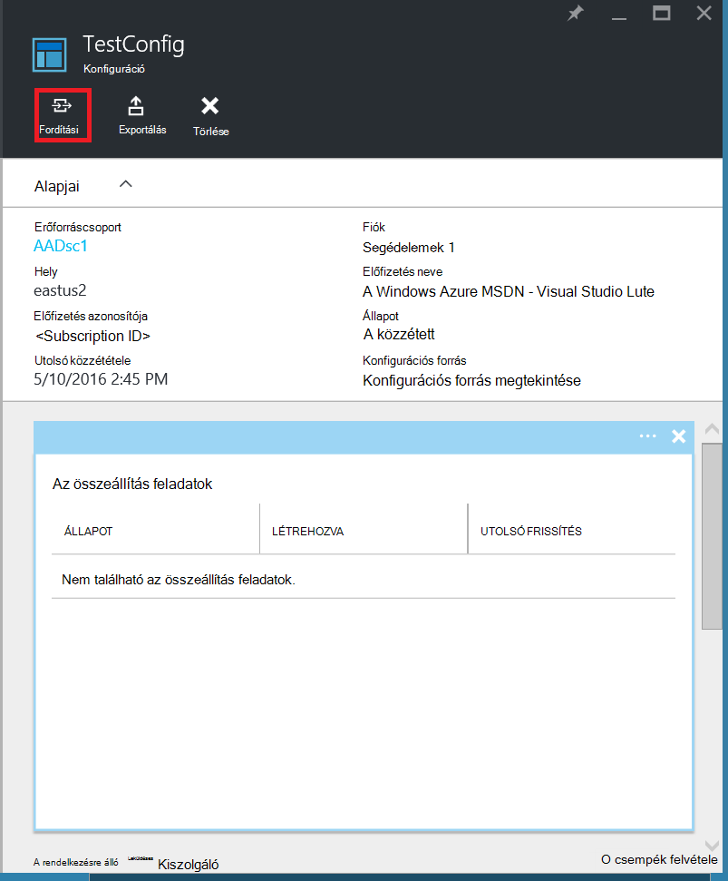
    
> [AZURE.NOTE] Ha a konfiguráció az Azure automatizálás lefordításához azt automatikusan üzembe helyezése bármelyik létrehozott csomópont konfigurálása MOF-ot a leküldéses kiszolgálóra.

## <a name="viewing-a-compilation-job"></a>A fordítás feladatok megtekintése

Miután elindította a fordítás, megtekintheti a **konfigurációs** lap a **Fordítás feladatok** csempéjén. A **Fordítás feladatok** csempe megjeleníti a futó, befejeződött, és nem sikerült a feladatokat. Amikor megnyit egy összeállítása a feladat lap, a művelet, beleértve az esetleges hibákat vagy ütközött figyelmeztetések vonatkozó információkat jelenít meg, hogy, a bemeneti paramétereket a konfigurációs és használt fordítási naplók.

1. Jelentkezzen be az [Azure-portálon](https://portal.azure.com).

2. Központi menüben kattintson a **összes erőforrás** , majd a automatizálást fiók nevére.

3. Kattintson az **automatizálás fiók** lap **DSC konfigurációk**.

4. Kattintson a **DSC konfigurációk** lap **TestConfig** (az előzőleg importált kereséskonfigurációs neve).

5. A **Fordítás feladatok** megjeleníteni a **TestConfig konfigurációs** lap kattintson a feladatok szerepel a listában bármelyik. A **Fordítás feladat** lap megnyitása, amelyet a fordítás feladat indított dátumával.

    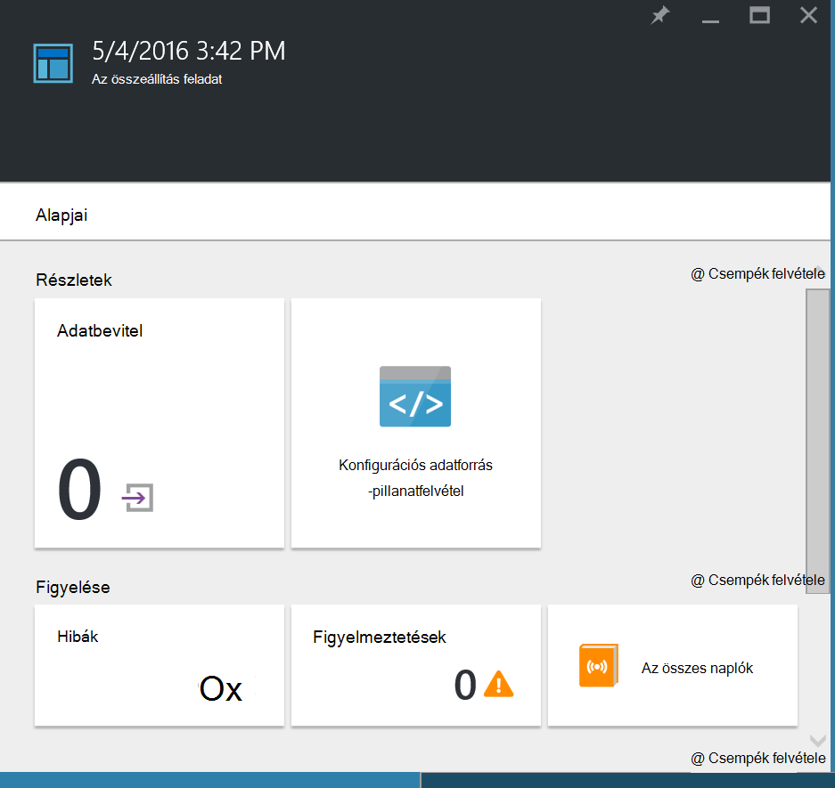
  
6. Kattintson bármelyik csempére kattintva további információkat a feladat szeretne látni a **Fordítás feladat** lap a.

## <a name="viewing-node-configurations"></a>Csomópont-beállítások megtekintése

A fordítás projekt sikeres befejezésétől egy vagy több új csomópont konfigurációk hoz létre. A csomópont konfiguráció telepítve van a leküldéses kiszolgáló, és készen áll a lekért, és egy vagy több csomópontok által alkalmazott MOF dokumentum. A csomópont konfigurációk megtekintése a **DSC csomópont-beállítások** lap automatizálási-fiókjában. A csomópont konfiguráció van az űrlapot, *ConfigurationName*neve. *Csomópontnév*.

1. Jelentkezzen be az [Azure-portálon](https://portal.azure.com).

2. Központi menüben kattintson a **összes erőforrás** , majd a automatizálást fiók nevére.

3. Kattintson az **automatizálás fiók** lap **DSC csomópont konfigurációk**.

    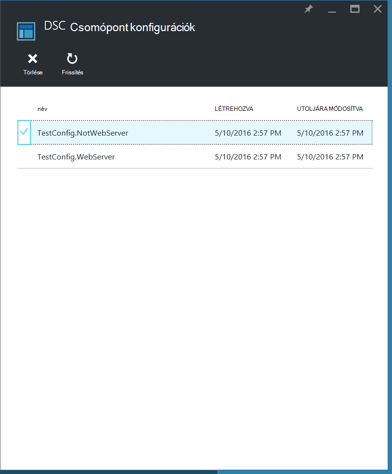
    
## <a name="onboarding-an-azure-vm-for-management-with-azure-automation-dsc"></a>Az Azure virtuális, kezelési Azure automatizálási DSC bevezetési

Azure automatizálási DSC Azure VMs (klasszikus és erőforrás-kezelő), a helyszíni VMs, Linux gépek, AWS VMs és a helyszíni fizikai gépek kezelése is használhatja. Ez a témakör foglalkozunk beépített csak Azure erőforrás-kezelő VMs hogyan. Más típusú gépek, bevezetési információt talál [bevezetési gépekhez Azure automatizálási DSC kezelésére](automation-dsc-onboarding.md).

### <a name="to-onboard-an-azure-resource-manager-vm-for-management-by-azure-automation-dsc"></a>A beépített az Azure virtuális Azure automatizálási DSC kezelésére erőforrás-kezelő gép

1. Jelentkezzen be az [Azure-portálon](https://portal.azure.com).

2. Központi menüben kattintson a **összes erőforrás** , majd az automatizálási fiókja nevét.

3. Kattintson az **automatizálás fiók** lap **DSC csomópontot**.

4. Kattintson a **DSC csomópontok** lap **Hozzáadása Azure virtuális**.

    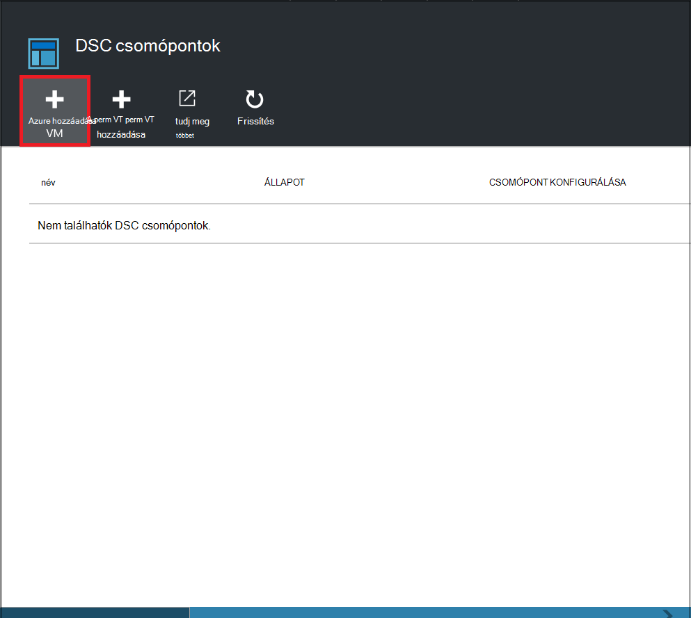

5. Kattintson az **Azure VMs hozzáadása** lap, **Jelölje ki a virtuális gépeken futó a beépített**.

6. A **VMs jelölje be** a lap válassza ki a kívánt beépített virtuális, és kattintson az **OK gombra**.

    >[AZURE.IMPORTANT] Ez lehet az Azure erőforrás-kezelő virtuális fut a Windows Server 2008 R2 vagy újabb verziójában.
    
7. Kattintson az **Azure VMs hozzáadása** lap **konfigurálása regisztrációs adatok**.

8. A **regisztráció** lap adja meg a nevét a csomópont konfigurációt szeretne alkalmazni szeretné a virtuális a **Csomópont konfiguráció neve** mezőbe. Ezzel pontosan egyeznie kell a csomópont konfiguráció automatizálási fiók nevére. Ezen a ponton kezeléséről a név nem kötelező. Módosíthatja a tevékenységhez rendelt csomópont konfigurálása után bevezetési a csomópontot.
**Indítsa újra a csomópont szükség esetén**jelölje be, és kattintson **az OK**gombra.
    
    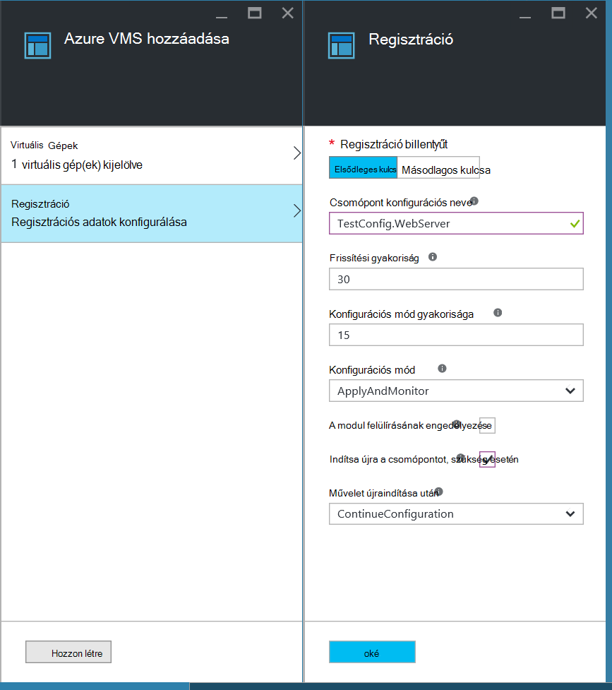
    
    A megadott csomópont konfigurálása a **Konfigurációs mód gyakoriság**által meghatározott időközönként fog vonatkozni a virtuális, és a virtuális keressen frissítéseket a **Frissítési gyakoriság**által meghatározott időközönként csomópont konfigurációját. Ezek az értékek használatáról további információt tanulmányozza a [helyi Configuration Manager beállítása](https://msdn.microsoft.com/PowerShell/DSC/metaConfig)című témakört.
    
9. Az **Azure VMs hozzáadása** lap kattintson a **Létrehozás**gombra.

Azure megkezdi a virtuális bevezetési folyamatát. Amikor elkészült, a virtuális fog megjelenni a **DSC csomópontok** fel az automatizálási fiókot.

## <a name="viewing-the-list-of-dsc-nodes"></a>DSC csomópontok listájának megtekintése

A lista összes gépek, amelyeket a **DSC csomópontok** lap automatizálási-fiókjába a kezelési onboarded tekinthet meg.

1. Jelentkezzen be az [Azure-portálon](https://portal.azure.com).

2. Központi menüben kattintson a **összes erőforrás** , majd a automatizálást fiók nevére.

3. Kattintson a **fiók automatizálást** lap **DSC csomópontot**.

## <a name="viewing-reports-for-dsc-nodes"></a>DSC csomópontok jelentések megtekintése

Minden alkalommal, amikor az Azure automatizálási DSC hajt végre olyan felügyelt csomópont konzisztencia ellenőrzése a csomópont visszaküldi állapotjelentés a leküldéses kiszolgáló. Kattintson a lap adott csomópont ezeket a jelentéseket tekinthet meg.

1. Jelentkezzen be az [Azure-portálon](https://portal.azure.com).

2. Központi menüben kattintson a **összes erőforrás** , majd a automatizálást fiók nevére.

3. Kattintson a **fiók automatizálást** lap **DSC csomópontot**.

4. A **jelentések** csempére kattintson a lista jelentés közül.

    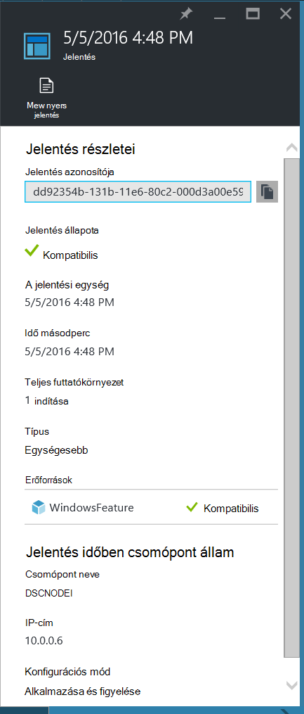

A lap egy egyéni jelentés megtekintheti az alábbi adatok állapota a megfelelő konzisztencia ellenőrzése:

- A jelentés állapota – akár a csomópont "Kompatibilis", "Nem sikerült", konfigurációjának vagy a csomópont "Nem kompatibilis" (Ha a csomópont **applyandmonitor** módban van, és a számítógép nem szerepel a kívánt állapotot).
- A kezdési időpontot a konzisztencia ellenőrzése.
- A konzisztencia ellenőrzése a teljes futtatókörnyezet.
- Konzisztencia ellenőrzése típusát.
- A hibák, beleértve a kódszámú hiba jelenik meg, és hibaüzenet jelenik meg. 
- A konfiguráció és minden erőforrás (e a csomópont jelenik meg a kívánt állapota az adott erőforrás) állapotát használt DSC erőforrások –, hogy minden további információt az adott erőforrás veheti erőforrás kattint.
- A neve, IP-cím és a csomópont konfigurációs módban.

Lásd: a tényleges adat, amely a kiszolgáló küld a csomópont- **nyers jelentés megtekintése** is kattinthat. Adatok használatával kapcsolatos további tudnivalókért lásd: a [DSC jelentés-kiszolgálóval](https://msdn.microsoft.com/powershell/dsc/reportserver).

Eltarthat egy kis időt, miután csomópont onboarded, mielőtt az első jelentés érhető el. Előfordulhat, hogy várnia kell az első jelentés akár 30 percig Miután fedélzeti csomópontot.

## <a name="reassigning-a-node-to-a-different-node-configuration"></a>A különböző csomópont konfiguráció csomópontot újbóli hozzárendelése

Rendelhet, mint a kezdetben rendelve egy másik csomópont konfiguráció használata csomópontot.

1. Jelentkezzen be az [Azure-portálon](https://portal.azure.com).

2. Központi menüben kattintson a **összes erőforrás** , majd az automatizálási fiókja nevét.

3. Kattintson az **automatizálás fiók** lap **DSC csomópontot**.

4. A **Csomópontok DSC** lap kattintson a nevére az újratársítani kívánt csomópontot.

5. A csomópont-lap kattintson a **csomópontra hozzárendelése**gombra.

    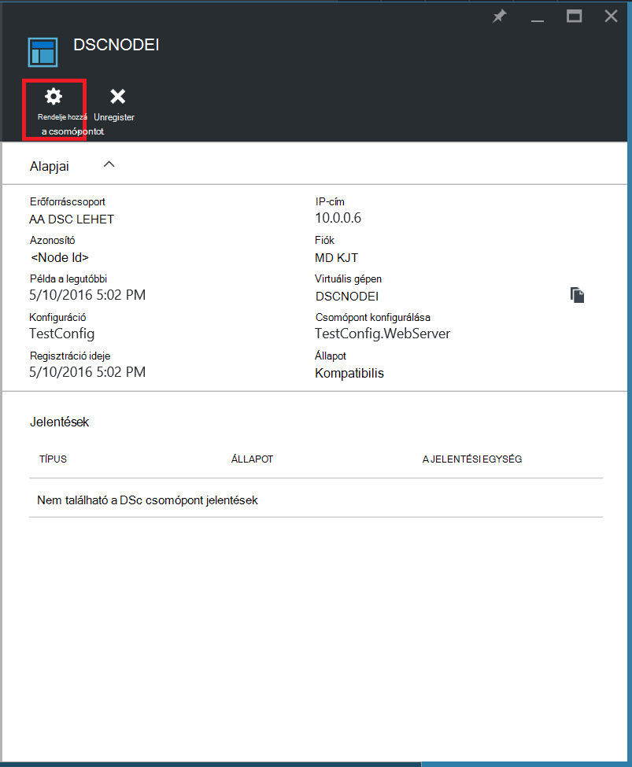

6. A **Csomópont konfigurációs hozzárendelése** lap, a válassza ki azt a csomópont konfigurációt, amelyhez szeretne rendelni a csomópontot, és kattintson **az OK**gombra.

    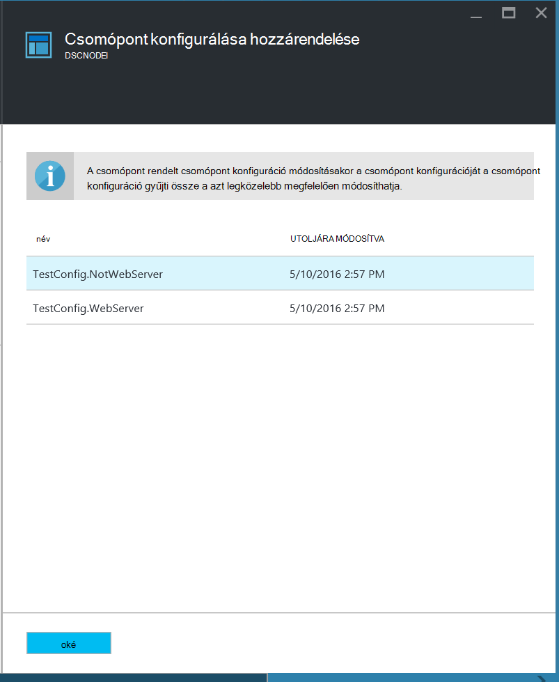
    
## <a name="unregistering-a-node"></a>A csomópont regisztrációjának

Ha már nem tudják kezelni az Azure automatizálási DSC csomópontot, akkor is unregister.

1. Jelentkezzen be az [Azure-portálon](https://portal.azure.com).

2. Központi menüben kattintson a **összes erőforrás** , majd az automatizálási fiókja nevét.

3. Kattintson az **automatizálás fiók** lap **DSC csomópontot**.

4. A **Csomópontok DSC** lap kattintson a kívánt unregister csomópont nevére.

5. Kattintson a lap adott csomópont, **Unregister**.

    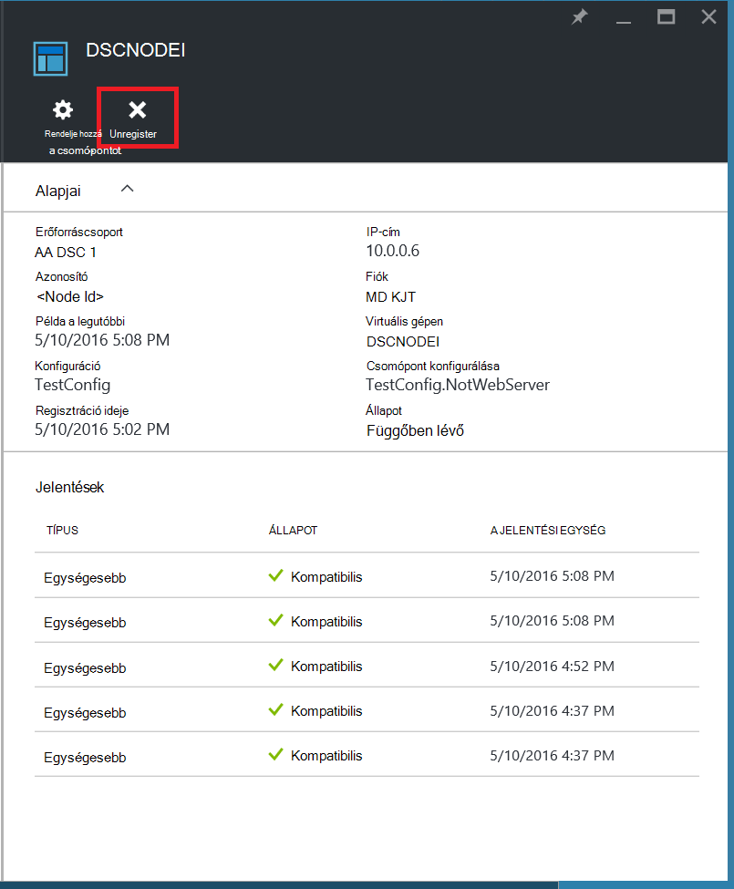

## <a name="related-articles"></a>Kapcsolódó cikkek
* [Azure automatizálási DSC – áttekintés](automation-dsc-overview.md)
* [Azure automatizálási DSC kezelésére bevezetési gépekhez](automation-dsc-onboarding.md)
* [A Windows PowerShell kívánt állapot beállítások áttekintése](https://msdn.microsoft.com/powershell/dsc/overview)
* [Azure automatizálási DSC parancsmagok](https://msdn.microsoft.com/library/mt244122.aspx)
* [Azure automatizálási DSC árak](https://azure.microsoft.com/pricing/details/automation/)

