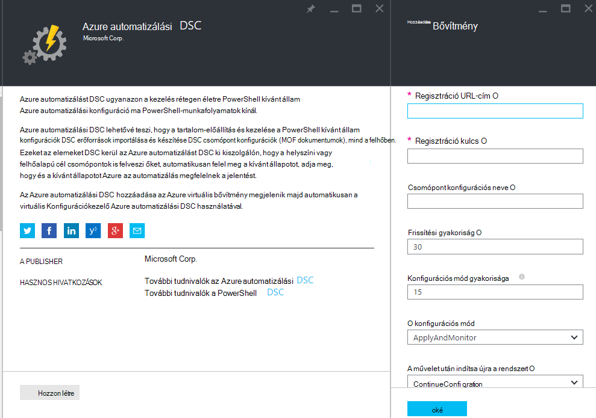
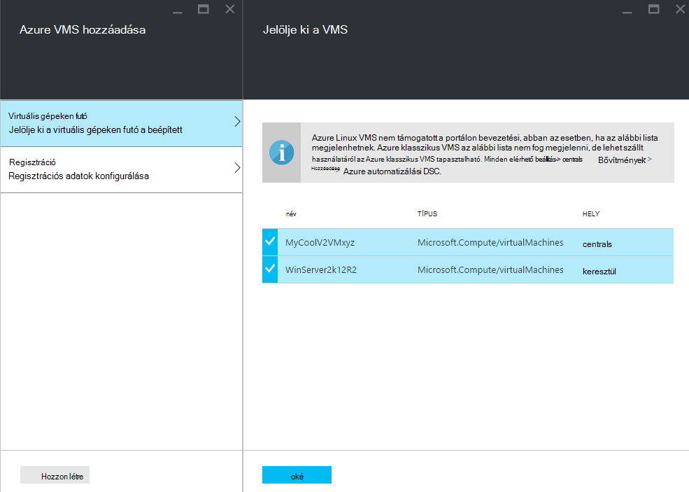
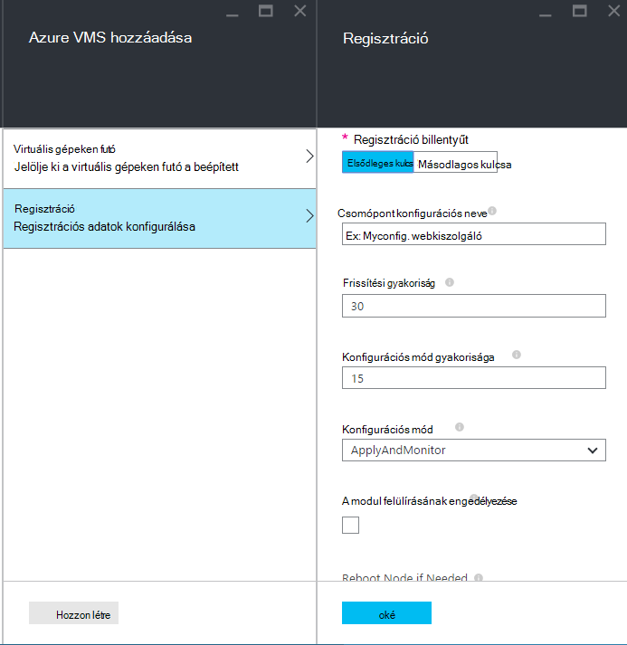
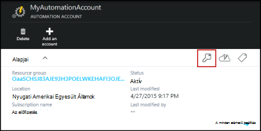
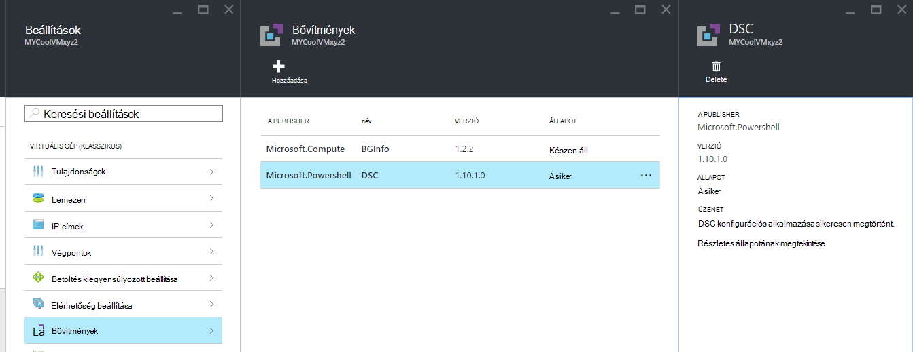

<properties 
   pageTitle="Bevezetési fizikai és virtuális gépeken futó, az Azure automatizálási DSC kezelésére |} Microsoft Azure" 
   description="Azure automatizálási DSC-kezelés gépekhez beállítása" 
   services="automation" 
   documentationCenter="dev-center-name" 
   authors="coreyp-at-msft" 
   manager="stevenka" 
   editor="tysonn"/>

<tags
   ms.service="automation"
   ms.devlang="NA"
   ms.topic="article"
   ms.tgt_pltfrm="powershell"
   ms.workload="TBD" 
   ms.date="04/22/2016"
   ms.author="coreyp"/>

# Azure automatizálást DSC kezelésére bevezetési gépekhez

## Miért kezelése az Azure automatizálási DSC gépek?

[PowerShell kívánt állam konfigurációja](https://technet.microsoft.com/library/dn249912.aspx), például Azure automatizálási kívánt állam konfigurációja egy egyszerű, mégis hatékony, konfigurációs alkalmazáskezelési szolgáltatás DSC csomópontok (fizikai és virtuális gépeken futó) bármely felhő vagy a helyszíni adatközpontban. Lehetővé teszi méretezhetőség gépek ezer keresztül gyorsan és egyszerűen egy központi, biztonságos helyen tárolt. Egyszerűen beépített gépek közül választhat, deklaráció konfigurációk őket, és a megjelenítő jelentések megtekintése minden gép hozzárendelése meg a kívánt állapotot, a megadott megfelelési. Az Azure automatizálást DSC management réteget, hogy DSC, az Azure automatizálást management réteg van PowerShell-parancsfájlokat. Más szóval az adott dokumentumkészletből ugyanúgy, Azure automatizálási segít kezelése a PowerShell-parancsfájlokat, is segít DSC konfigurációk kezelése. Többet szeretne tudni az Azure automatizálási DSC használatának előnyeit, hogy az [Azure automatizálási DSC áttekintése](automation-dsc-overview.md)című témakörben találhat. 

Azure automatizálási DSC gépek számos kezeléséhez használható:

*    Azure virtuális gépeken futó (klasszikus)
*    Azure virtuális gépeken futó
*    Amazon Web Services (AWS) virtuális gépeken futó
*    Fizikai virtuális Windows gépek a helyszíni, vagy nem Azure/AWS a felhőben
*    Fizikai virtuális Linux gépek a helyszíni Azure-ban vagy a felhőben Azure kívül

Ezenkívül ha nem közvetlenül a gép konfiguráció kezeléséhez a felhőből, Azure automatizálási DSC is használható csak a jelentés végpontjának. Így állíthatja (betolás) a kívánt konfiguráció helyszíni DSC keresztül, és multimédiás jelentéskészítési részleteinek megtekintése csomópontra megfelelés az Azure automatizálás a kívánt állapotot.

Az alábbi szakaszok tagolja, hogyan dolgozhat fedélzeti Azure automatizálást DSC gép hibatípusonként.

## Azure virtuális gépeken futó (klasszikus)

Azure automatizálási DSC akkor egyszerűen beépített Azure virtuális gépeken futó (klasszikus) Konfigurációkezelő Azure portál, vagy a PowerShell használatával is. A motorháztető alatt fülre, és anélkül, hogy a távoli a virtuális be rendszergazdaként az Azure virtuális kívánt állam konfigurációs kiterjesztése a virtuális regisztrálja Azure automatizálási DSC. Mivel az Azure virtuális kívánt állam konfigurációs bővítmény aszinkron, fut lépéseket, amelyekkel a nyilvántartása – vagy – problémamegoldás az alábbi [**hibaelhárítási Azure virtuális gép bevezetési**](#troubleshooting-azure-virtual-machine-onboarding) szakaszában találhatók.

### Azure portál

Az [Azure-portálon](http://portal.azure.com/)kattintson a **Tallózás** -> **virtuális gépeken futó (klasszikus)**. Jelölje ki a kívánt beépített Windows virtuális. A virtuális gép irányítópult lap, kattintson a **minden beállítások** -> **bővítmények** -> **hozzáadása** -> **Azure automatizálást DSC** -> **létrehozása**. Írja be a [PowerShell DSC helyi Configuration Manager értékeket](https://msdn.microsoft.com/powershell/dsc/metaconfig4) , a használati eset, a automatizálást fiókkulcs regisztrációs és a regisztrációs URL-CÍMÉT, és szükséges tetszés szerint a csomópont konfiguráció hozzárendelése a virtuális.

A bejegyzés keresése URL-CÍMEK és az automatizálási kulcsa fiók fedélzeti az számítógépen való használatáról a [**regisztrációs biztonságos**](#secure-registration) címszó alatt.

### A PowerShell

    # log in to both Azure Service Management and Azure Resource Manager
    Add-AzureAccount
    Add-AzureRmAccount
    
    # fill in correct values for your VM/Automation account here
    $VMName = ""
    $ServiceName = ""
    $AutomationAccountName = ""
    $AutomationAccountResourceGroup = ""

    # fill in the name of a Node Configuration in Azure Automation DSC, for this VM to conform to
    $NodeConfigName = ""

    # get Azure Automation DSC registration info
    $Account = Get-AzureRmAutomationAccount -ResourceGroupName $AutomationAccountResourceGroup -Name $AutomationAccountName
    $RegistrationInfo = $Account | Get-AzureRmAutomationRegistrationInfo

    # use the DSC extension to onboard the VM for management with Azure Automation DSC
    $VM = Get-AzureVM -Name $VMName -ServiceName $ServiceName
    
    $PublicConfiguration = ConvertTo-Json -Depth 8 @{
      SasToken = ""
      ModulesUrl = "https://eus2oaasibizamarketprod1.blob.core.windows.net/automationdscpreview/RegistrationMetaConfigV2.zip"
      ConfigurationFunction = "RegistrationMetaConfigV2.ps1\RegistrationMetaConfigV2"

    # update these PowerShell DSC Local Configuration Manager defaults if they do not match your use case.
    # See https://technet.microsoft.com/library/dn249922.aspx?f=255&MSPPError=-2147217396 for more details
     Properties = @{
        RegistrationKey = @{
          UserName = 'notused'
          Password = 'PrivateSettingsRef:RegistrationKey'
        }
        RegistrationUrl = $RegistrationInfo.Endpoint
        NodeConfigurationName = $NodeConfigName
        ConfigurationMode = "ApplyAndMonitor"
        ConfigurationModeFrequencyMins = 15
        RefreshFrequencyMins = 30
        RebootNodeIfNeeded = $False
        ActionAfterReboot = "ContinueConfiguration"
        AllowModuleOverwrite = $False
      }
    }

    $PrivateConfiguration = ConvertTo-Json -Depth 8 @{
      Items = @{
         RegistrationKey = $RegistrationInfo.PrimaryKey
      }
    }
    
    $VM = Set-AzureVMExtension `
     -VM $vm `
     -Publisher Microsoft.Powershell `
     -ExtensionName DSC `
     -Version 2.19 `
     -PublicConfiguration $PublicConfiguration `
     -PrivateConfiguration $PrivateConfiguration `
     -ForceUpdate

    $VM | Update-AzureVM

## Azure virtuális gépeken futó

Azure automatizálási DSC segítségével egyszerűen beépített Azure virtuális gépeken futó Konfigurációkezelő, az Azure portálon, a Azure erőforrás-kezelő sablonok vagy a PowerShell használatával. A motorháztető alatt fülre, és anélkül, hogy a távoli a virtuális be rendszergazdaként az Azure virtuális kívánt állam konfigurációs kiterjesztése a virtuális regisztrálja Azure automatizálási DSC. Mivel az Azure virtuális kívánt állam konfigurációs bővítmény aszinkron, fut lépéseket, amelyekkel a nyilvántartása – vagy – problémamegoldás az alábbi [**hibaelhárítási Azure virtuális gép bevezetési**](#troubleshooting-azure-virtual-machine-onboarding) szakaszában találhatók.

### Azure portál

Az [Azure portálon](https://portal.azure.com/)nyissa meg a Azure automatizálási fiókot, amelyhez a beépített virtuális gépeken. Kattintson az automatizálás fiók irányítópult **DSC csomópontok** -> **Azure virtuális hozzáadása**.

Egy vagy több Azure virtuális gépeken futó a beépített csoportban **Válassza ki a virtuális gépeken futó a beépített**.

**Konfigurálása regisztrációs adatok**, csoportban írja be a [PowerShell DSC helyi Configuration Manager értékeket](https://msdn.microsoft.com/powershell/dsc/metaconfig4) , a virtuális hozzárendelése a használati eset, és tetszés szerint a csomópont konfiguráció szükséges.

 
### Azure erőforrás-kezelő sablonok

Azure virtuális gépeken futó telepíthető és Azure erőforrás-kezelő sablonok keresztül az Azure automatizálási DSC onboarded. [Konfigurálása](https://azure.microsoft.com/documentation/templates/dsc-extension-azure-automation-pullserver/) című témakört a virtuális DSC kiterjesztés és Azure automatizálást DSC keresztül egy példa sablon, hogy egy meglévő virtuális az Azure automatizálást DSC onboards. A regisztráció billentyű és a regisztrációs URL-CÍMÉT, venni keresése ebben a sablonban bemeneteként használatáról a [**regisztrációs biztonságos**](#secure-registration) címszó alatt.

### A PowerShell

A [Külső.FÜGGV-AzureRmAutomationDscNode](https://msdn.microsoft.com/library/mt603833.aspx) parancsmag beépített virtuális gépeken futó az Azure-portálon keresztül PowerShell használható.

## Amazon Web Services (AWS) virtuális gépeken futó

Azt is megteheti, egyszerűen beépített Amazon webszolgáltatásokhoz virtuális gépeken futó Konfigurációkezelő által Azure automatizálási DSC a AWS DSC eszközkészlet használata. További tudnivalók az eszközkészlet [Itt](https://blogs.msdn.microsoft.com/powershell/2016/04/20/aws-dsc-toolkit/).

## Fizikai virtuális Windows gépek a helyszíni, vagy nem Azure/AWS a felhőben

A helyszíni Windows gépek és a Windows gépek nem Azure felhőket (például az Amazon webszolgáltatásokhoz) is onboarded Azure automatizálást DSC, az mindaddig, amíg az interneten keresztül néhány egyszerű lépést kimenő hozzáféréssel rendelkeznek:

1. Ellenőrizze, hogy a kívánt beépített az Azure automatizálási DSC számítógépén telepítve van a [WMF 5](http://aka.ms/wmf5latest) legújabb verzióját.
2. Szakasz [**generálni DSC metaconfigurations**](#generating-dsc-metaconfigurations) az alábbi a szükséges DSC metaconfigurations tartalmazó mappa létrehozásához kövesse.
3. A PowerShell DSC metaconfiguration távolról alkalmazása a kívánt beépített gépek. **A gép ezt a parancsot futtatja a [WMF 5](http://aka.ms/wmf5latest) telepítve van a legújabb verzióját kell rendelkeznie**:

    `Set-DscLocalConfigurationManager -Path C:\Users\joe\Desktop\DscMetaConfigs -ComputerName MyServer1, MyServer2`

4. Ha a PowerShell DSC metaconfigurations nem távolról vonatkozik, a metaconfigurations mappa másolása lépés: 2 egyes gépi alakzatot a beépített. Hívhatja **Set-DscLocalConfigurationManager** helyben integrált minden számítógépen.
5. Az Azure portál vagy parancsmagok használata esetén ellenőrizze, hogy a gép beépített ekkor megjelennek majd Azure automatizálási fiókban regisztrált DSC csomópontok.

## Fizikai virtuális Linux gépek a helyszíni Azure-ban vagy a felhőben Azure kívül

A helyszíni Linux gépek, Linux gépek Azure-ban, és nem Azure felhőket Linux gépek is lehetnek onboarded Azure automatizálási DSC, az mindaddig, amíg az interneten keresztül néhány egyszerű lépést kimenő hozzáféréssel rendelkeznek:

1. Ellenőrizze, hogy a kívánt beépített az Azure automatizálási DSC számítógépén telepítve van a a [DSC Linux ügynök](http://www.microsoft.com/download/details.aspx?id=49150) legújabb verzióját.

2. Ha a [PowerShell DSC helyi Configuration Manager Alapértelmezések](https://msdn.microsoft.com/powershell/dsc/metaconfig4) és nagybetű különbözik a használatát, és azt szeretné, hogy beépített gépek, például, hogy **kiolvasható, mind az Azure automatizálási DSC el** :

    *    Egyes Linux gép az Azure automatizálási DSC beépített, a segítségével Register.py beépített a PowerShell DSC helyi Configuration Manager alapértelmezett értékek használata:

        `/opt/microsoft/dsc/Scripts/Register.py <Automation account registration key> <Automation account registration URL>`

    *    A regisztráció billentyűt, és a regisztrációs URL-CÍMÉT az automatizálási fiók című szakaszban talál az alábbi [**regisztrációs biztonságos**](#secure-registration) szakaszt.

    Ha a PowerShell DSC helyi Konfigurációkezelő alapértelmezés szerint, **végezze el** a használati eset, vagy szeretne beépített gépek, hogy az ezek csak Azure automatizálási DSC jelentés **nem** egyezik, de nem leküldéses konfiguráció vagy PowerShell-modulok belőle megtekintéséhez lépésekkel 3-6. Egyéb esetben ugorjon közvetlenül 6.

3.  Kövesse az alábbi készítése a szükséges DSC metaconfigurations tartalmazó mappa [**létrehozása DSC metaconfigurations**](#generating-dsc-metaconfigurations) szakaszában.
4.  A PowerShell DSC metaconfiguration távolról alkalmazása a kívánt beépített gépek:
        
        $SecurePass = ConvertTo-SecureString -String "<root password>" -AsPlainText -Force
        $Cred = New-Object System.Management.Automation.PSCredential "root", $SecurePass
        $Opt = New-CimSessionOption -UseSsl -SkipCACheck -SkipCNCheck -SkipRevocationCheck

        # need a CimSession for each Linux machine to onboard
        
        $Session = New-CimSession -Credential $Cred -ComputerName <your Linux machine> -Port 5986 -Authentication basic -SessionOption $Opt
        
        Set-DscLocalConfigurationManager -CimSession $Session –Path C:\Users\joe\Desktop\DscMetaConfigs
    
Ezt a parancsot futtatja a számítógépre telepített [WMF 5](http://aka.ms/wmf5latest) legújabb verzióját kell rendelkeznie.

5.  Ha a PowerShell DSC metaconfigurations távolról, nem alkalmazható egyes Linux a számítógépen, a megfelelő az alakzatot a Linux gép 5 mappából, hogy a gép metaconfiguration másolásához. Kattintson a hívás `SetDscLocalConfigurationManager.py` helyileg minden Linux gépen szeretné a beépített az Azure automatizálást DSC:

    `/opt/microsoft/dsc/Scripts/SetDscLocalConfigurationManager.py –configurationmof <path to metaconfiguration file>`

6.  Az Azure portál vagy parancsmagok használata esetén ellenőrizze, hogy a gép beépített ekkor megjelennek majd Azure automatizálási fiókban regisztrált DSC csomópontok.

##DSC metaconfigurations létrehozása
Általában beépített gépi Azure automatizálási DSC, hogy egy DSC metaconfiguration lehetnek létrehozott, ha egyenként alkalmazza őket, ez az információ a DSC agent kiolvasható, illetve Azure automatizálási DSC el a számítógépen. A PowerShell DSC konfiguráció vagy az Azure automatizálási PowerShell-parancsmagok használata az Azure automatizálási DSC DSC metaconfigurations hozhatók létre.

**Megjegyzés:** DSC metaconfigurations szükséges a beépített egy számítógépre, az automatizálás számlája kezelése a titkos kulcsok tartalmazzák. Ügyeljen arra, hogy megfelelően védelme bármely DSC metaconfigurations hoz létre, vagy az után törölje őket.

###A DSC konfiguráció használata
1.  Nyissa meg a PowerShell ISE rendszergazdaként a számítógépre a helyi környezetben. A számítógépen telepített [WMF 5](http://aka.ms/wmf5latest) legújabb verzióját kell rendelkeznie.

2.  Másolja a következő helyi meghajtóra. Ez a parancsfájl metaconfigurations és metaconfiguration létrehozását elindításához parancs a PowerShell DSC konfiguráció tartalmazza.
    
        # The DSC configuration that will generate metaconfigurations
        [DscLocalConfigurationManager()]
        Configuration DscMetaConfigs 
        { 
            param 
            ( 
                [Parameter(Mandatory=$True)] 
                [String]$RegistrationUrl,
         
                [Parameter(Mandatory=$True)] 
                [String]$RegistrationKey,

                [Parameter(Mandatory=$True)] 
                [String[]]$ComputerName,

                [Int]$RefreshFrequencyMins = 30, 
            
                [Int]$ConfigurationModeFrequencyMins = 15, 
            
                [String]$ConfigurationMode = "ApplyAndMonitor", 
            
                [String]$NodeConfigurationName,

                [Boolean]$RebootNodeIfNeeded= $False,

                [String]$ActionAfterReboot = "ContinueConfiguration",

                [Boolean]$AllowModuleOverwrite = $False,

                [Boolean]$ReportOnly
            )

    
            if(!$NodeConfigurationName -or $NodeConfigurationName -eq "") 
            { 
                $ConfigurationNames = $null 
            } 
            else 
            { 
                $ConfigurationNames = @($NodeConfigurationName) 
            }

            if($ReportOnly)
            {
               $RefreshMode = "PUSH"
            }
            else
            {
               $RefreshMode = "PULL"
            }

            Node $ComputerName
            {

                Settings 
                { 
                    RefreshFrequencyMins = $RefreshFrequencyMins 
                    RefreshMode = $RefreshMode 
                    ConfigurationMode = $ConfigurationMode 
                    AllowModuleOverwrite = $AllowModuleOverwrite 
                    RebootNodeIfNeeded = $RebootNodeIfNeeded 
                    ActionAfterReboot = $ActionAfterReboot 
                    ConfigurationModeFrequencyMins = $ConfigurationModeFrequencyMins 
                }

                if(!$ReportOnly)
                {
                   ConfigurationRepositoryWeb AzureAutomationDSC 
                    { 
                        ServerUrl = $RegistrationUrl 
                        RegistrationKey = $RegistrationKey 
                        ConfigurationNames = $ConfigurationNames 
                    }

                    ResourceRepositoryWeb AzureAutomationDSC 
                    { 
                       ServerUrl = $RegistrationUrl 
                       RegistrationKey = $RegistrationKey 
                    }
                }

                ReportServerWeb AzureAutomationDSC 
                { 
                    ServerUrl = $RegistrationUrl 
                    RegistrationKey = $RegistrationKey 
                }
            } 
        }
        
        # Create the metaconfigurations
        # TODO: edit the below as needed for your use case
        $Params = @{
             RegistrationUrl = '<fill me in>';
             RegistrationKey = '<fill me in>';
             ComputerName = @('<some VM to onboard>', '<some other VM to onboard>');
             NodeConfigurationName = 'SimpleConfig.webserver';
             RefreshFrequencyMins = 30;
             ConfigurationModeFrequencyMins = 15;
             RebootNodeIfNeeded = $False;
             AllowModuleOverwrite = $False;
             ConfigurationMode = 'ApplyAndMonitor';
             ActionAfterReboot = 'ContinueConfiguration';
             ReportOnly = $False;  # Set to $True to have machines only report to AA DSC but not pull from it
        }
        
        # Use PowerShell splatting to pass parameters to the DSC configuration being invoked
        # For more info about splatting, run: Get-Help -Name about_Splatting
        DscMetaConfigs @Params

3.  Töltse ki a regisztrációs kulcs és az URL-CÍMÉT az automatizálási fiókját, valamint a gép beépített azoknak a. Minden más paraméter megadása nem kötelező. A regisztráció billentyűt, és a regisztrációs URL-CÍMÉT az automatizálási fiók című szakaszban talál az alábbi [**regisztrációs biztonságos**](#secure-registration) szakaszt.

4.  Ha azt szeretné, hogy a gép DSC állapotinformációkat Azure automatizálási DSC a jelentést, de nem lekérés konfigurációs vagy PowerShell-modulok, a **ReportOnly** paraméter értéke igaz.

5.  Futtassa a. Most már rendelkeznie kell **DscMetaConfigs** a munkakönyvtár nevű mappa a PowerShell DSC metaconfigurations a beépített gépekhez tartalmazó.

###Azure automatizálási-parancsmagok használata
Ha a PowerShell DSC helyi Configuration Manager alapértelmezések és nagybetű különbözik a használatát, és szeretne beépített gépek, hogy azok is kiolvasható, és Azure automatizálási DSC jelentést, az Azure automatizálási parancsmag egy létrehozása a szükséges DSC metaconfigurations egyszerűsített lehetőséget nyújt a:

1.  Nyissa meg a PowerShell konzoljában vagy a PowerShell ISE rendszergazdaként egy számítógépre, a helyi környezetben.

2.  Csatlakozás az Azure erőforrás-kezelő **Hozzáadása-AzureRmAccount** használatával

3.  Töltse le a PowerShell DSC metaconfigurations, amelyet a gépekhez beépített az automatizálási fiókból, amely szeretne beépített csomópontok:

        # Define the parameters for Get-AzureRmAutomationDscOnboardingMetaconfig using PowerShell Splatting
        $Params = @{
            ResourceGroupName = 'ContosoResources'; # The name of the ARM Resource Group that contains your Azure Automation Account
            AutomationAccountName = 'ContosoAutomation'; # The name of the Azure Automation Account where you want a node on-boarded to
            ComputerName = @('web01', 'web02', 'sql01'); # The names of the computers that the meta configuration will be generated for
            OutputFolder = "$env:UserProfile\Desktop\";
        }
        
        # Use PowerShell splatting to pass parameters to the Azure Automation cmdlet being invoked
        # For more info about splatting, run: Get-Help -Name about_Splatting
        Get-AzureRmAutomationDscOnboardingMetaconfig @Params

Most már rendelkeznie kell egy ***DscMetaConfigs***, a beépített gépekhez a PowerShell DSC metaconfigurations tartalmazó nevű mappát.

##Biztonságos regisztrációs

Gépek biztonságosan fedélzeti is lehetővé teszi, hogy egy DSC csomópont (beleértve az Azure automatizálási DSC) PowerShell DSC V2 lekérés vagy a jelentéskészítő kiszolgálón hitelesítést végezni WMF 5 DSC regisztrációs protokollon keresztül Azure automatizálási fiókba. A csomópont regisztrálja **Regisztrációs URL-CÍMÉT**, hitelesítése **regisztrációs kulcsa**segítségével a kiszolgálón. Regisztráció, a DSC csomópontot, és a DSC ki/jelentéskészítő kiszolgálót során egyeztetni a kiszolgáló utáni bejegyzésére hitelesítéshez használt csomópont tartozó egyedi tanúsítvány. Ez a folyamat megakadályozza, hogy magát egy másikra, például ha egy csomópont sérül és ártó viselkedik onboarded csomópontot. Regisztráció után a regisztrációs kulcsa újra hitelesítéshez nem használatos, és törlődik a csomópontot.

Elérheti a DSC regisztrációs Protocol (protokoll) az Azure előzetes portálon a **Kulcsok kezelése** lap a szükséges adatokat. Ez a lap megnyitásához kattintson a kulcs ikon a **Essentials** csúszkáját a automatizálást fiókom.

*    Regisztráció URL-CÍMÉT az URL-cím mezőre a kulcsok kezelése lap.
*    Regisztráció billentyűt a kulcsok kezelése lap a elsődlegeskulcs Access vagy a másodlagos hívóbetű szerepel. Bármelyik kulcs használható.

A nagyobb biztonság érdekében automatizálási fiók elsődleges és másodlagos hívóbetűk helyreállíthatja bármikor (a **Kulcsok kezelése** lap), hogy a jövőbeli csomópont regisztrációk előző billentyűk segítségével.

##Azure virtuális gép bevezetési – hibaelhárítás

Azure automatizálási DSC modellkonfigurációk kezelésére egyszerűen beépített Azure Windows VMs segítségével. A motorháztető alatt fülre az Azure virtuális kívánt állam konfigurációs bővítmény segítségével regisztrálhatja a virtuális Azure automatizálási DSC. Mivel az Azure virtuális kívánt állam konfigurációs bővítmény aszinkron fut, a haladás nyomon követése és hibaelhárítási végrehajtása során fontos lehet. 

>[AZURE.NOTE] Az Azure Windows virtuális Azure automatizálási DSC az Azure virtuális kívánt állam konfigurációs menti a bevezetési módszere eltarthat a csomópont kattintva jelenítse meg az Azure automatizálás regisztrált akár egy óra. Ez a Windows Management Framework 5.0 az Azure virtuális DSC kiterjesztés, amely beépített szükség van a virtuális példányával miatt a virtuális az Azure automatizálást DSC.

Hibaelhárítás vagy az Azure virtuális kívánt állam konfigurációs bővítmény állapotának megtekintése, az Azure-ban portálon nyissa meg a virtuális onboarded alatt, majd kattintson a **minden elérhető beállítás**-> -> **bővítmények** -> **DSC**. További részletekért rákattintva **részletes állapotának megtekintése elemre**.

## Tanúsítvány érvényességi és ismételt

Egy számítógépre regisztrálás Azure automatizálást DSC DSC csomópont megjelölése után számos miért szükség lehet a jövőben újraregisztrálása csomópontra okok miatt:

* A regisztrálás után minden csomópont automatikusan végrehajtja a lejárta után egy évvel hitelesítéshez egyedi tanúsítvány. Jelenleg a PowerShell DSC regisztrációs protokoll nem tudja automatikusan megújítani tanúsítványok, a csomópontok újraregisztrálása idő egy év múlva kell azokat is közelítő lejárati, amikor. Mielőtt helyére, ellenőrizze, hogy az egyes csomópontok fut Windows Management Framework 5.0-s RTM. Ha egy csomópont hitelesítési tanúsítvány lejár, és a csomópontra a rendszer nem újra regisztrálja, a csomópont nem tudnak kommunikálni az Azure automatizálási, és lesznek megjelölve "Unresponsive." Ismételt elvégzett 90 napon vagy kisebb a tanúsítvány lejárati idő vagy a tanúsítvány lejárati idő után bármely pontján új tanúsítvány használt és keletkezett eredményez.

* A csomópont, például a configurationmode kulcsot kezdeti regisztráció során beállított [PowerShell DSC helyi Configuration Manager értékek](https://msdn.microsoft.com/powershell/dsc/metaconfig4) módosítása. Jelenleg DSC ügynök mintaértékek csak módosítható ismételt keresztül. Az egyetlen kivétel ez alól a csomópont konfigurálása a csomópont rendelt – ez módosítható az Azure automatizálási DSC közvetlenül.

Ismételt regisztrálta a csomópont kezdetben a dokumentumban leírt bevezetési módszerek bármelyikével megegyező módon lehet végrehajtani. Nem kell unregister csomópont Azure automatizálást DSC eltávolítása előtt újra regisztrálás azt.

## Kapcsolódó cikkek
* [Azure automatizálási DSC – áttekintés](automation-dsc-overview.md)
* [Azure automatizálási DSC parancsmagok](https://msdn.microsoft.com/library/mt244122.aspx)
* [Azure automatizálási DSC árak](https://azure.microsoft.com/pricing/details/automation/)

