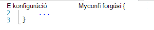
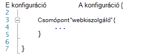
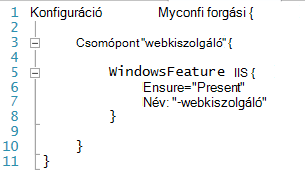
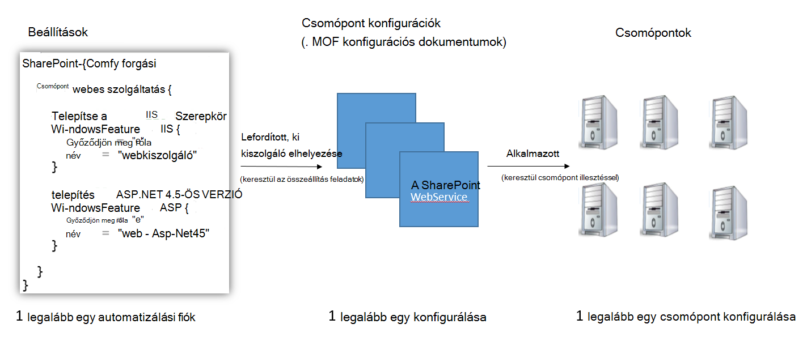
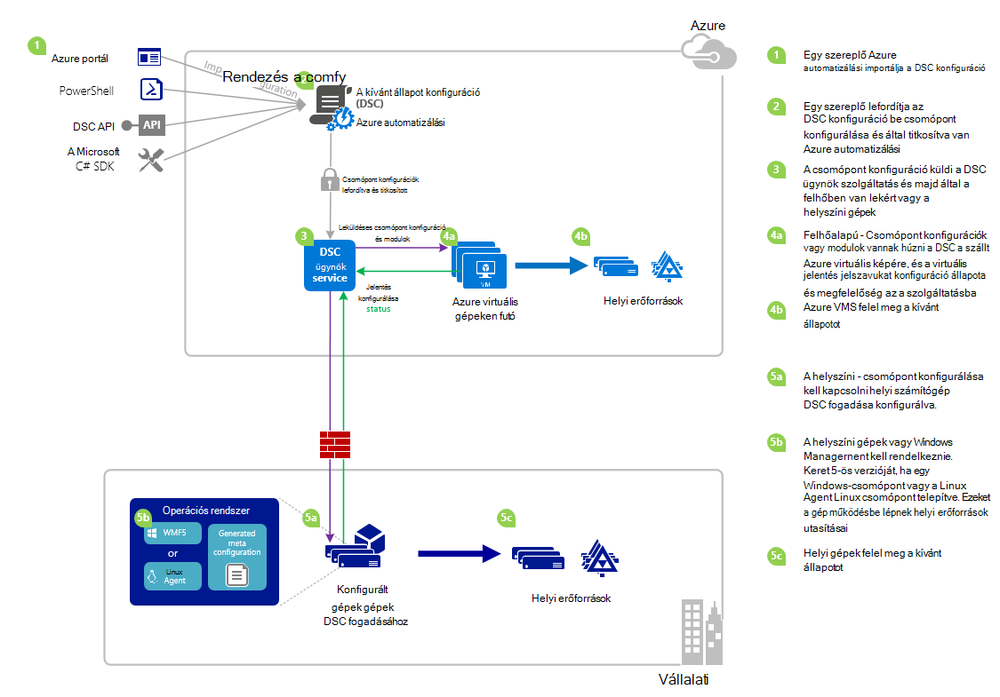

<properties 
   pageTitle="Azure automatizálást DSC áttekintése |} Microsoft Azure" 
   description="Egy áttekintése az Azure automatizálási kívánt állam konfigurációs (DSC), a kifejezések és az ismert problémák" 
   services="automation" 
   documentationCenter="dev-center-name" 
   authors="coreyp-at-msft" 
   manager="stevenka" 
   editor="tysonn"
   keywords="a PowerShell dsc, a kívánt állapotot konfigurációja, a powershell dsc azure"/>

<tags
   ms.service="automation"
   ms.devlang="NA"
   ms.topic="article"
   ms.tgt_pltfrm="powershell"
   ms.workload="TBD" 
   ms.date="05/10/2016"
   ms.author="magoedte;coreyp"/>

# Azure automatizálási DSC – áttekintés #

##Mi az Azure automatizálási DSC?##
Üzembe helyezése, és a kiszolgálókon és az alkalmazás erőforrások kívánt állapotának fenntartása lehet fárasztó és jobban hiba. Az Azure automatizálási kívánt állam konfigurációs (DSC), egységes telepítheti, biztos, hogy figyelheti, és automatikusan frissíti az összes az informatikai erőforrások, a méretarány a felhőből kívánt állapota. Épül PowerShell DSC, automatizálási DSC igazíthatja a gép konfigurációs egy adott üzemmódot fizikai és virtuális gépeken futó (VMs), használja a Windows vagy Linux rendszerhez, és a felhő vagy a helyszíni. Folytonos informatikai szolgáltatások kézbesítési a egységes vezérlő engedélyezése és a gyors változás kezelése végig a eltérő hibrid környezetben való könnyű.

Azure automatizálási DSC hoz létre a kapcsolatos alapismeretekről PowerShell DSC megadására egy még egyszerűbb konfigurációs adatkezelési folyamatok az jelent meg felvételével. Azure automatizálást DSC ugyanazon a kezelés rétegen szerint Azure automatizálást kínál PowerShell futtatása Ma [PowerShell kívánt állam konfigurációs](https://msdn.microsoft.com/powershell/dsc/overview) életre.

Azure automatizálást DSC lehetővé teszi, hogy a [tartalom-előállítás és kezelése a PowerShell kívánt állam konfigurációk](https://technet.microsoft.com/library/dn249918.aspx), [DSC erőforrások](https://technet.microsoft.com/library/dn282125.aspx)importálása, és készítése DSC csomópont konfigurációk (MOF dokumentumok), mind a felhőben. Ezeket az elemeket DSC rákerül [DSC lekérés server](https://technet.microsoft.com/library/dn249913.aspx) Azure automatizálási, hogy a helyszíni vagy felhőalapú (például a tényleges és virtuális gépeken futó) cél csomópontok is felveszi őket, automatikusan felel meg a kívánt állapotot, adja meg, hogy és a kívánt állapotot Azure az automatizálás megfelelnek a jelentést.

Inkább az olvasóablak szolgáltatásra? Van egy pillantást a május 2015, amikor először bejelentve Azure automatizálási DSC a videó alatti. **Megjegyzés:** A fogalmak és ebben a videóban bemutatott életciklus is helyes, miközben a Azure automatizálási DSC sokkal fejlődött mivel ez a videó lett felvéve. Akkor általában elérhető, sokkal több teljes körű kezelőfelülete az Azure-portálon és számos további lehetőségeket támogatja.

> [AZURE.VIDEO microsoft-ignite-2015-heterogeneous-configuration-management-using-microsoft-azure-automation]

## Azure automatizálási DSC kifejezések ##
### Konfiguráció ###
A PowerShell DSC konfigurációk nevű új fogalma jelent meg. Konfiguráció engedélyezze a via PowerShell szintaktikai, adhatja meg a kívánt állapotot a környezet. DSC használatával állítsa be a környezetet, először megadása a Windows PowerShell parancsprogramot adatblokk az konfigurációs kulcsszó, majd hajtsa végre a egy azonosítójú, majd a kapcsos zárójelek ({}) Tiltás határoló.

A konfiguráció blokkon belül határozhatja meg csomópont konfigurációs megakadályozza, hogy adja meg, hogy a kívánt beállításokat meg csomópontok (számítógépek), amely kell lenniük a környezetben konfigurálva pontosan megegyezik. Ezzel a módszerrel a csomópont konfiguráció "szerepkör" tegyük fel, hogy egy vagy több csomópontok jelöl. A csomópont konfigurációs tiltása a csomópont kulcsszó kezdődik. Kövesse a kulcsszó a szerepkört, ami lehet egy változó vagy kifejezés a nevet. Szerepkör neve használja a kapcsos zárójeleket {} határoló csomópont konfigurációs tiltás.

 
A csomópont konfigurációs blokkon belül erőforrás blokkok adott DSC erőforrások konfigurálása adhatja meg. Egy erőforrás szövegrészt a nevét, az azonosító szeretne megadni, amelyek blokkolják a, majd a továbbfejlesztett fájlblokkolás határoló {} kapcsos követ kezdődik.

További információt a konfigurációs kulcsszó, lásd: [Ismertetése konfigurációs kulcsszó állam konfiguráció szükséges](http://blogs.msdn.com/b/powershell/archive/2013/11/05/understanding-configuration-keyword-in-desired-state-configuration.aspx "Ismertetése konfigurációs kulcsszó állam konfiguráció szükséges")

Fut (fordítása) a DSC konfiguráció hoznak létre egy vagy több DSC csomópont konfigurációk (MOF dokumentumok), amelyek DSC csomópontok alkalmazni kívánt állapotot felel meg.

Azure automatizálási DSC lehetővé teszi, hogy importálja, a szerző, és a fordítási DSC beállításokat az Azure automatizálás hasonló, hogyan lehet importálni runbooks szerzője, és a lépések az Azure automatizálási.

>[AZURE.IMPORTANT] A konfiguráció csak egy konfigurációs blokkokból álló, mint a konfigurációs az Azure automatizálási DSC azonos nevű kell tartalmaznia. 

###Csomópont konfigurálása###

A DSC konfiguráció összeállítása után, ha egy vagy több csomópont konfigurációk attól függően, hogy a konfigurációban csomópont blokkok termék készült. A csomópont konfiguráció "MOF" vagy "konfigurációs dokumentum" (Ha ismeri a PS DSC feltételekkel), és egy "szerepkört," jelöli például webkiszolgáló vagy kívánt egy vagy több csomópontok kell tegyük fel, vagy ellen megfelelőség ellenőrzése állam dolgozó. Azure automatizálást DSC beállításai csomópontot azoknak a "Konfigurációs Name.NodeConfigurationBlockName" formájában.

PS DSC csomópontok tudomására azokat meg elfogadni DSC leküldéses, vagy a leküldéses módszerek csomópont konfigurációk. Azure automatizálási DSC DSC ki módszer, ahol csomópontok kérelem csomópont konfigurációk kell vonatkoznak az Azure automatizálási DSC húzza a kiszolgáló támaszkodik. A csomópontok Azure automatizálási DSC végez a kérést, mert a csomópontok lehetnek tűzfalak mögött van az összes bejövő portok lezárt stb. Csak kimenő Internet-hozzáféréssel kell (vagy közvetlenül egy proxyn keresztül).

###Csomópont###

DSC csomópont konfigurációját DSC kezeli tartalmazó gépi. Ez lehet egy Windows vagy Linux Azure virtuális, a helyszíni virtuális / fizikai állomás, vagy egy másik nyilvános felhőben gépi. Csomópontokat csomópont konfigurációk válik, és meghatározzák a kívánt állapotot megfelelés karbantartása elfogadni, és a konfigurációs állapot és a megfelelőség és a kívánt állapotot vissza egy jelentéskészítő kiszolgálót a jelentés is lehet.

Azure automatizálási DSC Azure automatizálási DSC kezelésére vonatkozó csomópontok bevezetési megkönnyíti, és lehetővé teszi, hogy az egyes csomópont kiszolgálóoldali rendelve, így legközelebb csomópont ellenőrzi, további útmutatásért tegyük fel, egy másik szerepkört, és hogy miként van konfigurálva és a complaince állapot módosítása a kiszolgáló azt jelentse szemben a megfelelő csomópont beállításainak módosításával.

###Erőforrás###
DSC erőforrások építőelemei megadása a Windows PowerShell kívánt állam konfigurációs (DSC) konfiguráció használható. DSC beépített erőforrások, például a fájlok és mappák, server szolgáltatásai és szerepkörök, rendszerbeállítások, környezeti változók, és a szolgáltatások és folyamatok halmazának megtalálható. [A beépített DSC erőforrások és használatuk teljes listáját kapcsolatos további tudnivalókért beépített Windows PowerShell adatközpontokban állam konfigurációs forrásokban](https://technet.microsoft.com/library/dn249921.aspx)talál.

DSC erőforrások is importálhatók PowerShell-modulok, ha ki szeretné terjeszteni a beépített DSC erőforrások készlete részeként. Nem alapértelmezett erőforrások fog kell húzni DSC csomópontok a DSC ki kiszolgálótól, ha a csomópont konfiguráció célja, hogy a csomópont életbe léptetni e erőforrásokra mutató hivatkozásokat tartalmaz. [Megtudhatja, hogy miként hozhat létre egyéni erőforrások, felépítése egyéni Windows PowerShell kívánt állam konfigurációs forrásokban](https://technet.microsoft.com/library/dn249927.aspx)talál.

Azure automatizálási DSC alkalmazásban az azonos beépített DSC erőforrások PS DSC, ahogyan. További források Azure automatizálási DSC erőforrásokat tartalmazó az Azure automatizálási PowerShell-modulok importálásával bővíthető.

###Az összeállítás feladat###
A fordítás feladat az Azure automatizálási DSC összeállítása a konfiguráció hozhat létre egy vagy több csomópont konfigurációk egy példánya. Ezek hasonlóak Azure automatizálási runbook feladatok, azzal a különbséggel, hogy azok valójában nem hajtja végre létre csomópont konfigurációk kivételével bármilyen feladatot. A fordítás feladat által létrehozott csomópont beállításaitól automatikusan bekerülnek az Azure automatizálási DSC ki kiszolgálón, és felülírása csomópont konfigurációk esetén a korábbi verzióival, ha a ebben a konfigurációban állapotát. A fordítás feladat készített csomópontot konfiguráció neve "ConfigurationName.NodeConfigurationBlockName" formájában történik. Például összeállítása a konfigurációs alatti eredményezne a "MyConfiguration.webserver" nevű csomópontot egyetlen konfiguráció

>[AZURE.NOTE] Runbooks, hasonlóan a konfigurációk tehetők közzé. Ez nem kapcsolódó elemek DSC elhelyez az Azure automatizálási DSC ki kiszolgálóra. Az összeállítás feladatok okozó DSC elemek Azure automatizálási DSC ki kiszolgálói helyét. Azure automatizálást "közzététel" kapcsolatos további tudnivalókért olvassa el a [egy Runbook közzétételi](https://msdn.microsoft.com/library/dn903765.aspx)című témakört.

##Azure automatizálást DSC életciklus##
Egy üres automatizálási fiókból Ugrás felügyelt meg megfelelően konfigurált csomópontok folyamatok definiálása konfigurációk esetén ezeket a beállításokat a csomópont-beállításokat, és a bevezetési csomópontok Azure automatizálási DSC és csomópontot a konfigurációk rendszerbe bekapcsolásával halmazának magába foglalja. Az alábbi ábra bemutatja az Azure automatizálási DSC életciklus:

Az alábbi képen részletes, lépésenkénti folyamatot DSC életciklusa a mutatja be. A konfiguráció importálása, és csomópontok található automatizálás Azure, egy helyszíni gépi DSC és más összetevőket közötti kölcsönhatás szükséges összetevőket alkalmazott különböző módokon tartalmazza. 

     

##Meglátások ismert problémák /:##

- Frissítéskor WMF 5 RTM, ha a számítógépen már regisztrált egy csomópontjának Azure automatizálási DSC, unregister azt az Azure automatizálási DSC, és a WMF 5 RTM frissítése után regisztrálja újra.

- Azure automatizálási DSC egyelőre nem támogatja az összetett teljes vagy részleges DSC konfigurációk. Azonban DSC összetett erőforrások importálja is, és a helyi PowerShellben konfigurációs ismételt engedélyezése ugyanúgy, mint az Azure automatizálási DSC konfigurációk szolgál.

- A legújabb WMF 5 telepítenie kell a Windows Azure automatizálási kommunikálni tudjanak a PowerShell DSC agent. A PowerShell DSC agent Linux a legújabb Azure automatizálási kommunikálni tudjanak Linux telepítenie kell.

- A hagyományos PowerShell DSC ki kiszolgáló vár modul az üzenet pillanatok alatt a leküldéses kiszolgálón formátumban helyét **ModuleName_Version.zip "**. Azure automatizálási vár PowerShell-modulok importálni kívánt neveivel **ModuleName.zip**formájában. Lásd: [Ez a blogbejegyzés](https://azure.microsoft.com/blog/2014/12/15/authoring-integration-modules-for-azure-automation/) további információt a szükséges a modul importálása az Azure automatizálási integrációs modul formátumát. 

- Importálja az Azure automatizálási PowerShell-modulok .doc és .docx fájlokat nem tartalmazhat. Néhány PowerShell-modulok DSC erőforrásokat tartalmazó ezeket a fájlokat, a Súgó célokra tartalmazzák. Ezek a fájlok modulokat, importálhatja az Azure automatizálási előzetes el kell távolítani.

- Csomópont először Azure automatizálást fiókkal van regisztrálva a csomópont képezhető le egy másik csomópont konfigurációs kiszolgálóoldali változik, és állapotának lesz "Kompatibilis", akkor is, ha a csomópont állapota nem ténylegesen kompatibilis most hozzárendelt csomópont-beállításokkal. Miután a csomópont elvégzi az első ki, és az első jelentés küldése a regisztráció vagy a csomópont konfiguráció hozzárendelés módosítása után lehet, hogy a csomópont állapotát megbízható.

- Amikor bevezetési az Azure Windows virtuális által Azure automatizálási DSC a közvetlen bevezetési módszerekkel történő kezeléséhez, eltarthat a virtuális jelenjen meg, mint az Azure automatizálás DSC csomópont órává. Ez a Windows Management Framework 5.0 az Azure virtuális DSC kiterjesztés, amely beépített szükség van a virtuális példányával miatt a virtuális az Azure automatizálást DSC.

- A regisztrálás után minden csomópont automatikusan végrehajtja a lejárta után egy évvel hitelesítéshez egyedi tanúsítvány. Ekkor a PowerShell DSC regisztrációs protokoll nem tudja automatikusan megújítani tanúsítványok, a csomópontok újraregisztrálása idő egy év múlva kell azokat is közelítő lejárati, amikor. Mielőtt helyére, ellenőrizze, hogy az egyes csomópontok fut Windows Management Framework 5.0-s RTM. Ha egy csomópont hitelesítési tanúsítvány lejár, és a csomópontra a rendszer nem újra regisztrálja, a csomópont nem tudnak kommunikálni az Azure automatizálási, és lesznek megjelölve "Unresponsive." Ismételt kezdetben regisztrált a csomópont ugyanúgy történik. Ismételt elvégzett 90 napon vagy kisebb a tanúsítvány lejárati idő vagy a tanúsítvány lejárati idő után bármely pontján új tanúsítvány használt és keletkezett eredményez.

- Frissítéskor WMF 5 RTM, ha a számítógépen már regisztrált egy csomópontjának Azure automatizálást DSC, unregister azt az Azure automatizálást DSC, és a WMF 5 RTM frissítése után regisztrálja újra. Mielőtt helyére, törölje a $env:windir\system32\configuration\DSCEngineCache.mof fájlt.

- PowerShell DSC-parancsmagok esetleg nem működik, ha WMF-5 RTM WMF 5 munkakörnyezeti kép felett telepítve van. A hiba kijavításához a következő parancsot a jogú egy PowerShell-munkamenetet (Futtatás rendszergazdaként):`mofcomp $env:windir\system32\wbem\DscCoreConfProv.mof`
 

##Kapcsolódó cikkek##

- [Azure automatizálási DSC kezelésére bevezetési gépekhez] (.. /Automation/Automation-DSC-onboarding.MD)
- [Lefordítása konfigurációk az Azure automatizálást DSC] (.. /Automation/Automation-DSC-Compile.MD)
- [Azure automatizálási DSC parancsmagok] (https://msdn.microsoft.com/library/mt244122.aspx)
- [Azure automatizálási DSC ár] (https://azure.microsoft.com/pricing/details/automation/)
- [IaaS VMs Azure automatizálási DSC használatával történő folyamatos telepítéséhez és Chocolatey] (automatizálási-dsc-cd-chocolatey.md)
