<properties
    pageTitle="Az első grafikus runbook az Azure automatizálást |} Microsoft Azure"
    description="Amelyek végigvezetik Önt a létrehozási, tesztelés, és egy egyszerű grafikus runbook a közzététel oktatóprogram."
    services="automation"
    documentationCenter=""
    authors="mgoedtel"
    manager="jwhit"
    editor=""
    keywords="runbook, runbook sablont, runbook automatizálási, azure runbook"/>
<tags
    ms.service="automation"
    ms.workload="tbd"
    ms.tgt_pltfrm="na"
    ms.devlang="na"
    ms.topic="get-started-article"
    ms.date="07/06/2016"
    ms.author="magoedte;bwren"/>

# <a name="my-first-graphical-runbook"></a>Az első grafikus runbook

> [AZURE.SELECTOR] - [A grafikus](automation-first-runbook-graphical.md) - [PowerShell](automation-first-runbook-textual-PowerShell.md) - [PowerShell-munkafolyamat](automation-first-runbook-textual.md)

Ebben az oktatóanyagban bemutatja az olyan [grafikus runbook](automation-runbook-types.md#graphical-runbooks) az Azure automatizálás létrehozását.  Lássuk először egy egyszerű runbook, hogy miként tesztelése, és közben azt ismertetik a runbook feladat állapotának nyomon követéséhez tegye közzé a.  Azt fogja módosítsa a runbook ténylegesen kezelheti az Azure erőforrásokat, ebben az esetben kezdve az Azure virtuális gépen.  Azt fogja végezze el a runbook megbízhatóbb runbook paramétereket és feltételes hivatkozások hozzáadásával.

## <a name="prerequisites"></a>Előfeltételek

Ebben az oktatóanyagban befejezéséhez szüksége lesz az alábbi.

-   Azure előfizetés.  Ha egy még nem rendelkezik, akkor [az MSDN előfizetői előnyöket aktiválása](https://azure.microsoft.com/pricing/member-offers/msdn-benefits-details/) vagy a <a href="/pricing/free-account/" target="_blank"> [ingyenes fiókot regisztrálni](https://azure.microsoft.com/free/).
-   [Azure Futtatás másként fiókot](automation-sec-configure-azure-runas-account.md) tartsa lenyomva az ujját a runbook és Azure erőforrásokhoz hitelesítést végezni.  Ehhez a fiókhoz elindítása és leállítása a virtuális gép engedéllyel kell rendelkeznie.
-   Azure virtuális gépen.  Hogy leállítása, és indítsa el az ezen a számítógépen, így nem kell lennie a termelési.


## <a name="step-1---create-new-runbook"></a>Lépés: 1 – új runbook létrehozása

Lássuk először: hozzon létre egy egyszerű runbook, hogy a szöveg *Helló, világ*exportálja.

1.  Az Azure-portálon nyissa meg az automatizálási fiókját.  
    Automatizálási fióklapjának elemre koppintva az erőforrások gyors áttekintést ehhez a fiókhoz.  Egyes eszközök már rendelkeznie kell.  A táblázatparancsok nagy része automatikusan bekerülnek az új fiók automatizálási modulokat.  Rendelkeznie kell is szerepel a [Előfeltételek](#prerequisites)hitelesítő digitális eszköz kiválasztása.
2.  Kattintson a nyissa meg a listát a runbooks **Runbooks** csempére.<br> 
3.  Hozzon létre egy új runbook a **egy runbook Hozzáadás** gombra, majd a **Létrehozás egy új runbook**gombjára kattintva.
4.  Nevezze el a runbook a *MyFirstRunbook grafikus*.
5.  Ebben az esetben fogunk létrehozni egy [grafikus runbook](automation-graphical-authoring-intro.md) , ezért válassza a **grafikus** **Runbook**típusra.<br> 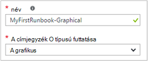<br>
6.  Kattintson a **Létrehozás** hozhat létre a runbook, és nyissa meg a grafikus szerkesztőben.

## <a name="step-2---add-activities-to-the-runbook"></a>Lépés: 2 - a tevékenységek hozzáadása a runbook

A szerkesztő bal oldalán a tár vezérlőelem lehetővé teszi, hogy jelölje ki a tevékenységek hozzáadása a runbook.  Adja hozzá a szöveget a runbook a kimeneti **Írási-kimeneti** parancsmag megyünk.

1.  A tár vezérlő kattintson a Keresés mezőben lévő értéket, és írja be a **Írási-kimeneti**.  A keresési eredmények alatt jelenik meg. <br> 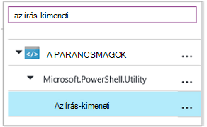
2.  Görgessen le a lista aljára.  Akkor is vagy kattintson a jobb gombbal az **Írási-kimeneti** , és kattintson **vászon hozzáadása** vagy az ellipszis parancsmag mellett kattintson és válassza **vászon hozzáadása**.
3.  Kattintson a vászonra az **Írási-kimeneti** tevékenység.  Ekkor megnyílik a konfigurációs vezérlő lap, amely lehetővé teszi, hogy a tevékenység beállítása.
4.  Parancsmag neve alapértelmezés szerint a **címke** , de azt is módosíthatja valamire további rövid. Módosítsa *Írása Helló, világ való létrehozásához*.
5.  Kattintson a értéket ad a parancsmag paramétereket **paramétereket** .  
    Néhány parancsmagok rendelkezik több paraméter beállítása, és be kell jelölni, amely a használni kívánt. Ebben az esetben **Írási-kimeneti** rendelkezik csak egy paraméter, így Önnek nem kell válasszon egyet. <br> 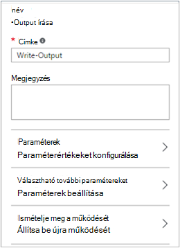
6.  Jelölje ki a **InputObject** paramétert.  A paraméter az, ahol azt határozza meg a szöveget a kimeneti adatfolyam küldeni.
7.  A **adatforrás** tartalmazó legördülő listára válassza a **PowerShell kifejezés**.  Az **adatforrás** legördülő menü a paraméter értéke kitöltéséhez használt különböző forrásokból biztosít.  
    Az ilyen forrásból, például egy másik tevékenységeket, tárgyi eszköz automatizálási vagy egy PowerShell-kifejezés kimeneti is használhatja.  Ebben az esetben csak szeretnénk kimeneti *Helló, világ*szöveget. Hogy PowerShell kifejezéssel, és adjon meg egy karakterláncot.
8.  A **kifejezés** mezőbe írja be a *"Helló, világ"* , és kattintson kétszer az **OK gombra** a vászonra vissza.<br> 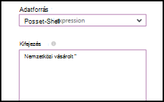
9.  Mentse a runbook **mentése**gombra kattintva.<br> 

## <a name="step-3---test-the-runbook"></a>3 - próba a runbook lépés

Mielőtt közzétesszük a runbook gyártási elérhetővé szeretné tenni, szeretnénk tesztelése, hogy győződjön meg arról, hogy helyesen működik-e.  Amikor egy runbook teszteléséhez a **Piszkozat** verzióját futtatja, és interaktív módon tekintheti meg a kimenetét.

1.  Kattintson a **próba ablakban** nyissa meg a próba lap.<br> 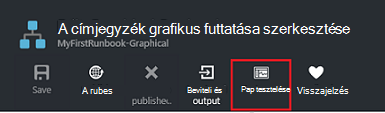
2.  Kattintson a **Start** indítsa el a tesztet.  A csak engedélyezett lehetőséget kell.
3.  A [runbook feladat](automation-runbook-execution.md) jön létre, és állapota a ablaktáblában jelenik meg.  
    A feladat állapota szerint *várólistás* jelző, elérhetővé válik a felhőben runbook dolgozó Várakozás fog elindulni.  *Kezdő* majd azt helyezi át, amikor egy dolgozó követelések a feladatot, majd a *operációs rendszert futtató* indításakor a runbook ténylegesen operációs rendszert futtató.  
4.  A runbook feladat befejezésekor jelenik meg az eredményt. Ebben az esetben célszerű *Helló, világ*láthatja.<br> 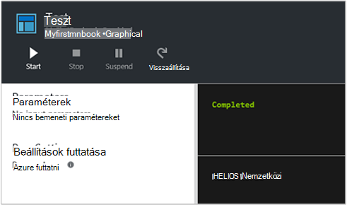
5.  Zárja be a próba lap a vászonra való visszatéréshez.

## <a name="step-4---publish-and-start-the-runbook"></a>Lépés: 4 - közzé, és indítsa el a runbook

Az imént létrehozott runbook továbbra is a vázlat módban van. A közzétételre, mielőtt azt is futtathatja a termelési szükséges.  Egy runbook közzétételekor piszkozat verziójával felülírják a meglévő közzétett verzió.  Ebben az esetben azt a közzétett verzió még nincs, mert az imént létrehozott a runbook.

1.  Kattintson a runbook közzététele a **Közzététel** , majd az **Igen** .<br> 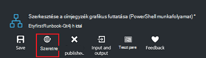
2.  Ha szeretné megtekinteni a runbook a **Runbooks** lap görgetés a balra, azt **közzétett** **Állapotát szerzői** jeleníti meg.
3.  Vissza a lap megtekintése **MyFirstRunbook**jobbra görgetés.  
    Indítsa el a runbook, ütemezze a kezdő sorszám egy kis időt, a jövőben, vagy hozzon létre egy [webhook](automation-webhooks.md) , így indítható el nekünk is, a képernyő tetején a beállítások lehetővé teszi a HTTP-hívás keresztül.
4.  Szeretnénk egyszerűen indítsa el a runbook úgy kattintson **indítása** , majd az **Igen gombra** .<br> 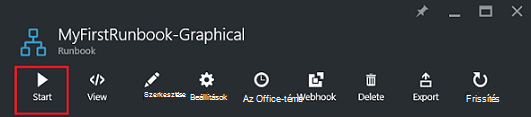
5.  A feladat lap van megnyitva, a runbook feladat, amely az imént létrehozott.  Azt is zárja be az Ez a lap, de ebben az esetben azt fogja hagyja nyitva, akkor megnézheti, hogy a feladat előrehaladását.
6.  A feladat állapota a **Projekt összefoglaló** jelenik meg, és azt a runbook vizsgálva bekerül az állapotok megegyezik.<br> 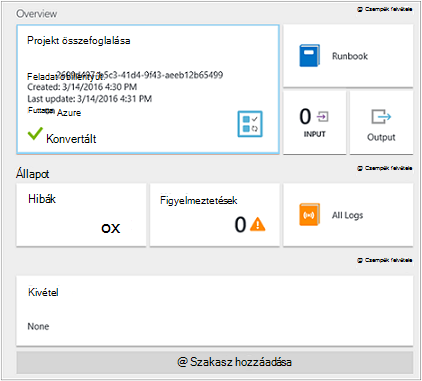
7.  Miután a runbook állapota *kész*, kattintson a **kimeneti**. A **kimeneti** lap van megnyitva, és azt láthatja, hogy a *Helló, világ* ablakban.<br> 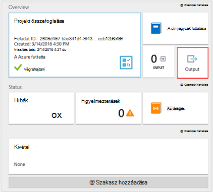  
8.  Zárja be a kimeneti lap.
9.  Kattintson **Az összes naplók** a runbook projektre vonatkozóan a adatfolyamok lap megnyitásához.  Csak a kimeneti adatfolyam *Helló, világ* kell láthatja, de ez más adatfolyamok runbook feladat például részletes és hiba megjelenítheti a őket a runbook ír.<br> 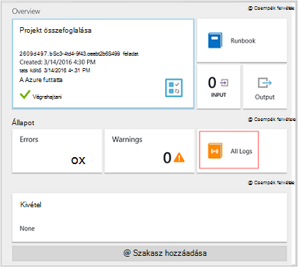
10. Zárja be az összes naplók lap és a feladat lap a MyFirstRunbook lap való visszatéréshez.
11. Kattintson a **feladatok** -e runbook a feladatok lap megnyitásához.  Az e runbook által létrehozott feladatok listája. Csak egy feladatot szerepel a felsorolásban, mivel a probléma csak adódott a feladat egyszer kell láthatja.<br> 
12. A feladat az azonos feladat munkaablak, amely azt nézett meg azt a runbook indításakor választhatja.  Lehetővé teszi, hogy térjen vissza az időt, és minden feladat, amely az egy adott runbook készült részleteinek megtekintését.

## <a name="step-5---create-variable-assets"></a>Lépés az 5 - változó eszközök létrehozása

Hogy korábban vizsgálni, és a runbook közzétett, de az eddigi azt nem bármit hasznos. Azure erőforrások telepítve szeretnénk.  Azt adja meg a runbook hitelesítést végezni, mielőtt azt egy változó, tartsa lenyomva az előfizetés azonosítója, és azt beállítása a tevékenység hitelesítést végezni a lenti 6 után hivatkozást hoz létre.  Többek között az előfizetés környezetben hivatkozni segítségével egyszerűen együttműködés több előfizetéssel között.  A folytatás előtt másolja a előfizetés azonosítója elhagyja a navigációs ablakban a előfizetések lehetőséget.  

1. Az automatizálási fiókok a lap, kattintson a **Webhelyeszközök** csempével és az **eszközök** lap van megnyitva.
2. Az eszközök lap kattintson a **változók** csempére.
3. Kattintson a változók lap **hozzáadása egy változó**.<br>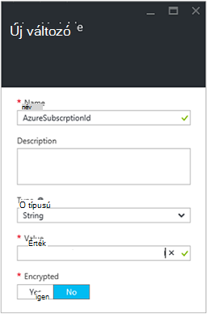
4. Az új változó fel, a **név** mezőbe írja be a **AzureSubscriptionId** , és az **érték** mezőben adja meg a előfizetés azonosítójával.  Tartsa a *karakterlánc* **típus** és az alapértelmezett érték **titkosításhoz**.  
5. Kattintson a **Create** a változó létrehozása.  


## <a name="step-6---add-authentication-to-manage-azure-resources"></a>Lépés a 6 - hitelesítés Azure erőforrások hozzáadása

Most, hogy elkészült a változó tárolásához az előfizetés azonosítója, azt is beállíthatja a runbook Futtatás mint hitelesítő a [előfeltételekről](#prerequisites)a hivatkozott hitelesítést végezni.  Akkor ezt megteheti a Futtatás Azure más néven kapcsolatot **az eszközök** és a **Hozzáadás-AzureRMAccount** parancsmag hozzáadása a vászonra.  

1.  Kattintson a MyFirstRunbook a lap **szerkesztése** gombra kattintva nyissa meg a grafikus szerkesztő.<br> 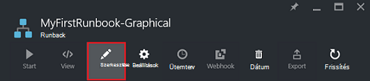
2.  Az **Írás Helló, világ kimeneti** már nem szükséges, ezért kattintson jobb gombbal, és válassza a **Törlés**.
3.  A tár vezérlő bontsa ki a **kapcsolatok** , és **AzureRunAsConnection** felveheti a vászonra **Hozzáadás vászon gombra**kattintva.
4.  Területén jelölje ki a **AzureRunAsConnection** , és konfigurációs vezérlő mezőre, írja be az **Első futtatása, a kapcsolat** az a **címke** mezőben lévő értéket.  A kapcsolat 
5.  A tár vezérlő írja be a Keresés mezőben lévő értéket **Hozzáadása-AzureRmAccount** .
6.  **Hozzáadás-AzureRmAccount** adja hozzá a vásznat.<br> 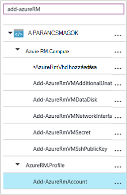
7.  Az egérmutatót **Első futtatása mint kapcsolat** kör jelenik meg az alakzat alsó. Kattintson a megfelelő körre, és húzza a nyíl **Hozzáadása-AzureRmAccount**.  Az éppen létrehozott lehetőség nyílra *hivatkozásra*.  A runbook elindítja az **első futtatni,** kapcsolattal, és futtassa a **Hozzáadás-AzureRmAccount**.<br> 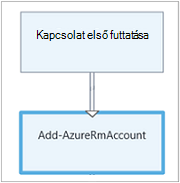
8.  Területén válassza a **Hozzáadás-AzureRmAccount** , és a konfigurációs szabályozhatja az ablakban írja be **bejelentkezési Azure** a **címke** mezőben lévő értéket.
9.  Kattintson a **Paraméterek** és a tevékenység paraméter konfiguráció lap jelenik meg. 
10.  **Hozzáadás-AzureRmAccount** több paraméter tartoznak, így az jelöljön ki egy paraméterértékeket is biztosítjuk előtt szükség.  Kattintson a **Paraméterek beállítása** gombra, és válassza a **ServicePrincipalCertificate** paraméter megadása. 
11.  Miután kiválasztotta a paraméter megadása, a paramétereket a tevékenység paraméter konfigurációs lap jelenik meg.  Kattintson a **APPLICATIONID**.<br> 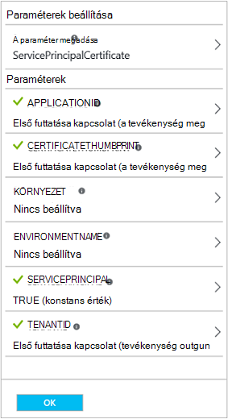
12.  A paraméter értéke a lap jelölje be a **tevékenység kimeneti** **adatforrás** és jelölje ki a **Első futtatása, kapcsolatot** a listában, írja be a **mező elérési út** szövegdoboz **ApplicationId**, lehetőséget, és kattintson **az OK**gombra.  A tulajdonság neve a mező elérési útja megadása azt esetén, mivel a tevékenység-objektum tulajdonságok több exportálja.
13.  Kattintson a **CERTIFICATETHUMBPRINT**, és a paraméter lap válasszon **tevékenység kimeneti** **adatforrás**.  Jelölje ki a **Első futtatása, kapcsolatot** a listában, írja be a **mező elérési út** szövegdoboz **CertificateThumbprint**, és kattintson **az OK**gombra. 
14.  **SERVICEPRINCIPAL**, kattintson a paraméter lap válassza **ConstantValue** **adatforrás**, **Igaz**lehetőségre, és kattintson **az OK**gombra.
15.  Kattintson a **TENANTID**, és a paraméter lap válasszon **tevékenység kimeneti** **adatforrás**.  Jelölje ki a **Első futtatása, kapcsolatot** a listában, írja be a **mező elérési út** szövegdoboz **TenantId**, és kattintson kétszer az **OK gombra** .  
16.  A tár vezérlő írja be a **Set-AzureRmContext** a Keresés mezőben lévő értéket.
17.  **Set-AzureRmContext** adja hozzá a vásznat.
18.  Területén válassza a **Set-AzureRmContext** , és a konfigurációban szabályozhatja az ablak típusú **Előfizetés azonosítója adja meg** a **címke** mezőben lévő értéket.
19.  Kattintson a **Paraméterek** és a tevékenység paraméter konfiguráció lap jelenik meg. 
20. **Set-AzureRmContext** több paraméter tartoznak, így az jelöljön ki egy paraméterértékeket is biztosítjuk előtt szükség.  Kattintson a **Paraméterek beállítása** gombra, és válassza a **SubscriptionId** paraméter megadása.  
21.  Miután kiválasztotta a paraméter megadása, a paramétereket a tevékenység paraméter konfigurációs lap jelenik meg.  Kattintson a **SubscriptionID**
22.  A paraméter lap a válassza ki a **Változó eszközt** **adatforrás** és **AzureSubscriptionId** válasszon a listából, és kattintson kétszer az **OK gombra** .   
23.  Az egérmutatót **az Azure Login** kör jelenik meg az alakzat alsó. Kattintson a megfelelő körre, és húzza a nyíl **Előfizetés azonosítója adja meg**.


A runbook kell kinéznie ezen a ponton: <br>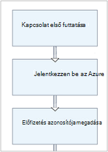

## <a name="step-7---add-activity-to-start-a-virtual-machine"></a>Lépés a 7 - virtuális gép indításához tevékenység hozzáadása

Most már adunk egy **Kezdő-AzureRmVM** tevékenység virtuális gép indításához.  Virtuális gépi is választhat az Azure-előfizetése, és most parancsmag be nevet hardcoding azt is.

1. A tár vezérlő írja be a **Kezdő-AzureRm** a Keresés mezőben lévő értéket.
2. **Kezdés-AzureRmVM** hozzáadása a vászonra kattintson rá, és húzza azt **Adja meg az előfizetés azonosítója**alatt.
3. **Előfizetés azonosítója adja meg,** mutasson a mindaddig, amíg az alakzat alsó megjelenik egy kör.  Kattintson a megfelelő körre, és húzza a nyíl **Start-AzureRmVM**. 
4.  Válassza a **Start-AzureRmVM**.  Kattintson a **Paraméterek** , majd **a paraméter megadása** a halmaz **Start-AzureRmVM**megtekintése.  Jelölje ki a paraméter megadása **ResourceGroupNameParameterSetName** . Megjegyzés **ResourceGroupName** és **nevét** tartalmazó felkiáltójelet következő őket.  Ez azt jelzi, hogy azok szükséges paramétert.  Tartsa szem előtt, mind a karakterlánc tulajdonságértékeket várnak.
5.  Jelölje ki a **nevét**.  Jelölje ki a **PowerShell kifejezést** az **adatforrás** , és írja be, a virtuális gép tartalmazó dupla idézőjelek, amely azt rendszer kezdetű ez runbook körülvett neve.  Kattintson az **OK gombra**.<br>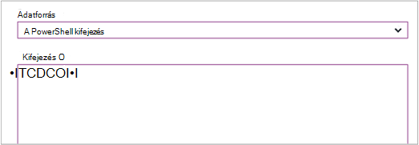
6.  Jelölje ki a **ResourceGroupName**. Az **adatforrás** és a neve az erőforráscsoport tartalmazó dupla idézőjelek körülvett típus **PowerShell kifejezés** használni.  Kattintson az **OK gombra**.<br> 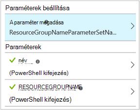
8.  Úgy, hogy azt tesztelheti a runbook, kattintson a vizsgálat munkaablak gombra.
9.  Kattintson a **Start** indítsa el a tesztet.  Ha befejeződött, ellenőrizze, hogy a virtuális gép indított.

A runbook kell kinéznie ezen a ponton: <br>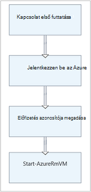

## <a name="step-8---add-additional-input-parameters-to-the-runbook"></a>Lépés a 8 - további bemeneti paramétereket hozzáadása a runbook

A runbook jelenleg indítja el a virtuális gép az erőforráscsoport, azt a **Kezdés-AzureRmVM** parancsmag adott, de a runbook további akkor hasznos, ha azt megadhatja mind a runbook indításakor lenne.  Most már hozzáadja azt, hogy funkciókat nyújtson a runbook bemeneti paramétereket.

1. A grafikus szerkesztő **MyFirstRunbook** munkaablakban **szerkesztése** gombra kattintva nyissa meg.
2. Kattintson a **bemeneti és kimeneti** , majd **adja hozzá a bemeneti** nyissa meg a bemeneti paraméterre Runbook ablaktáblát.<br> 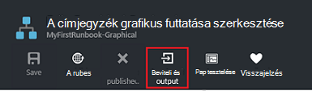
3. Adja meg a **nevét**, *VMName* .  Megtartása *karakterlánc* **típusú**, de módosítása **kötelező** *Igen*értékre.  Kattintson az **OK gombra**.
4. Hozzon létre egy *ResourceGroupName* úgynevezett második kötelező bemeneti paraméterre, és kattintson az **OK gombra** kattintva zárja be a **bemeneti és kimeneti** ablakban.<br> 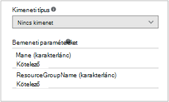
5. Jelölje ki a **Kezdő-AzureRmVM** tevékenységet, és kattintson a **Paraméterek**gombra.
6. **Adatforrás** módosítása **Runbook beviteli** **jelölőnégyzetét** , és válassza a **VMName**.<br>
7. **Adatforrás** módosítása a **ResourceGroupName** **Runbook beviteli** , és válassza a **ResourceGroupName**.<br> 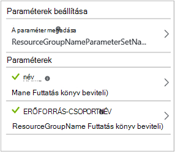
8. A runbook mentse, és nyissa meg a próba ablaktáblát.  Látható, hogy most értékek biztosíthat a két bemeneti változót a próba használt.
9. A próba-ablak bezárása
10. Kattintson a **Közzététel** a runbook új verziójának közzététele.
11. Állítsa le a virtuális gép, Ön által indított az előző lépésben.
12. Kattintson a **Start** a runbook indítása gombra.  Írja be a **VMName** és **ResourceGroupName** a virtuális gép, amely szeretné elindítani.<br> 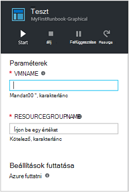
13. A runbook befejezése után ellenőrizze, hogy a virtuális gép indított.

## <a name="step-9---create-a-conditional-link"></a>Lépés a 9 - feltételes hivatkozás létrehozása

A runbook most azt módosítja, így csak megkísérli elindítani a virtuális gép, ha nem kezdődött.  A **Get-AzureRmVM** parancsmag felveszi a runbook kap a virtuális gép szintű példány állapotának azt fogja ehhez. Ezután adunk egy PowerShell-munkafolyamat kódmodul nevű **Állapot beolvasása** egy kódtöredékének annak megállapításához, hogy a virtuális gép állapota állapotát PowerShell-kódot.  A **Get Status** modulból feltételes hivatkozás csak hajtja végre **Start-AzureRmVM** , ha az aktuális fut le van állítva.  Végezetül azt lesz egy üzenet tájékoztatja, ha a virtuális elindult, vagy nem a írási-kimeneti PowerShell parancsmaggal kimeneti.

1. Nyissa meg a grafikus szövegszerkesztőben **MyFirstRunbook** .
2. **Előfizetés azonosítója adja meg,** és a **Kezdő-AzureRmVM** között a hivatkozás eltávolításához kattintson rá, és ezután nyomja le a *Delete* billentyűt.
3. A tár vezérlő írja be a Keresés mezőben lévő értéket **Get-AzureRm** .
4. **Get-AzureRmVM** adja hozzá a vásznat.
5. Jelölje ki a **Get-AzureRmVM** , majd **a paraméter megadása** a halmaz **Get-AzureRmVM**megtekintése.  Jelölje ki a paraméter megadása **GetVirtualMachineInResourceGroupNameParamSet** .  Megjegyzés **ResourceGroupName** és **nevét** tartalmazó felkiáltójelet következő őket.  Ez azt jelzi, hogy azok szükséges paramétert.  Tartsa szem előtt, mind a karakterlánc tulajdonságértékeket várnak.
6. Az **adatforrás** **neve**jelölje be a **bemeneti Runbook** , és válassza a **VMName**.  Kattintson az **OK gombra**.
7. Az **adatforrás** **ResourceGroupName**jelölje be a **bemeneti Runbook** , és válassza a **ResourceGroupName**.  Kattintson az **OK gombra**.
8. **Adatforrás** **állapot**, csoportban jelölje be a **állandót** , majd kattintson a **Igaz**.  Kattintson az **OK gombra**.  
9. **Előfizetés azonosítója adja meg** a **Get-AzureRmVM**mutató hivatkozás létrehozása
10. A tár vezérlő bontsa ki a **Runbook vezérlőt** , és **kód** hozzáadása a vásznat.  
11. **Get-AzureRmVM** **kódra**mutató hivatkozás létrehozása  
12. Kattintson a **kód** , és a konfigurációs ablakban módosítsa címke **Get**-állapot megjelenítéséhez.
13. Jelölje be a **kódot** paraméter, és a **Kód szerkesztése** lap megjelenik.  
14. A kód szerkesztőben illessze be az alábbi kódtöredékének kódot:

     ```
     $StatusesJson = $ActivityOutput['Get-AzureRmVM'].StatusesText 
     $Statuses = ConvertFrom-Json $StatusesJson 
     $StatusOut ="" 
     foreach ($Status in $Statuses){ 
     if($Status.Code -eq "Powerstate/running"){$StatusOut = "running"} 
     elseif ($Status.Code -eq "Powerstate/deallocated") {$StatusOut = "stopped"} 
     } 
     $StatusOut 
     ```

15. **Állapot beolvasása** a **Kezdés-AzureRmVM**mutató hivatkozás létrehozása<br> 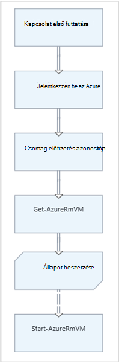  
16. Jelölje ki a hivatkozást, és a konfigurációs ablakban módosítsa **alkalmaz a feltétel** **Igen**értékre.   Figyelje meg a hivatkozást, azzal kikapcsolja a szaggatott vonal jelzi, hogy a célhely tevékenység csak futtatandó Ha oldja fel a feltétel igaz.  
17. A **feltétel kifejezést**írja be a *$ActivityOutput ["első helyzet"] - eq "Leállt"*.  **Kezdés-AzureRmVM** csak most futtatható a virtuális gép leállítása.
18. Bontsa ki a tár vezérlőelem **-parancsmagok** és **Microsoft.PowerShell.Utility**.
19. Adja hozzá **Az írási-kimeneti** a vászonra kétszer.<br> 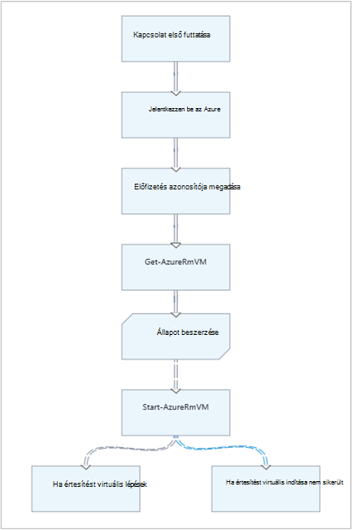
20. Első vezérlőelemére **Írási-kimeneti** kattintson a **Paraméterek** gombra, és módosítsa a **címke** értéket *Virtuális lépések értesítést*.
21. **InputObject**, az **adatforrás** módosítása **PowerShell kifejezést** , és írja be az *"$VMName elindul."*kifejezés.
22. A második **Írási-kimeneti** vezérlő kattintson a **Paraméterek** gombra, és módosítsa a **címke** értéket *Értesíti a virtuális indítása sikertelen volt*
23. **InputObject**, az **adatforrás** módosítása **PowerShell-kifejezés** , és írja be a *"$VMName nem indítható,."*kifejezés.
24. **Kezdés-AzureRmVM** **Virtuális lépések értesítést** , és **Értesítést virtuális indítása sikertelen**mutató hivatkozás létrehozása
25. Jelölje ki a **virtuális** lépések értesíti a hivatkozást, és módosítsa **alkalmaz a feltétel** **Igaz**.
26. A **feltétel kifejezést**írja be a *$ActivityOutput ["Start-AzureRmVM"]. IsSuccessStatusCode - eq $true*.  E írási-kimeneti vezérlő csak most működik a virtuális gép sikeresen elindul, ha.
27. Jelölje ki a **virtuális indítása** sikertelen értesíti a hivatkozást, és módosítsa **alkalmaz a feltétel** **Igaz**.
28. A **feltétel kifejezést**írja be a *$ActivityOutput ["Start-AzureRmVM"]. IsSuccessStatusCode - ne $true*.  E írási-kimeneti vezérlő csak most működnek, ha a virtuális gép sikeresen nem indult el.
29. A runbook mentse, és nyissa meg a próba ablaktáblát.
30. A virtuális gép leállt a runbook kezdődik, és meg kell kezdődnie.

## <a name="next-steps"></a>Következő lépések

-   Grafikus létrehozásával kapcsolatos további információért lásd a [grafikus Azure automatizálási létrehozására](automation-graphical-authoring-intro.md)
-   Első lépések a PowerShell runbooks, lásd: [az első PowerShell runbook](automation-first-runbook-textual-powershell.md)
-   Első lépések a PowerShell munkafolyamat runbooks, lásd: [az első PowerShell munkafolyamat runbook](automation-first-runbook-textual.md)
