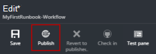
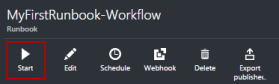

<properties
    pageTitle="Az első munkafolyamat PowerShell runbook az Azure automatizálás |} Microsoft Azure"
    description="Amelyek végigvezetik Önt a létrehozási, tesztelés, és a közzététel egy egyszerű szöveges runbook munkafolyamat PowerShell használata az oktatóprogram."
    services="automation"
    documentationCenter=""
    authors="mgoedtel"
    manager="jwhit"
    editor=""
    keywords="a PowerShell munkafolyamat-powershell munkafolyamat példákban munkafolyamat powershell"/>
<tags
    ms.service="automation"
    ms.workload="tbd"
    ms.tgt_pltfrm="na"
    ms.devlang="na"
    ms.topic="get-started-article"
    ms.date="07/19/2016"
    ms.author="magoedte;bwren"/>

# <a name="my-first-powershell-workflow-runbook"></a>Az első munkafolyamat PowerShell runbook

> [AZURE.SELECTOR] - [A grafikus](automation-first-runbook-graphical.md) - [PowerShell](automation-first-runbook-textual-PowerShell.md) - [PowerShell-munkafolyamat](automation-first-runbook-textual.md)

Ebben az oktatóanyagban végigvezeti az Azure automatizálás egy [PowerShell-munkafolyamat runbook](automation-runbook-types.md#powerShell-workflow-runbooks) létrehozását. Lássuk először egy egyszerű runbook, hogy miként vizsgálat, és közben azt ismertetik a runbook feladat állapotának nyomon követéséhez tegye közzé a. Azt fogja módosítsa a runbook ténylegesen kezelheti az Azure erőforrásokat, ebben az esetben kezdve az Azure virtuális gépen. Azt fogja végezze el a runbook megbízhatóbb runbook paraméterek hozzáadásával.

## <a name="prerequisites"></a>Előfeltételek

Ebben az oktatóanyagban befejezéséhez szüksége lesz az alábbi.

-   Azure előfizetés. Ha egy még nem rendelkezik, akkor [az MSDN előfizetői előnyeinek aktiválása](https://azure.microsoft.com/pricing/member-offers/msdn-benefits-details/) vagy a <a href="/pricing/free-account/" target="_blank"> [ingyenes fiókot regisztrálni](https://azure.microsoft.com/free/).
-   [Automatizálási fiók](automation-security-overview.md) tartsa lenyomva az ujját a runbook és Azure erőforrásokhoz hitelesítést végezni.  Ehhez a fiókhoz elindítása és leállítása a virtuális gép engedéllyel kell rendelkeznie.
-   Azure virtuális gépen. Hogy leállítása, és indítsa el az ezen a számítógépen, így nem kell lennie a termelési.

## <a name="step-1---create-new-runbook"></a>Lépés: 1 – új runbook létrehozása

Lássuk először: hozzon létre egy egyszerű runbook, hogy a szöveg *Helló, világ*exportálja.

1.  Az Azure-portálon nyissa meg az automatizálási fiókját.  
    Automatizálási fióklapjának elemre koppintva az erőforrások gyors áttekintést ehhez a fiókhoz. Egyes eszközök már rendelkeznie kell. A táblázatparancsok nagy része automatikusan bekerülnek az új fiók automatizálási modulokat. Rendelkeznie kell is szerepel a [Előfeltételek](#prerequisites)hitelesítő digitális eszköz kiválasztása.
2.  Kattintson a nyissa meg a listát a runbooks **Runbooks** csempére.<br> 
3.  Hozzon létre egy új runbook a **egy runbook Hozzáadás** gombra, majd a **Létrehozás egy új runbook**gombjára kattintva.
4.  Nevezze el a runbook a *MyFirstRunbook-munkafolyamatot*.
5.  Ebben az esetben megyünk hozzon létre egy [PowerShell-munkafolyamat runbook](automation-runbook-types.md#powerShell-workflow-runbooks) , ezért válassza a **Powershell munkafolyamat** - **típus Runbook**.<br> 
6.  Kattintson a **Létrehozás** hozhat létre a runbook, és nyissa meg a szöveges szerkesztőben.

## <a name="step-2---add-code-to-the-runbook"></a>Lépés: 2 - kód hozzáadása a runbook

Bármelyik kódját közvetlenül a runbook is, vagy válassza ki a tár vezérlő parancsmagok, runbooks és eszközök, és azokat a runbook kapcsolódó paramétereket az adott hozzá. Ez a forgatókönyv azt fogja írja be közvetlenül a runbook.

1.  A runbook jelenleg ürül kizárólag a szükséges *munkafolyamat* kulcsszó, a nevét, valamint a runbook a kapcsos zárójeleket, amely a teljes munkafolyamat fog encase. 

    ```
    Workflow MyFirstRunbook-Workflow
    {
    }
    ```

2.  Írja be *az írási-kimeneti "Helló, világ."* a kapcsos zárójelek. 
   
    ```
    Workflow MyFirstRunbook-Workflow
    {
      Write-Output "Hello World"
    }
    ```

3.  Mentse a runbook **mentése**gombra kattintva.<br> 

## <a name="step-3---test-the-runbook"></a>3 - próba a runbook lépés

Mielőtt közzétesszük a runbook gyártási elérhetővé szeretné tenni, szeretnénk tesztelése, hogy győződjön meg arról, hogy helyesen működik-e. Amikor egy runbook teszteléséhez a **Piszkozat** verzióját futtatja, és interaktív módon tekintheti meg a kimenetét.

1.  **Teszt ablakban** a próba-ablak megnyitása gombra.<br> 
2.  Kattintson a **Start** indítsa el a tesztet. A csak engedélyezett lehetőséget kell.
3.  A [runbook feladat](automation-runbook-execution.md) jön létre, és állapota jelenik meg.  
    A feladat állapota *várólistás* jelző Várakozás hamarosan érhető el a felhőben runbook dolgozó induljon el fog. *Kezdő* majd azt helyezi át, amikor egy dolgozó állítja a feladatot, majd a *operációs rendszert futtató* indításakor a runbook ténylegesen operációs rendszert futtató.  
4.  A runbook feladat befejezésekor jelenik meg az eredményt. Ebben az esetben célszerű *Helló, világ*láthatja.<br> 
5.  A próba-való visszatéréshez a vászonra ablak bezárása

## <a name="step-4---publish-and-start-the-runbook"></a>Lépés: 4 - közzé, és indítsa el a runbook

Az imént létrehozott runbook továbbra is a vázlat módban van. A közzétételre, mielőtt azt is futtathatja a gyártás szükséges. Egy runbook közzétételekor piszkozat verziójával felülírják a meglévő közzétett verzió. Ebben az esetben azt a közzétett verzió még nincs, mert az imént létrehozott a runbook.

1.  Kattintson a **Közzététel** a runbook közzététele, majd az **Igen** .<br> 
2.  Ha balra a runbook most megtekintése a **Runbooks** ablakban görgessen le, akkor **közzétett** **Állapotát szerzői** jeleníti meg.
3.  Görgetés az ablakban **MyFirstRunbook-munkafolyamathoz**tartozó jobbra.  
    Indítsa el a runbook, ütemezze a kezdő sorszám egy kis időt, a jövőben, vagy hozzon létre egy [webhook](automation-webhooks.md) , így indítható el nekünk is, a képernyő tetején a beállítások lehetővé teszi a HTTP-hívás keresztül.
4.  Szeretnénk egyszerűen indítsa el a runbook úgy kattintson **indítása** , majd az **Igen gombra** .<br> 
5.  A feladat ablaktáblában a runbook feladat, amely az imént létrehozott nyitja meg. Azt is zárja be az ablaktábla, de ebben az esetben azt fogja hagyja nyitva, akkor megnézheti, hogy a feladat előrehaladását.
6.  A feladat állapota a **Projekt összefoglaló** jelenik meg, és azt a runbook vizsgálva bekerül az állapotok megegyezik.<br> 
7.  Miután a runbook állapota *kész*, kattintson a **kimeneti**. Nyitja meg a kimeneti ablakban, és azt láthatja, hogy a *Helló, világ*.<br>   
8.  Zárja be a kimeneti ablakban.
9.  Kattintson a **adatfolyam megjelenítését** a runbook projektre vonatkozóan a adatfolyamok ablak megnyitásához. Csak a kimeneti adatfolyam *Helló, világ* kell láthatja, de ez más adatfolyamok runbook feladat például részletes és hiba megjelenítheti a őket a runbook ír.<br> 
10. Zárja be a adatfolyam megjelenítését és a feladat ablaktábla, a MyFirstRunbook ablaktáblán való visszatéréshez.
11. Kattintson a **feladatok** kattintva nyissa meg a feladatok ablakban a runbook. Az e runbook által létrehozott feladatok listája. Csak egy feladatot szerepel a felsorolásban, mivel a probléma csak adódott a feladat egyszer kell láthatja.<br> 
12. A feladat az azonos feladat munkaablak, amely azt nézett meg azt a runbook indításakor választhatja. Lehetővé teszi, hogy térjen vissza az időt, és minden feladat, amely az egy adott runbook készült részleteinek megtekintését.

## <a name="step-5---add-authentication-to-manage-azure-resources"></a>Lépés az 5 - hitelesítés Azure erőforrások hozzáadása

Azt már vizsgálni, és címjegyzékemben runbook közzé, de az eddigi azt nem bármit hasznos. Azure erőforrások telepítve szeretnénk. Teheti, kivéve, ha van rá hitelesíteni a [Előfeltételek](#prerequisites)hivatkozni hitelesítő adatokkal azonban nem. Azt a érheti el, amely a **Hozzáadás-AzureRMAccount** parancsmag.

1.  A munkafolyamat MyFirstRunbook ablaktáblában **szerkesztése** gombra kattintva nyissa meg a szöveges szerkesztőben.<br> 
2.  Az **írás** sorrá már nem szükséges, így jóváhagyást, és törölje azt.
3.  Vigye a kurzort egy üres sorban a kapcsos zárójelek közé.
4.  Írja be vagy illessze be a következő kódot, amely a hitelesítés, a Futtatás automatizálási más néven fiókjával fogja kezelni:

    ```
    $Conn = Get-AutomationConnection -Name AzureRunAsConnection 
    Add-AzureRMAccount -ServicePrincipal -Tenant $Conn.TenantID `
    -ApplicationId $Conn.ApplicationID -CertificateThumbprint $Conn.CertificateThumbprint
    ```

5.  Kattintson a **ablaktábla tesztelése** , hogy azt tesztelheti a runbook.
6.  Kattintson a **Start** indítsa el a tesztet. Ha befejeződött, a kimeneti hasonlóan, mint a következő, a Megjelenítés az alapvető információk a fiókjából kell kapnia. Ez megerősíti, hogy a hitelesítő adatok érvényes.<br> 

## <a name="step-6---add-code-to-start-a-virtual-machine"></a>Lépés a 6 - kód egy virtuális gép indítása

Most, hogy a runbook hitelesíti az Azure-előfizetéséhez, azt is kezelheti az erőforrásokat. Adunk virtuális gép indítása parancsot. Virtuális gépi is választhat az Azure-előfizetése, és most parancsmag be nevet hardcoding azt is.

1.  *Hozzáadás-AzureRmAccount*, után írja be a *Start-AzureRmVM-neve "VMName" - ResourceGroupName "NameofResourceGroup"* kezeléséről a és a virtuális gép indítása erőforráscsoport nevét.  

    ```
    workflow MyFirstRunbook-Workflow
    {
      $Conn = Get-AutomationConnection -Name AzureRunAsConnection
      Add-AzureRMAccount -ServicePrincipal -Tenant $Conn.TenantID -ApplicationId $Conn.ApplicationID -CertificateThumbprint $Conn.CertificateThumbprint
      Start-AzureRmVM -Name 'VMName' -ResourceGroupName 'ResourceGroupName'
    }
    ``` 

2.  Mentse a runbook, és kattintson az **ablak tesztelése** , hogy azt tesztelheti.
3.  Kattintson a **Start** indítsa el a tesztet. Ha befejeződött, ellenőrizze, hogy a virtuális gép indított.

## <a name="step-7---add-an-input-parameter-to-the-runbook"></a>Lépés a 7 – a bemeneti paraméterre hozzáadása a runbook

A runbook jelenleg elindítja a virtuális számítógép-e azt a runbook a szoftveresen kötött, de több hasznos lenne, ha azt megadhatja a virtuális gép a runbook indításakor. Most már hozzáadja azt, hogy funkciókat nyújtson a runbook bemeneti paramétereket.

1.  Paraméterek *VMName* és *ResourceGroupName* hozzáadása a runbook, és ezek a változók használata a **Kezdés-AzureRmVM** parancsmag, ahogy az alábbi példában. 

    ```
    workflow MyFirstRunbook-Workflow
    {
       Param(
        [string]$VMName,
        [string]$ResourceGroupName
       )  
     $Conn = Get-AutomationConnection -Name AzureRunAsConnection 
     Add-AzureRMAccount -ServicePrincipal -Tenant $Conn.TenantID -ApplicationId $Conn.ApplicationID -CertificateThumbprint $Conn.CertificateThumbprint
     Start-AzureRmVM -Name $VMName -ResourceGroupName $ResourceGroupName
    }
    ```

2.  A runbook mentse, és nyissa meg a próba ablaktáblát. Látható, hogy most értékek biztosíthat a két bemeneti változót a próba használt.
3.  A próba-ablak bezárása
4.  Kattintson a **Közzététel** a runbook új verziójának közzététele.
5.  Állítsa le a virtuális gép, Ön által indított az előző lépésben.
6.  Kattintson a **Start** a runbook indítása gombra. Írja be a **VMName** és **ResourceGroupName** a virtuális gép, amely szeretné elindítani.<br> 

7.  A runbook befejezése után ellenőrizze, hogy a virtuális gép indított.

## <a name="next-steps"></a>Következő lépések

-  Első lépések a grafikus runbooks, lásd: [az első grafikus runbook](automation-first-runbook-graphical.md)
-  Első lépések a PowerShell runbooks, lásd: [az első PowerShell runbook](automation-first-runbook-textual-powershell.md)
-  Runbook típusú, a előnyei és korlátai kapcsolatos további tudnivalókért lásd: [Azure automatizálási runbook típusai](automation-runbook-types.md)
-  További információt a PowerShell-parancsprogramot támogatja a szolgáltatást című témakörben [található automatizálás Azure támogatja natív PowerShell-parancsprogramot](https://azure.microsoft.com/blog/announcing-powershell-script-support-azure-automation-2/)