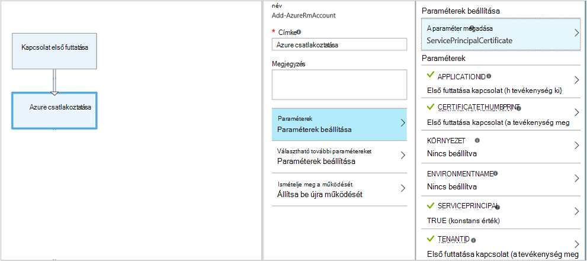

<properties 
    pageTitle="A grafikus létrehozása az Azure automatizálás |} Microsoft Azure"
    description="Grafikus szerzői lehetővé teszi a runbooks létrehozása az Azure automatizálási kód használata nélkül. Ebben a cikkben egy grafikus szerzői – bevezetés és a minden részlet, a grafikus runbook létrehozásához szükséges."
    services="automation"   
    documentationCenter=""
    authors="mgoedtel"
    manager="jwhit"
    editor="tysonn" />
<tags 
    ms.service="automation"
    ms.devlang="na"
    ms.topic="article"
    ms.tgt_pltfrm="na"
    ms.workload="infrastructure-services"
    ms.date="06/03/2016"
    ms.author="magoedte;bwren" />

# Grafikus Azure automatizálási létrehozására

## – Bevezetés

Grafikus szerkesztést lehetővé teszi, hogy runbooks létrehozása az Azure automatizálási a bonyodalmainak az alapul szolgáló Windows PowerShell vagy PowerShell munkafolyamat kód nélkül. Tevékenységek hozzáadása a vászonra parancsmagok és runbooks tárról, kapcsolja össze, és konfigurálja úgy, hogy a munkafolyamat űrlap.  Ha minden eddiginél dolgozott System Center Orchestrator vagy szolgáltatás felügyeleti automatizálási (SMA), majd meg kell kinéznie ismerős lehet.   

Ebben a cikkben egy grafikus szerzői – bevezetés és a kell egy grafikus runbook létrehozása az első lépések koncepciót is bemutat.

## A grafikus runbooks

Az Azure automatizálás összes runbooks a Windows PowerShell-munkafolyamatok.  Grafikus és a grafikus PowerShell munkafolyamat runbooks az automatizálási dolgozók által futtatott PowerShell-kód létrehozása, de Ön nem tudja megtekintéséhez, vagy közvetlenül módosíthatók.  A grafikus runbook konvertálható egy grafikus PowerShell munkafolyamat runbook és fordítva, de azok nem alakítható át egy szöveges runbook. Egy meglévő szöveges runbook a grafikus szerkesztő nem importálhatók.  

## A grafikus szerkesztő áttekintése

A grafikus szerkesztő az Azure-portálon megnyithatja a létrehozásához, vagy egy grafikus runbook szerkesztésével.

Az alábbi szakaszok ismertetik a vezérlők a grafikus szerkesztőben.

### Vászon
A vászonra, ahol a runbook tervezése.  A tár vezérlő csomópontjának tevékenységek hozzáadása a runbook, és a runbook logika megadása mutató hivatkozásokkal csatlakozni őket.

A vezérlőket használhatja a vászonra alján nagyíthat és kicsinyíthet.

### Tár vezérlő

A tár vezérlő, ahol kiválaszthatja a [tevékenységek](#activities) hozzáadása a runbook.  Felveheti a vászonra, ahol csatlakoztatás többi tevékenységekkel.  Az alábbi táblázatban ismertetett négy szakaszok tartalmazza.

| Szakasz | Leírás |
|:---|:---|
| A parancsmagok | A parancsmagok használható szerepel a runbook.  A parancsmagok modul szerint vannak rendezve.  Az összes automatizálási fiókban telepített modulokat érhetők el.  |
| Runbooks |  A runbooks tartalmazza a automatizálási-fiókjában. A gyermek runbooks helyőrzőként vászon ezek runbooks bővíthető. Csak az éppen szerkesztett runbook azonos core típusú runbooks jelennek meg; a grafikus runbooks csak PowerShell-alapú runbooks jelennek meg, amíg grafikus PowerShell munkafolyamat runbooks csak PowerShell-munkafolyamat-alapú runbooks megjelennek.
| Eszközök | Az [automatizálási eszközök](http://msdn.microsoft.com/library/dn939988.aspx) szerepel a runbook használható automatizálási fiókját.  Tárgyi eszköz egy runbook beállításakor azt ad hozzá egy munkafolyamatot tevékenységet, amely a kiválasztott eszköz kapja.  Változó eszközök, esetén választhat egy tevékenységet a változó első, illetve a változó szeretné hozzáadni.
| Runbook vezérlő | Az aktuális runbook runbook vezérlő tevékenységek használható tartalmazza. *Csatlakozási* több bemenetben tart, és megvárja, amíg az összes a munkafolyamat a továbblépés előtt befejeződik. A *kód* tevékenységének futtat egy vagy több kódsorokat PowerShell vagy PowerShell munkafolyamat grafikus runbook típusától függően.  Ez a tevékenység egyéni kódot vagy elérése a többi tevékenységekkel funkciókat használhatja.|

### Konfigurációs vezérlő

A konfiguráció vezérlő, ahol részletek biztosítanak a vászonra kijelölt objektum. Érhető el ez a vezérlő tulajdonságainak kiválasztott objektum típusától függ.  A konfiguráció vezérlő jelöljön ki egy elemet kattintva megnyílik további pengéit további információt a biztosítása érdekében.

### Vezérlőelem ellenőrzéséhez

A próba-vezérlő nem jelenik meg, a grafikus szerkesztő első indításakor. Mikor megnyitva, interaktív [tesztelje a grafikus runbook](#graphical-runbook-procedures).  

## A grafikus runbook eljárások 

### A grafikus runbook importálása és exportálása

A grafikus runbook közzétett verziójának csak exportálhatja.  Ha a runbook még nem lett közzé, majd az **Exportálás közzétett** gombra le lesznek tiltva.  Ha az **Exportálás közzétett** gombra kattint, a runbook töltse le a rendszer a helyi számítógépre.  A fájl nevét a runbook *graphrunbook* kiterjesztésű neve megegyezik.

Válassza az **Importálás** lehetőséget, egy runbook hozzáadásakor grafikus vagy grafikus PowerShell munkafolyamat runbook fájl importálhatja.   Ha bejelöli az importálni kívánt fájlt, megtartása ugyanazt a **nevet** , vagy adja meg egy újat.  A Runbook típusa mező azt értékeli ki a fájlt, és megpróbálja a különböző típusú, nem helyes, ha egy üzenet formában jelennek meg potenciális ütközés és az átalakítás során lehet szintaktikai hibák megjegyezni után jelennek meg runbook típusú.  

### A grafikus runbook tesztelése

Egy runbook piszkozat verziójának tesztelheti az Azure portál változatlanul a runbook közzétett verziójának, vagy egy új runbook előtt közzétételét követően tesztelheti közben. Ez lehetővé teszi, hogy ellenőrizze, hogy a runbook a közzétett verzió cseréje előtt megfelelően működik. Egy runbook tesztelésekor a piszkozat runbook megy végbe, és a végrehajtható műveleteket hajt végre. Nincs korábbi hoz létre, de a kimeneti a próba kimeneti ablakban jelenik meg. 

Nyissa meg a próba vezérlőelemet egy runbook nyissa meg szerkesztésre a runbook, és kattintson a **Próba-ablak** gombra.

A próba-vezérlő esetleges bemeneti paramétereket kérni fogja, és a runbook először kattintson a **Start** gombra.

### A grafikus runbook közzététele

Minden runbook az Azure automatizálást tartalmaz, a Vázlat és a közzétett verzió. Csak a közzétett verzió érhető el kell futtatni, és csak a vázlatverziója szerkeszthető. A közzétett verzió nem érinti a vázlatverziója módosításait. Ha elkészült, elérhetővé szeretné tenni a piszkozat verziót, majd teszi közzé, amely felülírja a közzétett verzió piszkozat verziójával.

A grafikus runbook közzéteheti úgy, hogy megnyitja a runbook szerkesztésre, és válassza a **Közzététel** gombra.

Ha egy runbook még nem lett közzé, **Új**állapotban van.  Közzétételkor, **közzétett**állapotban van.  A runbook után közzétételét követően, és a Vázlat és a közzétett verzió eltérőek szerkesztésekor a runbook állapotú **szerkesztése**.

 

Akkor is egy runbook közzétett verziójának visszaállítása lehetőséget.  A nem vagyok a gépnél okoz a runbook legutóbbi közzétételének és a runbook piszkozat verziójának cseréli a közzétett verzió óta elvégzett módosításokat.

## Tevékenységek

Tevékenységek építőelemei a egy runbook.  Egy tevékenység lehet egy PowerShell-parancsmag egy Gyermekszint runbook és munkafolyamat-tevékenység.  Tevékenység hozzáadása a runbook jobb gombbal kattint a tár vezérlő, és válassza a **Hozzáadás a vászon**.  Kattintson a gombra, majd húzza a tevékenység a vászonra, amely tetszik, tetszőleges helyére.  Hol található a a tevékenység a vászonra nincs hatással a runbook semmilyen módon működését.  Azt is megteheti elrendezés a runbook azonban Ön tetszését leginkább megfelelő működése ábrázolásához. 

Jelölje ki a tevékenységet a konfigurációs lap Tulajdonságok és a paraméterek beállítása a vászonra.  A **címke** a tevékenység egy üzenetet, amely pontosan leírja, hogy módosíthatja.  Továbbra is futtassa az eredeti parancsmag, egyszerűen csak szeretné megváltoztatni a megjelenítendő név, a grafikus szerkesztőben használt.  A címke a runbook belül egyedinek kell lennie. 

### Paraméterek beállítása

A paraméter megadása a kötelező és választható paraméterek, amely akkor fogad el egy adott parancsmag értékének határozza meg.  Az összes parancsmagok legalább egy paraméter van, és néhány több.  Ha parancsmag több paraméter beállítása, majd válasszon melyiket fogja használni a paraméterek konfigurálása előtt.  A paraméterek beállítható úgy dönt, hogy a paraméter megadása függ.  Módosíthatja a **Paraméter megadása** , egy másik gomb kiválasztásával tevékenység által használt paraméter megadása.  Ebben az esetben konfigurált paraméterértékeket elvesznek.

Az alábbi példa a Get-AzureRmVM parancsmag három paraméter készletek tartalmaz.  Jelölje ki a paraméter készleteken nem konfigurálható paraméterértékeket.  ListVirtualMachineInResourceGroupParamSet paraméter megadása az összes virtuális gépeken futó visszaadni erőforráscsoport és az egyetlen választható paramétert.  A GetVirtualMachineInResourceGroupParamSet nem adja meg a virtuális gép, amelyet eredményül szeretne kapni, és két kötelező és választható paraméter egy.

#### Paraméter értéke

Egy értéket a paraméter megadása esetén válassza a adatforrás határozza meg, hogyan adható meg az értéket.  Az adatforrások használható egy adott paraméterhez az érvényes értékek az adott paraméter függ.  Ha például Null nem lesz, amely nem teszi lehetővé a null értékek paraméter egy lehetőség.

| Adatforrás | Leírás |
|:---|:---|
|Állandó értékét|Írja be a paraméter értékét.  Ez a lehetőség csak a következő típusú vonatkozó: Int32, Int64, karakterlánc, logikai érték, DateTime, kapcsolót. |
|Tevékenység kimeneti|Az aktuális tevékenység program munkafolyamaton belül a tevékenység kimenetét.  Az összes érvényes tevékenységek lesz látható.  Jelölje ki az eredményt használni a paraméter értéke csak a tevékenységet.  Ha a tevékenység kimenet objektumhoz több tulajdonságok, majd beírhatja a tulajdonság neve a tevékenység kijelölése után.|
|Runbook beviteli |Jelölje ki a runbook bemeneti paraméterre bemenetként átadja a tevékenység paramétert.|  
|Változó eszköz|Jelölje be az automatizálási változó beviteli.|  
|Hitelesítő digitális eszköz kiválasztása|Jelölje be az automatizálási hitelesítő adatok beviteli.|  
|Tanúsítvány eszköz|Jelölje be az automatizálási tanúsítványt beviteli.|  
|A kapcsolat digitális eszköz kiválasztása|Jelölje be az automatizálási kapcsolat beviteli.| 
|A PowerShell kifejezés|Adja meg, hogy egyszerű [PowerShell kifejezés](#powershell-expressions).  A kifejezés kiértékelésre kerül, a tevékenységet, és az eredmény a paraméter értéke használt előtt.  Ha nézni szeretné a kimenet valamely tevékenység vagy egy runbook bemeneti paraméterre változót is használhatja.|
|Nincs beállítva|Bármilyen érték korábban beállított törli.|

#### Választható további paramétereket

Az összes parancsmagok lesz a lehetőséget, ha további paramétereket.  Ezek a PowerShell általános paramétereket vagy más egyéni paraméterek.  Hol lehet nyújtani PowerShell szintaxissal paraméterek szövegdoboz jelenik meg.  Például **részletes** közös paraméter használatával, meg szeretné adni **"-részletes: $True"**.

### Ismételje meg a tevékenység

**Viselkedés ismét** lehetővé teszi, hogy egy tevékenység többször futtatható, amíg egy adott feltétel nem teljesül, hasonlóan a ismétlődve.  Használhatja ezt a szolgáltatást, hogy jobban hiba többször fusson, a tevékenységek és előfordulhat, hogy szükség egynél több megpróbálja a sikerhez vagy tesztelje a kimeneti információkat a tevékenység érvényes adatok.    

Tevékenység újra engedélyezheti, beállíthatja, hogy késleltetést, és a megadott feltétel.  A késleltetés az idő (másodpercben vagy percben mérhető), hogy a runbook várakozik, a tevékenység ismételt futtatása előtt.  Ha nincs késés van megadva, majd a tevékenység fog futni újra befejezése után azonnal. 

Az Ismét gombra a feltétel egy PowerShell-kifejezés, amely minden alkalommal, amikor a tevékenység futása után kiértékelt.  Ha a kifejezés eredménye IGAZ, majd a tevékenység, újra futtatja.  Ha a kifejezés eredménye hamis, a a tevékenység nem futtassa újra, és a runbook helyezi át következő műveletre. 

Az Ismét gombra a feltétel, amely a tevékenység próbálkozások információt hozzáférést biztosít $RetryData nevű változó használható.  Ez a változó az alábbi táblázatban az tulajdonságokat tartalmaz.

| A tulajdonság | Leírás |
|:--|:--|
| NumberOfAttempts | Száma, hogy a tevékenység működött.              |
| Kimenet           | A tevékenység utolsó Futtatás kimenetét.                    |
| TotalDuration    | Túllépte a tevékenység az első alkalommal kezdete óta eltelt. |
| StartedAt        | A tevékenység UTC formátumú első elindítása.           |

Következők tevékenység példák feltételeket próbálkozzon újra.

    # Run the activity exactly 10 times.
    $RetryData.NumberOfAttempts -ge 10 

    # Run the activity repeatedly until it produces any output.
    $RetryData.Output.Count -ge 1 

    # Run the activity repeatedly until 2 minutes has elapsed. 
    $RetryData.TotalDuration.TotalMinutes -ge 2

Miután beállította a tevékenység újrapróbálkozási feltétel, a a tevékenység, amelyben emlékezteti arra, hogy két vizuális figyelmeztetések tartalmazza.  A tevékenység egyik foglalt, és a másik pedig, amikor a tevékenység konfigurációjának áttekintheti.

### Munkafolyamat parancsfájl vezérlő

A kód beállítás ki egy speciális tevékenységet, amely éppen létrehozott funkciókat, amelyek más módon nem feltétlenül vehető igénybe biztosítása érdekében a grafikus runbook típusától függően PowerShell vagy PowerShell munkafolyamat parancsfájl elfogadja.  Azt nem lehet elfogadni paraméterek, de a változó használható tevékenység kimeneti és runbook bemeneti paramétereket.  Mindaddig nem csatolása kimenő ebben az esetben nem adja hozzá a runbook kimenetének bármely kimeneti a tevékenység bekerül a databus.

A következő kódot például számításokat $NumberOfDays nevű runbook beviteli változó dátum hajt végre.  Majd elküld egy számítás dátuma és időpontja ezt az eredményt, a runbook azt követő tevékenységek való használatra.

    $DateTimeNow = (Get-Date).ToUniversalTime()
    $DateTimeStart = ($DateTimeNow).AddDays(-$NumberOfDays)}
    $DateTimeStart

## Hivatkozások és munkafolyamat

A grafikus runbook **hivatkozás** a két tevékenység csatlakozik.  Akkor jelenik meg a vászonra az adatforrás tevékenységből cél a műveletre mutató nyilat.  A tevékenységek a cél tevékenységgel kezdve a forrás tevékenység befejezése után futtathatók a nyíl irányát.  

### Hivatkozás létrehozása

A forrás tevékenység kijelölése, és kattintson a kör, a képernyő alján az alakzat a két tevékenység közötti mutató hivatkozás létrehozása  Húzza a nyílra a cél tevékenység és megjelenés.

Jelölje ki a tulajdonságainak beállítása a konfigurációs lap hivatkozását.  Ide tartoznak a kapcsolat típusa, amelyen leírása az alábbi táblázatban.

| Hivatkozás típusa | Leírás |
|:---|:---|
| Folyamat | A cél tevékenység van lebonyolítása egyszer minden objektum kimeneti a forrás tevékenységet.  A cél tevékenység nem működik, ha a forrás tevékenység nincs kimenet eredményez.  A forrás tevékenység kimenetét objektumként érhető el.  |
| Sorszám | A cél tevékenység csak egyszer fut.  Az objektumok tömb fogad a forrás tevékenységet.  A forrás tevékenység kimenetét objektumok tömbként érhető el. |

### Tevékenység kezdési

A grafikus runbook elkezdenek bármely tevékenységekkel, amelyeken nincs olyan bejövő hivatkozásra.  Ez csak egy tevékenység, amelyet szeretne használni, a kezdő tevékenységet a runbook kívánt gyakran lesz.  Ha több tevékenység nincs olyan bejövő hivatkozásra, majd a runbook párhuzamosan futtatásával fog kezdődni.  Majd kövesse az a hivatkozásokra kattintva futtassa a másik tevékenységeket, minden egyes befejeződik.

### Feltételek

Hivatkozás a feltétel megadása esetén a a cél tevékenység csak futtatni, ha oldja fel a feltétel igaz.  A kimenet beolvasásához a forrás tevékenység állapotban általában használandó egy $ActivityOutput változó.  

Egy folyamat hivatkozás egyetlen objektum egy feltétel megadása, és a feltétel kiértékelt minden objektum kimeneti a forrás tevékenység.  A cél tevékenység ezután az egyes objektumokra a feltételnek megfelelő fut.  Például a Get-AzureRmVm forrás tevékenységének szintaxisa a következő használható feltételes folyamat hivatkozás csak virtuális gépeken futó az erőforráscsoport *csoport1*nevű beolvasásához.  

    $ActivityOutput['Get Azure VMs'].Name -match "Group1"

Sorozat hivatkozásának a feltétel csak kiértékeli egyszer óta a forrás tevékenység kimenetét összes objektumot tartalmazó egyetlen tömböt adja vissza.  Emiatt a szekvencia hivatkozás nem használhatók, például a folyamat hivatkozás szűrés, de egyszerűen határozza meg, a következő tevékenység fut-e. Vesz például a következő tevékenységek csoportja a virtuális indítása runbook.   
Vannak olyan három különböző sorozat hivatkozások igazolni értékek voltak megadott két runbook bemeneti paramétereket virtuális és annak meghatározásához, erőforrás-csoport nevét, amely a megfelelő műveletet – vagyis egy egyetlen virtuális indítása, el erőforrások csoportjában található összes VMs, vagy az összes VMs az előfizetést.  A sorozat hivatkozás Azure csatlakozás és a Get-egyetlen virtuális között a következő feltétel logika:

    <# 
    Both VMName and ResourceGroupName runbook input parameters have values 
    #>
    (
    (($VMName -ne $null) -and ($VMName.Length -gt 0))
    ) -and (
    (($ResourceGroupName -ne $null) -and ($ResourceGroupName.Length -gt 0))
    )

Feltételes hivatkozás használata esetén a többi tevékenységekkel, hogy ág a forrás tevékenység elérhető adatok a feltétel szerint szűrhető.  Ha egy tevékenységet a forrás több hivatkozást, majd ágak tevékenységek rendelkezésére az adatok függ a hivatkozást, hogy a fiók csatlakoztatása a feltétel.

A tevékenység **Kezdés-AzureRmVm** az alábbi runbook például összes virtuális gépeken futó indítja el.  Van két feltételes hivatkozást.  Az első feltételes hivatkozásra a kifejezés *$ActivityOutput ["Start-AzureRmVM"] használja. IsSuccessStatusCode - eq $true* szűrése, ha a kezdés-AzureRmVm művelet sikeresen befejeződött.  A második a következő kifejezést: ["Start-AzureRmVM"] $ActivityOutput *használja. IsSuccessStatusCode - ne $true* szeretné szűrni, ha a kezdés-AzureRmVm tevékenység nem indult el, hogy a virtuális gépen.  

Bármely tevékenység, amely az első hivatkozásra, és használja a Get-AzureVM tevékenység kimenetét csak kapja meg a Get-AzureVM futtatott időben elindító virtuális gépeken futó követi.  Bármely tevékenység, amely követi a második hivatkozás csak fog kapni az, hogy a Get-AzureVM futtatott időben le voltak virtuális gépeken futó.  Bármely tevékenység, a harmadik hivatkozásra futó állapotától függetlenül minden virtuális gépeken futó jelenik meg.

### Elhelyezni pontokra

A csatlakozási egy speciális tevékenységet, amely várakozik, amíg az összes bejövő ágak befejeződött.  Lehetővé teszi, hogy több tevékenység párhuzamosan futó, és győződjön meg arról, hogy összes mielőtt befejeződött.

Elágazás rendelkezhet bejövő hivatkozások tetszőleges számú, amíg nem egynél több ezeket a hivatkozásokat lehet a folyamat.  Nem korlátozza a bejövő szekvencia hivatkozások száma.  A csatlakozási létrehozása több bejövő folyamat hivatkozásokkal, és mentse a runbook engedélyezett, de futtatott meghiúsul.

Az alábbi példában egy virtuális gépeken futó halmazának géppel alkalmazandó javítások egyidejű letöltésekor kezdődő runbook része.  A csatlakozási annak érdekében, hogy mindkét folyamat befejeződött, mielőtt a runbook továbbra is használják.

### Ciklus

A ciklus esetén a cél tevékenység hivatkozások vissza az adatforrások tevékenységét vagy egy másik tevékenységeket, végül a forrás hivatkozások vissza.  Ciklus jelenleg nem használhatók a grafikus szerzői.  Ha a runbook verziókövetéssel egy, a menti megfelelően, de hibaüzenetet kap végrehajtásakor.

### Tevékenységek közötti-adatok megosztása

Egy kimenő kapcsolattal rendelkező tevékenység kimeneti adatokat írja be a *databus* a runbook számára.  Minden tevékenység a runbook használja a databus a paraméterértékeket feltöltése vagy programkódot szerepeltetni.  A kimenet az munkafolyamatokban előző tevékenység egy tevékenység érheti el.     

Hogyan adatokat ír a databus attól függ, hogy a hivatkozás a a tevékenység típusát.  Egy **folyamat**adatai kimeneti Többszörösök objektumként.  A **sorozat** hivatkozás adatai kimeneti tömbként.  Ha csak egy érték, kimeneti egyetlen elem tömbként lesz.

A két módszer egyikével databus adatokat is elérheti.  Először használja egy **Tevékenység kimeneti** adatforrás paraméter egy másik tevékenység kitöltéséhez.  Ha a kimenet objektum, egyetlen tulajdonság is megadhat.

A kimenet **PowerShell kifejezés** adatain, illetve egy ActivityOutput változó egy **Munkafolyamat parancsfájl** tevékenységet a tevékenység is meghallgathatja.  Ha a kimenet objektum, egyetlen tulajdonság is megadhat.  ActivityOutput változók a következő szintaxissal.

    $ActivityOutput['Activity Label']
    $ActivityOutput['Activity Label'].PropertyName 

### Pontjainak

Beállíthatja, hogy [pontjainak](automation-powershell-workflow.md#checkpoints) egy grafikus PowerShell munkafolyamat runbook az *ellenőrzés runbook* minden tevékenység kiválasztásával.  Ennek hatására a tevékenység futtatása után kell állítani egy ellenőrzés.

A grafikus PowerShell munkafolyamat runbooks csak akkor engedélyezett pontjainak, a grafikus runbooks nem érhető el.  Ha a runbook Azure parancsmagok használ, célszerű követnie egy hozzáadása AzureRMAccount bármely alkulcsaihoz tevékenységet abban az esetben a runbook fel van függesztve, és újraindul a Ez az ellenőrzés egy másik alkalmazottnak. 

## Azure erőforrásokhoz hitelesítés

Azure-hitelesítés Runbooks az Azure automatizálás, amely az Azure erőforrások kezelésére van szükség.  Az új [fiók Futtatás mint](automation-sec-configure-azure-runas-account.md) (más néven egyszerű szolgáltatás) funkció automatizálást runbooks előfizetés Azure erőforrás-kezelő erőforrásainak eléréséhez az alapértelmezett módszer.  Ez a funkció vehet egy grafikus runbook a kapcsolatot használja a [Get-AutomationConnection](https://technet.microsoft.com/library/dn919922%28v=sc.16%29.aspx) PowerShell-parancsmag, és a vászonra [Hozzáadása-AzureRmAccount](https://msdn.microsoft.com/library/mt619267.aspx) parancsmag **AzureRunAsConnection** eszköz hozzáadásával. Ezt az alábbi példa mutatja.  
Az első futtatása mint kapcsolat tevékenység (azaz Get-AutomationConnection) nevű AzureRunAsConnection állandót adatforrás van beállítva.  
A következő tevékenység hozzáadása-AzureRmAccount, a runbook összeadja a hitelesített Futtatás mint-fiók használata. 
 
A paraméterek **APPLICATIONID** **CERTIFICATETHUMBPRINT**és **TENANTID** szüksége lesz adja meg a tulajdonság neve a mező elérési útja, mivel a a tevékenység-objektum tulajdonságok több exportálja.  Egyéb esetben a runbook végrehajtásakor meghiúsul kísérel meg hitelesítést végezni.  Ez a szükséges minimális hitelesíteni a runbook, a Futtatás mint fiókkal.

Megtartásához visszamenőleges kompatibilitás előfizetők számára létrehozó automatizálási fiók az [Azure Active Directory felhasználói fiók](automation-sec-configure-aduser-account.md) Azure szolgáltatás felügyeleti (ASM) vagy az erőforrás-kezelő Azure erőforrások kezelésére van a hitelesítést végezni módja az, hogy az Active Directory-felhasználó, aki hozzáfér az Azure-fiók a [hitelesítő adatok eszköz](http://msdn.microsoft.com/library/dn940015.aspx) hozzáadása-AzureAccount parancsmag.

Ez a funkció vehet egy grafikus runbook a vászonra, Hozzáadás-AzureAccount tevékenységet, ezek után pedig egy hitelesítőadat-eszköz hozzáadásával.  A beviteli a hitelesítő adatok tevékenység hozzáadása AzureAccount használja.  Ezt az alábbi példa mutatja.

Ha a runbook és minden egyes ellenőrzés elején hitelesítést végezni.  Ez azt jelenti, hogy összeadás hozzáadása-AzureAccount tevékenység felvétele után bármilyen ellenőrzés-munkafolyamat-tevékenység. Mivel ugyanúgy használhatja, nem szükséges hitelesítő adatok tevékenység hozzáadásával 

## Bemeneti és kimeneti Runbook

### Runbook beviteli

Egy runbook megkövetelheti egy felhasználóhoz, hogy mikor induljanak el, hogy a runbook az Azure portálon keresztül vagy egy másik runbook beviteli, az aktuális sora stílusnak használatakor.
Például ha egy runbook, amely egy virtuális gép hoz létre, előfordulhat adatokat például a nevet a virtuális gép és más tulajdonságait, minden alkalommal, amikor a runbook indításakor.  

El kell fogadnia a runbook bevitelt megadásával egy vagy több bemeneti paramétereket.  Akkor adjon meg értéket a ezeket a paramétereket a runbook indításakor minden alkalommal.  Egy runbook Azure Portal indításakor kéri, hogy adja meg az értékeket az egyes a runbook bemeneti paramétereket.

Egy runbook bemeneti paramétereinek runbook eszköztár a **bemeneti és kimeneti** gombra kattintva érheti el.  

 

Ekkor megnyílik a **bemeneti és kimeneti** vezérlő, ha egy meglévő bemeneti paraméterre szerkesztése, vagy hozzon létre egy újat **beviteli hozzáadása**gombra kattintva. 

Minden egyes bemeneti paraméterre tulajdonságait a következő táblázat az határozza meg.

|A tulajdonság|Leírás|
|:---|:---|
| név | A paraméter egyedi neve.  Ez csak alfa numerikus karaktereket tartalmazhat, és nem tartalmazhat szóközt. |
| Leírás | A bemeneti paraméterre leírását.  |
| Típus | A paraméter értéke várható adattípusát.  Az Azure portál bevitel során egy megfelelő vezérlő biztosítja az egyes paraméterek adattípusát. |
| Kötelező | Itt adhatja meg, hogy egy értéket kell megadnia a paramétert.  A runbook nem indítható el, ha nem ad értéket az egyes kötelező paraméterek nincs telepítve a definiált alapértelmezett értéket. |
| Alapérték | Itt adhatja meg, milyen lesz a paraméterhez használt, ha nincs megadva.  Ez lehet üres vagy egy megadott értéket. |

### Runbook kimeneti

[A runbook kimenetének](http://msdn.microsoft.com/library/azure/dn879148.aspx)bármely tevékenység, amely nem tartalmaz egy kimenő hivatkozás által létrehozott adatok hozzáadódik.  A kimenet a program menti a runbook feladat és érhető el a szülő runbook stílusnak a runbook segítségével.  

## A PowerShell kifejezések

Azzal az előnnyel a grafikus szerzői biztosítja az azt jelenti, hogy egy PowerShell minimális ismerő runbook összeállítása.  Jelenleg kell, hogy bizonyos [paraméterértékeket](#activities) feltöltése és [hivatkozás feltételek](#links-and-workflow)beállítása, hogy egy kicsit PowerShell.  Ez a témakör a felhasználók számára nem lehet azt ismerő PowerShell kifejezések rövid útmutatást talál.  A [parancsprogram-kezelés, a Windows PowerShell](http://technet.microsoft.com/library/bb978526.aspx)PowerShell minden részlet érhetők el. 

### Kifejezés PowerShell-adatforrás

Adatforrásként egy PowerShell-kifejezés használatával feltöltése egy [tevékenység paraméter](#activities) PowerShell kód eredményével.  Ez lehet az egysoros néhány egyszerű függvény vagy néhány összetett logikájának végrehajtása többsoros kódot.  Bármely kimeneti változó hozzá nem rendelt parancsból kimenet: a paraméter értéke. 

A következő parancs például az aktuális dátumot szeretné kimeneti. 

    Get-Date

A következő parancsok végrehajtása az aktuális dátumtól karakterlánc felépítése, és rendelje hozzá a változó.  A kimenet majd elküldi a változó tartalma 

    $string = "The current date is " + (Get-Date)
    $string

A következő parancsok végrehajtása az aktuális dátum értékeli, és egy karakterlánc, ami azt jelzi, hogy az adott napra egy Hétvége vagy hét.napja. 

    $date = Get-Date
    if (($date.DayOfWeek = "Saturday") -or ($date.DayOfWeek = "Sunday")) { "Weekend" }
    else { "Weekday" }
    
 
### Tevékenység kimeneti

Egy előző tevékenységre kimenetét használni a runbook, használja a $ActivityOutput változó a következő szintaxissal.

    $ActivityOutput['Activity Label'].PropertyName

Előfordulhat például, egy tulajdonság, amely egy virtuális gép neve igényel egy tevékenység ebben az esetben is használja az alábbi kifejezés.

    $ActivityOutput['Get-AzureVm'].Name

Ha a tulajdonságot, amelyet a virtuális gép szükséges objektum helyett csak egy tulajdonság, majd azt adja vissza a teljes objektumot, a következő szintaxissal.

    $ActivityOutput['Get-AzureVm']

A tevékenység eredménye például az alábbi, amely a virtuális számítógépnév szöveg összefűzésével összetettebb kifejezésben is használhatja.

    "The computer name is " + $ActivityOutput['Get-AzureVm'].Name

### Feltételek

[Összehasonlító operátorok](https://technet.microsoft.com/library/hh847759.aspx) segítségével összehasonlíthatja az értékek vagy határozza meg, ha az érték egy megadott mintának megfelelő.  Összehasonlítása $true vagy a $false értéket ad eredményül.

Ha például a következő feltétel határozza meg, hogy a *Get-AzureVM* nevű tevékenység virtuális gép jelenleg *leállt*. 

    $ActivityOutput["Get-AzureVM"].PowerState –eq "Stopped"

A következő feltétel annak vizsgálata, hogy virtuális ugyanarra a gépre bármelyik államban eltérő *leállt*.

    $ActivityOutput["Get-AzureVM"].PowerState –ne "Stopped"

Több feltétel, egy [logikai operátorok](https://technet.microsoft.com/library/hh847789.aspx) például használatával csatlakozhat **- és** vagy **- vagy**.  Ha például a következő feltétel annak vizsgálata, hogy az előző példában ugyanazon virtuális gép *leállítása* vagy *leállítása*állapotban.

    ($ActivityOutput["Get-AzureVM"].PowerState –eq "Stopped") -or ($ActivityOutput["Get-AzureVM"].PowerState –eq "Stopping") 

### Hashtables

[Hashtables](http://technet.microsoft.com/library/hh847780.aspx) , amelyek hasznos adja eredményül adása név/érték párokká.  Az egyes tevékenységek tulajdonságai helyett egy egyszerű érték egy hashtable előfordulhat, hogy várnak.  Egy szótár néven hashtable szerint is látható. 

A következő szintaxissal egy hashtable hoz létre.  Egy hashtable tartalmazhatnak bármely bejegyzéseinek száma, de egyes határozza meg egy nevet és értéket.

    @{ <name> = <value>; [<name> = <value> ] ...}

A következő kifejezés például egy hashtable egy hashtable egy internetes keresés értékű várható tevékenység paraméterhez az adatforrás használandó hoz létre.

    $query = "Azure Automation"
    $count = 10
    $h = @{'q'=$query; 'lr'='lang_ja';  'count'=$Count}
    $h

Az alábbi példában egy tevékenység neve *Twitter kapcsolat első* kimenetét egy hashtable kitöltéséhez.

    @{'ApiKey'=$ActivityOutput['Get Twitter Connection'].ConsumerAPIKey;
      'ApiSecret'=$ActivityOutput['Get Twitter Connection'].ConsumerAPISecret;
      'AccessToken'=$ActivityOutput['Get Twitter Connection'].AccessToken;
      'AccessTokenSecret'=$ActivityOutput['Get Twitter Connection'].AccessTokenSecret}

## Következő lépések

- Első lépések a PowerShell munkafolyamat runbooks, lásd: [az első PowerShell munkafolyamat runbook](automation-first-runbook-textual.md) 
- Első lépések a grafikus runbooks, lásd: [az első grafikus runbook](automation-first-runbook-graphical.md)
- Szeretne többet megtudni a runbook típusú, a előnyei és korlátai, lásd: [Azure automatizálási runbook típusai](automation-runbook-types.md)
- Megtudhatja, hogyan hitelesíteni a Futtatás automatizálási más néven fiókot használ, lásd: [Azure futtatása mint fiók konfigurálása](automation-sec-configure-azure-runas-account.md)
 
