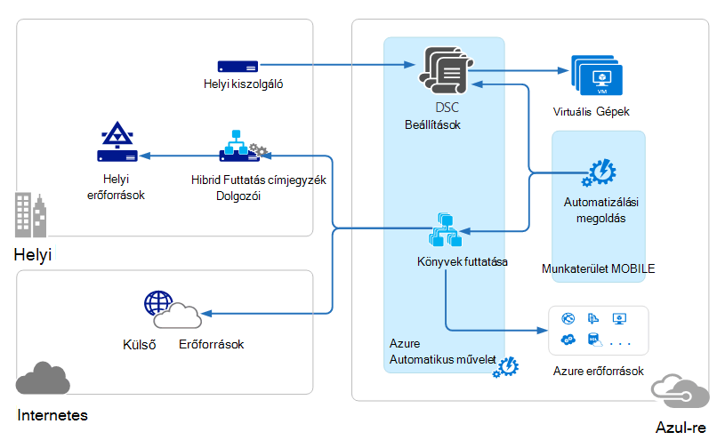
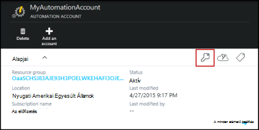
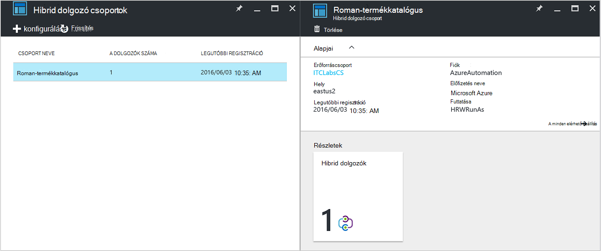
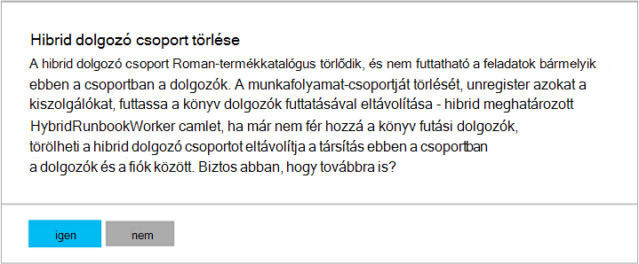

<properties
   pageTitle="Azure automatizálási hibrid Runbook dolgozók |} Microsoft Azure"
   description="Ez a cikk információt nyújt telepítésével és használatával, amely jellemzi Azure automatizálási, amely lehetővé teszi a helyi adatok központban gépeken runbooks futtatásához a hibrid Runbook dolgozó."
   services="automation"
   documentationCenter=""
   authors="mgoedtel"
   manager="jwhit"
   editor="tysonn" />
<tags
   ms.service="automation"
   ms.devlang="na"
   ms.topic="article"
   ms.tgt_pltfrm="na"
   ms.workload="infrastructure-services"
   ms.date="10/14/2016"
   ms.author="bwren" />

# Azure automatizálást hibrid Runbook dolgozók

Az Azure automatizálás Runbooks nem tud hozzáférni a erőforrásokat a helyi adatok központban, mivel az Azure felhőben futnak.  A hibrid Runbook dolgozó Azure automatizálás funkcióval annak érdekében, hogy a helyi erőforrások kezelése az Adatközpont található gépeken runbooks futtatásához. A runbooks tárolt és Azure automatizálás felügyelt és egy vagy több helyszíni gépek majd kézbesítve.  

Ez a funkció az alábbi képen az szemlélteti.   

A használni kívánt hibrid Runbook dolgozó és Azure automatizálási runbooks lebonyolítása az Adatközpont is kijelölhet egy vagy több számítógépre.  Minden egyes dolgozó Microsoft műveletek Management csomagja és Azure automatizálást runbook környezetre kapcsolatot a Microsoft Management Agent szükséges.  Tevékenységek kezelése csomagja csak akkor szeretné telepíteni és kezelése az adatkezelési ügynök, valamint figyelheti a a funkciók a dolgozó használatos.  Azure automatizálási runbooks és a utasítás mutassa meg a kézbesítés hajtja végre.

Nincsenek a hibrid Runbook dolgozók támogatási bejövő tűzfal követelmények. A helyi számítógépen agent kezdeményez minden kommunikációs Azure automatizálási a felhőben. Ha egy runbook indítják, a Azure automatizálási ügynök foghat utasítást hoz létre. A agent majd gyűjti össze a runbook és a paramétereket lefelé futtatása előtt.  Azt is beolvashatja az esetleg a runbook az Azure automatizálási által használt [eszközök](http://msdn.microsoft.com/library/dn939988.aspx) .

>[AZURE.NOTE] Hibrid Runbook dolgozók jelenleg nem támogatja [A DSC konfigurációk](automation-dsc-overview.md).

## Hibrid Runbook dolgozó csoportok

Minden egyes hibrid Runbook dolgozói a ügynök telepítésekor megadott hibrid Runbook dolgozó csoport tagja.  Csoport egy képviselő is tartalmazhat, de több ügynökök telepítheti csoport magas elérhetőség.

Amikor egy runbook egy hibrid Runbook dolgozó kezd, adja meg a csoportot, amelyhez fog futni.  A csoport tagjainak meghatározza, hogy melyik dolgozó szolgálja a kérést.  Egy adott dolgozó nem adhat meg.

## Hibrid Runbook dolgozó vonatkozó követelmények

Legalább egy helyszíni számítógép futtatásához hibrid runbook feladatokat ki kell jelölnie.  Ezen a számítógépen kell rendelkeznie a következőket:

- A Windows Server 2012 vagy újabb verzió
- A Windows PowerShell 4.0-s vagy újabb verzió
- Legalább két magmintákat és 4 GB RAM

Vegye figyelembe az alábbi javaslatokat hibrid dolgozók számára: 

- Minden csoport magas elérhetőség több hibrid dolgozó kijelöli.  
- Hibrid dolgozók szolgáltatás felügyeleti automatizálási vagy System Center Orchestrator runbook kiszolgálókkal is megtalálhatók.
- Fontolja meg egy olyan számítógépen, vagy annak közelében automatizálási fiókja régiója fizikailag található óta a feladat befejezésekor a feladat adatokat küldi vissza az Azure automatizálási.

>[AZURE.NOTE] Hibrid Runbook dolgozó verzió 7.2.11136.0 jelenleg csak a PowerShell-parancsfájlokat proxykiszolgálón keresztüli kommunikáció támogatja.  Munkafolyamat PowerShell-parancsfájlokat támogatása elérhetők az elkövetkező kiadásokban.  

### A proxykiszolgáló és a tűzfal beállításainak konfigurálása

A helyszíni hibrid Runbook dolgozó való kapcsolódáshoz és regisztrálhatja a Microsoft műveletek Management csomagja (MOBILE) szolgáltatással azt a portszámot, és az alábbi URL-címek hozzáféréssel kell rendelkeznie.  Ez a mellett a [portokat és a Microsoft figyelése Agent szükséges URL-címek](../log-analytics/log-analytics-proxy-firewall.md#configure-proxy-and-firewall-settings-with-the-microsoft-monitoring-agent) , MOBILE csatlakozni. Ha a agent és a MOBILE szolgáltatás közötti kommunikáció proxykiszolgálót használ, kell érhetők el, hogy a megfelelő erőforrások biztosítására. Ha tűzfalat használva korlátozhatja a hozzáférést az interneten, állítsa be a tűzfalat, hogy engedélyezze a hozzáférést szeretne. 

Az alábbi információk felsorolása a portszámot és az URL-ek a hibrid Runbook dolgozó kommunikáció automatizálási szükséges.

- Port: Csak a TCP 443-as szükség a kimenő internetkapcsolat
- Globális URL-címe: *.azure-automation.net

Ha adott terület definiált automatizálási fiókkal rendelkezik, és szeretné korlátozni, hogy regionális adatközponthoz való kommunikáció, a következő táblázat a DNS-rekord az egyes régiókra vonatkozó.

|**Régió**|**DNS-rekord**|
|--------------|--------------|
|A központi Dél-Amerikai Egyesült Államok|scus-jobruntimedata-termékkatalógus-su1.azure-automation.net|
|Kelet-amerikai 2|eus2-jobruntimedata-termékkatalógus-su1.azure-automation.net|
|Nyugati Európa|a Microsoft-jobruntimedata-termékkatalógus-su1.azure-automation.net|
|Észak-Európa|Ne-jobruntimedata-termékkatalógus-su1.azure-automation.net|
|Közép Kanadán|másolatot kap – jobruntimedata-termékkatalógus-su1.azure-automation.net|
|Dél-kelet-ázsiai|tengeri-jobruntimedata-termékkatalógus-su1.azure-automation.net|
|A központi India|CID-jobruntimedata-termékkatalógus-su1.azure-automation.net|
|Japán keleti|jpe-jobruntimedata-termékkatalógus-su1.azure-automation.net|
|Ausztrália Dél kelet|ASE-jobruntimedata-termékkatalógus-su1.azure-automation.net|

## Hibrid Runbook dolgozó telepítése

Az alábbi eljárást telepítse és állítsa be a hibrid Runbook dolgozó ismerteti.  Automatizálási környezetben egyszer végezze el az első két lépést, és ismételje a hátralévő lépéseket minden dolgozó számítógépen.

### 1. a tevékenységek kezelése csomagja-munkaterület létrehozása

Ha nem már rendelkezik egy műveletek Management csomagja munkaterület, majd hozzon létre egyet utasításokat használatával [állítsa be a munkaterületet](https://technet.microsoft.com/library/mt484119.aspx). Ha már van egy meglévő munkaterülethez használhatja.

### 2. automatizálási megoldás felvétele a tevékenységek kezelése csomagja munkaterületre

Megoldások funkciók hozzáadása a tevékenységek kezelése programcsomagban.  Az automatizálási megoldás hibrid Runbook dolgozó támogatással Azure automatizálási szolgáltatásai ad.  A megoldás a munkaterületre való hozzáadásakor azt fog automatikusan lenyomja dolgozó összetevőinek a ügynök számítógépre telepített lesz a következő lépésben.

Kövesse az utasításokat a [megoldástárban használatával megoldást hozzáadása](../log-analytics/log-analytics-add-solutions.md) az **automatizálási** megoldás hozzáadása a műveletek Management csomagja munkaterület.

### 3. Telepítse a Microsoft Agent figyelése

A Microsoft figyelése Agent számítógépek műveletek Management csomagja csatlakozik.  Amikor a agent telepítése a helyi számítógépen, és kapcsolja a munkaterület, automatikusan letölti hibrid Runbook dolgozó szükséges összetevők.

Kövesse az utasításokat a agent telepítéséhez a helyi számítógépen [napló Analytics való csatlakozás Windows](../log-analytics/log-analytics-windows-agents.md) mögött.  Ezt a folyamatot, több számítógépen több dolgozó hozzáadása a környezet megismétlése

Amikor a agent sikeresen csatlakozott a tevékenységek kezelése programcsomagban, a műveletek Management csomagja **beállításai** ablakban **Csatlakoztatott adatforrásból** lapján megjelenik.  Ellenőrizheti, hogy a agent megfelelően letölti az automatizálási megoldás amikor egy C:\Program Files\Microsoft figyelése Agent\Agent **AzureAutomationFiles** nevű mappát.  A hibrid Runbook dolgozó verziójának megerősítéséhez megkeresheti C:\Program Files\Microsoft figyelése Agent\Agent\AzureAutomation\ és megjegyzés a \\ *verzió* almappában.   

### 4. a runbook környezet telepítése, és csatlakozzon az Azure automatizálási

Ügynökszoftvert műveletek Management csomagja beállításakor a automatizálási megoldást lefelé, amely tartalmazza a **Hozzáadás-HybridRunbookWorker** parancsmag **HybridRegistration** PowerShell-modult verembe küldi.  Ezzel a parancsmaggal a runbook környezet telepítése a számítógépen, és Azure automatizálást regisztrálja segítségével.

Nyissa meg a PowerShell-munkamenetet rendszergazdai módban, és futtassa az alábbi parancsokat a modul importálhat.

    cd "C:\Program Files\Microsoft Monitoring Agent\Agent\AzureAutomation\<version>\HybridRegistration"
    Import-Module HybridRegistration.psd1

Futtassa a **Hozzáadás-HybridRunbookWorker** parancsmagot a következő szintaxissal:

    Add-HybridRunbookWorker –Name <String> -EndPoint <Url> -Token <String>

Az ezzel a parancsmaggal a az Azure-portálon **Kulcsok kezelése** lap a szükséges információ elérheti.  Ez a lap megnyitásához kattintson a kulcs ikon az automatizálási fiók elemek lapján.

- **A nevem a hibrid Runbook dolgozó csoport nevét.** Ha a csoport már létezik automatizálást fiók, majd az aktuális számítógép bekerül azt.  Ha még nem létezik, majd a program felveszi.
- **Végpont** a **Kulcsok kezelése** lap **URL-cím** mezőjében.
- **Jogkivonat** a **Kulcsok kezelése** lap az **Access elsődlegeskulcs** .  

Használja a **-részletes** **Hozzáadása-HybridRunbookWorker** kaphat a telepítés részletes információt a váltás.

### 5. PowerShell-modul telepítése

Runbooks által látható tevékenységek és a modulokat az automatizálási Azure környezetben van telepítve a definiált parancsmagok bármelyike használható.  Ezeket a modulokat nem automatikusan telepítik helyszíni számítógépre azonban kell manuálisan telepíteni.  A kivétel ez alól a Azure modul, amely hozzáférhetővé tenné parancsmagok Azure szolgáltatásokat és a tevékenységek az Azure automatizálási alapértelmezés szerint telepítve van.

A hibrid Runbook dolgozó szolgáltatás elsődleges célja, hogy a helyi erőforrások kezelése, mivel, valószínűleg telepíteni kell a modulokat, amely támogatja az alábbi forrásokból.  Akkor is hivatkozhat [Modul telepítése](http://msdn.microsoft.com/library/dd878350.aspx) további információt a Windows PowerShell-modulok telepítéséről.

## Hibrid Runbook dolgozó eltávolítása

Egy vagy több hibrid Runbook dolgozók eltávolítása egy csoportból, vagy eltávolíthatja a csoport attól függően, hogy az igényeknek megfelelően alakíthatja.  Ha el szeretne távolítani egy hibrid Runbook dolgozó egy helyi számítógép, nyissa meg a PowerShell-munkamenetet rendszergazdai módban, és futtassa a következő parancs - **Eltávolítása-HybridRunbookWorker** parancsmagot.  Használja a **-részletes** átváltani az részletes naplója az eltávolítást. 

A Microsoft figyelése Agent nincs eltávolítása a számítógépről, csak a funkciók és konfigurálása a hibrid Runbook dolgozó szerepkört.  

Ha törölni szeretne egy csoportot, először a hibrid Runbook dolgozó eltávolítása az összes olyan számítógépen, amely a korábban bemutatott paranccsal csoport tagjának kell, és ezután hajtsa végre az alábbi lépések elvégzésével távolítsa el a csoportot.  

1. Nyissa meg az automatizálási fiókot az Azure-portálon.
2. A **Hibrid dolgozó csoportok** csempét, és a **Hibrid dolgozó csoportok** lap, jelölje ki a törölni kívánt csoportot.  Miután kiválasztotta az adott csoport, a **hibrid dolgozó csoport** Tulajdonságok lap jelenik meg.     
3. A kijelölt csoport Tulajdonságok lap kattintson a **Törlés**gombra.  Üzenet jelenik meg, ez a művelet megerősítését kéri, és válassza az **Igen lehetőséget** , ha biztos benne, hogy folytatni szeretné.    Vehet igénybe néhány másodpercig befejezéséhez és **értesítések** a meghívási folyamat követheti a menüből.  

## Hibrid Runbook dolgozó runbooks elindítása

Egy runbook létrehozásakor a különböző módszerek [az Azure automatizálás egy Runbook indítása](automation-starting-a-runbook.md) ismerteti.  Hibrid Runbook dolgozó hozzáadása egy **RunOn** lehetőséget, ahol megadhatja a hibrid Runbook dolgozó csoport nevét.  Ha meg van adva egy csoportot, majd a runbook van beolvasott és futtathatja, a dolgozók az adott csoport.  Ha nincs megadva ezt a lehetőséget, majd futás az Azure automatizálás szokásos.

Egy runbook az Azure-portálon indításakor választhat egy **működésbe** beállítás választhatja ki **Azure** vagy **Hibrid dolgozó**.  Ha bejelöli a **Hibrid dolgozói**, majd válassza a csoport legördülő listában.

A következő parancs segítségével indítsa el a próba-Runbook a Windows PowerShell szolgáltatással MyHybridGroup nevű hibrid Runbook dolgozó csoport nevű runbook **RunOn** paraméter használatával.

    Start-AzureRmAutomationRunbook –AutomationAccountName "MyAutomationAccount" –Name "Test-Runbook" -RunOn "MyHybridGroup"

>[AZURE.NOTE] A **Kezdés-AzureAutomationRunbook** parancsmagot a Microsoft Azure PowerShell 0.9.1 verziójában a **RunOn** paramétert hozzá lett adva.  Tegye a következőt: [Töltse le a legújabb verzióját](https://azure.microsoft.com/downloads/) , ha egy korábban telepítve van.  Csak verzióját kell telepítenie a hol, elindítása a runbook a Windows PowerShell munkaállomáson.  Nem kell telepíteni dolgozó számítógépen, kivéve, ha runbooks indítása arról a számítógépről szeretne.  Nem lehet jelenleg kezd egy runbook egy hibrid Runbook dolgozó más runbook óta ehhez a legújabb Azure Powershell automatizálási fiókban telepítésére van szükség.  A legújabb verzióra fog automatikusan frissíti az Azure automatizálás, és automatikusan tolódik a dolgozók hamarosan.

## Runbook engedélyek

[Módszer, amely általában runbooks használatos hitelesítő Azure erőforrásokhoz](automation-configuring.md#configuring-authentication-to-azure-resources) azonos hibrid Runbook dolgozó futó Runbooks nem lehet használni, mert azok érik el erőforrások Azure-Ön kívül.  A runbook vagy adja meg a saját helyi erőforrások hitelesítés, vagy megadhatja, hogy egy felhasználó az összes runbooks ad egy RunAs-fiókkal.

### Runbook hitelesítés

Alapértelmezés szerint runbooks futtatható a helyi rendszerfiók környezetében a helyi számítógépen, meg kell adni a saját hitelesítés információforrások, amelyek lesz hozzáférésük.  

[Hitelesítő](http://msdn.microsoft.com/library/dn940015.aspx) és a [tanúsítvány](http://msdn.microsoft.com/library/dn940013.aspx) eszközök, amelyek lehetővé teszik, hogy adja meg a hitelesítő adatokat, így különböző erőforrásokhoz hitelesítheti parancsmagokat a runbook használhatja.  A következő példa bemutatja egy runbook, hogy a számítógép újraindítása egy részét.  Azt a hitelesítő adatokkal lekéri a hitelesítő adatok eszköz és egy változó eszközből a számítógép nevét, és kattintson a számítógép újraindítása parancsmag használja ezeket az értékeket.

    $Cred = Get-AzureRmAutomationCredential -ResourceGroupName "ResourceGroup01" -Name "MyCredential"
    $Computer = Get-AzureRmAutomationVariable -ResourceGroupName "ResourceGroup01" -Name  "ComputerName"

    Restart-Computer -ComputerName $Computer -Credential $Cred

Is lehetővé teszi, hogy futtassa a kód szövegblokkokat egy másik számítógépen a [PSCredential közös paraméter](http://technet.microsoft.com/library/jj129719.aspx)által megadott hitelesítő adatokkal [InlineScript](automation-powershell-workflow.md#inline-script) is élvezheti.

### RunAs fiók

A saját hitelesítést helyi forrásokat nyújt runbooks bízza egy hibrid dolgozó csoport **RunAs** fiókot is megadhat.  Megadott [hitelesítő adatok eszköz](automation-credentials.md) helyi erőforrások hozzáféréssel rendelkező, és minden runbooks fog futni ezeket a hitelesítő adatokat a csoport hibrid Runbook dolgozó forgalmi.  

A felhasználó nevét a hitelesítő adatok kell lennie a következő formátumokban:

- TARTOMANY\felhasznalonev 
- username@domain
- username (a helyi arra a számítógépre, a helyszíni fiókok)

Az alábbi eljárással adjon meg egy hibrid dolgozó csoport RunAs fiókot:

1. Hozzon létre egy [hitelesítőadat-eszköz](automation-credentials.md) helyi erőforrások elérését.
2. Nyissa meg az automatizálási fiókot az Azure-portálon.
2. A **Hibrid dolgozó csoportok** csempét, és válassza ki a csoportot.
3. Jelölje ki **az összes beállítások ikonra** , majd a **hibrid dolgozó csoportok beállításai**.
4. Módosíthatja **futtassa** az **alapértelmezett** **Custom**.
5. Jelölje be a hitelesítő adatait, és kattintson a **Mentés**gombra.

## Hibrid Runbook dolgozó runbooks létrehozása

Nincs különbség az Azure automatizálási és azok a hibrid Runbook dolgozó futó futó runbooks felépítésének nem. Az összes használt Runbooks fog valószínűleg szignifikánsan bár óta hibrid Runbook dolgozó runbooks általában kezelése az Adatközpont helyi erőforrások közben az Azure automatizálás runbooks általában erőforrások Azure a felhőben. 

Egy runbook hibrid Runbook dolgozó az Azure automatizálást szerkesztheti, de nehézségei lehet, ha megpróbál a runbook tesztelje a szerkesztő.  A PowerShell-modulok, melyhez hozzáféréssel a helyi erőforrások valószínűleg nincs telepítve az Azure automatizálást környezetben ebben az esetben, a teszt sikertelen volt.  Ha a szükséges modulokat, a runbook futtassa, de nem lesznek helyi erőforrások teljes vizsgálat elérheti.

## A hibrid Runbook dolgozó runbooks – hibaelhárítás

[Runbook kimeneti és az üzenetek](automation-runbook-output-and-messages.md) fogadására Azure automatizálási a hibrid runbook feladatok hasonlóan a dolgozók futtassa a felhőben.  Is engedélyezheti a részletes és előrehaladását adatfolyamok más runbooks ugyanúgy ugyanúgy.  

Minden egyes hibrid dolgozó C:\ProgramData\Microsoft\System Center\Orchestrator\7.2\SMA\Sandboxes a naplók helyileg vannak tárolva.

Ha a runbooks nem completeing sikeresen és a projekt összefoglaló állapotjelzője **Felfüggesztve**, olvassa el a hibakeresési témakört [hibrid Runbook dolgozó: felfüggesztett állapotban megszakítja A runbook feladat](automation-troubleshooting-hrw-runbook-terminates-suspended.md).   

## A szolgáltatás felügyeleti automatizálást kapcsolat

[Szolgáltatás felügyeleti automatizálási (SMA)](https://technet.microsoft.com/library/dn469260.aspx) lehetővé teszi, hogy az azonos runbooks Azure automatizálási a helyi adatok központban által támogatott futtatását. SMA általában telepítve van együtt a Windows Azure csomag, mint a Windows Azure-csomag tartalmazza a grafikus felületen SMA kezelésére. Azure automatizálás, ellentétben SMA szükséges egy helyi telepítési, amely tartalmazza a webkiszolgálón tárolni az API-val, runbooks és SMA konfigurációs adatbázis, és Runbook dolgozók runbook feladatokat végrehajtani. Azure automatizálási ezeket a szolgáltatásokat, a felhőben, és csak igényel meg szeretné őrizni a hibrid Runbook dolgozók a helyi környezetben.

Ha egy meglévő SMA felhasználót, áthelyezheti a runbooks használni a hibrid Runbook dolgozó módosítás nélkül, a feltételezve, hogy azok a saját hitelesítéshez erőforrások, mint ismertetett [hibrid Runbook dolgozó runbooks létrehozása](#creating-runbooks-for-hybrid-runbook-worker)az Azure automatizálás.  A SMA Runbooks amelyek, hogy a runbooks hitelesítés dolgozó kiszolgálón futó a szolgáltatásfiók környezetében.

Az alábbi feltételek segítségével megállapítható, hogy jobban megfelel az igényeinek megfelelően-e Azure automatizálást hibrid Runbook dolgozó vagy szolgáltatás felügyeleti automatizálást.

- SMA egy helyi telepíteni kell az alapul szolgáló összetevői, amely a Windows Azure csomag csatlakozik a grafikus kezelőfelület szükségessége esetén. További helyi erőforrások az Azure automatizálást, amely csak a helyi runbook dolgozók telepített ügynökszoftvert szükséges-nál nagyobb a karbantartási költségek lesz szükség. Adatkezelési műveletek csomagot, további csökkenő a karbantartási költségek az ügynökök kezeli.
- Azure automatizálási annak runbooks tárolja a felhőben, és továbbítja azokat a helyszíni hibrid Runbook dolgozók számára. Ha a Yammer biztonsági házirendje nem teszi lehetővé a jelenség, akkor SMA kell használni.
- SMA megtalálható a System Center; és így a System Center 2012 R2 licencre van szükség. Azure automatizálási van többszintű előfizetés modellek alapján.
- Azure automatizálási speciális funkciókat, amelyek nem érhetők el a SMA grafikus runbooks például.

## Következő lépések

- További tudnivalók a runbook indításához használható különböző módszerek című témakörben talál [egy Runbook az Azure automatizálás indítása](automation-starting-a-runbook.md)
- A szöveges szerkesztőben Azure automatizálás PowerShell és a PowerShell munkafolyamat runbooks használata különböző műveleteket, című cikkben talál részletes [egy Runbook az Azure automatizálás szerkesztése](automation-edit-textual-runbook.md)

 
