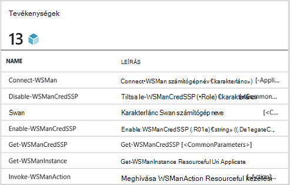
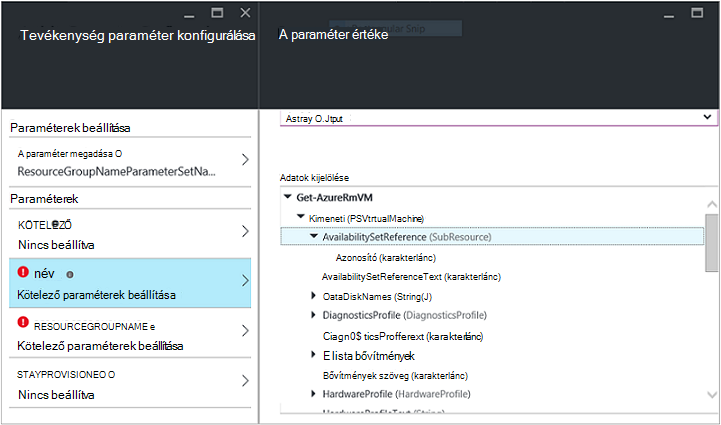
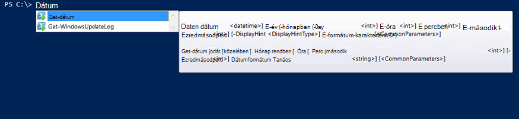

<properties
   pageTitle="Hozzon létre egy Azure automatizálást integráció modult |} Microsoft Azure"
   description="Oktatóanyag, amely végigvezeti az Azure automatizálás integrációs modulok létrehozási, tesztelése és példa-e."
   services="automation"
   documentationCenter=""
   authors="mgoedtel"
   manager="jwhit"
   editor="" />

<tags
   ms.service="automation"
   ms.workload="tbd"
   ms.tgt_pltfrm="na"
   ms.devlang="na"
   ms.topic="get-started-article"
   ms.date="09/12/2016"
   ms.author="magoedte" />

# <a name="azure-automation-integration-modules"></a>Azure automatizálási integrációs modulok

A PowerShell az Azure automatizálási mögött alapvető technológiát. Mivel az Azure automatizálási PowerShell épül, PowerShell-modulok kulcsfontosságúak a bővítési Azure automatizálás. Ez a cikk azt végigvezeti Önt részletei határozzák meg, PowerShell-modulok "Integrációs modulok" és a gyakorlati tanácsok a saját PowerShell-modulok létrehozásához, hogy működnek, mint Azure automatizálási integrációs moduljainak említett Azure automatizálási használatát. 

## <a name="what-is-a-powershell-module"></a>Mi az, hogy egy PowerShell-modult?

A **Get-dátum** vagy az **Elem másolása**a PowerShell konzol parancsfájlok, munkafolyamatok, runbooks és PowerShell DSC erőforrások, mint a WindowsFeature vagy a fájlnévre, a PowerShell DSC konfigurációk használható használható például PowerShell-parancsmagok csoport, akkor egy PowerShell-modult. Összes funkció PowerShell-parancsmagok és DSC erőforrások keresztül elérhetővé tett, és minden parancsmag/DSC erőforrás egy PowerShell-modult mögött számos, amely kiszállítása a PowerShell magát. Például a **Get-dátum** parancsmag része a Microsoft.PowerShell.Utility PowerShell-modult, és **Elem másolása** parancsmag része a Microsoft.PowerShell.Management PowerShell-modult, és a csomag DSC erőforrás a PSDesiredStateConfiguration PowerShell-modult része. A következő modulok kiszállítása a szolgáltatást a PowerShell használatával. De sok PowerShell-modult nem PowerShell részét képezi, és helyette osztják első vagy harmadik fél termékekkel, például a System Center 2012 Configuration Manager vagy a helyek funkciót, például a PowerShell-gyűjtemény a nagy PowerShell közösségi.  A modulokat hasznosak, mert azok összetett feladatok egyszerűbbé teszik beágyazott funkció révén.  További információ a [PowerShell-modulok MSDN webhelyen](https://msdn.microsoft.com/library/dd878324%28v=vs.85%29.aspx)talál. 

## <a name="what-is-an-azure-automation-integration-module"></a>Mi az az Azure automatizálási integrációs modul?

-Integráció a modul nem egy PowerShell-modult lényegesen eltér. Az egyszerűen egy PowerShell-modult tetszés szerint egy további fájl – adja meg a megfelelő Azure automatizálási kapcsolattípust az runbooks a modul parancsmagokat használandó metaadat-fájlt tartalmazó. Nem kötelező a fájl-e, illetve ezek PowerShell-modulok importálható Azure automatizálási, hogy azok parancsmagok runbooks és azok DSC erőforrások belül használható DSC konfigurációk belül használható. Bepillantás a színfalak mögé Azure automatizálási ezeket a modulokat tárolja, és runbook feladat és DSC compiliation feladat-végrehajtási idő betölti az Azure automatizálási homokszóró, ahol runbooks kell végrehajtani, és DSC konfigurációk összeállítása a őket.  DSC modulokat az erőforrások is automatikusan kerülnek, a kiszolgálón automatizálási DSC ki, hogy az alkalmazása DSC konfigurációk próbál gépek lekért kell azokat.  Számos Azure PowerShell-modult azt kiszállítása a beépített az Azure automatizálás szeretne használni, így azonnal automatizálása Azure management kezdéshez, de egyszerűen importálhatja a PowerShell-modulok bármilyen rendszer, szolgáltatás vagy integráció a kívánt eszközt. 

>[AZURE.NOTE] Bizonyos modulok szállítása mint "globális modulok" az automatizálási szolgáltatásban. Ezeket a globális modulokat érhetők el, amely automatikusan továbbítja azokat automatizálási fiókjára beépített automatizálási fiók létrehozása, és előfordul, hogy azt frissíteni őket. Ha szeretné automatikus frissítése nem szeretné, mindig importálhatja ugyanabban a modulban saját magát, és, amely elsőbbséget élveznek a globális modul verzióját, hogy a modul, amely azt a szolgáltatást a szállítási. 

A-integráció a modul csomag fog importálni formátuma tömörített fájl neve megegyezik a modul és .zip kiterjesztése az. A Windows PowerShell-modult, és bármelyik segédfájlok, beleértve a nyilvánvalóan fájl (.psd1), ha rendelkezik a modul tartalmaz.

Megadhatja, hogy a modul tartalmazza az Azure automatizálási kapcsolat típusa, is kell tartalmaznia az nevű fájl *<ModuleName>*-Automation.json, amely meghatározza a kapcsolat típusú tulajdonságait. Ez a modul mappát a tömörített .zip fájl mutatnia json fájl, és tartalmazza azokat a mezőket a "kapcsolat" szükséges, a rendszer vagy a szolgáltatást a modult jelöli. Ez a kapcsolat típusú létrehozása az Azure automatizálás felfelé véget ér. Fájltípusok: Ezzel a fájllal, beállíthatja, hogy a mezőnevek használatával, és hogy a mezők kell a titkosított és / vagy nem kötelező, a kapcsolat típusának a modul. Az alábbiakban látható egy sablont, a json formátumban:

```
{ 
   "ConnectionFields": [
   {
      "IsEncrypted":  false,
      "IsOptional":  false,
      "Name":  "ComputerName",
      "TypeName":  "System.String"
   },
   {
      "IsEncrypted":  false,
      "IsOptional":  true,
      "Name":  "Username",
      "TypeName":  "System.String"
   },
   {
      "IsEncrypted":  true,
      "IsOptional":  false,
      "Name":  "Password",
   "TypeName":  "System.String"
   }],
   "ConnectionTypeName":  "DataProtectionManager",
   "IntegrationModuleName":  "DataProtectionManager"
}
```

Ha telepítette a szolgáltatás felügyeleti automatizálási és hozta létre az automatizálási runbooks integrációs modulok csomagját, ezt kell kinéznie nagyon ismerősnek Önnek. 


## <a name="authoring-best-practices"></a>Ajánlott eljárások létrehozása

Pusztán azért, mert a integrációs modulok lényegében PowerShell-modulok, amely nem jelenti, hogy nem rendelkezik egy sor olyan eljárások megalkotása a szerzői őket. Továbbra is az a szám, azt javasoljuk, hogy a leghatékonyabbak, az Azure automatizálás érdemes egy PowerShell-modult munka közben dolgot. Ezek közül néhány a Azure automatizálást adott, és egy részüket hasznosak legyen a modulok PowerShell munkafolyamat függetlenül automatizálást használ-e a jól működik. 

1. Egy összegzést, leírás, hozzáadni, majd a modul minden parancsmag URI súgóját. A PowerShell meghatározhatja engedélyezése fogadásához segítségre van szüksége a őket a **Segítség** parancsmag a a felhasználó-parancsmagok az egyes súgóinformációt. Ha például az alábbiakban hogyan egy összegzést definiálása és URI súgóját egy PowerShell-modult .psm1 fájl nyelven íródott.<br>  

    ```
    <#
        .SYNOPSIS
         Gets all outgoing phone numbers for this Twilio account 
    #>
    function Get-TwilioPhoneNumbers {
    [CmdletBinding(DefaultParameterSetName='SpecifyConnectionFields', `
    HelpUri='http://www.twilio.com/docs/api/rest/outgoing-caller-ids')]
    param(
       [Parameter(ParameterSetName='SpecifyConnectionFields', Mandatory=$true)]
       [ValidateNotNullOrEmpty()]
       [string]
       $AccountSid,

       [Parameter(ParameterSetName='SpecifyConnectionFields', Mandatory=$true)]
       [ValidateNotNullOrEmpty()]
       [string]
       $AuthToken,

       [Parameter(ParameterSetName='UseConnectionObject', Mandatory=$true)]
       [ValidateNotNullOrEmpty()]
       [Hashtable]
       $Connection
    )

    $cred = CreateTwilioCredential -Connection $Connection -AccountSid $AccountSid -AuthToken $AuthToken

    $uri = "$TWILIO_BASE_URL/Accounts/" + $cred.UserName + "/IncomingPhoneNumbers"
    
    $response = Invoke-RestMethod -Method Get -Uri $uri -Credential $cred

    $response.TwilioResponse.IncomingPhoneNumbers.IncomingPhoneNumber
    }
    ```
<br> 
Ez az információ csak nem jelennek meg a Súgó a **Get-Help** parancsmaggal a PowerShell konzolban, nyújtó azt is fedheti fel a Súgó funkció belül Azure automatizálás, például amikor tevékenységeket beszúrása runbook létrehozása során. Kattintás a "Megtekintheti a részletes segítségnyújtásra" a Súgó URI megnyílik a böngésző Azure automatizálási eléréséhez használ egy másik fülre.<br>
2. Ha a távoli rendszer fut a modul egy. Tartalmaznia kell egy integrációs modul metaadatok fájlt, amely definiálja csatlakozás távoli rendszer, ami azt jelenti, a kapcsolat típusának szükséges adatokat. b. Minden egyes parancsmagot a modul látnia kell állapotba paraméterként kapcsolat objektum (egy adott kapcsolattípus példányának).  
    A modul parancsmagok könnyebben használható az Azure automatizálás, ha engedélyezi a kapcsolat típusú mezőkkel rendelkező objektum átadása paraméterként parancsmag válnak. A felhasználók nem kell minden alkalommal, amikor meghívják parancsmag megfeleltetése határozza meg a kapcsolat eszköz a parancsmag megfelelő paramétereknek. A fenti példa runbook alapján, használja a Twilio kapcsolat eszköz CorpTwilio nevű Twilio eléréséhez, és lépjen vissza a telefonszámok fiók.  Figyelje meg, hogyan azt hozzárendeli a mezőket a kapcsolat határozza meg a parancsmag?<br>

    ```
    workflow Get-CorpTwilioPhones
    {
      $CorpTwilio = Get-AutomationConnection -Name 'CorpTwilio'
    
      Get-TwilioPhoneNumbers 
        -AccountSid $CorpTwilio.AccountSid  
        -AuthToken $CorptTwilio.AuthToken
    }
    ```
<br>
Megközelíthető Ez egy egyszerűbbé és jobban módja van közvetlenül átadása a kapcsolat objektum - parancsmag

    ```
    workflow Get-CorpTwilioPhones
    {
      $CorpTwilio = Get-AutomationConnection -Name 'CorpTwilio'

      Get-TwilioPhoneNumbers -Connection $CorpTwilio
    }
    ```
<br>
Engedélyezheti a működésmódot jelennek meg a parancsmagok azáltal, fogadja el a kapcsolati objektum közvetlenül paraméterként, csak a kapcsolat mezők paraméterekkel helyett. Általában érdemes paraméter minden egyes, beállítása, hogy a felhasználó nem használja az Azure automatizálási felhívhatja a parancsmagok megépítése egy hashtable használni kívánt a kapcsolat objektum nélkül. Paraméter megadása az alábbi **SpecifyConnectionFields** adják át a kapcsolat tulajdonságai egyesével szolgál. A kapcsolat egyenes keresztül adják át **UseConnectionObject** segítségével. Amint látható, a Küldés-TwilioSMS parancsmagot a [Twilio PowerShell-modult](https://gallery.technet.microsoft.com/scriptcenter/Twilio-PowerShell-Module-8a8bfef8) lehetővé teszi, hogy mindkét módon áthaladó: 

    ```
    function Send-TwilioSMS {
      [CmdletBinding(DefaultParameterSetName='SpecifyConnectionFields', `
      HelpUri='http://www.twilio.com/docs/api/rest/sending-sms')]
      param(
         [Parameter(ParameterSetName='SpecifyConnectionFields', Mandatory=$true)]
         [ValidateNotNullOrEmpty()]
         [string]
         $AccountSid,

         [Parameter(ParameterSetName='SpecifyConnectionFields', Mandatory=$true)]
         [ValidateNotNullOrEmpty()]
         [string]
         $AuthToken,

         [Parameter(ParameterSetName='UseConnectionObject', Mandatory=$true)]
         [ValidateNotNullOrEmpty()]
         [Hashtable]
         $Connection

       )
    }
    ```
<br>
3. Adja meg az összes parancsmagok kimeneti típusát a modul. Egy kimenet típusú parancsmag definiálása lehetővé teszi, hogy a tervezéskor IntelliSense, hogy a parancsmaggal használható létrehozása során kimeneti tulajdonságainak. Érdemes különösen hasznosak lehetnek automatizálási runbook grafikus szerzői, hol a tervezés idő Tudásbázis a billentyű lenyomásával a modul egy egyszerű kezelőfelület során.<br> <br> Hasonlít az "írja be a következő" funkció a parancsmag kimenete a PowerShell ISE anélkül, hogy futtatni.<br> <br>
4. A modul parancsmagok nem kell vennie összetett objektumtípusok paraméterekkel. A PowerShell munkafolyamat eltér a PowerShell, annak, hogy tárolja az összetett típusú deszerializált formában. Egyszerű típusokhoz primitívek marad, de az összetett típusú alakulnak át, a deszerializált verziók, amelyek lényegében tulajdonságcsomaghoz. Ha például a **Get-Process** parancsmag egy runbook (vagy ezt a témát PowerShell munkafolyamatok) használata esetén azt adja vissza típusú [Deserialized.System.Diagnostic.Process], nem a várt [System.Diagnostic.Process] típusú objektum. Típus van azonos tulajdonságok nem deszerializálni típusa, de módszerek egyikével sem. És próbál át ezt az értéket paraméterként parancsmag, ahol a parancsmagnak ehhez a paraméterhez [System.Diagnostic.Process] érték, ha az alábbi hibaüzenet fog: *nem lehet feldolgozni azokat a paraméter "folyamat" argumentum átalakítása. Hiba: "a"System.Diagnostics.Process (CcmExec)"típusú érték"Deserialized.System.Diagnostics.Process"írja be a"System.Diagnostics.Process"nem alakíthatók.*   Ennek oka az, a várt [System.Diagnostic.Process], és az adott [Deserialized.System.Diagnostic.Process]-típus közötti típus nem egyezik. A probléma megoldásához módja annak biztosítására, a parancsmagok a modul nem összetett típusú paraméterekkel. Az alábbiakban a megfelelő úgy teheti meg.

    ```
    function Get-ProcessDescription {
      param (
            [System.Diagnostic.Process] $process
      )
      $process.Description
    }
    ``` 
<br>
És véve egy egyszerű használható belső parancsmag által ragadja meg az összetett objektumra, és használni szeretné a megfelelő módja. Parancsmagok végrehajtása a PowerShell környezetében, mivel a PowerShell munkafolyamat-nem, a parancsmag $process belül a megfelelő típusú [System.Diagnostic.Process] válik.  

    ```
    function Get-ProcessDescription {
      param (
            [String] $processName
      )
      $process = Get-Process -Name $processName

      $process.Description
    }
    ```
<br>
Kapcsolat eszközök runbooks hashtables, amelyek összetett típusú, és még a következő hashtables úgy tűnik, átadandó parancsmagjai be tudja azok – adatkapcsolat paramétere tökéletesen, nincs cast kivétellel. Néhány PowerShell-típusok értelemben, képesek deszerializált formájukban azok szerializált űrlapról megfelelően típusra, és így továbbíthatók parancsmagok be a nem deszerializált típusú elfogadása paraméterekkel. Hashtable az alábbiak egyike. Lehetséges, hogy egy modul Szerző definiált típusok oly módon, hogy azok is megfelelően deszerializálni, valamint kell végrehajtani, de néhány kompromisszumok, hogy. A típus alapértelmezett konstruktora van, az összes nyilvános tulajdonságait, és egy PSTypeConverter kell. Azonban nem rendelkezik a modul Szerző már definiált típusnál nincs mód "javítás" őket, így a javaslatot, hogy az összes együttesen paramétereknél összetett típusú elkerülése érdekében. Szerzői Runbook tipp: néhány ok a parancsmagok kell vennie egy összetett típusú paramétert, vagy valaki más modul, amely egy összetett típusú paramétert igényel használja, a megoldáshoz PowerShell munkafolyamat runbooks és a helyi PowerShellben, PowerShel munkafolyamatok esetén úgy veheti körül a létrehozza az összetett típust, valamint az összetett típust az ugyanarra a műveletre InlineScript fogyasztása parancsmag parancsmag. InlineScript PowerShell munkafolyamat helyett PowerShell végrehajtja a tartalmát, mivel az összetett típusa előállító parancsmag eredményezne, hogy megfelelő típusú, az deszerializált összetett típust.
5. Végezze el az összes parancsmagok a modul állapot nélküli. Minden parancsmag egy másik munkamenetben az munkafolyamatokban nevű PowerShell munkafolyamat fut. Ez azt jelenti, hogy bármelyik létrehozott / más parancsmagok ugyanabban a modulban módosította a munkamenet-állapot függő parancsmagok nem működik a PowerShell munkafolyamat runbooks.  Íme egy példa Teendők nem.

    ```
    $globalNum = 0
    function Set-GlobalNum {
       param(
           [int] $num
       )
      
       $globalNum = $num
    }
    function Get-GlobalNumTimesTwo {
       $output = $globalNum * 2
     
       $output
    }
    ```
<br>
6. A modul egy Xcopy képes csomag teljesen tartalmazza. Azure automatizálási modulokat osztják az automatizálási homokszóró amikor runbooks kell végrehajtani, mert azok kell a fogadó a futtatott függetlenül működik. Ez azt jelenti, hogy látnia kell zip felveszi a modul csomagot, helyezze át azt bármilyen más host PowerShell megegyező vagy újabb verziójával, és akkor működik, mint normál állomáson, PowerShell környezetbe importálásakor. Ahhoz, hogy fordulhat elő, a modul kell nem függő fájlok kívül a modul mappát (a kap zip be, amikor importálása az Azure automatizálási mappa), vagy bármely egyedi rendszerbeállítások állomáson, például a termék a telepített által meghatározott. Ajánlott eljárás nem követik, ha a modul nem használható az Azure automatizálás.  

## <a name="next-steps"></a>Következő lépések

- Első lépések a PowerShell munkafolyamat runbooks, lásd: [az első PowerShell munkafolyamat runbook](automation-first-runbook-textual.md)
- PowerShell-modulok létrehozásával kapcsolatos további tudnivalókért lásd: a [Windows PowerShell-modult írása](https://msdn.microsoft.com/library/dd878310%28v=vs.85%29.aspx)