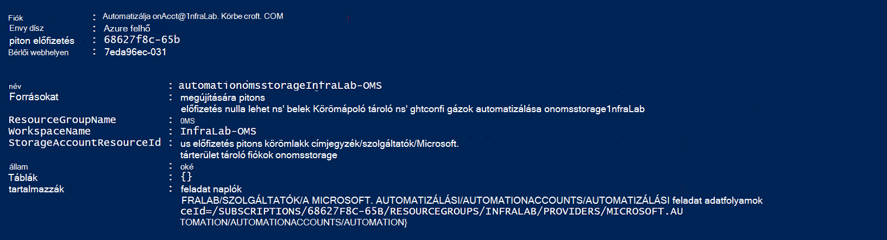

<properties
    pageTitle="Előre feladat állapotát és a feladat adatfolyamok automatizálási napló-elemző (MOBILE) |} Microsoft Azure"
    description="Ez a cikk bemutatja, hogyan küldhet el feladat állapotát és runbook feladat adatfolyamok Microsoft műveletek Management csomagja napló Analytics további betekintést ad és kezelése."
    services="automation"
    documentationCenter=""
    authors="MGoedtel"
    manager="jwhit"
    editor="tysonn" />
<tags
    ms.service="automation"
    ms.devlang="na"
    ms.topic="article"
    ms.tgt_pltfrm="na"
    ms.workload="infrastructure-services"
    ms.date="09/22/2016"
    ms.author="magoedte" />

# Előre feladat állapotát és a feladat adatfolyamok automatizálást napló-elemző (MOBILE)

Automatizálási elküldheti runbook feladat állapotát és a feladat adatfolyam megjelenítését a Microsoft műveletek Management csomagja (MOBILE) napló Analytics-munkaterületre.  Ezt az információt az Azure-portálon vagy megjeleníthet PowerShell egyes feladatállapot vagy egy adott automatizálási fiókhoz tartozó összes feladatot, miközben a működési követelmények támogatására speciális bármi szükséges hozhat létre egyéni PowerShell-parancsfájlokat.  Most már napló Anaytics van lehetősége:

- Első betekintést az automatizálási feladatokhoz 
- Az eseményindító egy e-mailbe vagy értesítés alapján a runbook feladat állapotát (például nem sikerült vagy felfüggesztett) 
- Speciális lekérdezéseket írni a feladat fogadhassák keresztül 
- Feladatok összehangolására automatizálási fiókok között 
- A korábbi ábrázolása adott idő alatt     

## Előfeltételek és telepítése során megfontolandó kérdések

Indítsa el a naplót Analytics az automatizálási naplók küldése, a következőket kell rendelkeznie:

1. Egy MOBILE-előfizetést. További információkért lásd a [napló Analytics – első lépések](../log-analytics/log-analytics-get-started.md).  

    >[AZURE.NOTE]A MOBILE munkaterület és automatizálási fiókkal kell ahhoz, hogy megfelelően működjön a fenti konfiguráció ugyanabban az Azure előfizetésben. 
  
2. [Azure tárterület-fiókot](../storage/storage-create-storage-account.md).  
   
    >[AZURE.NOTE]A tároló fiók *kell* lennie az ugyanazon régió automatizálást fiókként. 
 
3. Azure PowerShell 1.0.8 verzióval vagy újabb verziót a működési háttérismeretek parancsmagok. Ebben a verzióban, és útmutatást adunk a telepítés tudni megtudhatja, [hogy miként telepítheti, állíthatja Azure PowerShell](../powershell-install-configure.md).
4. Azure diagnosztikai és napló Analytics PowerShell.  Ebben a kiadásban és útmutatást adunk a telepítés kapcsolatos további tudnivalókért olvassa el az [Azure diagnosztikai és a napló Analytics](https://www.powershellgallery.com/packages/AzureDiagnosticsAndLogAnalytics/0.1)című témakört.  
5. Töltse le a [PowerShell gyűjtemény](https://www.powershellgallery.com/packages/Enable-AzureDiagnostics/1.0/DisplayScript) **Enable-AzureDiagnostics.ps1** PowerShell-parancsprogramot. A parancsfájl fog konfigurálni az alábbiakat:
 - Egy tartsa lenyomva az ujját a runbook feladat állapotát és adatfolyam adatokat a megadott feltételeknek automatizálási fiókjához tárterület-fiókkal.
 - Engedélyezze a automatizálási fiókját, hogy tárolja azt a JSON formátumban Azure Blob tároló fiók adatainak gyűjteménye.
 - Állítsa be az adatokat gyűjt a Blob-tároló fiókjából MOBILE napló Analytics.
 - Engedélyezze az automatizálási napló Analytics megoldás a MOBILE munkaterület.   

Az **Enable-AzureDiagnostics.ps1** parancsfájl a végrehajtás során a következő paraméterek szükséges:

- *AutomationAccountName* – az automatizálási fiók neve
- *LogAnalyticsWorkspaceName* – a MOBILE munkaterület neve

Az értékek *AutomationAccountName*megkereséséhez az Azure-portálon jelölje be az automatizálási fiókját az **automatizálási fiók** lap a, **az összes beállításai**elemre.  Az **összes beállítások** lap, a **Fiókbeállítások** csoportban válassza a **Tulajdonságok parancsot**.  Az a **tulajdonságokat** lap Megjegyzés: ezeket az értékeket.  .

## Integráció a napló Analytics beállítása

1. A számítógépen indítsa el a **Windows PowerShell** **a kezdőképernyőn** .  
2. A PowerShell parancssori rendszerhéj nyissa meg azt a mappát, amely tartalmazza a parancsfájl töltötte le, és hajtsa végre, akkor az értékek paramétereinek módosítása *- AutomationAccountName* és *- LogAnalyticsWorkspaceName*.

    >[AZURE.NOTE] Az Azure hitelesítést végezni, akkor hajtsa végre a parancsfájlt után kéri.  Meg **kell** jelentkezzen be egy, az előfizetés Rendszergazdák szerepkör tagja, és az előfizetés közös rendszergazdai fiókkal.   
    
        .\Enable-AzureDiagnostics -AutomationAccountName <NameofAutomationAccount> `
        -LogAnalyticsWorkspaceName <NameofOMSWorkspace> `

3. A parancsfájl futtatása után meg kell jelennie napló Analytics rekordjaihoz körülbelül 30 perc után az új diagnosztikai adatok tárolóhoz íródott.  Ha a rekordok nem érhetők el, miután ez esetben olvassa el a [JSON-fájlok blob-tárolóban lévő](../log-analytics/log-analytics-azure-storage-json.md#troubleshooting-configuration-for-azure-diagnostics-written-to-blob-in-json)hibaelhárítási című.

### Konfigurációjának ellenőrzése

Erősítse meg, hogy a parancsprogram konfigurálva a automatizálást és a MOBILE wokspace sikeresen, hajtsa végre az alábbi lépéseket a PowerShellben.  Mielőtt az ehhez szükséges lépéseket az értékeket a MOBILE munkaterület neve és a erőforráscsoport nevét, az Azure portálról, nyissa meg a napló-elemző (MOBILE) és a napló Analytics (MOBILE) lap megkereséséhez jegyezze fel az értéket az **nevét** és **Erőforráscsoport**.   azt használja az alábbi két érték azt a MOBILE munkaterületen a PowerShell parancsmaggal [Get-AzureRmOperationalInsightsStorageInsight](https://msdn.microsoft.com/library/mt603567.aspx)konfigurációjának ellenőrzése.

1.  Az Azure portálról nyissa meg a tárterület-fiókok és használja az elnevezésük is egységes - *AutomationAccountNameomsstorage*következő tárterület-fiók keresése.  Miután egy runbook feladat befejeződése hamarosan ezután meg kell jelennie két Blob tárolók létre - **háttérismeretek – naplók-joblogs** és **háttérismeretek – naplók-jobstreams**.  

2.  A PowerShell futtassa az alábbi PowerShell-kódot, az értékek **ResourceGroupName** és **WorkspaceName** , amely a másolt vagy korábban feljegyzett paramétereinek módosítása.  

    Bejelentkezés-AzureRmAccount Get-AzureRmSubscription - SubscriptionName "SubscriptionName" |} Set-AzureRmContext Get-AzureRmOperationalInsightsStorageInsight - ResourceGroupName "OMSResourceGroupName" "-munkaterületi"OMSWorkspaceName" 

    Ez ad eredményül a megadott MOBILE munkaterület a tárhely betekintést.  Azt szeretné, erősítse meg a tárhely betekintést azt a korábban megadott automatizálási fiók létezik, és az **állapot** objektum látható egy érték, **az OK gombra**.  .

## Naplóbejegyzések Analytics

Automatizálási két típusú rekordok a MOBILE adattárban hoz létre.

### Feladat naplók

A tulajdonság | Leírás|
----------|----------|
Idő | Dátum és időpont, amikor a runbook feladatot végre.|
resourceId | Adja meg az erőforrás típusa Azure-ban.  Automatizálás, az érték a runbook társított automatizálást fiók.|
operationName | Adja meg az Azure-ban végrehajtott művelet.  Automatizálás, az az érték lesz feladatot.|
resultType | A runbook feladat állapotának.  Lehetséges értékek a következők: -Lépések -Leállítása -Felfüggesztett -Sikertelen -Sikeres|
resultDescription | A feladat runbook eredmény állapota ismerteti.  Lehetséges értékek a következők: -Feladat indítják -Nem sikerült projekt -Feladat végrehajtása|
CorrelationId | A korrelációs azonosító a runbook feladat GUID.|
Kategória | Milyen típusú adatokat besorolása.  Automatizálás, az érték JobLogs.|
RunbookName | A runbook neve.|
JobId | GUID azonosítója a runbook feladatot.|
Hívóazonosító |  A művelet kezdeményezett ki.  Lehetséges értékei a kívánt e-mail címet vagy a rendszer ütemezett feladatokhoz.|

### Feladat adatfolyamok
A tulajdonság | Leírás|
----------|----------|
Idő | Dátum és időpont, amikor a runbook feladatot végre.|
resourceId | Adja meg az erőforrás típusa Azure-ban.  Automatizálás, az érték a runbook társított automatizálást fiók.|
operationName | Adja meg az Azure-ban végrehajtott művelet.  Automatizálás, az az érték lesz feladatot.|
resultType | A runbook feladat állapotának.  Lehetséges értékek a következők: -Esetbejegyzések|
resultDescription | A kimenet adatfolyam a runbook a tartalmazza.|
CorrelationId | A korrelációs azonosító a runbook feladat GUID.|
Kategória | Milyen típusú adatokat besorolása.  Automatizálás, az érték JobStreams.|
RunbookName | A runbook neve.|
JobId | GUID azonosítója a runbook feladatot.|
Hívóazonosító | A művelet kezdeményezett ki.  Lehetséges értékei a kívánt e-mail címet vagy a rendszer ütemezett feladatokhoz.| 
StreamType | A feladat adatfolyam típusát. Lehetséges értékek a következők: -Folyamatban -Kimeneti -Figyelmeztetés -Hiba -Hibakeresési -Részletes|

## A napló Analytics naplózza automatizálási megtekintése 

Most, hogy az automatizálási feladat naplók küldése napló Analytics osztályjegyzetfüzetet lássuk, mit tehet az ezek a naplók MOBILE belül.   

### Küldjön e-mailt, ha runbook feladat meghibásodik vagy felfüggeszti a 

A felső ügyfél egyik arra utasítja, az azt jelenti, hogy küldjön e-mailben vagy egy szöveget, amikor az egy runbook feldolgozás mentésük valamit, amit az.   

Hozzon létre egy szabályt, hogy esetén létrehozásával kell kezdenie napló kereshet az Office.com runbook feladat rekordokat kell elindítani az értesítésre.  Az **értesítés** gomb majd érhetők el, hozzon létre, és állítsa be a szabályt.

1.  A MOBILE áttekintése lapon kattintson a **Log keresés**gombra.
2.  Írjon be a következőt a lekérdezésmező az értesítésre vonatkozóan napló keresési lekérdezés létrehozása: `Category=JobLogs (ResultType=Failed || ResultType=Suspended)`.  Is csoportosíthatja a RunbookName által használatával: `Category=JobLogs (ResultType=Failed || ResultType=Suspended) | measure Count() by RunbookName_s`.   
  
    Ha állított be naplók egynél több automatizálást fiókja vagy előfizetési a munkaterületre, is lehet csoportosítása az értesítések, az előfizetést vagy automatizálást fiók által érdekli.  Automatizálási fióknév JobLogs keresése a erőforrásmező származhat.  

3.  Kattintson a **figyelmeztető** elemre a lap tetején az **Értesítési szabály hozzáadása** képernyő megnyitásához.  Az értesítés beállítása a beállításokkal kapcsolatos további tudnivalókat lásd a [napló Analytics értesítések](../log-analytics/log-analytics-alerts.md#creating-an-alert-rule).

### Keresse meg az összes feladat, amely hibákkal fejeződött be 

Nemcsak a riasztási alapú elhagyja a hibák, valószínűleg szeretné, hogy mikor runbook feladat volt egy nem lezáró hiba (PowerShell-hiba adatfolyam hoz létre, de nem lezáró hibák nem hiúsul meg a feladatok felfüggesztheti, vagy nem).    

1. A MOBILE portálon kattintson a **Log keresés**gombra.
2. Írja be a lekérdezésmező `Category=JobStreams StreamType_s=Error | measure count() by JobId_g` , és kattintson a **Keresés**gombra.

### Feladat adatfolyamok nézet egy projekt  

Amikor egy projekt hibakeresés alatt, is érdemes hogy vizsgálja meg a projekt adatfolyamok a.  Az alábbi lekérdezés globálisan egyedi azonosítója 2ebd22ea-e05e-4eb9 – 9-es d 76-d73cbd4356e0 egyetlen feladat számára a adatfolyamok jeleníti meg:   

`Category=JobStreams JobId_g="2ebd22ea-e05e-4eb9-9d76-d73cbd4356e0" | sort TimeGenerated | select ResultDescription` 

### Korábbi feladat állapotának megtekintése 

Végezetül érdemes adott idő alatt a korábbi ábrázolásához.  A lekérdezés használatával adott idő alatt a feladatok állapotának kereshet. 

`Category=JobLogs NOT(ResultType="started") | measure Count() by ResultType interval 1day`  
   

## Összefoglalás

Az automatizálási feladat állapotát és adatfolyam adatokat küld a napló Analytics, az automatizálási feladatok, hogy értesítést küldjön, ha a probléma, és jelenítse meg a runbook eredményeket speciális lekérdezésekkel egyéni irányítópultok értesítések beállításával állapotának runbook feladat állapotát, és más kapcsolódó fő jelölők vagy mértékek jobb betekintést kaphat.  Ez segít nagyobb műveleti láthatóság és a cím események gyorsabban.  

## Következő lépések

- Különböző keresési lekérdezések összeállításához, és tekintse át az automatizálási feladat naplók a napló Analytics kapcsolatban további információért lásd: a [napló keresések napló Analytics](../log-analytics/log-analytics-log-searches.md)
- Hogyan hozhat létre, és a kimeneti és hibaüzenetek lekérése runbooks, című cikkben talál részletes [Runbook kimeneti és üzenetek](automation-runbook-output-and-messages.md) 
- További információ a névjegyek runbook végrehajtás módja a Lync-runbook feladatok és egyéb technikai részletek című témakörben talál [egy runbook feladat követése](automation-runbook-execution.md)
- További információ a MOBILE napló analitikai és a webhelycsoport adatforrások című témakörben talál [gyűjteni Azure tároló adatait a napló Analytics – áttekintés](../log-analytics/log-analytics-azure-storage.md)