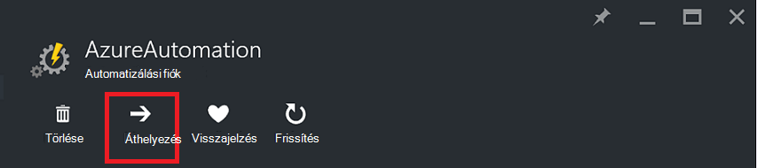
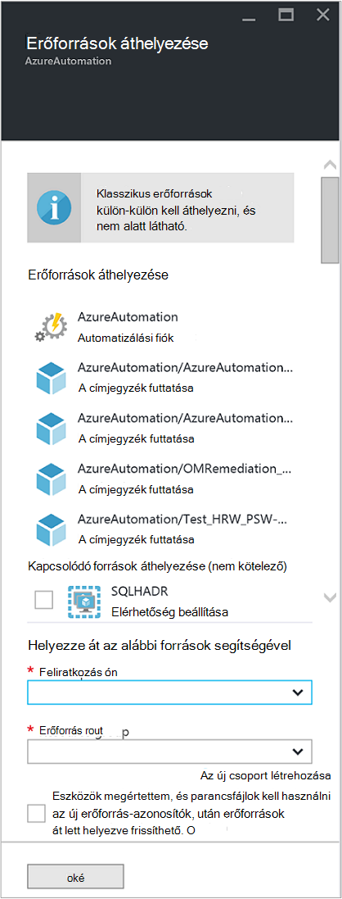

<properties
   pageTitle="Automatizálási fiók és az erőforrások |} Microsoft Azure"
   description="Ez a cikk ismerteti, hogyan szeretne váltani az Azure automatizálási és kapcsolódó erőforrásokat automatizálási fiók egy előfizetés."
   services="automation"
   documentationCenter=""
   authors="MGoedtel"
   manager="jwhit"
   editor="tysonn" />
<tags
   ms.service="automation"
   ms.devlang="na"
   ms.topic="article"
   ms.tgt_pltfrm="na"
   ms.workload="infrastructure-services"
   ms.date="07/07/2016"
   ms.author="magoedte" />

# <a name="migrate-automation-account-and-resources"></a>Automatizálási fiók és a források

Az automatizálási fiókok és a kapcsolódó erőforrásokat (azaz eszközök, runbooks, modulok, stb.), amely az Azure-portálon hozott létre, és át szeretne térni a egy erőforráscsoport vagy egyik előfizetésről a másikra Ez elvégezhető egyszerűen szolgáltatással [áthelyezése erőforrás](../resource-group-move-resources.md) elérhető az Azure-portálon. Azonban ezzel a művelettel a folytatás előtt meg kell először tekintse át a következő [előtt erőforrások áthelyezése a feladatlista](../resource-group-move-resources.md#Checklist-before-moving-resources) , és ezenfelül automatizálási esetén az alábbi listán.   

1.  A cél előfizetés-/ erőforráscsoport forrásaként ugyanazon régió kell lennie.  Ami azt jelenti, automatizálási-fiókok nem lehet áthelyezni területek között.
2.  Erőforrások (pl. runbooks, feladatok, stb.) mozgatásakor mind a forrás és a cél csoport a tevékenység időtartama alatt zárolva van. Írja be, és törölje a műveletek az áthelyezés befejeződéséig a csoportok a blokkolt.  
3.  Bármely runbooks vagy egy erőforrás-előfizetés azonosítója hivatkozást a meglévő előfizetésből változók kell frissíteni kell az áttelepítés befejeződése után.   


>[AZURE.NOTE] Ez a funkció nem támogatja a mozgó klasszikus automatizálási erőforrásokat.

## <a name="to-move-the-automation-account-using-the-portal"></a>Az automatizálási fiók a portálon áthelyezése

1. Automatizálási fiókjából kattintson a **áthelyezése** a lap tetején.<br> <br> 
2. **Helyezze át az erőforrások** lap jegyezze fel, hogy az így megjelenített a automatizálási fiók és az erőforrás-csoportot is kapcsolódó erőforrásokat.  Jelölje ki az **előfizetés** és **erőforráscsoport** a legördülő listákból vagy jelölje ki az **erőforrás új csoport létrehozása** lehetőséget, és írja be egy új erőforrásnevet csoport mezőbe.  
3. Tekintse át, és jelölje be a jelölőnégyzetet, akkor elismerjük *megértéséhez eszközök és parancsfájlok kell frissíteni kell, hogy új erőforrás azonosítók dolgozhasson erőforrások át lett helyezve* , és kattintson **az OK**gombra.<br> <br>   

Ez a művelet elvégzéséhez néhány percig tart.  **Értesítések**, akkor formában jelennek meg, hogy mi történjen - ellenőrzési, áttelepítést, minden egyes művelet állapotban és végül amikor befejeződik.     

## <a name="to-move-the-automation-account-using-powershell"></a>A PowerShell használatá automatizálási fiók áthelyezése

Meglévő automatizálást erőforrások erőforráscsoport vagy-előfizetésre egy másik áthelyezéséhez segítségével a **Get-AzureRmResource** parancsmag adott automatizálást fiók, majd az áthelyezés elvégzéséhez **Áthelyezés-AzureRmResource** parancsmag.

Az első példa szemlélteti az automatizálási fiók áthelyezése egy új erőforráscsoport.

   ```
    $resource = Get-AzureRmResource -ResourceName "TestAutomationAccount" -ResourceGroupName "ResourceGroup01"
    Move-AzureRmResource -ResourceId $resource.ResourceId -DestinationResourceGroupName "NewResourceGroup"
   ``` 

Miután végrehajtja a fenti példa, a rendszer kéri, ellenőrizze a kívánt művelet végrehajtásához.  Kattintson az **Igen** gombra, és folytassa a parancsfájl, ha nem kap értesítések közben az áttelepítés végrehajtásához.  

Új előfizetéshez áthelyezéséhez a *DestinationSubscriptionId* paraméter egy értéket tartalmazza.

   ```
    $resource = Get-AzureRmResource -ResourceName "TestAutomationAccount" -ResourceGroupName "ResourceGroup01"
    Move-AzureRmResource -ResourceId $resource.ResourceId -DestinationResourceGroupName "NewResourceGroup" -DestinationSubscriptionId "SubscriptionId"
   ``` 

Az előző példában, a rendszer kéri kattintva erősítse meg az áthelyezés.  

## <a name="next-steps"></a>Következő lépések

- Az erőforrások áthelyezése új erőforráscsoport vagy-előfizetésre kapcsolatos további tudnivalókért lásd: a [Új erőforráscsoport vagy-előfizetésre erőforrások áthelyezése](../resource-group-move-resources.md)
- Szerepköralapú hozzáférés-vezérlés az Azure automatizálást kapcsolatos további tudnivalókért tekintse át az [Azure automatizálást szerepköralapú hozzáférés-vezérlés](../automation/automation-role-based-access-control.md).
- PowerShell-parancsmagok az előfizetés kezeléséhez kapcsolatos további tudnivalókért lásd: [Az erőforrás-kezelő Azure a PowerShell használatával](../powershell-azure-resource-manager.md)
- Az előfizetés kezeléséhez portál szolgáltatásairól című témakörben talál [az Azure-portálon erőforrások kezelésére](../azure-portal/resource-group-portal.md). 
