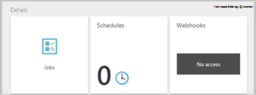

<properties 
   pageTitle="Szerepköralapú hozzáférés-vezérlés Azure automatizálási |} Microsoft Azure"
   description="Szerepköralapú hozzáférés-szerepalapú lehetővé teszi, hogy a hozzáférés-kezelés az Azure erőforrások. Ez a cikk ismerteti, hogy miként állíthatja be az Azure automatizálás RBAC."
   services="automation"
   documentationCenter=""
   authors="mgoedtel"
   manager="jwhit"
   editor="tysonn"
   keywords="automatizálási rbac, a szerepköralapú hozzáférés-vezérlés azure rbac" />
<tags 
   ms.service="automation"
   ms.devlang="na"
   ms.topic="get-started-article"
   ms.tgt_pltfrm="na"
   ms.workload="infrastructure-services"
   ms.date="09/12/2016"
   ms.author="magoedte;sngun"/>

# Azure automatizálási szerepköralapú hozzáférés-vezérlés

## Szerepköralapú hozzáférés-vezérlés

Szerepköralapú hozzáférés-szerepalapú lehetővé teszi, hogy a hozzáférés-kezelés az Azure erőforrások. [RBAC](../active-directory/role-based-access-control-configure.md)használ, feladatai újból a munkacsoporton belül, és csak az access összegét adja meg a felhasználók, csoportok és -alkalmazások munkájuk elvégzéséhez szükségük van. Szerepköralapú hozzáférés-kaphatnak a felhasználók a Azure portál, Azure parancssori eszközök vagy Azure kiszolgálói API-ja használatával.

## Az automatizálási fiókok RBAC

Azure automatizálás, a hozzáférés a megfelelő RBAC szerepkört rendelhet a felhasználók, csoportok és a automatizálási fiók hatókör alkalmazásokat. Az alábbiakban a beépített szerepkörök automatizálási fiók által támogatott:  

|**Szerepkör** | **Leírás** |
|:--- |:---|
| Tulajdonos | A tulajdonos szerepkör az erőforrások és a műveletek belül, beleértve a más felhasználók, csoportok és az automatizálási fiókjának kezelése az alkalmazások hozzáférhetővé automatizálási fiók hozzáférést biztosít. |
| Közös munka | Vonatkozó munkatársi szerepkörök lehetővé teszi, hogy mindent egy automatizálási-fiókot a másik felhasználó a hozzáférési engedélyek módosítása kivételével kezelése. |
| A képernyőolvasók | Az Olvasó szerepkör megtekintheti az összes erőforrás található automatizálás fiók, de nem tudja módosítani.|
| Automatizálási operátor | Az automatizálási operátor szerepkör lehetővé teszi például az útmutató műveleti feladatok, leállítása, felfüggesztheti, folytathatja és feladatok ütemezése. A szerepkör akkor lehet hasznos, ha az automatizálási fiók erőforrások, mint a hitelesítő adatok eszközök és runbooks védelme megtekintsék vagy módosítani, de továbbra is a hajtsa végre az alábbi runbooks a szervezet tagjai engedélyezni szeretné. |
| Felhasználói hozzáférés-rendszergazda | A felhasználói hozzáférés rendszergazdai szerepkör Azure automatizálási fiókokhoz felhasználói hozzáférés kezelése a teszi lehetővé. |

>[AZURE.NOTE] Egy adott runbook vagy runbooks, csak az erőforrások és a műveletek az automatizálási számla belüli jogokkal nem adja meg.  

Ebben a cikkben fog végigvezetjük, hogy miként állíthatja be az Azure automatizálás RBAC. Először azonban nézzük meg részletesebben az egyéni engedélyeket a közös munka, a olvasó, az automatizálási operátor és a felhasználói hozzáférés rendszergazda úgy, hogy azt szerezni egy jól érthető automatizálási fiókjában jogok megadása bárki előtt.  Egyéb esetben eredményezhet a nemkívánatos vagy nemkívánatos következmények.     

## Közös munka szerepkör engedélyei

Az alábbi táblázat bemutatja a vonatkozó munkatársi szerepkörök található automatizálás elvégezhető műveleteket hajt végre.

| **Erőforrás típusa** | **Olvasás** | **Az írás** | **Törlése** | **Egyéb műveletek** |
|:--- |:---|:--- |:---|:--- |
| Automatizálási Azure-fiók |  |  |  | | 
| Automatizálási tanúsítvány a digitális eszköz kiválasztása |  |  |  | |
| Automatizálási kapcsolatot a digitális eszköz kiválasztása |  |  |  | | 
| Automatizálási kapcsolat típusát a digitális eszköz kiválasztása |  |  |  | | 
| Automatizálási hitelesítő digitális eszköz kiválasztása |  |  |  | |
| Automatizálási ütemezés eszköz |  |  |  | |
| Automatizálási változó a digitális eszköz kiválasztása |  |  |  | |
| Automatizálási kívánt állapot beállítása | | | |  |
| Hibrid Runbook dolgozó erőforrás típusa |  | |  | | 
| Azure automatizálási feladat |  |  | |  | 
| Automatizálási feladat adatfolyam |  | | | | 
| Automatizálási ütemezett feladat |  |  |  | |
| Automatizálási modul |  |  |  | |
| Azure automatizálási Runbook |  |  |  |  |
| Automatizálási Runbook piszkozat |  | | |  |
| Automatizálási Runbook piszkozat vizsgálat feladat |  |  | |  | 
| Automatizálási Webhook |  |  |  |  |

## A képernyőolvasók szerepkör engedélyei

Az alábbi táblázat bemutatja az Olvasó szerepkör található automatizálás elvégezhető műveleteket hajt végre.

| **Erőforrás típusa** | **Olvasás** | **Az írás** | **Törlése** | **Egyéb műveletek** |
|:--- |:---|:--- |:---|:--- |
| Klasszikus előfizetés-rendszergazda |  | | | 
| Adatkezelési zárolása |  | | | 
| Engedély |  | | |
| Szolgáltató műveletek |  | | | 
| Szerepkör-hozzárendelés |  | | | 
| Szerepkör-definíció |  | | | 

## Automatizálási operátor szerepkör engedélyei

Az alábbi táblázat bemutatja az automatizálás automatizálást operátor szerepkörönként elvégezhető műveleteket hajt végre.

| **Erőforrás típusa** | **Olvasás** | **Az írás** | **Törlése** | **Egyéb műveletek** |
|:--- |:---|:--- |:---|:--- |
| Automatizálási Azure-fiók |  | | | 
| Automatizálási tanúsítvány a digitális eszköz kiválasztása | | | |
| Automatizálási kapcsolatot a digitális eszköz kiválasztása | | | |
| Automatizálási kapcsolat típusát a digitális eszköz kiválasztása | | | |
| Automatizálási hitelesítő digitális eszköz kiválasztása | | | |
| Automatizálási ütemezés eszköz |  |  | | |
| Automatizálási változó a digitális eszköz kiválasztása | | | |
| Automatizálási kívánt állapot beállítása | | | | |
| Hibrid Runbook dolgozó erőforrás típusa | | | | | 
| Azure automatizálási feladat |  |  | |  | 
| Automatizálási feladat adatfolyam |  | | |  
| Automatizálási ütemezett feladat |  |  | | |
| Automatizálási modul | | | |
| Azure automatizálási Runbook |  | | | |
| Automatizálási Runbook piszkozat | | | |
| Automatizálási Runbook piszkozat vizsgálat feladat | | | |  
| Automatizálási Webhook | | | |

További részletek az [automatizálási operátor műveletek](../active-directory/role-based-access-built-in-roles.md#automation-operator) az automatizálási operátor szerepkör az automatizálási fiók és az erőforrások által támogatott műveletek láthatók.

## Felhasználói hozzáférés rendszergazdai szerepkör engedélyei

Az alábbi táblázat bemutatja a felhasználói hozzáférés rendszergazdai szerepkör az automatizálás elvégezhető műveleteket hajt végre.

| **Erőforrás típusa** | **Olvasás** | **Az írás** | **Törlése** | **Egyéb műveletek** |
|:--- |:---|:--- |:---|:--- |
| Automatizálási Azure-fiók |  | | | |
| Automatizálási tanúsítvány a digitális eszköz kiválasztása |  | | | |
| Automatizálási kapcsolatot a digitális eszköz kiválasztása |  | | | |
| Automatizálási kapcsolat típusát a digitális eszköz kiválasztása |  | | | |
| Automatizálási hitelesítő digitális eszköz kiválasztása |  | | | |
| Automatizálási ütemezés eszköz |  | | | |
| Automatizálási változó a digitális eszköz kiválasztása |  | | | |
| Automatizálási kívánt állapot beállítása | | | | |
| Hibrid Runbook dolgozó erőforrás típusa |  | | | | 
| Azure automatizálási feladat |  | | | | 
| Automatizálási feladat adatfolyam |  | | | | 
| Automatizálási ütemezett feladat |  | | | |
| Automatizálási modul |  | | | |
| Azure automatizálási Runbook |  | | | |
| Automatizálási Runbook piszkozat |  | | | |
| Automatizálási Runbook piszkozat vizsgálat feladat |  | | | | 
| Automatizálási Webhook |  | | |

## Állítsa be a RBAC automatizálást fiókjának Azure portál használatával

1.  Jelentkezzen be az [Azure-portálra](https://portal.azure.com/) , és automatizálási fiókját az automatizálási fiókok lap megnyitása.  

2.  Kattintson a jobb felső sarokban a **hozzáférés** -vezérlés. Ekkor megnyílik a **felhasználók** lap adhat hozzá új felhasználók, csoportok és az alkalmazások automatizálási fiókjának kezelését, és az automatizálási fiókban beállított meglévő szerepkörök megtekintése.  

      

>[AZURE.NOTE] **Előfizetés rendszergazdáknak** már létezik az alapértelmezett felhasználóként. Az előfizetés rendszergazdák active directory-csoportnak a szolgáltatás helyi bejelentkezést és a co-administrator(s) az Azure-előfizetése tartalmazza. A szolgáltatás-rendszergazda Azure-előfizetése, és az erőforrások tulajdonosa, és fog a tulajdonos szerepkör örökölt vannak az automatizálási fiókokhoz is. Ez azt jelenti, hogy az access **öröklődés** **szolgáltatás-rendszergazdák és** további-rendszergazdák előfizetés és annak **hozzárendelt** összes a többi felhasználó számára. Kattintson az **előfizetés rendszergazdák** megtekintése engedélyeiket olvashat bővebben.  

### Rendeljen egy szerepkört, és új felhasználó hozzáadása

1.  A felhasználók a lap kattintson a **Hozzáadás** megnyitásához, ahol felhasználói, csoport vagy alkalmazást, és a szerepkör hozzárendelése az **access-lap hozzáadása** elemre.  

      

2.  Válasszon egy szerepkört a rendelkezésre álló szerepkörének felsorolása. Az **olvasó** szerepkör azt választja ki, de választhat az elérhető beépített szerepkörök, amely támogatja az automatizálási fiók közül, vagy bármely definiált egyéni szerepkör.  

      

3.  Kattintson a **felhasználók hozzáadása** , a **felhasználók hozzáadása** lap megnyitásához. Ha hozzáadta minden olyan felhasználók, csoportok és az előfizetés kezeléséhez, akkor jelennek meg ezeket a felhasználókat, és kijelölhet választva vegye fel az access alkalmazás. Ha nincsenek az összes felhasználó szerepel a listában, vagy ha a felhasználó érdeklik hozzáadása nem szerepel a kattintson a **Meghívás** nyissa meg a **vendégként meghívja** lap, ahol meghívhatnak például Outlook.com, a onedrive-on vagy az Xbox Live ID azonosítót érvényes Microsoft-fiók e-mail címmel rendelkező felhasználó. Miután megadta, hogy a felhasználó e-mail címét, kattintson a **Válassza ki** , vegye fel a felhasználót, és kattintson **az OK**gombra. 

      
 
    Ekkor meg kell jelennie a felhasználó az **olvasót** szerepkört, a **felhasználók** lap hozzáadni.  

      

    Is rendelhet a szerepkör a felhasználó a **szerepkörök** lap a. 

1. A felhasználók lap a **szerepkörök lap**megnyitásához kattintson a **szerepkörök** elemre. Ez a lap a megtekintheti a nevét a szerepkört, a felhasználók és csoportok szerepkörhöz hozzárendelt számát.

      
   
    >[AZURE.NOTE] Szerepköralapú hozzáférés-vezérlés csak az automatizálási fiók szint, és a bármilyen erőforrás alatt az automatizálási fiók nem állítható.

    Egynél több szerepkör hozzárendelése egy felhasználói, csoport vagy alkalmazást. Például ha együtt a **Olvasó szerepkör** az **Automatizálási operátor** szerepkör azt hozzá a felhasználó, majd azok is automatizálási-erőforrások megtekintése, valamint runbook feladatok végrehajtása. A legördülő menü a felhasználó szerepköreit listájának megtekintése elemre.  

      
 
### A felhasználó eltávolítása

A hozzáférési engedélyt a automatizálást-fiókjának kezelését nem ki van, vagy akik már nem működik a szervezet számára a felhasználó eltávolítása Az alábbiakban a lépéseket eltávolít egy felhasználót: 

1.  Jelölje ki az eltávolítani kívánt szerepkör-hozzárendelés a **felhasználók** lap.

2.  Kattintson a hozzárendelés a Részletek lap a **eltávolítása** gombra.

3.  Kattintson az **Igen gombra** kattintva hagyja jóvá az Eltávolítás gombra. 

      

## Hozzárendelt felhasználói szerepkör

Amikor a felhasználó a szerepkörbe jelentkezik be az automatizálási fiókját, láthatja a tulajdonos fiók szerepel a listában, az **Alapértelmezett könyvtárak**. Megtekintéséhez a automatizálási fiókot szeretne hozzáadni, hogy az alapértelmezett könyvtár a tulajdonos alapértelmezett könyvtár kell váltania.  

  

### Automatizálási operátor szerepkör kezelőfelület

Ha egy felhasználó, aki hozzá van rendelve az automatizálási operátor szerepkör nézetek az automatizálási fiók vannak rendelve, csak olvashatják a lista runbooks, runbook feladatok és az automatizálási fiókokban létrehozott kimutatások, de nem lehet megtekinteni a definíció. Azt indítása, leállítása, felfüggesztheti, folytathatja vagy a runbook feladat ütemezése. A felhasználó nem lesz más automatizálási erőforrások, például konfigurációk esetén a hibrid dolgozó csoportok vagy DSC csomópontok elérését.  

  

Amikor a felhasználó a runbook kattint, a parancsokat a forrás megtekintése és szerkesztése a runbook nincs megadva, az automatizálási operátor szerepkör nem engedélyezi a hozzáférést.  

  

A felhasználó hozzáférést kap megtekintéséhez, és hozzon létre ütemezést, de nem érik el minden más eszköz típusa.  

  

A felhasználó még nincs hozzáférése a egy runbook társított webhooks megtekintése

  

## Állítsa be a RBAC automatizálást fiókjának Azure PowerShell használatával

Szerepköralapú hozzáférés-is beállítható úgy, hogy a következő [Azure PowerShell-parancsmagok](../active-directory/role-based-access-control-manage-access-powershell.md)automatizálási fiók.

• [Get-AzureRmRoleDefinition](https://msdn.microsoft.com/library/mt603792.aspx) felsorolja minden RBAC szerepkör az Azure Active Directory használható. Ez a parancs a **Name** tulajdonság együtt használatával az egy adott szerepkörönként elvégezhető műveletek listában.  
    **Példa:**  
      

• [Get-AzureRmRoleAssignment](https://msdn.microsoft.com/library/mt619413.aspx) Azure Active Directory RBAC szerepkör-hozzárendelés, a megadott keresési tartomány sorolja fel. Paraméter nélkül a parancs az előfizetés alapján összes szerepkör-hozzárendelések adja vissza. A lista az access-hozzárendelésekhez **ExpandPrincipalGroups** paraméter használatával az adott felhasználó számára, valamint a csoportok a felhasználó tagja.  
    **Példa:** A következő paranccsal lista az összes felhasználó és a fiók automatizálást szerepkörében.

    Get-AzureRMRoleAssignment -scope “/subscriptions/<SubscriptionID>/resourcegroups/<Resource Group Name>/Providers/Microsoft.Automation/automationAccounts/<Automation Account Name>” 

• [Új-AzureRmRoleAssignment](https://msdn.microsoft.com/library/mt603580.aspx) hozzáférés hozzárendelése a felhasználók, csoportok és egy adott hatókör alkalmazásokat.  
    **Példa:** A következő paranccsal hozzárendelése egy felhasználóhoz az automatizálási fiók hatókörének "Automatizálási operátor" szerepkörét.

    New-AzureRmRoleAssignment -SignInName <sign-in Id of a user you wish to grant access> -RoleDefinitionName "Automation operator" -Scope “/subscriptions/<SubscriptionID>/resourcegroups/<Resource Group Name>/Providers/Microsoft.Automation/automationAccounts/<Automation Account Name>”  

• [Eltávolítása-AzureRmRoleAssignment](https://msdn.microsoft.com/library/mt603781.aspx) segítségével az access egy adott felhasználó, csoport vagy alkalmazás eltávolítása egy adott hatókör.  
    **Példa:** A következő parancsot használja a felhasználó eltávolítása a "Automatizálási operátor" szerepkör automatizálási fiók hatálya alá.

    Remove-AzureRmRoleAssignment -SignInName <sign-in Id of a user you wish to remove> -RoleDefinitionName "Automation Operator" -Scope “/subscriptions/<SubscriptionID>/resourcegroups/<Resource Group Name>/Providers/Microsoft.Automation/automationAccounts/<Automation Account Name>”

A fenti példákban a fiókadatokat **Jelentkezzen be az azonosító**, **Előfizetés azonosítója**, **erőforrás-csoport nevét** és **automatizálási fióknév** cserélje. Válassza az **Igen gombra** kattintva erősítse meg, ha el szeretné távolítani a felhasználói szerepkör-hozzárendelés a továbblépés előtt.   

## Következő lépések
-  A változatos módszerekkel, amelyekkel RBAC konfigurálása az Azure automatizálási tudnivalókért tekintse kezelése [a Azure PowerShell RBAC](../active-directory/role-based-access-control-manage-access-powershell.md).
- A változatos módszerekkel, amelyekkel indítsa el a runbook részletekért olvassa el [a runbook indítása](automation-starting-a-runbook.md)
- Különböző runbook típusú információt tekintse át az [Azure automatizálást runbook típusai](automation-runbook-types.md)

