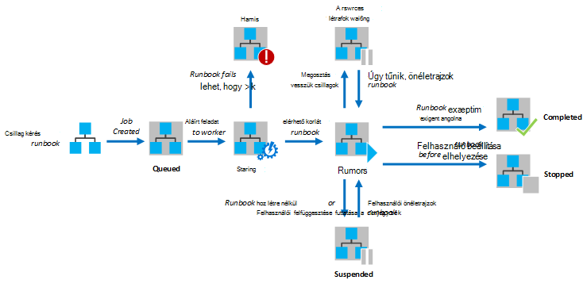
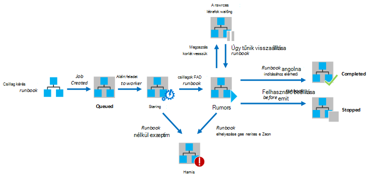

<properties
   pageTitle="Az Azure automatizálás Runbook végrehajtása"
   description="Ismerteti, hogyan egy runbook az Azure automatizálást feldolgozása részleteit."
   services="automation"
   documentationCenter=""
   authors="mgoedtel"
   manager="stevenka"
   editor="tysonn" />
<tags
   ms.service="automation"
   ms.devlang="na"
   ms.topic="article"
   ms.tgt_pltfrm="na"
   ms.workload="infrastructure-services"
   ms.date="03/21/2016"
   ms.author="bwren" />

# Az Azure automatizálás Runbook végrehajtása

Egy runbook az Azure automatizálás indításakor a feladat jön létre. A feladat egy egyetlen adatvégrehajtás-példány egy runbook. Az Azure automatizálási dolgozó minden feladat futtatása van rendelve. Munkatársak több Azure-fiók által megosztott, feladatokat az automatizálási másik fiókból, egymástól elszigetelt is. Nincs fog szolgáltatás a feladatok vonatkozó mely dolgozó szabályozható.  Egy egyetlen runbook futó egyszerre több feladat van. Amikor az Azure-portálon runbooks listáját, itt a felsorolásban az utolsó feladat, amely az egyes runbook indított állapotát. Minden egyes állapotának nyomon abból a feladatok az egyes runbook tekinthet meg. A különböző feladat állapotok leírását olvassa el a [Feladat állapotok](#job-statuses)című témakört.

A következő ábrán egy runbook feladat életciklusa [grafikus runbooks](automation-runbook-types.md#graphical-runbooks) és [PowerShell munkafolyamat runbooks](automation-runbook-types.md#powershell-workflow-runbooks).

A következő ábrán a életciklusáról runbook feladat [PowerShell runbooks](automation-runbook-types.md#powershell-runbooks)számára.

A feladatok érik el az Azure erőforrások azáltal, hogy az Azure előfizetés kapcsolat. Csak azok fog rendelkezni az Adatközpont erőforrásokhoz, ha ezek az erőforrások érhetők el a nyilvános felhőből.

## Feladat állapotok

Az alábbi táblázat ismerteti a különböző állapotok lehetségesek feladathoz.

| Állapot| Leírás|
|:---|:---|
|Befejezett|A feladat sikeresen befejeződött.|
|Nem sikerült.| A [grafikus és PowerShell munkafolyamat runbooks](automation-runbook-types.md)a runbook összeállításához sikertelen volt.  A runbook nem indult el [PowerShell-parancsprogramot runbooks](automation-runbook-types.md), és a feladat kivételt feltárása. |
|Nem sikerült, Várakozás a források|A feladat nem sikerült, mert elérte [valós megosztás](#fairshare) háromszor és az azonos ellenőrzés, illetve a runbook elején minden alkalommal indítják el.|
|Aszinkron|A feladat egy automatizálási alkalmazottnak, így érhető el, hogy indítható el erőforrások várakozik.|
|Indítása|A feladatot hozzárendelték dolgozó, és a rendszer nem te000129565 elindítani.|
|Folytatása|A rendszer nem te000129565 folytatása a feladatot, akkor felfüggesztése után.|
|Fut|A feladat fut.|
|Fut, a Várakozás a források|A feladat már nincs betöltve, mert a [valós megosztás](#fairshare) korlát elérte. Folytatódik, hogy az utolsó ellenőrzés az hamarosan.|
|Leállítva|A felhasználó által a feladatot leállt fejeződött volt.|
|Leállítása|A rendszer a feladat leállítása webhelyet.|
|Felfüggesztett|A feladat felfüggesztése a felhasználó által, a rendszer, vagy a runbook egy parancsra. A feladat, amely fel van függesztve indítható el ismét, és folytatja az utolsó ellenőrzés vagy a runbook elejére, ha nincs pontjainak. A runbook csak fel kell függeszteni a kivételt esetén a rendszer. Alapértelmezés szerint ErrorActionPreference **Folytatás** értéke, amely a feladat hiba megtartása futó jelentését. Ha ez a beállítás változó **leállítása** kattintson a feladat felfüggeszti a hibát.  [Grafikus és PowerShell munkafolyamat runbooks](automation-runbook-types.md) csak vonatkozik.|
|Felfüggesztése|A rendszer felfüggeszti a feladatot a felhasználó kérésére próbál meg. A runbook kell elérje a következő ellenőrzés, mielőtt kell függeszteni. Ha már lejárt, akkor az utolsó ellenőrzés, majd azt befejezi előtt kell függeszteni.  [Grafikus és PowerShell munkafolyamat runbooks](automation-runbook-types.md) csak vonatkozik.|

## Az Azure adatkezelési portál használatával feladat állapotának megtekintése

### Automatizálási irányítópult

Az automatizálási irányítópult összegzi az összes, a runbooks adott automatizálási fiókot. A fiók egy használatát áttekintése is tartalmaz. Az összefoglaló graph összes runbooks minden állapot megadott fölé egy adott számú nap vagy óra teljes feladatok száma látható. A diagram jobb felső sarkában lévő időtartomány kijelölése A diagram az idő tengelye megadott típusnak megfelelő választott időtartomány változik. Megadhatja a megjelenjen-e egy adott állapot sorában kattintson a képernyő felső részén.

Az alábbi lépésekkel segítségével az automatizálási irányítópult megjelenítéséhez.

1. Az Azure adatkezelési portálon jelölje be az **automatizálási** , és kattintson majd automatizálási fiók nevére.
1. Válassza az **Irányítópult** lapon.

### Runbook irányítópult

A Runbook irányítópult egy egyetlen runbook összesítő jeleníti meg. Az összefoglaló graph az egyes állapot megadott fölé egy adott számú nap vagy óra runbook teljes feladatok száma látható. A diagram jobb felső sarkában lévő időtartomány kijelölése A diagram az idő tengelye megadott típusnak megfelelő választott időtartomány változik. Megadhatja a megjelenjen-e egy adott állapot sorában kattintson a képernyő felső részén.

Az alábbi lépésekkel segítségével a Runbook irányítópult megjelenítéséhez.

1. Az Azure adatkezelési portálon jelölje be az **automatizálási** , és kattintson majd automatizálási fiók nevére.
1. Kattintson egy runbook nevére.
1. Válassza az **Irányítópult** lapon.

### Projekt összefoglalása

Megtekintheti az összes az egy adott runbook és a legutóbbi állapotát létrehozott feladatok listáját. A feladat állapota szerint listában, és a legutóbbi változtatások a feladat dátumtartomány is szűrheti. Kattintson a nevére a feladatok megjelenítése a részletes információkat és az eredményt. A feladat részletes nézete az, hogy feladatot kapott runbook paraméterek értékeket tartalmazza.

Az alábbi lépésekkel segítségével egy runbook feladatainak megtekintése.

1. Az Azure adatkezelési portálon jelölje be az **automatizálási** , és kattintson majd automatizálási fiók nevére.
1. Kattintson egy runbook nevére.
1. Jelölje ki a **feladatok** lap.
1. Kattintson a projekt tekintheti meg a részletek és a kimeneti **Feladat létrehozott** oszlopra.

## A Windows PowerShell használatá feladatállapot beolvasása

A [Get-AzureAutomationJob](http://msdn.microsoft.com/library/azure/dn690263.aspx) segítségével beolvashatja a feladatok létrehozása a egy runbook és egy adott projekt részleteit. Ha egy runbook a Windows PowerShell használatával [Start-AzureAutomationRunbook](http://msdn.microsoft.com/library/azure/dn690259.aspx)indul el, akkor az így létrehozott feladatot ad vissza. [Get-AzureAutomationJob](http://msdn.microsoft.com/library/azure/dn690263.aspx)kimeneti segítségével a feladat kimeneti.

A következő példa parancsok egy minta runbook az utolsó feladatot, és állapotának, a runbook paramétereket és a feladat kimenetét az értékeket a szükséges.

    $job = (Get-AzureAutomationJob –AutomationAccountName "MyAutomationAccount" –Name "Test-Runbook" | sort LastModifiedDate –desc)[0]
    $job.Status
    $job.JobParameters
    Get-AzureAutomationJobOutput –AutomationAccountName "MyAutomationAccount" -Id $job.Id –Stream Output

## Valós megosztása

Erőforrások megosztása között összes runbooks a felhőben, hogy Azure automatizálási fog ideiglenes összetevőobjektum minden feladat 3 órát futása után.    [Grafikus](automation-runbook-types.md#graphical-runbooks) és [PowerShell munkafolyamat](automation-runbook-types.md#powershell-workflow-runbooks) runbooks az illető utolsó [ellenőrzés](http://technet.microsoft.com/library/dn469257.aspx#bk_Checkpoints)folytatódik. Ez idő alatt a feladat jelennek meg futtatása állapotban Várakozás erőforrásokra. Ha a runbook még nincs pontjainak, vagy éppen törölt előtt a feladat az első ellenőrzés nem érte el, akkor fog indítsa újra az elejétől.  [PowerShell](automation-runbook-types.md#powershell-runbooks) runbooks mindig újra az elejétől, mivel az nem támogatják a pontjainak.

>[AZURE.NOTE] A valós megosztás korlát esetében nem alkalmazható a hibrid Runbook dolgozók végrehajtó runbook feladatok.

Ha a runbook újraindul a azonos ellenőrzés vagy a runbook egymás után háromszor elejére, azt nem sikerült, a Várakozás a források állapotban megszakad. Ez a runbooks nélkül hajt végre, végtelen időre szóló futtatása megakadályozhatja, mivel nem tudja, hogy tegye a következő ellenőrzés nélkül ismét éppen törölt. Ebben az esetben a következő kivételt az elmulasztott kap.

*A feladat egészen addig fut, mert többször eltávolítani az azonos ellenőrzés a kívánt. Ellenőrizze, hogy a Runbook nem műveleteket hosszadalmas nélkül pályától tartós állapotába.*

Amikor létrehoz egy runbook, győződjön meg róla, hogy a tevékenységek között két pontjainak futtatásához idő nem haladhatja meg a 3 órát. Előfordulhat, hogy pontjainak hozzáadása a runbook annak érdekében, hogy nem éri 3 órát határértéket vagy felfelé long oldaltörés futó műveletek. Például a runbook előfordulhat, hogy hajtsa végre a ismételt indexelése nagy SQL-adatbázishoz. Ha egyetlen művelet nem jár teljes belül valós megosztás, majd a feladatot fog kell törölt és újraindul az elejétől. Ebben az esetben kell több lépést, például egy táblázat újraindexelés egyszerre történő az ismételt indexelése művelet megszakítja, és helyezze a ellenőrzés minden művelet után, hogy a feladat végrehajtásához az utolsó művelet után sikerült folytatni.

## Következő lépések

- [Egy runbook kezdése az Azure automatizálást](automation-starting-a-runbook.md)
