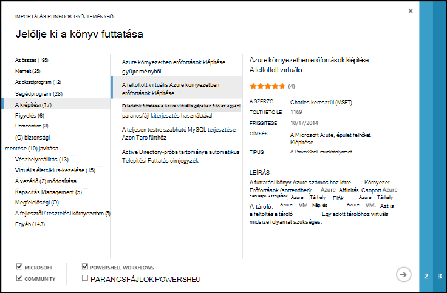
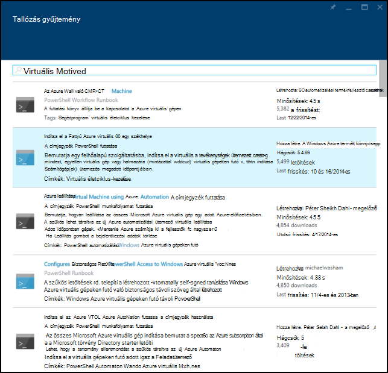
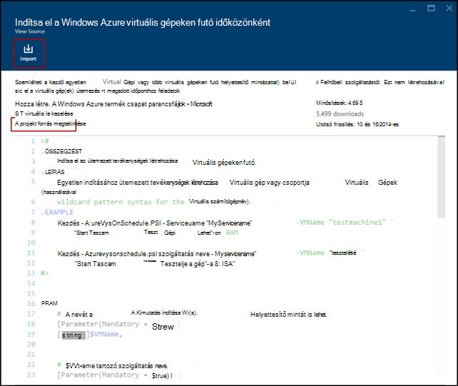
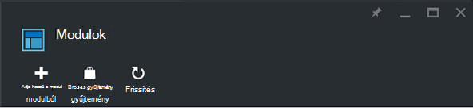
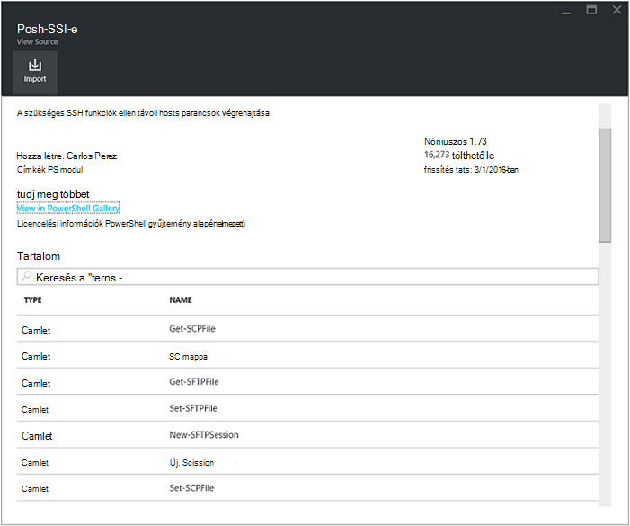
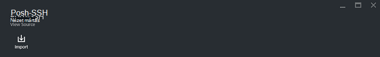
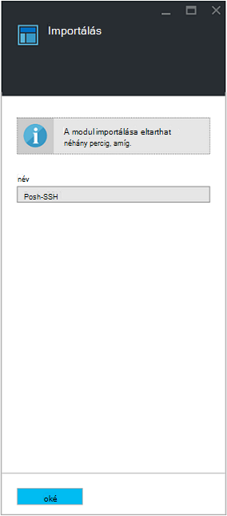

<properties
    pageTitle="Az Azure automatizálási Runbook és modul minták |} Microsoft Azure"
    description="Runbooks és a Microsoft és a közösségi modul telepítése és használata az Azure automatizálást környezetben való érhetők el.  Ez a cikk ismerteti, hogy ezek az erőforrások érheti el, és szeretné gyűjteménybe a runbooks küldeni."
    services="automation"
    documentationCenter=""
    authors="mgoedtel"
    manager="jwhit"
    editor="tysonn" />
<tags
    ms.service="automation"
    ms.devlang="na"
    ms.topic="article"
    ms.tgt_pltfrm="na"
    ms.workload="infrastructure-services"
    ms.date="09/18/2016"
    ms.author="magoedte;bwren" />

# Az Azure automatizálási Runbook és modul gyűjtemények

A saját runbooks és modulok létrehozása az Azure automatizálás, helyett esetek, amelyek a Microsoft és a közösségi már beépített számos érheti el.  Használhatja a módosítás nélkül forgatókönyvekben vagy kiindulási pontként használhatja őket és szerkeszthessék a jegyzeteket az adott követelményeket.

A [Runbook gyűjtemény](#runbooks-in-runbook-gallery) és a modulokat a [PowerShell gyűjtemény](#modules-in-powerShell-gallery)runbooks elérheti.  Ön is hozzájárulhat a Közösség fejleszt eseteket megosztásával.

## Runbooks Runbook gyűjtemény

A [Gyűjtemény Runbook](http://gallery.technet.microsoft.com/scriptcenter/site/search?f[0].Type=RootCategory&f[0].Value=WindowsAzure&f[1].Type=SubCategory&f[1].Value=WindowsAzure_automation&f[1].Text=Automation) runbooks számos a Microsoft és a közösségi, lehetősége van importálni az Azure automatizálási. Bármelyik letöltése a gyűjteményből az [TechNet Script Center](http://gallery.technet.microsoft.com/)üzemelteti, amely egy runbook is, vagy közvetlenül importálhatja a runbooks a gyűjteményből az Azure klasszikus portál vagy az Azure portálon.

Csak importálhatja a Runbook gyűjteményből közvetlenül az Azure klasszikus portálja vagy az Azure portal segítségével. Ez a funkció a Windows PowerShell használatá nem hajtható végre.

>[AZURE.NOTE] Meg kell erősítenie bármely runbooks beszerzése a Runbook gyűjteményből, és a rendkívüli körültekintően telepítéséhez és futtatásához őket munkakörnyezetben tartalmának. |}

### Egy runbook importálása az Azure klasszikus portálján Runbook-dokumentumtárból

1. Az Azure-portálon kattintson a, **Új** **alkalmazás szolgáltatások**, **automatizálás**, **Runbook**, **A gyűjteményben**.
2. Megtekintéséhez jelöljön ki egy kategóriát kapcsolódó runbooks, és válassza ki a runbook a részletek megtekintéséhez. Ha bejelöli a kívánt runbook, kattintson a jobbra mutató nyíl gombra.

    

3. Tekintse át a runbook tartalmát, és jegyezze fel a bármely követelményeket, a Leírás mezőben. Amikor elkészült, kattintson a jobbra mutató nyíl gombra.
4. Adja meg a runbook adatait, és kattintson a pipajeles gombra. Már szerepelni fognak a runbook nevét.
5. Az automatizálási fiókot a **Runbooks** lapon a runbook fog megjelenni.

### Egy runbook importálása az Azure portálján Runbook-dokumentumtárból

1. Az Azure-portálon nyissa meg az automatizálási fiókját.
2. Kattintson a nyissa meg a listát a runbooks **Runbooks** csempére.
3. Kattintson a **Tallózás gombra a gyűjtemény** gombra.

    

4. Keresse meg a gyűjteményelem szeretné, és jelölje ki a részletek megtekintéséhez.

    

4. Kattintson **a projekt forrás megtekintése** a [TechNet Script Center](http://gallery.technet.microsoft.com/)az elem megtekintéséhez.
5. Importálhat egy elemet, kattintson rá a részletek megtekintéséhez, és kattintson az **Importálás** gombra.

    

6. Tetszés szerint módosítsa a runbook nevét, és kattintson az **OK** gombra a runbook importálásához.
5. A runbook jelenik meg a **Runbooks** lapon a automatizálást fiókom.

### Egy runbook hozzáadása a runbook gyűjtemény

A Microsoft javasolja runbooks felvenni, úgy gondolja, hogy más felhasználók segítségére lehetnek Runbook gyűjteményben.  Egy runbook is hozzáadhat, [tölt fel, hogy a parancsprogram-központban](http://gallery.technet.microsoft.com/site/upload) figyelembe az alábbiakat.

- *Windows Azure* meg kell adnia a **kategória** és a **subcategory (alkategória)** a runbook az *automatizálási* , a varázsló jelennek meg.  

- A feltöltés .ps1 vagy .graphrunbook fájl kell lennie.  Ha a runbook van szüksége bármelyik modulok, a gyermek runbooks vagy az eszközök, majd sorolja fel azokat a beküldött a leírás és a runbook megjegyzések szakaszába.  Ha igénylő több runbooks példa, mindegyik külön-külön feltöltése, és a kapcsolódó runbooks mindegyik leírásának azoknak a lista. Győződjön meg arról, hogy használja ugyanazt a címkét, hogy azok jelennek meg a ugyanarra a kategóriára. A felhasználó kell, hogy más runbooks szükség, hogy a leírást, olvassa el az alkalmazási példát, a munkát.

- Adja hozzá a címke "GraphicalPS", ha webkiszolgálón teszi közzé a **grafikus runbook** (nem grafikus munkafolyamat). 

- Egy PowerShell vagy a PowerShell munkafolyamat kódtöredék beszúrhatja a leírás **beszúrása kódot tartalmazó szakaszban** látható ikonnal.

- Az összefoglalás a feltöltés jelenik meg a Runbook gyűjtemény között így meg kell adni, amelynek segítségével azonosítani a runbook működésének felhasználó részletes információt.

- A következő címkéket egy-három kell rendelhet a feltöltés.  A kategóriák, amelyek megegyeznek a címkék csoportban a varázsló szerepelni fognak a runbook.  A listában nem szereplő címkéket figyelmen kívül hagyja a varázslóval. Ha nem adja meg a megfelelő címkéket, a runbook megjelenik a kategóriában.

 - Biztonsági másolat
 - Kapacitás kezelése
 - Vezérlőelem módosítása
 - Megfelelőség
 - A fejlesztői / környezetekben tesztelése
 - Vészhelyreállítás
 - Figyelése
 - Javítása
 - Kiépítése
 - Remediation
 - Virtuális életciklus-kezelése

- Automatizálási frissíti a gyűjtemény óránként egyszer, az adományok azonnal nem fogja látni.

## Modulok PowerShell-dokumentumtárban

PowerShell-modulok tartalmaz, amelyeket a runbooks használhat parancsmagok, és az Azure automatizálás telepítheti a meglévő modulokat érhetők el a [PowerShell gyűjteményben](http://www.powershellgallery.com).  Indítsa el az ebben a gyűjteményben az Azure portálról, és Azure automatizálási közvetlenül a telepítéshez, vagy, töltse le és telepítse a manuálisan.  Nem telepíthető a modulokat közvetlenül az Azure klasszikus portálról, de letöltheti őket bármely más modul módon telepítse azokat.

### A modul importálása az Azure portálján automatizálást modul gyűjteményből

1. Az Azure-portálon nyissa meg az automatizálási fiókját.
2. Kattintson a **Webhelyeszközök** csempét, nyissa meg a listát az eszközök.
3. Kattintson a nyissa meg a listát, modulok **modulok** csempére.
4. Kattintson a **Tallózás gombra a gyűjtemény** gombra, és a Tallózás gombra a gyűjtemény lap elindul.

      
5. Miután a Tallózás gombra a gyűjtemény lap van indul el, a következő mezők alapján is kereshet:

   - A modul neve
   - Címkék
   - A Szerző
   - Parancsmag/DSC erőforrás neve

6. Keresse meg a modul, amely érdekli, és jelölje ki a részletek megtekintéséhez.  
Ha egy adott modulba, tekinthet meg további információt a modul, például egy hivatkozás a PowerShell-dokumentumtárban a függőségek, és az összes parancsmagok és/vagy a modult tartalmazó DSC erőforrások szükséges.

      

7. Azure automatizálási közvetlenül a modul telepítése, kattintson az **Importálás** gombra.

    

8. Ha az Importálás gombra kattint, megjelenik a modul neve, amely az importálni kívánt. Ha telepítve van az összes függőségek, aktív lesz az **OK** gombra. Ha függőségek eltűntek, importálhatja azokat a modul importálásához előbb szüksége.
9. Kattintson **az OK** gombra a modul importálásához és a modul lap fog elindulni. Amikor Azure automatizálási importálja a modul a fiókjához, a modul és a parancsmagok metaadatait olvas ki.

    

    Ez néhány percig is eltarthat, mivel az egyes tevékenységek kell lennie kibontása.
10. A modul telepítik értesítést, és értesítést fog kapni, befejezését követően.
11. A modul importálása után jelennek meg a rendelkezésre álló tevékenységek, és használhatja a runbooks és a kívánt állapotot konfigurációs erőforrásait.

## Egy runbook vagy egy modul kérése

[Hangposta felhasználói](https://feedback.azure.com/forums/246290-azure-automation/)kérések küldhet.  Ha egy runbook írása súgó vagy PowerShell kérdése van szükség, közzé egy kérdést a [fórum](http://social.msdn.microsoft.com/Forums/windowsazure/en-US/home?forum=azureautomation&filter=alltypes&sort=lastpostdesc).

## Következő lépések

- Első lépések runbooks, [vagy](automation-creating-importing-runbook.md) című témakört létrehozása az Azure automatizálás egy runbook importálása
- A runbooks PowerShell és a PowerShell munkafolyamat közötti különbségek, című cikkben talál részletes [tanulási PowerShell-munkafolyamat](automation-powershell-workflow.md)
