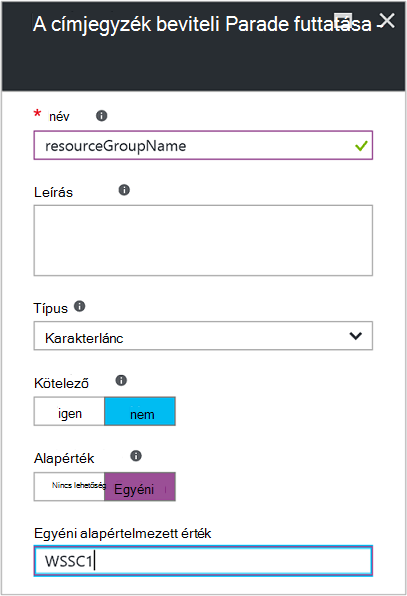
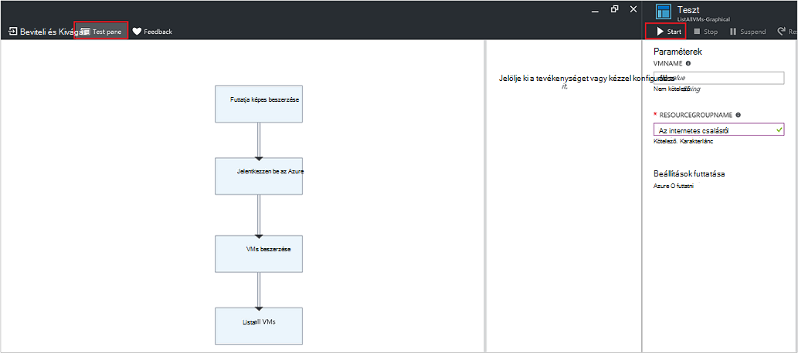

<properties
   pageTitle="Runbook bemeneti paramétereket |} Microsoft Azure"
   description="Runbook bemeneti paramétereket runbooks rugalmasan azáltal, hogy az adatok át egy runbook indításakor növelése Ez a cikk ismerteti a különböző forgatókönyvek runbooks helyének bemeneti paramétereket."
   services="automation"
   documentationCenter=""
   authors="MGoedtel"
   manager="jwhit"
   editor="tysonn" />
<tags
   ms.service="automation"
   ms.devlang="na"
   ms.topic="article"
   ms.tgt_pltfrm="na"
   ms.workload="infrastructure-services"
   ms.date="10/11/2016"
   ms.author="sngun"/>

# <a name="runbook-input-parameters"></a>Runbook bemeneti paramétereket

Runbook bemeneti paramétereket runbooks rugalmasan azáltal, hogy átadni adatok indításakor növelése A paraméterek lehetővé teszi, hogy a különböző forgatókönyvekben és a környezetek kiszemelt runbook műveletek. Ez a cikk azt végigvezeti különböző helyzetekkel ismerkedhet runbooks helyének bemeneti paramétereket.

## <a name="configure-input-parameters"></a>Állítsa be a bemeneti paramétereket

Bemeneti paramétereket PowerShell, a PowerShell munkafolyamat és a grafikus runbooks beállíthatók. Egy runbook beállíthatja, hogy több paraméterek különböző adattípusú, vagy nincs paraméterek megnyitását. Lehet, hogy bemeneti paramétereket kötelező és választható, és hozzárendelheti a választható paraméterek alapértelmezett értékét. Értékek hozzárendelheti egy runbook bemeneti paramétereinek indításkor végig az elérhető lehetőségek közül. Ezek közé tartozik egy runbook kezdve a portálon vagy webszolgáltatás. Egy, mint egy beágyazott meghívott egy másik runbook a gyermek runbook is elindíthatja.

## <a name="configure-input-parameters-in-powershell-and-powershell-workflow-runbooks"></a>A PowerShell és a PowerShell munkafolyamat runbooks bemeneti paramétereket beállítása

A PowerShell és a [PowerShell munkafolyamat runbooks](automation-first-runbook-textual.md) található automatizálás Azure támogatja a keresztül az alábbi attribútumok definiált bemeneti paramétereket.  

| **A tulajdonság** | **Leírás** |
|:--- |:---|
| Típus | Szükséges. A paraméter értéke várható adattípusát. .NET bármilyen érvényes. |
| név | Szükséges. A paraméter neve. Meg kell a runbook belül egyedinek kell és tartalmazhatnak csak betűk, számok, vagy karakterek aláhúzásjelekké. Egy betűvel kell kezdődnie. |
| Kötelező | Nem kötelező. Itt adhatja meg, hogy egy értéket kell megadnia a paramétert. Ha ez **$true**, majd egy értéket kell megadnia a runbook elindul. Ha a ez **$false**, egy érték nem kötelező. |
| Alapérték | Nem kötelező.  Itt adhatja meg, ha az érték nem át, a runbook indításakor a paraméterhez használt érték. Egy alapértelmezett értéket beállítható, hogy minden olyan paraméternek, és is automatikusan végrehajtja a paraméterrel nem kötelező, függetlenül a kötelező beállítást. |

A Windows PowerShell támogatja a bemeneti paramétereket további attribútumok azokat, itt látható érvényességi, például aliasok, mint a paraméter állítja be. Azure automatizálási jelenleg csak a fent felsorolt bemeneti paramétereket támogatja.

A paraméter PowerShell munkafolyamat runbooks van kiválasztva az alábbi általános űrlapon, ahol több paraméterek vannak elválasztva.

   ```
     Param
     (
         [Parameter (Mandatory= $true/$false)]
         [Type] Name1 = <Default value>,

         [Parameter (Mandatory= $true/$false)]
         [Type] Name2 = <Default value>
     )
   ```

>[AZURE.NOTE] Ha paramétereket, szövegdobozokhoz, ha nem adja meg a **kötelező** attribútum, majd alapértelmezés szerint a paraméter megadása nem kötelező. Is ha a PowerShell munkafolyamat runbooks paraméter egy alapértelmezett értéket, azt fogja kell kezelniük PowerShell paraméterként nem kötelező, függetlenül a **kötelező** attribútum érték.

Példaként tegyük konfigurálása bemeneti paramétereinek egy PowerShell-munkafolyamat runbook, amely a virtuális gépeken futó, vagy egy egyetlen virtuális, vagy egy erőforrás csoporton belül minden VMs részleteket exportálja. Ez a runbook két paraméterrel rendelkezik, az alábbi képernyőképen látható módon: virtuális gép és a csoport nevét, az erőforrás nevét.


A paraméter megadása, a paraméterek **$VMName** és **$resourceGroupName** is karakterlánc típusú egyszerű paramétereket. Azonban PowerShell és a PowerShell munkafolyamat runbooks támogatja az összes egyszerű és összetett típusainak, például az **objektum** vagy **PSCredential** a bemeneti paramétereket.

Ha a runbook az objektum típusa bemeneti paraméterre, majd használja a PowerShell hashtable nevű (érték) átadni az az érték párokká. Ha például a következő paraméter egy runbook is van:

     [Parameter (Mandatory = $true)]
     [object] $FullName

Ezután a következő értéket továbbíthatja a paraméter:

    @{"FirstName"="Joe";"MiddleName"="Bob";"LastName"="Smith"}


## <a name="configure-input-parameters-in-graphical-runbooks"></a>A grafikus runbooks bemeneti paramétereket beállítása

Bemeneti paramétereket és [konfigurálása a grafikus runbook](automation-first-runbook-graphical.md) hozzunk létre egy grafikus runbook, amely a virtuális gépeken futó, vagy egy egyetlen virtuális, vagy egy erőforrás csoporton belül minden VMs részleteket exportálja. Egy runbook konfigurálása, ahol a két fő tevékenységek, az alábbiaknak.

[**Azure Futtatás mint fiókkal hitelesítő Runbooks**](automation-sec-configure-azure-runas-account.md) az Azure hitelesítést végezni.

[**Get-AzureRmVm**](https://msdn.microsoft.com/library/mt603718.aspx) egy virtuális gépeken futó tulajdonságait.

Az [**Írás-kimeneti**](https://technet.microsoft.com/library/hh849921.aspx) tevékenység segítségével virtuális gépeken futó azoknak a kimeneti. A tevékenység **Get-AzureRmVm** fogadja el a két paraméterrel a **virtuális számítógép neve** és az **erőforrás csoport nevére**. Ezek a paraméterek különböző értékek minden indításakor: Ha a runbook megszabhatja, mivel a runbook felveheti bemeneti paramétereket. Az alábbiakban a bemeneti paramétereket hozzáadásának lépéseit:

1. Jelölje ki a grafikus runbook a **Runbooks** lap, és válassza a [**szerkesztheti**](automation-graphical-authoring-intro.md) azt.

2. Kattintson a runbook szerkesztő **bemeneti és kimeneti** a **bemeneti és kimeneti** lap megnyitásához.

    

3. A **bemeneti és kimeneti** lap bemeneti paramétereket a runbook definiált listáját jeleníti meg. Ez a lap a hozzáadása egy új bemeneti paraméterre, vagy egy meglévő bemeneti paraméterre beállításainak módosítása. Egy új paramétert a runbook hozzáadásához kattintson a **beviteli hozzáadása** a **bemeneti paraméterre Runbook** lap megnyitásához. Itt adhatja meg a következő paraméterek:

  	| **A tulajdonság** | **Leírás** |
  	|:--- |:---|
  	| név | Szükséges.  A paraméter neve. Meg kell a runbook belül egyedinek kell és tartalmazhatnak csak betűk, számok, vagy karakterek aláhúzásjelekké. Egy betűvel kell kezdődnie. |
  	| Leírás | Nem kötelező. Leírás a bemeneti paraméterre célját. |
  	| Típus | Nem kötelező. A paraméter értéke várható adattípusát. A paraméter által támogatott fájltípusok: **karakterláncot**, **Int32**, **Int64**, **decimális**, **logikai**, **DateTime**és **objektumot**. Ha egy adattípust nincs bejelölve, lesz az alapértelmezett **karakterlánc**. |
  	| Kötelező | Nem kötelező. Itt adhatja meg, hogy egy értéket kell megadnia a paramétert. Ha az **Igen**lehetőséget választja, majd egy értéket kell megadnia a runbook azonnal elindul. Ha úgy dönt, **nem**, majd egy érték nem szükséges a runbook elindul, és egy alapértelmezett értéket is beállítható. |
  	| Alapérték | Nem kötelező. Itt adhatja meg, ha az érték nem át, a runbook indításakor a paraméterhez használt érték. Alapértelmezett érték, amely nem kötelező paraméter beállíthatók. Beállíthat egy alapértelmezett értéket, válassza az **egyéni**. Ezt az értéket használja, ha egy másik értékre a runbook indításakor megadva. Válassza a **Nincs beállítást** , ha nem szeretné bármelyik alapértelmezett értéket. |  

    

4. Hozzon létre két paramétert a következő tulajdonságokat a **Get-AzureRmVm** tevékenység által használt:

    - **1:**
      - Név - VMName
      - Típus - karakterlánc
      - Kötelező - EK

    - **2:**
      - Név - resourceGroupName
      - Típus - karakterlánc
      - Kötelező - EK
      - Alapértelmezett érték - egyéni
      - Egyéni alapértelmezett értéke - \<nevét, amely tartalmazza a virtuális gépeken futó erőforráscsoport >

5. Miután felvette a paramétereket, kattintson az **OK gombra**.  Most megtekintheti őket a **bemeneti és kimeneti lap**. Kattintson az **OK** gombra, és kattintson a **Mentés** és **Közzététel** a runbook.

## <a name="assign-values-to-input-parameters-in-runbooks"></a>Paraméterek runbooks bemeneti értékek hozzárendelése

Az alábbi esetekben runbooks paraméterek bemeneti értékek továbbíthatja.

### <a name="start-a-runbook-and-assign-parameters"></a>Indítsa el a runbook és a paraméterek hozzárendelése

Egy runbook számos módon lehessen elindítani: egy webhook, PowerShell-parancsmagok, a REST API-val, vagy a SDK csomagjában talál az Azure portálon keresztül. Az alábbi témákat ölelik fel egy runbook indítása és a paraméterek hozzárendelése különböző módszereket.

#### <a name="start-a-published-runbook-by-using-the-azure-portal-and-assign-parameters"></a>A közzétett runbook kezdje azzal, hogy az Azure portálon, és a paraméterek hozzárendelése

Amikor megnyílik [a runbook indítása](automation-starting-a-runbook.md#starting-a-runbook-with-the-azure-portal), a **Runbook indítsa el** a lap, és beállíthatja, hogy az imént létrehozott paraméterek értékeit.


A címke alatt a beviteli mezőben akkor láthatja a paraméter beállított tulajdonságait. Attribútumok közé tartozik a kötelező és választható, írja be, és az alapértelmezett értéket. A Súgó buborékba a paraméter neve mellett megtekintheti a szükséges döntéseket paraméter bemeneti értékekkel kapcsolatos főbb információk. Az adatok közé tartozik, hogy egy paramétert a kötelező és választható. A típus és alapértelmezett érték (ha van ilyen), és hasznos jegyzeteket is tartalmaz.


>[AZURE.NOTE] Karakterlánc típusú paramétereket **az üres** karakterlánc értékeket támogatja.  Használjon **[üres karakterlánc]** a bemeneti paraméterre mezőben továbbítja az üres karakterlánc paraméterének. Karakterlánc típusú paramétereket is **Null** értékek átadott nem támogatott. Ha a karakterlánc paraméter értéke nem átadni, majd a PowerShell értelmezi azt null.

#### <a name="start-a-published-runbook-by-using-powershell-cmdlets-and-assign-parameters"></a>Indítsa el a közzétett runbook PowerShell-parancsmagokkal és a paraméterek hozzárendelése

  - **Azure erőforrás-kezelő parancsmagok:** Az automatizálási runbook egy erőforrás csoportban a [Kezdés-AzureRmAutomationRunbook](https://msdn.microsoft.com/library/mt603661.aspx)használatával létrehozott elindíthatja.

    **Példa:**

   ```
    $params = @{“VMName”=”WSVMClassic”;”resourceGroupeName”=”WSVMClassicSG”}
 
    Start-AzureRmAutomationRunbook -AutomationAccountName “TestAutomation” -Name “Get-AzureVMGraphical” –ResourceGroupName $resourceGroupName -Parameters $params
   ```

  - **Azure Service kezelő parancsmagok:** Az alapértelmezett erőforráscsoport [Start-AzureAutomationRunbook](https://msdn.microsoft.com/library/dn690259.aspx)használatával létrehozott automatizálási runbook elindíthatja.

    **Példa:**

   ```
    $params = @{“VMName”=”WSVMClassic”; ”ServiceName”=”WSVMClassicSG”}

    Start-AzureAutomationRunbook -AutomationAccountName “TestAutomation” -Name “Get-AzureVMGraphical” -Parameters $params
   ```

>[AZURE.NOTE] Egy runbook PowerShell-parancsmagok, egy alapértelmezett paraméter használatával indításakor **MicrosoftApplicationManagementStartedBy** **PowerShell**értékkel jön létre. A **feladat részletei** lap tekinthet meg ezt a paramétert.  

#### <a name="start-a-runbook-by-using-an-sdk-and-assign-parameters"></a>Indítsa el a egy runbook egy SDK használatával, és a paraméterek hozzárendelése

  - **Azure erőforrás-kezelő módszer:** Egy runbook elindíthatja a SDK csomagjában talál egy programozási nyelven használatával. Az alábbi képen egy C# kódrészletet egy runbook létrehozásakor a automatizálási-fiókjában. A saját [GitHub tárházba](https://github.com/Azure/azure-sdk-for-net/blob/master/src/ResourceManagement/Automation/Automation.Tests/TestSupport/AutomationTestBase.cs)megtekintése a kódot.  

   ```
     public Job StartRunbook(string runbookName, IDictionary<string, string> parameters = null)
        {
          var response = AutomationClient.Jobs.Create(resourceGroupName, automationAccount, new JobCreateParameters
           {
              Properties = new JobCreateProperties
               {
                  Runbook = new RunbookAssociationProperty
                   {
                     Name = runbookName
                   },
                     Parameters = parameters
               }
           });
        return response.Job;
        }
   ```

  - **Azure Szolgáltatáskezelés módszer:** Egy runbook elindíthatja a SDK csomagjában talál egy programozási nyelven használatával. Az alábbi képen a C# kódtöredék egy runbook létrehozásakor a automatizálási-fiókjában. A saját [GitHub tárházba](https://github.com/Azure/azure-sdk-for-net/blob/master/src/ServiceManagement/Automation/Automation.Tests/TestSupport/AutomationTestBase.cs)összes kódot tekinthet meg.

   ```      
    public Job StartRunbook(string runbookName, IDictionary<string, string> parameters = null)
      {
        var response = AutomationClient.Jobs.Create(automationAccount, new JobCreateParameters
      {
        Properties = new JobCreateProperties
           {
             Runbook = new RunbookAssociationProperty
           {
             Name = runbookName
                },
                  Parameters = parameters
                }
         });
        return response.Job;
      }
   ```

  Ez a módszer kezdéséhez mentheti a runbook paramétereket, **VMName** és **resourceGroupName**, és az értékük szótár létrehozása. Indítsa el a runbook. Az alábbi van a C# kódrészletet a meghatározott fenti módszer hívásához.

   ```
    IDictionary<string, string> RunbookParameters = new Dictionary<string, string>();

    // Add parameters to the dictionary.
    RunbookParameters.Add("VMName", "WSVMClassic");
    RunbookParameters.Add("resourceGroupName", "WSSC1");

    //Call the StartRunbook method with parameters
    StartRunbook(“Get-AzureVMGraphical”, RunbookParameters);
   ```

#### <a name="start-a-runbook-by-using-the-rest-api-and-assign-parameters"></a>Indítsa el a runbook a REST API, és a paraméterek hozzárendelése

A runbook feladat lehet létrehozni és a Azure automatizálási REST API-val, az eljárással **HELYEZI el** a következő kérésével URI lépések.

    https://management.core.windows.net/<subscription-id>/cloudServices/<cloud-service-name>/resources/automation/~/automationAccounts/<automation-account-name>/jobs/<job-id>?api-version=2014-12-08`

A kérés URI cserélje le a következő paraméterek:

  - **előfizetés-alapú:** Az Azure előfizetés azonosítójával.  
  - **cloud-szolgáltatás-neve:** A felhőbeli szolgáltatástól, amelyre az összehívást küldeni kell neve.  
  - **automatizálási fióknév:** A megadott felhőbeli szolgáltatástól belül üzemelteti automatizálási fiókja neve.  
  - **feladat azonosító:** A feladat globálisan egyedi azonosítója. A PowerShell GUID hozhat létre használata a **[GUID]::NewGuid(). ToString()** parancsot.

Annak érdekében, hogy paramétereket át a runbook feladat, használja az összehívás törzsébe. A következő két tulajdonságok JSON formátumban vesz igénybe:

  - **Runbook neve:** Szükséges. A projekt indítása a runbook neve.  
  - **Runbook paraméterek:** Nem kötelező. A szótárba a paraméter lista (nevében, érték) formázhatja, ahol karakterlánc típusú kell lennie, és értéke lehet bármely érvényes JSON értéket.

Ha szeretne kezdeni a **Get-AzureVMTextual** runbook, amely korábbi verziójában készült **VMName** és **resourceGroupName** paraméterként, az alábbi JSON formátum használható összehívás törzsébe.

   ```
    {
      "properties":{
        "runbook":{
        "name":"Get-AzureVMTextual"},
      "parameters":{
         "VMName":"WSVMClassic",
         "resourceGroupName":”WSCS1”}
        }
    }
   ```

HTTP állapotkódot 201 ad vissza, ha a feladat sikeresen jön létre. Válasz fejlécek és válasz törzsén további tudnivalókért tekintse át a cikk arról, hogy miként [runbook feladat létrehozása a REST API segítségével.](https://msdn.microsoft.com/library/azure/mt163849.aspx)

### <a name="test-a-runbook-and-assign-parameters"></a>Egy runbook tesztelésére, és a paraméterek hozzárendelése

Ha a **teszt** lap megnyitja [a runbook piszkozat verziójának tesztelje](automation-testing-runbook.md) a próba elemre, és beállíthatja, hogy az imént létrehozott paraméterek értékek.



### <a name="link-a-schedule-to-a-runbook-and-assign-parameters"></a>Ütemezett csatolása egy runbook, és a paraméterek hozzárendelése

Akkor [hivatkozás egy ütemtervet](automation-schedules.md) , a runbook úgy, hogy a runbook adott időben induljon. Ha az ütemezés létrehozását, és a runbook használja ezeket az értékeket az ütemezés szerint indításakor rendelhet bemeneti paramétereket. Az ütemezés nem lehet menteni, mindaddig, amíg az összes kötelező paraméterértékek találhatók.


### <a name="create-a-webhook-for-a-runbook-and-assign-parameters"></a>Egy-egy runbook webhook létrehozása és hozzárendelése a paraméterek

Hozzon létre egy [webhook](automation-webhooks.md) a runbook, és állítsa be a bemeneti paramétereket runbook. A webhook nem lehet menteni, amíg az összes kötelező paraméterértékek találhatók.


Amikor végrehajtása a egy runbook egy webhook a **[Webhookdata](automation-webhooks.md#details-of-a-webhook)** küldi el, a bemeneti paramétereket megadott együtt előre definiált beviteli paraméter használatával. Bontsa ki a további információt a **WebhookData** paraméter kattinthat.


## <a name="next-steps"></a>Következő lépések

- Runbook bemeneti és kimeneti a további tudnivalókért lásd: [Azure automatizálási: runbook beviteli, a kibocsátás és a beágyazott runbooks](https://azure.microsoft.com/blog/azure-automation-runbook-input-output-and-nested-runbooks/).
- Változatos módszerekkel, amelyekkel indítsa el a runbook kapcsolatos részletekért olvassa el a [egy runbook indítása](automation-starting-a-runbook.md)című témakört.
- Ha szerkeszteni szeretné egy szöveges runbook, olvassa el a [Szerkesztés szöveges runbooks](automation-edit-textual-runbook.md).
- A grafikus runbook szerkesztéséhez hivatkozhat [grafikus létrehozása az Azure automatizálás](automation-graphical-authoring-intro.md).
