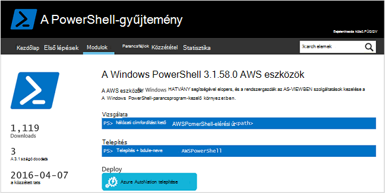
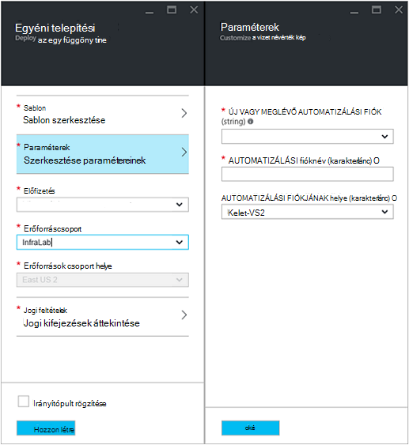
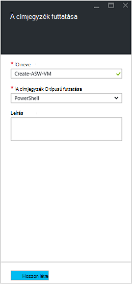
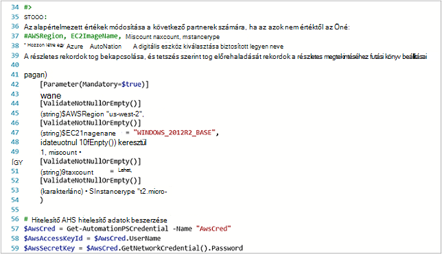
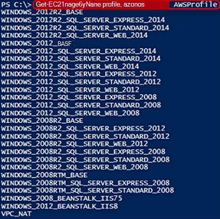
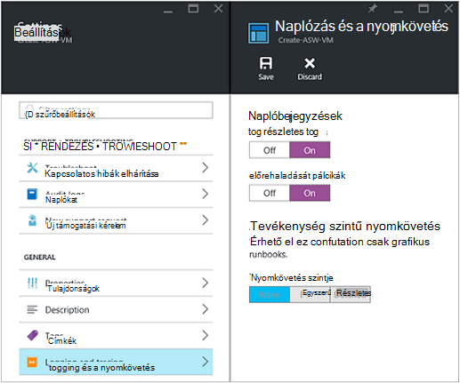
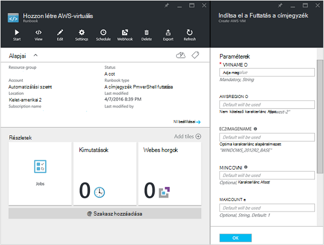
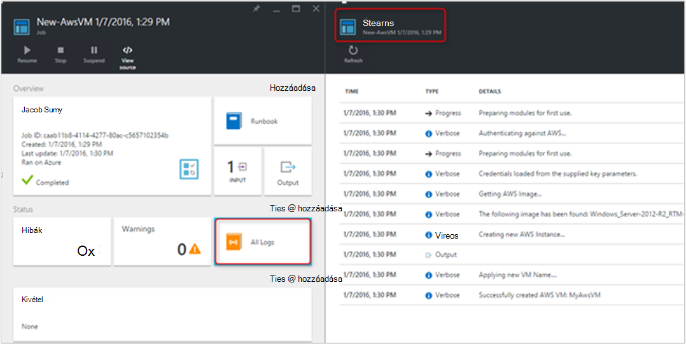
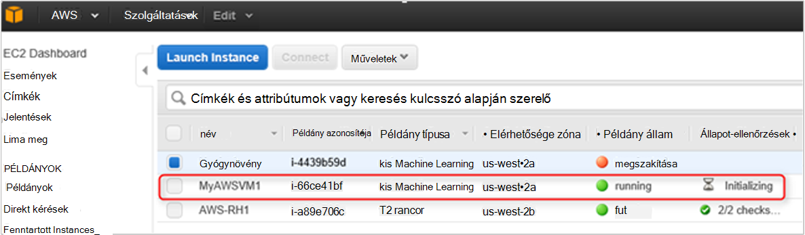

<properties
   pageTitle="A egy virtuális az Amazon webszolgáltatásokhoz telepítésének automatizálása |} Microsoft Azure"
   description="Ez a cikk bemutatja, hogyan Azure automatizálási használatával automatizálhatja a az Amazon Web Service virtuális létrehozása"
   services="automation"
   documentationCenter=""
   authors="mgoedtel"
   manager="jwhit"
   editor="" />
<tags
   ms.service="automation"
   ms.devlang="na"
   ms.topic="article"
   ms.tgt_pltfrm="na"
   ms.workload="na"
   ms.date="08/17/2016"
   ms.author="tiandert; bwren" />

# <a name="azure-automation-scenario---provision-an-aws-virtual-machine"></a>Azure automatizálási forgatókönyv – egy AWS virtuális gép kiépítése 

Ez a cikk azt mutatja be hogyan Azure automatizálási kiépítése virtuális gép az Amazon Web Service (AWS)-előfizetése, és nevezze el, hogy virtuális adott – ami AWS utal, mint "címkézés" a virtuális is kihasználhatja.

## <a name="prerequisites"></a>Előfeltételek

Ez a cikk az alkalmazásában Azure automatizálási fiók és egy AWS előfizetése van szükség. Azure automatizálási fiókot, és a AWS előfizetés hitelesítő adatokkal konfigurálja úgy a további tudnivalókért tekintse át a [Hitelesítés konfigurálása az Amazon webszolgáltatásokhoz](../automation/automation-sec-configure-aws-account.md).  Ehhez a fiókhoz kell létrehozni vagy frissíti a AWS előfizetés hitelesítő adatait a folytatás előtt, hogy hivatkoznak ehhez a fiókhoz, az alábbi lépéseket.


## <a name="deploy-amazon-web-services-powershell-module"></a>Amazon Web Services PowerShell-modult a telepítése

A virtuális runbook kiépítési fog kihasználhatja a munkavégzés a AWS PowerShell-modult. Hajtsa végre az alábbi lépéseket a modul hozzáadása a automatizálási fiók van konfigurálva a AWS előfizetés hitelesítő adatokkal.  

1. Nyissa meg a böngészőt, és nyissa meg azt a [PowerShell gyűjtemény](http://www.powershellgallery.com/packages/AWSPowerShell/) , majd kattintson a **Deploy Azure automatizálás gombra**.<br> 

2. Megnyílik az Azure bejelentkezési lapjára, és hitelesítését követően, akkor a rendszer az Azure-portálra a rendszer, és megjelenik a következő lap.<br> 

3. Jelölje ki az erőforráscsoport **Erőforráscsoport** legördülő listából, majd kattintson a Paraméterek lap, a következő adatokat:
   * **Új vagy meglévő automatizálást fiók (karakterlánc)** legördülő listában válassza a **meglévő**.  
   * **Automatizálási fióknév (karakterlánc)** mezőbe írja be az automatizálási fiók AWS előfizetéshez tartozó hitelesítő adatok tartalmazó pontos nevét.  Például ha létrehozott egy külön, **AWSAutomation**nevű fiókot, akkor írja be a mezőbe.
   * Jelölje ki a megfelelő terület az **Automatizálási fiók hely** legördülő listából.

4. Miután elvégezte a szükséges információk megadására, kattintson a **Létrehozás**gombra.

    >[AZURE.NOTE]Miközben egy PowerShell-modult Azure automatizálási importálja, akkor van is kiolvasó a parancsmagok és a következő tevékenységek nem jelennek meg a mindaddig, amíg a modul teljesen befejeződött, az importálás és a parancsmagok kibontása. Ez a folyamat néhány perc is eltelhet.  
<br>
5. Az Azure-portálon nyissa meg a 3 hivatkozott automatizálási fiókját.
6. Kattintson a **Webhelyeszközök** csempét, és kattintson az **eszközök** lap, válassza a **modulokat** csempét.
7. Az **modulokat** lap a listában a **AWSPowerShell** modul jelennek meg.

## <a name="create-aws-deploy-vm-runbook"></a>Hozzon létre AWS virtuális runbook terjesztése

Miután lett telepítve az AWS PowerShell-modult, azt az egy runbook automatizálhatja a kiépítési egy virtuális gép használata egy PowerShell-parancsprogramot AWS most Szerző. Az alábbi lépésekkel fog szemléltetik kihasználhatja az Azure automatizálás natív PowerShell-parancsprogramot.  

>[AZURE.NOTE] További lehetőségek és a parancsfájl vonatkozó információkat kérjük, keresse fel a [PowerShell gyűjtemény](https://www.powershellgallery.com/packages/New-AwsVM/DisplayScript).


1. Töltse le a New-AwsVM PowerShell-parancsprogramot a PowerShell gyűjteményből megnyitásával egy PowerShell-munkamenetet, és írja be a következő:<br>
   ```
   Save-Script -Name New-AwsVM -Path \<path\>
   ```
<br>
2. Az Azure portálról nyissa meg a automatizálási fiókját, és kattintson a **Runbooks** csempére.  
3. Jelölje ki a **Runbooks** lap **hozzáadása egy runbook**.
4. Válassza a **Hozzáadás a runbook** lap **Gyors létrehozása** (egy új runbook létrehozása).
5. A **Runbook** Tulajdonságok lap a runbook neve mezőjébe írja be a nevét és a **Runbook típusa** legördülő listában jelölje be a **PowerShell**, és kattintson a **Létrehozás**gombra.<br> 
6. A PowerShell Runbook szerkesztése lap megjelenésekor másolja a vágólapra, és illessze be a PowerShell-parancsprogramot, a vászonra szerzői runbook.<br> <br>

    >[AZURE.NOTE] Kérjük, vegye figyelembe az alábbi, a következő példa PowerShell-parancsprogramot való munkavégzés során:
    >
    > - A runbook tartalmazza az alapértelmezett paraméterértékeket. Ki az összes alapértelmezett értéket, és szükség esetén frissítse.
    > - Ha másképp **AWScred**nevű hitelesítő adatok eszközként tárolt AWS hitelesítő adatait, szüksége lesz frissítése a parancsfájl sorban 57 ennek megfelelően.  
    > - A AWS CLI parancsok PowerShell, különösen a Ez például runbook való munkavégzés során meg kell adnia a AWS területhez tartozik. Egyéb esetben a parancsmagok sikertelen lesz.  Megtekintheti AWS témakör [AWS régió adja meg](http://docs.aws.amazon.com/powershell/latest/userguide/pstools-installing-specifying-region.html) a PowerShell dokumentum további részleteket AWS eszközeit.  
<br>
7. A kép névsor lekérése AWS előfizetését, indítsa el a PowerShell ISE, és importálja a AWS PowerShell-modult.  A ISE környezetben a **Get-AutomationPSCredential** cserélésével AWS hitelesítést **AWScred = Get-hitelesítő**.  Ez kérni fogja a hitelesítő adatait, és megadhatja a **Hozzáférési kulcs Azonosítóját** a felhasználónevet és a **Titkos hívóbetű** a jelszót.  Lásd a lenti példát:

        #Sample to get the AWS VM available images
        #Please provide the path where you have downloaded the AWS PowerShell module
        Import-Module AWSPowerShell
        $AwsRegion = "us-west-2"
        $AwsCred = Get-Credential
        $AwsAccessKeyId = $AwsCred.UserName
        $AwsSecretKey = $AwsCred.GetNetworkCredential().Password

        # Set up the environment to access AWS
        Set-AwsCredentials -AccessKey $AwsAccessKeyId -SecretKey $AwsSecretKey -StoreAs AWSProfile
        Set-DefaultAWSRegion -Region $AwsRegion

        Get-EC2ImageByName -ProfileName AWSProfile
   A következő eredményt ad vissza:<br>
     
8. Másolja a vágólapra, és illessze be a kép neveket közül a runbook **$InstanceType**, a hivatkozott egy automatizálási változó. Mivel ez a példa azt az ingyenes AWS használatával többszintű előfizetés, **t2.micro** használjuk runbook példa.
9. A runbook mentse, majd kattintson a **Közzététel** a runbook közzététele, majd az **Igen** .


### <a name="testing-the-aws-vm-runbook"></a>A virtuális AWS runbook tesztelése
A runbook teszteli a folytatás előtt néhány dolog, amit ellenőrzéséhez szükséges. Kifejezetten:

   -  Vagy AWS hitelesítést az eszköz hívott **AWScred** megtörtént a parancsprogram frissült a nevét a hitelesítő adatok eszköz hivatkozni szeretne.  
   -  A AWS PowerShell-modult importálta az Azure automatizálás
   -  Egy új runbook létrehozás és paraméterértékeket ellenőrzi, és szükség esetén frissítése
   -  **Részletes naplóbejegyzések** és tetszőlegesen a **haladás naplóbejegyzések** csoportban a **naplózás és a nyomkövetés** beállításához runbook állította **be**.<br> 

1. Indítsa el a runbook, így kattintson a **Start** gombra, és kattintson az **OK gombra** a Start Runbook lap megnyitásakor szeretnénk.
2. Adja meg a kezdés Runbook lap egy **VMname**.  Fogadja el az alapértelmezett értékeket a többi paraméterekkel, amely a korábban előre a parancsfájl.  **Az OK gombra** a runbook projekt indítása gombra.<br> 
3. A feladat ablaktáblában a runbook feladat, amely az imént létrehozott nyitja meg. Ez az ablak bezárása
4. Azt is megtekintheti a feladat előrehaladását, és **Nézet kimenetét a runbook a feladat lap az **Összes naplók** csempére kattintva** .<br> 
5. Ellenőrizze, hogy a virtuális folyamatban van, jelentkezzen be a AWS Management Console, ha Ön nem jelentkezett be.<br> 

## <a name="next-steps"></a>Következő lépések
-   Első lépések a grafikus runbooks, lásd: [az első grafikus runbook](automation-first-runbook-graphical.md)
-   Első lépések a PowerShell munkafolyamat runbooks, lásd: [az első PowerShell munkafolyamat runbook](automation-first-runbook-textual.md)
-   Szeretne többet megtudni a runbook típusú, a előnyei és korlátai, lásd: [Azure automatizálási runbook típusai](automation-runbook-types.md)
-   További információt a PowerShell-parancsprogramot támogatja a szolgáltatást című témakörben [található automatizálás Azure támogatja natív PowerShell-parancsprogramot](https://azure.microsoft.com/blog/announcing-powershell-script-support-azure-automation-2/)
