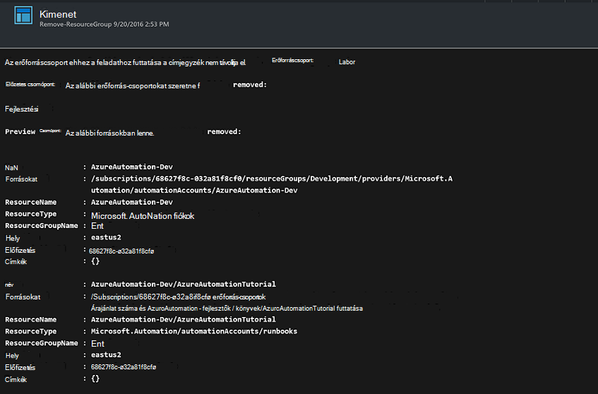

<properties
    pageTitle="Az erőforrás csoportok eltávolítása automatizálása |} Microsoft Azure"
    description="Az Azure automatizálási forgatókönyv többek között az összes erőforráscsoport az előfizetés megszüntetése runbooks PowerShell munkafolyamat-verziót."
    services="automation"
    documentationCenter=""
    authors="MGoedtel"
    manager="jwhit"
    editor=""
    />
<tags
    ms.service="automation"
    ms.workload="tbd"
    ms.tgt_pltfrm="na"
    ms.devlang="na"
    ms.topic="get-started-article"
    ms.date="09/26/2016"
    ms.author="magoedte"/>

# Azure automatizálást forgatókönyv - automatizálása az erőforrás csoportok eltávolítása

Vevőknek egynél több erőforráscsoport létrehozása. Néhány tapasztalhatott gyártási alkalmazások kezeléséhez, és mások fejlesztése, tesztelés, és a környezetek átmeneti előfordulhat, hogy hanglejtésjelként. Az alábbi források telepítését automatizálása egyvalamihez, de a gomb egy kattintással erőforráscsoport leválasztása nem egy másik. Azure automatizálási használatával zökkenőmentesebbé teheti a leggyakoribb felügyeleti feladat. Ez akkor hasznos, ha egy tagot ajánlatot, például az MSDN webhelyen vagy a Microsoft Partner Network Cloud Essentials program keresztül kiadások korlátozott tartalmazó Azure előfizetéssel rendelkező dolgozik.

Ebben az esetben egy PowerShell runbook alapul, és ha el szeretné távolítani az előfizetéséből megadott egy vagy több erőforrás-csoportok lett tervezve. Az alapértelmezett beállítás a a runbook, tesztelje a folytatás előtt. Ezzel biztosíthatja, hogy ne véletlenül törölje az erőforráscsoport előtt készen áll az eljárás végrehajtásához.   

## Bevezetés az alkalmazási példát

Ebben az esetben, a [PowerShell gyűjtemény](https://www.powershellgallery.com/packages/Remove-ResourceGroup/1.0/DisplayScript)letölthet egy PowerShell runbook áll. Is importálhat meg közvetlenül a [Runbook gyűjtemény](automation-runbook-gallery.md) az Azure-portálon.  

Runbook | Leírás|
----------|------------|
Eltávolítás-ResourceGroup | Egy vagy több Azure erőforrás-csoportok és a kapcsolódó erőforrásokat eltávolítja az előfizetést.  
 
A következő bemeneti paramétereket-e runbook meghatározása:

Paraméter | Leírás|
----------|------------|
NameFilter (kötelező) | Az erőforrás-csoportokat, amely azt szeretné, kattintson a Törlés korlátozása egy név szűrőt ad meg. Több érték egy vesszővel tagolt lista használatával továbbíthatja. A szűrő nem kis-és nagybetűk, és bármelyik erőforráscsoport, amely tartalmazza a karakterlánc meg fognak egyezni.|
PreviewMode (nem kötelező) | Végrehajtja a runbook, hogy mely erőforrás-csoportok szeretné törölni, de nem hajt végre semmilyen műveletet. Az alapértelmezett érték **Igaz** elkerülése érdekében a runbook átadott egy vagy több erőforrás csoportok véletlen törlését.  

## Telepítse és állítsa be az ebben az esetben

### Előfeltételek

A runbook hitelesíti a [Futtatás Azure más néven fiók](automation-sec-configure-azure-runas-account.md)használatával.    

### Telepítse és a runbooks közzététele

Miután letöltötte a runbook, importálhatja [importálása runbook eljárások](automation-creating-importing-runbook.md#importing-a-runbook-from-a-file-into-Azure-Automation)az eljárás használatával. Miután sikeresen importálta az automatizálási-fiókjába, tegye közzé a runbook.

## A runbook használatával

Az alábbi lépésekkel végigvezeti a runbook és a Súgó megismerni működéséről végrehajtását. Ön lesz csak kell vizsgálat a runbook ebben a példában ténylegesen nem törli az erőforráscsoport.  

1. Az Azure portálról nyissa meg a automatizálást fiókját, majd kattintson a **Runbooks**.
2. Válassza az **Eltávolítás-ResourceGroup** runbook, és kattintson a **Start**gombra.
3. A runbook indításakor a **Start Runbook** lap nyílik meg, és beállíthatja a paraméterek. Írja be a nevét, az erőforrás csoportok előfizetése teszteléshez használható, és a nem fog okozhat, ha véletlenül törölné.  

    >[AZURE.NOTE] Győződjön meg arról, hogy **Previewmode** értéke **Igaz** , a kijelölt erőforrás csoportok törlésének elkerülése.  **Megjegyzés:** ez runbook nem képes eltávolítani az erőforráscsoport, hogy fut-e runbook automatizálási fiókot tartalmazó.  

4. Miután beállította az összes paramétert értékek, kattintson az **OK gombra**, és a runbook végrehajtása lehet várakozik.  

Az Azure-portálon a **Eltávolítása-ResourceGroup** runbook feladat részleteinek megtekintéséhez jelölje ki a runbook **feladatokat** . A projekt összefoglaló jeleníti meg, a bemeneti paramétereket és a kimeneti adatfolyam mellett a feladat és az esetleges kivételek történt, általános információt.  .

A **Projekt összefoglaló** a a kimeneti figyelmeztetés és hiba adatfolyamok származó üzenetek is szerepelnek. Válassza ki a **Kimenet** runbook végrehajtása a részletes eredmények megtekintéséhez.  

## Következő lépések

- A saját runbook létrehozása, című cikkben ismerkedhet [létrehozása vagy importálása az Azure automatizálás egy runbook](automation-creating-importing-runbook.md).
- Első lépések a PowerShell munkafolyamat runbooks, olvassa el [az első munkafolyamat PowerShell runbook](automation-first-runbook-textual.md).
