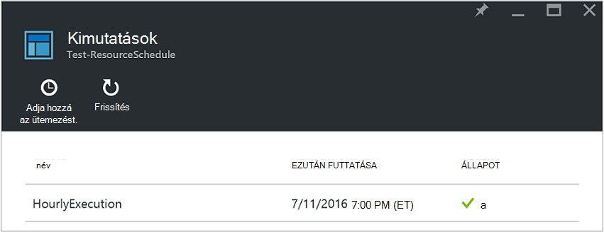
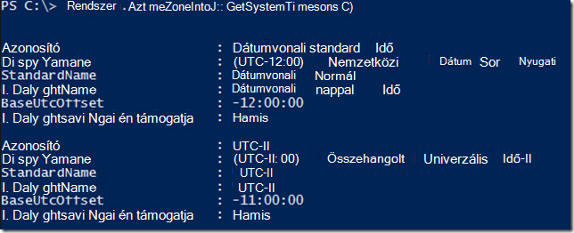
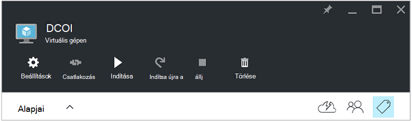
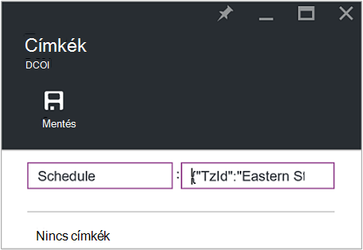
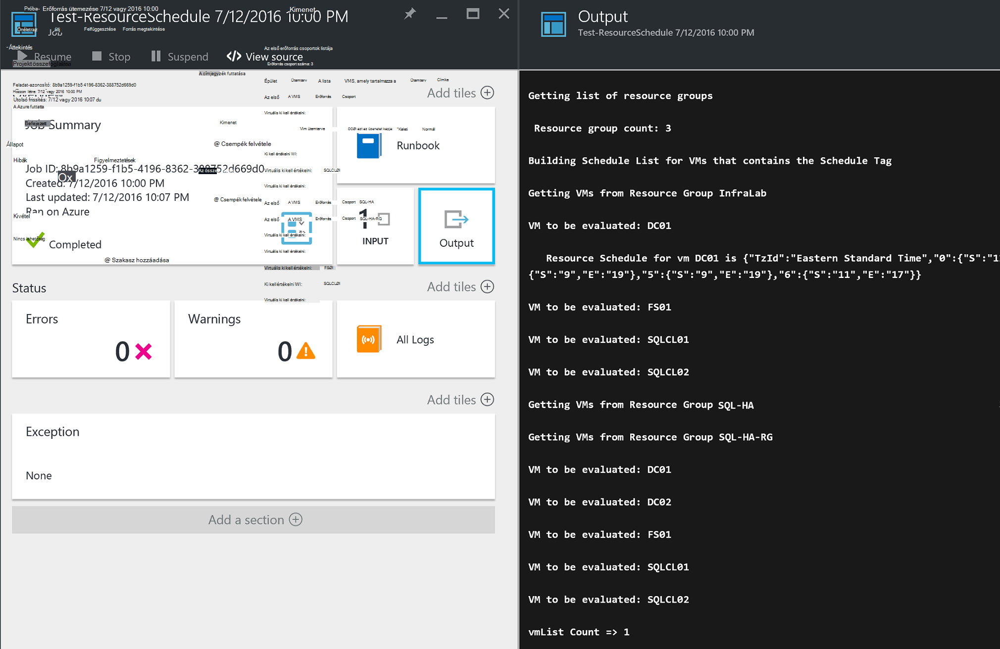

<properties
   pageTitle="Azure virtuális indítási és leállítási az ütemterv készítése a JSON formázott címkék használatával |} Microsoft Azure"
   description="Ez a cikk bemutatja, hogyan címkék JSON karakterláncok használatával automatizálhatja a virtuális indítási és leállítási ütemezését."
   services="automation"
   documentationCenter=""
   authors="MGoedtel"
   manager="jwhit"
   editor="tysonn" />
<tags
   ms.service="automation"
   ms.devlang="na"
   ms.topic="article"
   ms.tgt_pltfrm="na"
   ms.workload="infrastructure-services"
   ms.date="07/18/2016"
   ms.author="magoedte;paulomarquesc" />

# Azure automatizálási eset: Azure virtuális indítási és leállítási az ütemterv készítése a JSON formázott címkék használatával

Ügyfelek gyakran szeretne ütemezni, az indítási és leállítási virtuális gépeken futó előfizetés költségek csökkentése vagy támogatja az üzleti és műszaki követelmények segíti a.  

A következő példa lehetővé teszi, hogy egy erőforrás csoportszint vagy Azure virtuális gép szintjén ütemezés nevű címke használatával automatikus indítási és leállítási, a VMs beállítása. Az ütemterv egy indítási és leállítási időpontot a szombat beállítható a vasárnap.  

Van néhány ki-be a beállításai. Ezek a következők:
-  A [virtuális gép skála állítja be](../virtual-machine-scale-sets/virtual-machine-scale-sets-overview.md) , amelyek lehetővé teszik, méretezheti vagy kicsinyítés Automatikus méretezéssel beállításokkal.
- Az indítási és leállítási műveletek ütemezés beépített képes [DevTest Labs](../devtest-lab/devtest-lab-overview.md) szolgáltatás.

Azonban ezeket a beállításokat csak támogatja a különböző forgatókönyvekben és infrastruktúra-mint-a-szolgáltatás (IaaS) VMs nem alkalmazható.   

Az ütemezés címke erőforráscsoport történő alkalmazásakor azt is érvényes összes virtuális gépeken futó erőforrás csoporton belül. Ha egy virtuális közvetlenül is alkalmazta ütemezett, az utolsó ütemezés elsőbbséget a következő sorrendben:

1.  Erőforráscsoport alkalmazott ütemezése
2.  Erőforráscsoport és az erőforráscsoport virtuális gép alkalmazott ütemezése
3.  A virtuális gép alkalmazott ütemezése

Ebben az esetben lényegében megnyitja a JSON karakterlánc megadott formátumban, és hozzáadja őket az érték az ütemezés nevű címke. Egy runbook felsorolja az összes erőforrás-csoportok és virtuális gépeken futó, majd az ütemezés azonosítja minden virtuális az jelenik meg fentebb alapján. Ezután a csatolt rendelkező VMs keresztül hurkok, és ad meg, hogy milyen lépéseket kell tenni. Például azt határozza meg, amelyek VMs kell leállt, állítsa le vagy figyelmen kívül hagyja.

Ezek a runbooks hitelesíteni a [Futtatás Azure más néven fiók](../automation/automation-sec-configure-azure-runas-account.md)használatával.

## Töltse le a runbooks eset

Ebben az esetben, ahol a négy PowerShell munkafolyamat runbooks, amely letölthető a [TechNet-gyűjteménye](https://gallery.technet.microsoft.com/Azure-Automation-Runbooks-84f0efc7) vagy a [GitHub](https://github.com/paulomarquesdacosta/azure-automation-scheduled-shutdown-and-startup) tárházba ehhez a projekthez.

Runbook | Leírás
----------|----------
Próba-ResourceSchedule | Minden virtuális gép ütemezés ellenőrzi, és a Leállítás vagy attól függően, hogy az ütemezés indítás hajt végre.
ResourceSchedule hozzáadása | Az ütemterv címke ad egy virtuális vagy az erőforrás-csoportot.
Frissítés-ResourceSchedule | A meglévő kimutatás címke módosítása helyettesítve a egy újat.
Eltávolítás-ResourceSchedule | Az ütemterv címke eltávolítása egy virtuális vagy az erőforrás-csoportot.

## Telepítse és állítsa be az ebben az esetben

### Telepítse és a runbooks közzététele

A runbooks a letöltés után [létrehozása](automation-creating-importing-runbook.md#importing-a-runbook-from-a-file-into-Azure-Automation)vagy importálása az Azure automatizálást egy runbook az eljárás használatával importálhatja őket.  Miután sikeresen importálta az automatizálási-fiókjába, tegye közzé minden runbook.

### A próba-ResourceSchedule runbook ütemezett hozzáadása

Kövesse ezeket a lépéseket követve engedélyezze a próba-ResourceSchedule runbook az ütemezésben. Ez az, hogy melyik virtuális gépeken futó elinduljon, állítsa le, vagy marad, ellenőrzi a runbook.

1. Az Azure portálról nyissa meg az automatizálási fiókot, és válassza a **Runbooks** csempére.
2. A **Próba-ResourceSchedule** lap kattintson az **Ütemezés** csempére.
3. Az **ütemtervek** a lap kattintson a **Hozzáadás ütemezés**gombra.
4. Kattintson az **Ütemezés** lap jelölje ki a **hivatkozást a runbook ütemezést**. Válassza a **Create egy új kimutatást**.
5.  Kattintson az **Új ütemezés** lap mezőbe írja be annak az ütemezés, például: *HourlyExecution*.
6. Az ütemezés, **Indítsa el**a kezdő időpont beállítása egy óra növelése.
7. Jelölje ki az **Ismétlődés**, és az **ismétlődő minden intervallum**, válassza a **1 óra értéket**.
8. Ellenőrizze, hogy **beállítása lejárati** értéke **nem**, és kattintson a **Létrehozás** menti az új ütemezés gombra.
9. Válassza az **Ütemezés Runbook** a beállítások lap, **paramétereket és futtatása beállításait**. A próba-ResourceSchedule **Paraméterek** lap adja meg a **SubscriptionName** mezőben az előfizetése nevére.  Ez a paraméter csak a runbook működéséhez szükséges.  Ha végzett, kattintson az **OK gombra**.  

A runbook ütemezés az alábbiakhoz hasonlóan kell kinéznie amikor elkészült:

 

## A JSON-karakterlánc formázása

Ez a megoldás alapvetően veszi a JSON karakterlánc megadott formátumban, és hozzáadja őket a címke dátumaként neve ütemezése. Egy runbook felsorolja az összes erőforrás-csoportok és virtuális gépeken futó, majd az ütemezett virtuális gépeken azonosítja.

A runbook hurkok csatolt rendelkező virtuális gépeken futó fölé, és ellenőrzi, hogy milyen műveleteket kell tenni. Az alábbi képen hogyan megoldásokkal legyen formázva:

    {
       "TzId": "Eastern Standard Time",
        "0": {  
           "S": "11",
           "E": "17"
        },
        "1": {
           "S": "9",
           "E": "19"
        },
        "2": {
           "S": "9",
           "E": "19"
        },
    }

Az alábbiakban néhány ennél a módszernél részletes információt:

1. A JSON-struktúra formátumának Azure egyetlen címke megjelenése az 256 karakteres korlátozást kerülheti van optimalizálva.

2. *TzId* jelöli a virtuális gép időzónát. Az azonosító szerezhető be a TimeZoneInfo .NET osztály használata egy PowerShell-munkamenet –**[System.TimeZoneInfo]:: GetSystemTimeZones()**.

    

    - Munkanapok száma a 0-tól hat numerikus érték jelennek meg. Nulla érték megegyezik az vasárnap.
    - Az **S** attribútummal jeleníti meg a kezdési időpontot, és a 24 órás formátumban értéke.
    - Az end vagy a Leállítás idő **E** attribútumot tartalmazó jeleníti meg, és a 24 órás formátumban értéke.

    Ha az **S** és **az E** attribútumot minden nulla (0) értéket tartalmaz, a virtuális gép marad a jelenlegi állapotában a kiértékelés idején.   

3. Ha szeretne egy adott napjára, a hét kiértékelés átugrása, nem szakasz hozzáadása a hét napos. A következő példa csak hétfő kiértékelt, és a program figyelmen kívül hagyja a más nappal, a hét:

        {
          "TzId": "Eastern Standard Time",
           "1": {
             "S": "11",
             "E": "17"
           }
        }

## Az erőforrás-csoportok címke vagy VMs

VMs leállítására kell nyomon követése a VMs vagy az erőforrás-csoportokat, amelyben legyenek található. Virtuális gépeken futó, amelyeken nincs telepítve az ütemezés címke kiértékelése nem történik meg. Ezért ezeket nem lépések vagy a Leállítás.

Kétféleképpen címke erőforráscsoport vagy VMs a megoldás. Közvetlenül a portálon műveleteket hajthat végre. Másik lehetőségként használhatja a Hozzáadás-ResourceSchedule frissítés-ResourceSchedule és eltávolítás-ResourceSchedule runbooks.

### A portálon keresztül nyomon követése

Kövesse az alábbi lépéseket a virtuális gép vagy erőforráscsoport címkézéséhez a portálon:

1. A JSON-karakterlánc összeolvasztása, és ellenőrizze, hogy nincsenek-e szóközt.  A JSON-karakterlánc így néz ki:

        {"TzId":"Eastern Standard Time","0":{"S":"11","E":"17"},"1":{"S":"9","E":"19"},"2": {"S":"9","E":"19"},"3":{"S":"9","E":"19"},"4":{"S":"9","E":"19"},"5":{"S":"9","E":"19"},"6":{"S":"11","E":"17"}}

2. Jelölje be a **címke** ikon az ütemterv alkalmazásához virtuális vagy az erőforrás-csoport.

    
3. Kulcs/érték két követett címkék határozzák meg. **Ütemezés** a **kulcs** mezőbe írja be, és illessze be az **érték** mezőben a JSON-karakterlánc. Kattintson a **Mentés**gombra. Ekkor megjelenik az új címke az erőforrás címkelistájáról.

### A PowerShell címke

Az összes importált runbooks a parancsfájlt, amely ismerteti, hogyan lehet a runbooks végrehajtása a PowerShell közvetlenül az elejére súgóinformációt tartalmazzák. A PowerShell felhívhatja a Hozzáadás-ScheduleResource és frissítés-ScheduleResource runbooks. Ehhez szükséges paraméterek, melyekkel létrehozása vagy módosítása az ütemezés címke virtuális vagy az erőforrás csoporton kívüli a portálon átadása.  

Szeretne létrehozni, hozzáadása és törlése a címkéket, először meg kell állíthatja [be a PowerShell környezetet az Azure](../powershell-install-configure.md)Powershellen keresztül. Miután a telepítő, folytathatja a következő lépéseket.

### Hozzon létre ütemezést címke PowerShell

1. Nyissa meg a PowerShell-munkamenetet. Ezután felhasználhatja a következő példa a hitelesítést végezni a Futtatás mint fiókjával, és adja meg az előfizetést:   

        Conn = Get-AutomationConnection -Name AzureRunAsConnection
        Add-AzureRMAccount -ServicePrincipal -Tenant $Conn.TenantID `
        -ApplicationId $Conn.ApplicationID -CertificateThumbprint $Conn.CertificateThumbprint
        Select-AzureRmSubscription -SubscriptionName "MySubscription"

2. Ütemezés kivonat táblázat megadása Íme egy példa hogyan kell összeállítás:

        $schedule= @{ "TzId"="Eastern Standard Time"; "0"= @{"S"="11";"E"="17"};"1"= @{"S"="9";"E"="19"};"2"= @{"S"="9";"E"="19"};"3"= @{"S"="9";"E"="19"};"4"= @{"S"="9";"E"="19"};"5"= @{"S"="9";"E"="19"};"6"= @{"S"="11";"E"="17"}}

3. A paraméterek a runbook szükséges. A következő példa azt egy virtuális vannak kiválasztásával:

        $params = @{"SubscriptionName"="MySubscription";"ResourceGroupName"="ResourceGroup01"; `
        "VmName"="VM01";"Schedule"=$schedule}

    Ha erőforráscsoport esetén címkézés, távolítsa el a *VMName* paramétert a $params kivonat táblából az alábbi képlettel történik:

        $params = @{"SubscriptionName"="MySubscription";"ResourceGroupName"="ResourceGroup01"; `
        "Schedule"=$schedule}

4. A Hozzáadás-ResourceSchedule runbook futtassa a következő paraméterek létrehozása a kimutatás címke:

        Start-AzureRmAutomationRunbook -Name "Add-ResourceSchedule" -Parameters $params `
        -AutomationAccountName "AutomationAccount" -ResourceGroupName "ResourceGroup01"

5. Frissíti egy erőforráscsoport vagy a virtuális gép címkét, hajtsa végre a következő paraméterekkel a **Frissítés-ResourceSchedule** runbook:

        Start-AzureRmAutomationRunbook -Name "Update-ResourceSchedule" -Parameters $params `
        -AutomationAccountName "AutomationAccount" -ResourceGroupName "ResourceGroup01"

### A PowerShell ütemezés címke eltávolítása

1. Nyisson meg egy PowerShell-munkamenetet, és futtassa az alábbi, a Futtatás mint fiókjával hitelesítést végezni, és válassza ki, és adja meg az előfizetést:

        Conn = Get-AutomationConnection -Name AzureRunAsConnection
        Add-AzureRMAccount -ServicePrincipal -Tenant $Conn.TenantID `
        -ApplicationId $Conn.ApplicationID -CertificateThumbprint $Conn.CertificateThumbprint
        Select-AzureRmSubscription -SubscriptionName "MySubscription"

2. A paraméterek a runbook szükséges. A következő példa azt egy virtuális vannak kiválasztásával:

        $params = @{"SubscriptionName"="MySubscription";"ResourceGroupName"="ResourceGroup01" `
        ;"VmName"="VM01"}

    Ha a címke eltávolítása egy erőforrás csoport, távolítsa el a *VMName* paramétert a $params kivonat táblából az alábbi képlettel történik:

        $params = @{"SubscriptionName"="MySubscription";"ResourceGroupName"="ResourceGroup01"}

3. Az ütemterv címkét szeretne eltávolítani az Eltávolítás-ResourceSchedule runbook végrehajtása:

        Start-AzureRmAutomationRunbook -Name "Remove-ResourceSchedule" -Parameters $params `
        -AutomationAccountName "AutomationAccount" -ResourceGroupName "ResourceGroup01"

4. Erőforráscsoport vagy a virtuális gép címke frissítéséhez hajtsa végre az alábbi paraméterekkel az Eltávolítás-ResourceSchedule runbook:

        Start-AzureRmAutomationRunbook -Name "Remove-ResourceSchedule" -Parameters $params `
        -AutomationAccountName "AutomationAccount" -ResourceGroupName "ResourceGroup01"

>[AZURE.NOTE] Azt javasoljuk, hogy ezzel kapcsolatban beérkező figyelheti a runbooks (és a virtuális gép államok) ellenőrizze, hogy a virtuális gépeken futó állítsa le, és ennek megfelelően lépések.  

A próba-ResourceSchedule runbook feladat részleteinek megtekintése az Azure-portálon, jelölje be a **feladatok** megjeleníteni a runbook. A projekt összefoglaló a bemeneti paramétereket és a kimeneti adatfolyam, általános információk a feladatot, és az esetleges kivételek kívül jeleníti meg, ha az azok történt.  

A **Projekt összefoglaló** a a kimeneti figyelmeztetés és hiba adatfolyamok származó üzenetek is szerepelnek. Jelölje ki a **Kimenet** csempe runbook végrehajtása a részletes eredmények megtekintéséhez.

  

## Következő lépések

-  Első lépések a PowerShell munkafolyamat runbooks, olvassa el [az első PowerShell munkafolyamat runbook](automation-first-runbook-textual.md).
-  Többet szeretne tudni a runbook típusú, és azok előnyei és korlátai, témakörben [Azure automatizálási runbook](automation-runbook-types.md).
-  További információt a PowerShell-parancsprogramot szolgáltatásokat támogatja, című témakörben [található automatizálás Azure támogatja natív PowerShell-parancsprogramot](https://azure.microsoft.com/blog/announcing-powershell-script-support-azure-automation-2/).
-  Runbook naplózási és a kimeneti kapcsolatos további információért olvassa el a [Runbook kimeneti és Azure automatizálási üzenetek](automation-runbook-output-and-messages.md)című témakört.
-  Azure Futtatás mint fiók és hitelesítést végezni a runbooks azt használatával kapcsolatos további információért olvassa el a [fiókkal Futtatás Azure más néven a hitelesítés runbooks](../automation/automation-sec-configure-azure-runas-account.md)című témakört.
