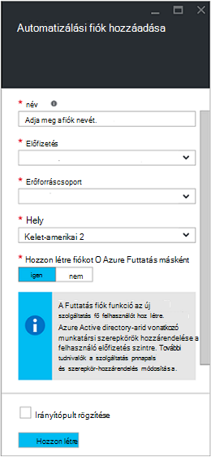
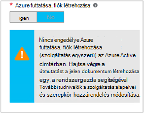

<properties
   pageTitle="Azure Active Directory-fiók beállítása |} Microsoft Azure"
   description="Ez a cikk ismerteti, hogyan runbooks Azure Active Directory felhasználói fiók hitelesítő adatainak beállítása az Azure automatizálási ARM és ASM elleni hitelesítést végezni."
   services="automation"
   documentationCenter=""
   authors="MGoedtel"
   manager="jwhit"
   editor="tysonn"
   keywords="Azure active directory felhasználói azure szolgáltatás felügyeleti azure Active Directory felhasználói fiók" />
<tags
   ms.service="automation"
   ms.devlang="na"
   ms.topic="get-started-article"
   ms.tgt_pltfrm="na"
   ms.workload="infrastructure-services"
   ms.date="09/12/2016"
   ms.author="magoedte" />

# Azure Szolgáltatáskezelés és erőforrás-kezelő Runbooks hitelesítő

Ez a cikk azokkal a lépésekkel, el kell végeznie az Azure szolgáltatás felügyeleti (ASM) vagy az Azure erőforrás Manager (ARM) erőforrások futó Azure automatizálási runbooks az Azure Active Directory felhasználói fiók konfigurálására.  Ez lehet egy által támogatott hitelesítéstípusok identitás a ARM-alapú runbooks továbbra is, miközben az ajánlott módszer az új Azure Futtatás mint fiókot használ.       

## Azure Active Directory új felhasználó létrehozása

1. Jelentkezzen be az Azure klasszikus portálra szolgáltatás rendszergazdái az Azure előfizetés kezelni szeretné.
2. Jelölje ki az **Active Directory**, és válassza ki a szervezeti könyvtár nevét.
3. A **felhasználók** lapon jelölje ki, és ezt követően a parancsot területen jelölje ki a **Felhasználó hozzáadása**.
4. A **mondja el a felhasználóra vonatkozó** lapján a **felhasználó típusa**csoportban jelölje be **a szervezet új felhasználó**.
5. Adja meg a felhasználónevet.  
6. Válassza az Azure Active Directory lapon-előfizetéséhez társított címtár nevét.
7. A **felhasználói profil** lapon adja meg egy első és utolsó nevét, egy könnyen megjegyezhető nevet és felhasználói **szerepkörök** listájából.  **Többtényezős hitelesítés engedélyezése**teheti meg.
8. Megjegyzés: a felhasználó teljes nevét és az ideiglenes jelszót.
9. Válassza a **beállításai > rendszergazdák > hozzáadása**.
10. Írja be a teljes felhasználónevet, az Ön által létrehozott felhasználó.
11. Jelölje ki azt az előfizetést, és azt szeretné, hogy a felhasználók kezelése.
12. Azure kijelentkezik, és jelentkezzen be az imént létrehozott fiókkal. A rendszer kéri a jelszó módosítása.

## Automatizálási fiók létrehozása az Azure klasszikus portálon
Ebben a részben fog hajtsa végre az alábbi lépésekkel Azure automatizálási új fiók létrehozása az Azure-portálon a ASM és ARM módban erőforrások kezelésére runbooks használt.  

>[AZURE.NOTE] Automatizálási-fiókok létrehozása az Azure klasszikus portált a mind az Azure klasszikus és Azure portál és -vagy kezelhető parancsmagok. Amikor létrejött a fiókot, akkor mindegy, hogyan létrehozása és kezelése a számla belüli erőforrások. Ha továbbra is használhatja az Azure klasszikus portál szeretné, majd kell használni azt helyett az Azure-portálon hozhat létre bármely automatizálást fiókot.

1. Jelentkezzen be az Azure klasszikus portálra szolgáltatás rendszergazdái az Azure előfizetés kezelni szeretné.
2. Jelölje be az **automatizálási**.
3. Az **automatizálási** lapon jelölje be az **automatizálási fiók létrehozása**.
4. **Automatizálási fiók létrehozása** mezőbe írja be az automatizálási-fiókja nevét, és válassza a **régió** a legördülő listából.  
5. Kattintson az **OK** gombra a beállítások elfogadásához és a fiók létrehozásához.
6. Létrehozása után, az **automatizálási** oldalon megjelenik.
7. Kattintson a fiók, és azt állapotba kerül, az irányítópult lapra.  
8. Az automatizálási irányítópult lapon válassza ki az **eszközöket**.
9. Az **eszközök** lapon válassza a **Beállítások hozzáadása** , a lap alján található.
10. A **Beállítások hozzáadása** lapon **Adja hozzá a hitelesítő adatok**kijelölése
11. **Határozza meg a hitelesítő adatok** lapján a **Hitelesítőadat-típus** legördülő listából válassza ki a **Windows PowerShell hitelesítő adatok** , és adjon meg egy nevet a hitelesítő adatok.
12. A következő **Hitelesítő megadása** lap típusú a felhasználónév az Active Directory felhasználói fiók a korábban létrehozott a **Felhasználónév** mezőbe, és a jelszót a **jelszó** és **A jelszó megerősítése** mezőben. Kattintson az **OK gombra** a módosítások mentéséhez.

## Automatizálási fiók létrehozása az Azure-portálon

Ebben a részben fog hajtsa végre az alábbi lépésekkel Azure automatizálást új fiók létrehozása az Azure-portálra, amikor a runbooks irányító ARM üzemmódban használt.  

1. Jelentkezzen be az Azure-portálra szolgáltatás rendszergazdái az Azure előfizetés kezelni szeretné.
2. Jelölje be **az automatizálási fiók**.
3. Az automatizálási fiókok a lap kattintson a **Hozzáadás**gombra. 
2. Az **Automatizálási fiók hozzáadása** lap, a **név** mezőbe írja be az automatizálási-fiókja nevét.
5. Ha egynél több előfizetése van, adja meg az új fiók, valamint egy új vagy meglévő **erőforráscsoport** és az Azure adatközponthoz **helyét**.
3. Jelölje be a **fiók létrehozása Azure Futtatás mint** beállítás értéke **nincs** , és kattintson a **Létrehozás** gombra.  

    >[AZURE.NOTE] Ha úgy dönt, hogy hozzon létre a Futtatás mint fiókot a **nincs**lehetőség választásával, bemutatni az **Automatizálási fiók hozzáadása** lap figyelmeztető üzenetet.  Miközben a fiók létrehozása és az előfizetés vonatkozó **munkatársi** szerepkörök rendelt, nem lesz egy megfelelő hitelesítési identitás belül az előfizetések címtárszolgáltatásába, és ezért nincs access erőforrás előfizetéséhez.  Megakadályozza, hogy minden olyan runbooks hivatkozó ehhez a fiókhoz nem hitelesítést végezni, és ellen erőforrások ARM műveleteket hajthat végre.

    

4. Azure létrehozza az automatizálási-fiókot, miközben Ön nyomon követheti a **értesítések** a menüből.

A hitelesítő adatok kibocsátása befejezése után, majd kell hitelesítő eszköz társíthatja az automatizálási fiókot a korábban létrehozott AD felhasználói fiók létrehozása.  Ne feledje, csak a automatizálást fiók létrehozott, és nem társított hitelesítési identitással.  Hajtsa végre a [hitelesítő adatok eszközök Azure automatizálást a cikkben](../automation/automation-credentials.md#creating-a-new-credential) ismertetett lépéseket, és írja be **felhasználónevét** a formátum **tartomány\felhasználó**a értékét.

## A hitelesítő adatok használata egy runbook

Egy runbook a [Get-AutomationPSCredential](http://msdn.microsoft.com/library/dn940015.aspx) tevékenységet használ a hitelesítő adatok beolvasásához, és akkor később felhasználhatja a [Hozzáadás-AzureAccount](http://msdn.microsoft.com/library/azure/dn722528.aspx) csatlakoztatása az Azure előfizetés. Ha a hitelesítő adatok rendszergazda több Azure-előfizetések akkor kell is használnia [Kijelölése-AzureSubscription](http://msdn.microsoft.com/library/dn495203.aspx) adja meg a megfelelő fiókot. Ez a példa a Windows PowerShell az alábbi, amely általában megjelenik a legtöbb Azure automatizálási runbooks tetején látható.

    $cred = Get-AutomationPSCredential –Name "myuseraccount.onmicrosoft.com"
    Add-AzureAccount –Credential $cred
    Select-AzureSubscription –SubscriptionName "My Subscription"

Bármely [pontjainak](http://technet.microsoft.com/library/dn469257.aspx#bk_Checkpoints) után a runbook ezek azok a sorok kell ismételnie. Ha egy másik alkalmazottnak majd folytatja a runbook fel van függesztve, majd meg kell hitelesítéshez újra.

## Következő lépések
* Nézze meg az típusai eltérő runbook és a lépéseket a saját runbooks létrehozásához a következő cikkben [Azure automatizálást runbook típusai](../automation/automation-runbook-types.md)
