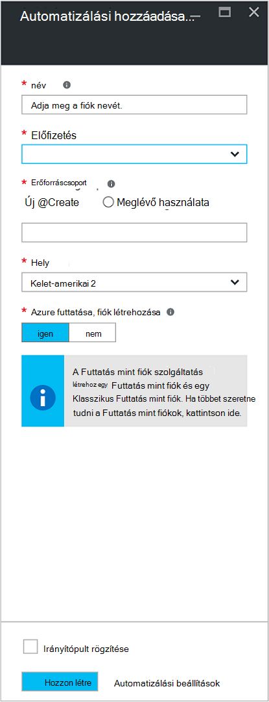
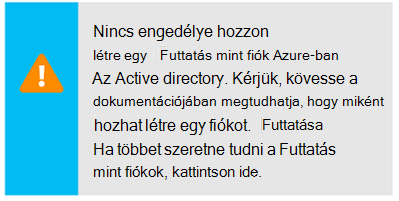
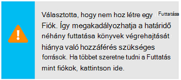
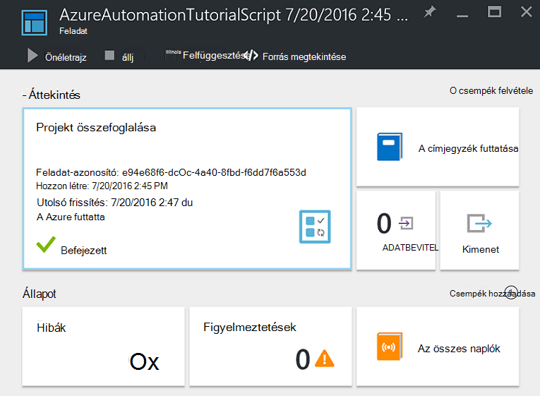
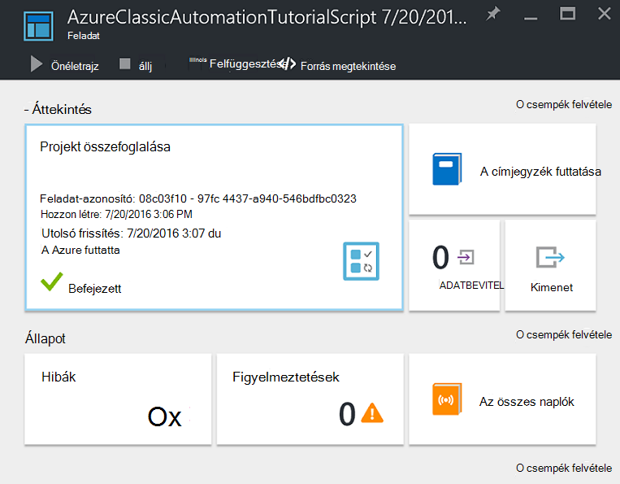
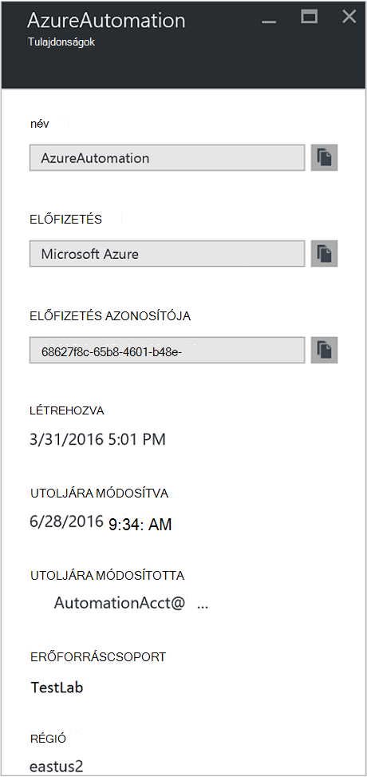

<properties
    pageTitle="Állítsa be a Futtatás Azure fiókként |} Microsoft Azure"
    description="Oktatóanyag, amely végigvezeti biztonsági fő hitelesítési az Azure automatizálás létrehozási, tesztelése és példa-e."
    services="automation"
    documentationCenter=""
    authors="mgoedtel"
    manager="jwhit"
    editor=""
    keywords="szolgáltatásnévvel, setspn, azure hitelesítés"/>
<tags
    ms.service="automation"
    ms.workload="tbd"
    ms.tgt_pltfrm="na"
    ms.devlang="na"
    ms.topic="get-started-article"
    ms.date="08/17/2016"
    ms.author="magoedte"/>

# Hitelesítő Runbooks Azure Futtatás mint fiókkal

Ez a témakör bemutatja, hogyan funkcióval futtatása fiók runbooks irányító erőforrások az Azure erőforrás-kezelő vagy a Azure Szolgáltatáskezelés hitelesítést végezni az Azure portálról az automatizálási fiók konfigurálására.

Új fiók automatizálást az Azure-portálon létrehozásakor automatikusan hoz:

- Futtassa a fiókot, amely hoz létre egy új szolgáltatás egyszerű az Azure Active Directory, a tanúsítvány és a közös munka szerepköralapú hozzáférés-szerepalapú, runbooks segítségével erőforrás-kezelő erőforrások kezelésére szolgáló rendel.   
- Klasszikus Futtatás mint fiók feltöltésével, Azure Szolgáltatáskezelés vagy klasszikus erőforrásoknak runbooks kezelésére szolgáló felügyeleti tanúsítvány.  

Ez a folyamat, és Ön gyors létrehozása és telepíti az igényeinek megfelelően automatizálást támogató runbooks segít egyszerűbbé teszi.      

Futtatása és klasszikus futtatása fiókot használ, a következőket teheti:

- Kínál használ az Azure hitelesítést végezni, amikor az Azure-portálon runbooks az Azure erőforrás-kezelő vagy Azure Szolgáltatáskezelés erőforrások kezelésére.  
- Globális runbooks konfigurálva a Azure értesítések e automatizálása.

>[AZURE.NOTE] Az automatizálási globális Runbooks [riasztási integrációja funkció](../monitoring-and-diagnostics/insights-receive-alert-notifications.md) Azure-automatizálási be van állítva a Futtatás másként és klasszikus Futtatás mint számlát szükséges. Jelöljön ki egy automatizálási fiókot, amely már rendelkezik egy definiált futtatása és klasszikus futtatása fiókkal, vagy válassza a hozzon létre egy újat.

Azt mutatja be az automatizálási fiók létrehozása az Azure portálról, frissítse a PowerShell használatá automatizálási fiók, és bemutatják, hogyan kívánja hitelesíteni a runbooks a.

Előtte, van néhány dolgot kell dátumtáblázatok ismertetése és a folytatás előtt mérlegelendő szempontokat.

1. A klasszikus vagy az erőforrás-kezelő telepítési modell hozta létre, meglévő automatizálási fiókok nincs hatással.  
2. Ez csak az automatizálási-fiókok létrehozása az Azure portálon keresztül fog működni.  Hozzon létre egy fiókot a klasszikus portálról kísérel meg nem bizonyos a Futtatás mint fiók konfigurálása.
3. Ha a telepített runbooks és eszközök (azaz ütemezések, változók, stb.) korábban létrehozott klasszikus erőforrások kezelésére, és azt szeretné, hogy ezek runbooks hitelesítést végezni az új klasszikus Futtatás mint fiókkal, szüksége lesz térjen át ezekkel az új automatizálási fiók, és frissítheti a meglévő fiók használatával az alábbi PowerShell parancsprogramot.  
4. Az új Futtatás mint fiók és azonosítania klasszikus futtatása mint automatizálási fiók, módosítania kell a meglévő runbooks az alábbi példa kóddal.  A kezelés tanúsítvány Szolgáltatáskezelés erőforrások hitelesítést **, kérjük, vegye figyelembe** , hogy a Futtatás mint fiókról van szó a fő tanúsítvány-alapú szolgáltatást, és a klasszikus Futtatás mint fiók segítségével erőforrás-kezelő erőforrások hitelesítését nem.     

## Automatizálási új fiók létrehozása az Azure portálról

Ebben a részben fog hajtsa végre az alábbi lépésekkel Azure automatizálást új fiók létrehozása az Azure portálról.  Ezzel létrehozott, a Futtatás mint és klasszikus Futtatás mint fiók.  

>[AZURE.NOTE] A felhasználónak, hajt végre az alábbi lépéseket *kell* lennie, az előfizetés Rendszergazdák szerepkör tagja és az előfizetést, az előfizetés a felhasználó hozzáférést nyújtó közös rendszergazdaként.  A felhasználó is hozzá kell adni a felhasználók számára, hogy az előfizetések alapértelmezett az Active Directory; a fiók nem kell a Yammerhez szerepkör-e kiosztani.

1. Jelentkezzen be az előfizetés Rendszergazdák szerepkör tagja, és az előfizetés közös rendszergazdai fiókkal az Azure-portálra.
2. Jelölje be **az automatizálási fiók**.
3. Az automatizálási fiókok a lap kattintson a **Hozzáadás**gombra. 

    >[AZURE.NOTE]Az **Automatizálási fiók hozzáadása** lap a következő figyelmeztetés jelenik meg, ha az mivel a fiók nem tagja a előfizetés Rendszergazdák szerepkörnek és további-rendszergazda, az előfizetés. 

4. Az **Automatizálási fiók hozzáadása** lap, a **név** mezőbe írja be az automatizálási-fiókja nevét.
5. Ha egynél több előfizetése van, válassza az új fiók, valamint egy új vagy meglévő **erőforráscsoport** és az Azure adatközponthoz **helyét**.
6. Ellenőrizze az az érték **Igen** ki van jelölve a **fiók létrehozása Azure Futtatás mint** lehetőséget, és kattintson a **Létrehozás** gombra.  

    >[AZURE.NOTE] Ha úgy dönt, hogy hozzon létre a Futtatás mint fiókot a **nincs**lehetőség választásával, bemutatni az **Automatizálási fiók hozzáadása** lap figyelmeztető üzenetet.  Az Azure-portálon létrejön a fiók, amíg nem lesz a megfelelő hitelesítési identitás belül a klasszikus vagy, erőforrás-kezelő előfizetés címtár-szinkronizálás eszközének és ezért erőforrások nem lehet hozzáférni az előfizetésben.  Megakadályozza, hogy minden olyan runbooks hivatkozó ehhez a fiókhoz nem hitelesítést végezni, és ezeket telepítési modellek ellen erőforrások feladatokat.

    > 
A szolgáltatás egyszerű nem létrehozásakor vonatkozó munkatársi szerepkörök nincs rendelhető.

7. Azure létrehozza az automatizálási-fiókot, miközben Ön nyomon követheti a **értesítések** a menüből.

### Beépített erőforrások

Az automatizálási fiókot sikeresen létrehozásakor számos erőforrások automatikusan létrejönnek.  Az alábbi táblázat összefoglalja a Futtatás mint fiókom erőforrásokat. 

Erőforrás|Leírás
--------|-----------
AzureAutomationTutorial Runbook|Egy példa PowerShell runbook, amely bemutatja, hogyan hitelesítse a Futtatás mint-fiókkal, és az erőforrás-kezelő-erőforrások kap.
AzureAutomationTutorialScript Runbook|Egy példa PowerShell runbook, amely bemutatja, hogyan hitelesítést végezni, a Futtatás mint fiókkal, és az erőforrás-kezelő-erőforrások kap.
AzureRunAsCertificate|Tanúsítvány eszköz automatikusan automatizálási fiók létrehozása során létre vagy az alábbi PowerShell-parancsprogramot a meglévő fiók.  Lehetővé teszi, hogy az erőforrás-kezelő Azure erőforrások runbooks kezelheti az Azure hitelesítést végezni.  A tanúsítvány egy egyéves élettartam tartalmaz.
AzureRunAsConnection|Kapcsolat eszköz automatikusan automatizálást fiók létrehozása során létre vagy az alábbi PowerShell-parancsprogramot a meglévő fiók.

Az alábbi táblázat összefoglalja a klasszikus Futtatás mint fiók erőforrások. 

Erőforrás|Leírás
--------|-----------
AzureClassicAutomationTutorial Runbook|Példa runbook, amely megkapja a klasszikus VMs klasszikus futtatása mint-fiókkal (tanúsítvány) előfizetést, és majd exportálja a virtuális nevét és állapotát.
AzureClassicAutomationTutorial parancsfájl Runbook|Példa runbook, amely megkapja a klasszikus VMs klasszikus futtatása mint-fiókkal (tanúsítvány) előfizetést, és majd exportálja a virtuális nevét és állapotát.
AzureClassicRunAsCertificate|Tanúsítvány eszköz automatikusan létrehozott használt, hogy az Azure klasszikus erőforrások runbooks kezelheti az Azure hitelesítést végezni.  A tanúsítvány egy egyéves élettartam tartalmaz.
AzureClassicRunAsConnection|Kapcsolat eszköz automatikusan létrehozott használt, hogy az Azure klasszikus erőforrások runbooks kezelheti az Azure hitelesítést végezni.  

## Futtatás más néven a hitelesítés ellenőrzése

Ezután azt elvégez egy kis próba tud sikerült hitelesíteni a Futtatás mint új fiókkal megerősítéséhez.     

1. Az Azure-portálon nyissa meg a korábban létrehozott automatizálási fiókot.  
2. Kattintson a nyissa meg a listát a runbooks **Runbooks** csempére.
3. Jelölje ki a **AzureAutomationTutorialScript** runbook, és kattintson a **Start** a runbook indításához.  Egy kérdés a runbook elindítani kívánt ellenőrzése kap.
4. A [runbook feladat](automation-runbook-execution.md) jön létre, a feladat lap jelenik meg, és a feladat állapota jelenik meg a **Projekt összefoglaló** csempére.  
5. A feladat állapota szerint *várólistás* jelző, elérhetővé válik a felhőben runbook dolgozó Várakozás fog elindulni. *Kezdő* majd azt helyezi át, amikor egy dolgozó követelések a feladatot, majd a *operációs rendszert futtató* indításakor a runbook ténylegesen operációs rendszert futtató.  
6. A runbook feladat befejezésekor **Befejezett**állapotú kell láthatja.   
7. A runbook részletes eredményének megtekintéséhez kattintson a **kimeneti** csempére.
8. A **Kimenet** lap látnia sikeresen hitelesített, és az összes erőforrás elérhető az erőforráscsoport listáját adja vissza.
9. Zárja be a **kimeneti** lap visszatérni a **Projekt összefoglaló** lap.
13. Zárja be a **Projekt összefoglalása** és a megfelelő **AzureAutomationTutorialScript** runbook lap.

## Klasszikus Futtatás más néven a hitelesítés ellenőrzése

Ezután azt elvégez egy kis próba tud sikerült hitelesíteni a az új fiókkal klasszikus Futtatás mint megerősítéséhez.     

1. Az Azure-portálon nyissa meg a korábban létrehozott automatizálási fiókot.  
2. Kattintson a nyissa meg a listát a runbooks **Runbooks** csempére.
3. Jelölje ki a **AzureClassicAutomationTutorialScript** runbook, és kattintson a **Start** a runbook indításához.  Egy kérdés a runbook elindítani kívánt ellenőrzése kap.
4. A [runbook feladat](automation-runbook-execution.md) jön létre, a feladat lap jelenik meg, és a feladat állapota jelenik meg a **Projekt összefoglaló** csempére.  
5. A feladat állapota szerint *várólistás* jelző, elérhetővé válik a felhőben runbook dolgozó Várakozás fog elindulni. *Kezdő* majd azt helyezi át, amikor egy dolgozó követelések a feladatot, majd a *operációs rendszert futtató* indításakor a runbook ténylegesen operációs rendszert futtató.  
6. A runbook feladat befejezésekor **Befejezett**állapotú kell láthatja.   
7. A runbook részletes eredményének megtekintéséhez kattintson a **kimeneti** csempére.
8. A **Kimenet** lap sikeresen hitelesített, és minden klasszikus virtuális listája az előfizetés által visszaadott láthatók.
9. Zárja be a **kimeneti** lap visszatérni a **Projekt összefoglaló** lap.
13. Zárja be a **Projekt összefoglalása** és a megfelelő **AzureClassicAutomationTutorialScript** runbook lap.

## Frissítse a PowerShell használatá automatizálási fiók

Itt biztosítunk Önnek a vezérlőt, amellyel módosíthatja a meglévő automatizálási fiókjához, ha a PowerShell használatával:

1. Automatizálási fiók létrehozott, de elutasító személyek, a Futtatás mint fiók létrehozása
2. Már van automatizálási fiókja, az erőforrás-kezelő erőforrások kezelésére és frissítheti a Futtatás mint fiók runbook hitelesítéshez felvenni kívánt
2. Klasszikus erőforrások kezelésére automatizálást fiókkal már rendelkezik, és állítsa át a klasszikus Futtatás mint helyett az új fiók létrehozása és a runbooks és eszközök áttelepítése hozzá szeretne   

A folytatás előtt ellenőrizze az alábbiakat:

1. Letöltött van, és telepítve van a [Windows Management Framework (WMF) 4.0-s](https://www.microsoft.com/download/details.aspx?id=40855) , ha futtatja a Windows 7-ben.   
    Ha futtatja a Windows Server 2012 R2, a Windows Server 2012-ben, a Windows 2008 R2, a Windows 8.1 és a Windows 7 SP1, a telepítéshez [Windows Management Framework 5.0](https://www.microsoft.com/download/details.aspx?id=50395) érhető el.
2. Azure PowerShell 1.0. Ebben a verzióban, és útmutatást adunk a telepítés tudni megtudhatja, [hogy miként telepítheti, állíthatja Azure PowerShell](../powershell-install-configure.md).
3. Automatizálási fiók hozott létre.  Ehhez a fiókhoz fog vonatkozni fog paraméterek dátumaként – AutomationAccountName és - ApplicationDisplayName mindkét alábbi parancsfájlok.

Úgy juthat az értékek *SubscriptionID*, *ResourceGroup*és *AutomationAccountName*, melyek a parancsfájlok az Azure-portálon szükséges paraméterek jelölje be az automatizálási fiókját az **automatizálási fiók** lap a, és válassza a **minden beállítások**.  Az **összes beállítások** lap, a **Fiókbeállítások** csoportban válassza a **Tulajdonságok parancsot**.  Az a **tulajdonságokat** lap Megjegyzés: ezeket az értékeket.    

### Futtatás másként fiók PowerShell-parancsprogramot létrehozása

Az alábbi PowerShell parancsprogramot fog konfigurálni az alábbiakat:

- Azure Active Directory alkalmazás fog sikerült hitelesíteni a önaláírt tanúsítvány ehhez az alkalmazáshoz szolgáltatás fő fiók létrehozása az Azure Active Directory és a (úgy módosíthatja a tulajdonos vagy bármely más szerepkör) munkatársi szerepkörök ehhez a fiókhoz, az aktuális előfizetése rendelve.  További információért olvassa el a [szerepköralapú hozzáférés-vezérlés Azure automatizálási](../automation/automation-role-based-access-control.md) cikk.
- Automatizálási tanúsítvány tárgyi eszköz megadott automatizálási fiók nevű **AzureRunAsCertificate**, a fő szolgáltatás által használt tanúsítvány betöltő.
- Automatizálási kapcsolat tárgyi eszköz megadott automatizálási fiók nevű **AzureRunAsConnection**, amely rendelkezik a applicationId, a tenantId, a subscriptionId és a tanúsítvány ujjlenyomat.    

Az alábbi lépésekkel végigvezeti a folyamaton, az parancsfájl.

1. A következő parancsfájl mentése a számítógépre.  Ebben a példában a Fájlnév **Új-AzureServicePrincipal.ps1**mentse.  

        #Requires -RunAsAdministrator
        Param (
        [Parameter(Mandatory=$true)]
        [String] $ResourceGroup,

        [Parameter(Mandatory=$true)]
        [String] $AutomationAccountName,

        [Parameter(Mandatory=$true)]
        [String] $ApplicationDisplayName,

        [Parameter(Mandatory=$true)]
        [String] $SubscriptionId,

        [Parameter(Mandatory=$true)]
        [String] $CertPlainPassword,

        [Parameter(Mandatory=$false)]
        [int] $NoOfMonthsUntilExpired = 12
        )

        Login-AzureRmAccount
        Import-Module AzureRM.Resources
        Select-AzureRmSubscription -SubscriptionId $SubscriptionId

        $CurrentDate = Get-Date
        $EndDate = $CurrentDate.AddMonths($NoOfMonthsUntilExpired)
        $KeyId = (New-Guid).Guid
        $CertPath = Join-Path $env:TEMP ($ApplicationDisplayName + ".pfx")

        $Cert = New-SelfSignedCertificate -DnsName $ApplicationDisplayName -CertStoreLocation cert:\LocalMachine\My -KeyExportPolicy Exportable -Provider "Microsoft Enhanced RSA and AES Cryptographic Provider"

        $CertPassword = ConvertTo-SecureString $CertPlainPassword -AsPlainText -Force
        Export-PfxCertificate -Cert ("Cert:\localmachine\my\" + $Cert.Thumbprint) -FilePath $CertPath -Password $CertPassword -Force | Write-Verbose

        $PFXCert = New-Object -TypeName System.Security.Cryptography.X509Certificates.X509Certificate -ArgumentList @($CertPath, $CertPlainPassword)
        $KeyValue = [System.Convert]::ToBase64String($PFXCert.GetRawCertData())

        $KeyCredential = New-Object  Microsoft.Azure.Commands.Resources.Models.ActiveDirectory.PSADKeyCredential
        $KeyCredential.StartDate = $CurrentDate
        $KeyCredential.EndDate= $EndDate
        $KeyCredential.KeyId = $KeyId
        $KeyCredential.Type = "AsymmetricX509Cert"
        $KeyCredential.Usage = "Verify"
        $KeyCredential.Value = $KeyValue

        # Use Key credentials
        $Application = New-AzureRmADApplication -DisplayName $ApplicationDisplayName -HomePage ("http://" + $ApplicationDisplayName) -IdentifierUris ("http://" + $KeyId) -KeyCredentials $keyCredential

        New-AzureRMADServicePrincipal -ApplicationId $Application.ApplicationId | Write-Verbose
        Get-AzureRmADServicePrincipal | Where {$_.ApplicationId -eq $Application.ApplicationId} | Write-Verbose

        $NewRole = $null
        $Retries = 0;
        While ($NewRole -eq $null -and $Retries -le 6)
        {
           # Sleep here for a few seconds to allow the service principal application to become active (should only take a couple of seconds normally)
           Sleep 5
           New-AzureRMRoleAssignment -RoleDefinitionName Contributor -ServicePrincipalName $Application.ApplicationId | Write-Verbose -ErrorAction SilentlyContinue
           Sleep 10
           $NewRole = Get-AzureRMRoleAssignment -ServicePrincipalName $Application.ApplicationId -ErrorAction SilentlyContinue
           $Retries++;
        }

        # Get the tenant id for this subscription
        $SubscriptionInfo = Get-AzureRmSubscription -SubscriptionId $SubscriptionId
        $TenantID = $SubscriptionInfo | Select TenantId -First 1

        # Create the automation resources
        New-AzureRmAutomationCertificate -ResourceGroupName $ResourceGroup -AutomationAccountName $AutomationAccountName -Path $CertPath -Name AzureRunAsCertificate -Password $CertPassword -Exportable | write-verbose

        # Create a Automation connection asset named AzureRunAsConnection in the Automation account. This connection uses the service principal.
        $ConnectionAssetName = "AzureRunAsConnection"
        Remove-AzureRmAutomationConnection -ResourceGroupName $ResourceGroup -AutomationAccountName $AutomationAccountName -Name $ConnectionAssetName -Force -ErrorAction SilentlyContinue
        $ConnectionFieldValues = @{"ApplicationId" = $Application.ApplicationId; "TenantId" = $TenantID.TenantId; "CertificateThumbprint" = $Cert.Thumbprint; "SubscriptionId" = $SubscriptionId}
        New-AzureRmAutomationConnection -ResourceGroupName $ResourceGroup -AutomationAccountName $AutomationAccountName -Name $ConnectionAssetName -ConnectionTypeName AzureServicePrincipal -ConnectionFieldValues $ConnectionFieldValues

2. A számítógépen indítsa el a **Windows PowerShell** **a kezdőképernyőn, emelt szintű felhasználói engedélyekkel** .
3. A rendszergazda jogú PowerShell parancssori rendszerhéj nyissa meg azt a mappát, amely tartalmazza az 1 létrehozott parancsfájl, és hajtsa végre a parancsfájlt, az értékek paramétereinek módosítása *– ResourceGroup*, *- AutomationAccountName*, *- ApplicationDisplayName*, *- SubscriptionId*és *- CertPlainPassword*. 

    >[AZURE.NOTE] Az Azure hitelesítést végezni, akkor hajtsa végre a parancsfájlt után kéri. Jelentkezzen be egy, az előfizetés Rendszergazdák szerepkör tagja és az előfizetés további rendszergazdai fiókkal.

        .\New-AzureServicePrincipal.ps1 -ResourceGroup <ResourceGroupName>
        -AutomationAccountName <NameofAutomationAccount> `
        -ApplicationDisplayName <DisplayNameofAutomationAccount> `
        -SubscriptionId <SubscriptionId> `
        -CertPlainPassword "<StrongPassword>"  
 

Után a parancsfájl sikeresen befejeződött, olvassa el az alábbi hitelesítést végezni az erőforrás-kezelő erőforrások és a hitelesítő adatok konfiguráció érvényesítése [példakódot](#sample-code-to-authenticate-with-resource-manager-resources) .

### Hozzon létre fiókot PowerShell-parancsprogramot klasszikus Futtatás másként

Az alábbi PowerShell parancsprogramot fog konfigurálni az alábbiakat:

- Automatizálási tanúsítvány tárgyi eszköz megadott automatizálást fiók nevű **AzureClassicRunAsCertificate**, amely a tanúsítvánnyal hitelesíti a runbooks.
- Automatizálási kapcsolat tárgyi eszköz megadott automatizálási fiók nevű **AzureClassicRunAsConnection**, az előfizetés nevét, subscriptionId és tanúsítvány eszköz betöltő.

A parancsfájl fog management önaláírt tanúsítvány létrehozása és mentse az ideiglenes fájlok mappát a felhasználói profil végrehajtása a PowerShell-munkamenet - *%USERPROFILE%\AppData\Local\Temp*használt csoportban a számítógépen.  Parancsfájl végrehajtás, után szüksége lesz az Azure management tanúsítvány feltöltése a tárba kezelése az előfizetés az automatizálási fiók készült.  Az alábbi lépésekkel végigvezeti a folyamaton, az parancsfájl, majd feltölti a tanúsítvány.  

1. A következő parancsfájl mentése a számítógépre.  Ebben a példában a Fájlnév **Új-AzureClassicRunAsAccount.ps1**mentse.

        #Requires -RunAsAdministrator
        Param (
        [Parameter(Mandatory=$true)]
        [String] $ResourceGroup,

        [Parameter(Mandatory=$true)]
        [String] $AutomationAccountName,

        [Parameter(Mandatory=$true)]
        [String] $ApplicationDisplayName,

        [Parameter(Mandatory=$true)]
        [String] $SubscriptionId,

        [Parameter(Mandatory=$true)]
        [String] $CertPlainPassword,

        [Parameter(Mandatory=$false)]
        [int] $NoOfMonthsUntilExpired = 12
        )

        Login-AzureRmAccount
        Import-Module AzureRM.Resources
        $Subscription = Select-AzureRmSubscription -SubscriptionId $SubscriptionId
        $SubscriptionName = $subscription.Subscription.SubscriptionName

        $CurrentDate = Get-Date
        $EndDate = $CurrentDate.AddMonths($NoOfMonthsUntilExpired)
        $KeyId = (New-Guid).Guid
        $CertPath = Join-Path $env:TEMP ($ApplicationDisplayName + ".pfx")
        $CertPathCer = Join-Path $env:TEMP ($ApplicationDisplayName + ".cer")

        $Cert = New-SelfSignedCertificate -DnsName $ApplicationDisplayName -CertStoreLocation cert:\LocalMachine\My -KeyExportPolicy Exportable -Provider "Microsoft Enhanced RSA and AES Cryptographic Provider"

        $CertPassword = ConvertTo-SecureString $CertPlainPassword -AsPlainText -Force
        Export-PfxCertificate -Cert ("Cert:\localmachine\my\" + $Cert.Thumbprint) -FilePath $CertPath -Password $CertPassword -Force | Write-Verbose
        Export-Certificate -Cert ("Cert:\localmachine\my\" + $Cert.Thumbprint) -FilePath $CertPathCer -Type CERT | Write-Verbose

        # Create the automation resources
        $ClassicCertificateAssetName = "AzureClassicRunAsCertificate"
        New-AzureRmAutomationCertificate -ResourceGroupName $ResourceGroup -AutomationAccountName $AutomationAccountName -Path $CertPath -Name $ClassicCertificateAssetName  -Password $CertPassword -Exportable | write-verbose

        # Create a Automation connection asset named AzureClassicRunAsConnection in the Automation account. This connection uses the ClassicCertificateAssetName.
        $ConnectionAssetName = "AzureClassicRunAsConnection"
        Remove-AzureRmAutomationConnection -ResourceGroupName $ResourceGroup -AutomationAccountName $AutomationAccountName -Name $ConnectionAssetName -Force -ErrorAction SilentlyContinue
        $ConnectionFieldValues = @{"SubscriptionName" = $SubscriptionName; "SubscriptionId" = $SubscriptionId; "CertificateAssetName" = $ClassicCertificateAssetName}
        New-AzureRmAutomationConnection -ResourceGroupName $ResourceGroup -AutomationAccountName $AutomationAccountName -Name $ConnectionAssetName -ConnectionTypeName AzureClassicCertificate -ConnectionFieldValues $ConnectionFieldValues

        Write-Host -ForegroundColor red "Please upload the cert $CertPathCer to the Management store by following the steps below."
        Write-Host -ForegroundColor red "Log in to the Microsoft Azure Management portal (https://manage.windowsazure.com) and select Settings -> Management Certificates."
        Write-Host -ForegroundColor red "Then click Upload and upload the certificate $CertPathCer"

2. A számítógépen indítsa el a **Windows PowerShell** **a kezdőképernyőn, emelt szintű felhasználói engedélyekkel** .  
3. A rendszergazda jogú PowerShell parancssori rendszerhéj nyissa meg azt a mappát, amely tartalmazza az 1 létrehozott parancsfájl, és hajtsa végre a parancsfájlt, az értékek paramétereinek módosítása *– ResourceGroup*, *- AutomationAccountName*, *- ApplicationDisplayName*, *- SubscriptionId*és *- CertPlainPassword*. 

    >[AZURE.NOTE] Az Azure hitelesítést végezni, akkor hajtsa végre a parancsfájlt után kéri. Jelentkezzen be egy, az előfizetés Rendszergazdák szerepkör tagja és az előfizetés további rendszergazdai fiókkal.

        .\New-AzureClassicRunAsAccount.ps1 -ResourceGroup <ResourceGroupName>
        -AutomationAccountName <NameofAutomationAccount> `
        -ApplicationDisplayName <DisplayNameofAutomationAccount> `
        -SubscriptionId <SubscriptionId> `
        -CertPlainPassword "<StrongPassword>"

A parancsfájl sikeresen befejeződése után szüksége lesz az a felhasználói profil **Temp** mappában létrehozott tanúsítványát másolásához.  Kövesse a feltölthető [management API tanúsítvány](../azure-api-management-certs.md) az Azure klasszikus portálra, és ezután [példakódot](#sample-code-to-authenticate-with-service-management-resources) hitelesítőadat-konfiguráció Szolgáltatáskezelés erőforrásokkal érvényesítése hivatkozni.

## Az erőforrás-kezelő erőforrások hitelesítést végezni példakódot

Az alábbi, frissített példakódot hitelesítést végezni, a Futtatás mint fiók használatával kezelheti a runbooks az erőforrás-kezelő erőforrásokat a **AzureAutomationTutorialScript** példa runbook vett használható.   

    $connectionName = "AzureRunAsConnection"
    $SubId = Get-AutomationVariable -Name 'SubscriptionId'
    try
    {
       # Get the connection "AzureRunAsConnection "
       $servicePrincipalConnection=Get-AutomationConnection -Name $connectionName         

       "Logging in to Azure..."
       Add-AzureRmAccount `
         -ServicePrincipal `
         -TenantId $servicePrincipalConnection.TenantId `
         -ApplicationId $servicePrincipalConnection.ApplicationId `
         -CertificateThumbprint $servicePrincipalConnection.CertificateThumbprint
       "Setting context to a specific subscription"  
       Set-AzureRmContext -SubscriptionId $SubId             
    }
    catch {
        if (!$servicePrincipalConnection)
        {
           $ErrorMessage = "Connection $connectionName not found."
           throw $ErrorMessage
         } else{
            Write-Error -Message $_.Exception
            throw $_.Exception
         }
    }

A parancsfájl a támogatási hivatkozó előfizetés környezetben, hogy könnyen több előfizetés között két további kódsorokat is tartalmaz. A változó eszköz SubscriptionId nevű az előfizetés Azonosítóját tartalmazza, és a Hozzáadás-AzureRmAccount parancsmag utasítás után, a [Set-AzureRmContext parancsmag](https://msdn.microsoft.com/library/mt619263.aspx) fentebb, az a paraméter megadása *- SubscriptionId*. Ha túl általános változó nevét, az a változó előtag vagy más elnevezési konvenció könnyebb azonosítása az adott célra nevét is módosítása. Másik lehetőségként használhatja a paraméter egy megfelelő változó digitáliseszköz - SubscriptionName - SubscriptionId helyett be.  

Figyelje meg a parancsmaggal használható hitelesítő runbook – **Hozzáadás – AzureRmAccount**, a használati *ServicePrincipalCertificate* paraméter megadása.  A szolgáltatás fő tanúsítvány, nem a hitelesítő adatok alapján hitelesíti.  

## Minta Szolgáltatáskezelés erőforrásokkal hitelesítő kód

Az alábbi, frissített példakódot klasszikus futtatása, figyelembe kell azonosítania a runbooks klasszikus erőforrások kezelése a **AzureClassicAutomationTutorialScript** példa runbook vett használható.

    $ConnectionAssetName = "AzureClassicRunAsConnection"
    # Get the connection
    $connection = Get-AutomationConnection -Name $connectionAssetName        

    # Authenticate to Azure with certificate
    Write-Verbose "Get connection asset: $ConnectionAssetName" -Verbose
    $Conn = Get-AutomationConnection -Name $ConnectionAssetName
    if ($Conn -eq $null)
    {
       throw "Could not retrieve connection asset: $ConnectionAssetName. Assure that this asset exists in the Automation account."
    }

    $CertificateAssetName = $Conn.CertificateAssetName
    Write-Verbose "Getting the certificate: $CertificateAssetName" -Verbose
    $AzureCert = Get-AutomationCertificate -Name $CertificateAssetName
    if ($AzureCert -eq $null)
    {
       throw "Could not retrieve certificate asset: $CertificateAssetName. Assure that this asset exists in the Automation account."
    }

    Write-Verbose "Authenticating to Azure with certificate." -Verbose
    Set-AzureSubscription -SubscriptionName $Conn.SubscriptionName -SubscriptionId $Conn.SubscriptionID -Certificate $AzureCert
    Select-AzureSubscription -SubscriptionId $Conn.SubscriptionID

## Következő lépések

- Szolgáltatás alapelvei kapcsolatos további tudnivalókért tekintse át az [alkalmazás és a szolgáltatás egyszerű objektumok](../active-directory/active-directory-application-objects.md).
- Szerepköralapú hozzáférés-vezérlés az Azure automatizálás kapcsolatos további tudnivalókért tekintse át az [Azure automatizálási szerepköralapú hozzáférés-vezérlés](../automation/automation-role-based-access-control.md).
- A tanúsítványok és Azure szolgáltatásaival kapcsolatos további tudnivalókért tekintse át [az Azure Cloud Services a tanúsítványok – áttekintés](../cloud-services/cloud-services-certs-create.md)
