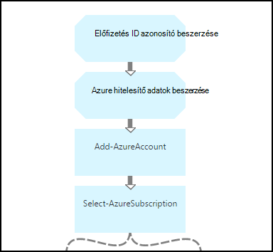

<properties 
    pageTitle="Indítása és leállítása virtuális gépeken futó - grafikon |} Microsoft Azure"
    description="Azure automatizálási forgatókönyv indítása és leállítása klasszikus virtuális gépeken futó runbooks együtt PowerShell munkafolyamat-verziót."
    services="automation"
    documentationCenter=""
    authors="mgoedtel"
    manager="jwhit"
    editor="tysonn" />
<tags 
    ms.service="automation"
    ms.devlang="na"
    ms.topic="article"
    ms.tgt_pltfrm="na"
    ms.workload="infrastructure-services"
    ms.date="07/06/2016"
    ms.author="bwren" />

# Azure automatizálási forgatókönyv - indítása és leállítása virtuális gépeken futó

Ebben az esetben Azure automatizálási indítása és leállítása klasszikus virtuális gépeken futó runbooks tartalmazza.  Ebben az esetben használható az alábbiak egyikét:  

- A saját környezetben használja a runbooks módosítás nélkül. 
- Módosítsa a runbooks testre szabott funkciók végrehajtásához.  
- Hívja fel a runbooks át egy másik runbook átfogó megoldásban részeként. 
- Oktatóanyagok fogalmak szerzői runbook minderről a runbooks használnak. 

> [AZURE.SELECTOR]
- [A grafikus](automation-solution-startstopvm-graphical.md)
- [A PowerShell-munkafolyamat](automation-solution-startstopvm-psworkflow.md)

Az ebben az esetben a grafikus runbook verziója. Érhető el is [PowerShell munkafolyamat runbooks](automation-solution-startstopvm-psworkflow.md)használatával.

## Bevezetés az alkalmazási példát

Ebben az esetben a két áll, az alábbi hivatkozások letölthet két grafikus runbooks.  Az ebben az esetben a PowerShell munkafolyamat runbooks mutató hivatkozások [PowerShell munkafolyamat-verziót](automation-solution-startstopvm-psworkflow.md) jelenik meg.

| Runbook | Hivatkozás | Típus | Leírás |
|:---|:---|:---|:---|
| StartAzureClassicVM | [Azure klasszikus virtuális grafikus Runbook indítása](https://gallery.technet.microsoft.com/scriptcenter/Start-Azure-Classic-VM-c6067b3d) | A grafikus | Az összes klasszikus virtuális gépeken futó elindítja az Azure előfizetéssel, vagy egy adott szolgáltatáshoz nevű összes virtuális gépeken futó. |
| StopAzureClassicVM | [Azure klasszikus virtuális grafikus Runbook leállítása](https://gallery.technet.microsoft.com/scriptcenter/Stop-Azure-Classic-VM-397819bd) | A grafikus | Leállítja az összes virtuális gépeken futó automatizálást-fiókjában vagy egy adott szolgáltatáshoz nevű összes virtuális gépeken futó.  |

## Való telepítéséről és konfigurálásáról az alkalmazási példát

### 1. a runbooks telepítése

A runbooks a letöltés után importálhatja őket a eljárással [grafikus runbook eljárásokat](automation-graphical-authoring-intro.md#graphical-runbook-procedures).

### 2. a leírás és a követelmények áttekintése
A runbooks **, Olvasás** , amely tartalmazza a leírás és a szükséges eszközök nevű tevékenységet tartalmaz.  Ez az információ megtekintheti a **Rólam olvasható** tevékenység és a **Munkafolyamat parancsfájlt** paraméter használatával.  Ez a cikk a ugyanazokat az információkat is megnyithatja. 

### 3. a eszközök beállítása
A runbooks csak a következő eszközöket, hogy létre kell hoznia és a megfelelő értékek kitöltéséhez.  A nevek alapértelmezés felelnek meg.  Más néven eszközök használhatja, ha adja meg azokat a neveket a [bemeneti paramétereket](#using-the-runbooks) a runbook indításakor.

| Eszköz típusa | Alapértelmezett név | Leírás |
|:---|:---|:---|:---|
| [Hitelesítő adatok](automation-credentials.md) | AzureCredential | Hitelesítésszolgáltató indítása és leállítása, az előfizetés Azure virtuális gépeken futó rendelkező fiók hitelesítő adatait tartalmazza.  |
| [Változó](automation-variables.md) | AzureSubscriptionId | Előfizetés azonosítója Azure-előfizetése tartalmazza. |

## Az alkalmazási példát használatával

### Paraméterek

Minden egyes runbooks rendelkezik az alábbi [bemeneti paramétereket](automation-starting-a-runbook.md#runbook-parameters).  Esetleges kötelező paramétereket értékeket kell adnia, és tetszés szerint megadhatja az értékek-további paramétereket attól függően, hogy az igényeknek megfelelően alakíthatja.

| Paraméter | Típus | Kötelező | Leírás |
|:---|:---|:---|:---|
| ServiceName | karakterlánc | nem | Ha egy értéket adni, majd az összes virtuális gépeken futó ilyen szolgáltatás nevű elindul, illetve leáll.  Ha nincs érték van megadva, majd az összes klasszikus virtuális gépeken futó az Azure előfizetés lépések vagy leállt. |
| AzureSubscriptionIdAssetName | karakterlánc | nem | Az Azure előfizetés előfizetés azonosítója tartalmazó [változó eszköz](#installing-and-configuring-the-scenario) nevét tartalmazza.  Ha egy érték nem ad meg, *AzureSubscriptionId* használják.  |
| AzureCredentialAssetName | karakterlánc | nem | A [hitelesítő adatok eszköz](#installing-and-configuring-the-scenario) használata a runbook hitelesítő adatait tartalmazó nevét tartalmazza.  Ha egy érték nem ad meg, *AzureCredential* használják.  |

### A runbooks indítása

Is használhatja az módszerek bármelyikével a [kezdési egy runbook az Azure automatizálás](automation-starting-a-runbook.md) indítása vagy a runbooks ebben a cikkben.

A következő példa parancsok használja a Windows PowerShell **StartAzureClassicVM** összes virtuális gépeken futó kezdődik, a szolgáltatás neve *MyVMService*futtatásához.

    $params = @{"ServiceName"="MyVMService"}
    Start-AzureAutomationRunbook –AutomationAccountName "MyAutomationAccount" –Name "StartAzureClassicVM" –Parameters $params

### Kimenet

A runbooks fogja, hogy a [kimenő üzenet](automation-runbook-output-and-messages.md) az egyes virtuális gép jelző attól függetlenül, hogy az indítás vagy a Leállítás utasítás sikerült elküldeni.  Egy adott karakterlánc határozza meg az eredményt az egyes runbook kimeneti kereshet.  Az alábbi táblázat a lehetséges kimeneti karakterláncok jelennek meg.

| Runbook | Feltétel | Üzenet |
|:---|:---|:---|
| StartAzureClassicVM | Virtuális gép már fut  | MyVM már fut |
| StartAzureClassicVM | Indítsa el a virtuális gép sikerült elküldeni kérése | MyVM van indítva. |
| StartAzureClassicVM | Virtuális gép kezdő kérése sikertelen volt  | Nem indult el MyVM |
| StopAzureClassicVM | Virtuális gép már fut  | MyVM már leállítása |
| StopAzureClassicVM | Indítsa el a virtuális gép sikerült elküldeni kérése | MyVM van indítva. |
| StopAzureClassicVM | Virtuális gép kezdő kérése sikertelen volt  | Nem indult el MyVM |

Az alábbiakban a **StartAzureClassicVM** a használják a [gyermek runbook](automation-child-runbooks.md) egy minta grafikus runbook a képét.  Az alábbi táblázat a feltételes hivatkozások ez használ.

| Hivatkozás | Feltétel |
|:---|:---|
| A siker hivatkozás | [StartAzureClassicVM] $ActivityOutput – például "\* el van indítva"    |
| Hiba hivatkozás   | $ActivityOutput [StartAzureClassicVM]-notlike "\* el van indítva" |

## Részletes kifejtése

Az alábbiakban ebben az esetben a runbooks részletes kifejtése.  Az információk segítségével testre szabhatja a runbooks, vagy közvetlenül az őket a saját automatizálást szerzői bemutatása.
 

### Hitelesítés

A runbook tevékenységek állítsa be a [hitelesítő adatok](automation-configuring.md#configuring-authentication-to-azure-resources) és a többi a runbook használt Azure előfizetés kezdődik.

Az első két tevékenységek **Előfizetés azonosító beszerzése** és **Azure hitelesítő első**, a következő két tevékenységek által használt [eszközök](#installing-the-runbook) beolvasásához.  Az eszközök közvetlenül megadhatja azoknál a tevékenységeknél, de szükségük van a digitáliseszköz-nevét.  Azt a felhasználót, hogy adja meg azokat a neveket a [bemeneti paramétereket](#using-the-runbooks)akiknek engedélyezi, mivel ezek a tevékenységek, az eszközök beolvasásához bemeneti paraméter által megadott névvel szükséges.

**Hozzáadás-AzureAccount** állítja be a többi a runbook használt hitelesítő adatait.  A hitelesítő adatok eszköz az **Ismerkedés az Azure hitelesítő adatok** beolvasó elindítása és leállítása, az előfizetés Azure virtuális gépeken futó hozzáféréssel kell rendelkeznie.  Az előfizetés használt használja az előfizetés-azonosító **Előfizetés azonosító beszerzése**a **Select-AzureSubscription** szerint be van jelölve.

### Virtuális gépeken futó beszerzése

A runbook meg kell állapítania a mely virtuális gépeken futó azt együtt dolgozni fog és e azok már elindított vagy leállítása (attól függően, hogy a runbook).   Két tevékenység egyik beolvassa a VMs.  **A szolgáltatás első VMs** hajtja végre, ha a a *ServiceName* a runbook a bemeneti paraméterre értéket tartalmaz.  **Minden VMs beszerzése** a hajtja végre, ha a *ServiceName* a runbook a bemeneti paraméterre nem tartalmaz értéket.  Ez a módszer az egyes tevékenységek megelőző feltételes hivatkozások hajtja végre.

A két tevékenység a **Get-AzureVM** parancsmag használata.  **Az összes VMs beszerzése** a **ListAllVMs** paramétert, állítsa vissza az összes virtuális gépeken futó használja.  **A szolgáltatás első VMs** **GetVMByServiceAndVMName** paraméter megadása használ, és a **ServiceName** bemeneti paraméterre biztosít a **ServiceName** paraméter.  

### VMs egyesítése

Az **Egyesítés VMs** tevékenység szükség, és a szolgáltatás nevét a vm(s) indításához szükséges **Lépések-AzureVM** bemeneti megadását.  Bevitel sikerült **Beszerzése minden VMs** vagy a **Szolgáltatás első VMs**származik, de a **Kezdés-AzureVM** csak adja meg annak a bemeneti egy-egy tevékenység.   

Az alkalmazási példát, ha futtatja az **Írási-kimeneti** parancsmag **Egyesítése VMs** .  Adott parancsmag **InputObject** paraméter egy PowerShell-kifejezés, amely az előző két tevékenység a bemeneti egyesíti.  Csak az egyik azoknál a tevékenységeknél, csak a kimeneti az egyik készlete várhatóan fog futni.  **Kezdés-AzureVM** , hogy a kimeneti használható a bemeneti paramétereket. 

### Virtuális gépeken futó indítása és leállítása

 

Attól függően, hogy a runbook a következő tevékenységek megpróbálja indítása és leállítása a **Kezdés-AzureVM** vagy **Leállítása-AzureVM**runbook.  A tevékenység folyamat hivatkozás van aposztróffal, mivel fog futni egyszer minden **Egyesítése VMs**– által eredményül adott objektum.  A hivatkozás nem feltételes, hogy a tevékenység csak hajtja végre, ha a *RunningState* a virtuális gép pedig *leállt* a **Kezdés-AzureVM** *Elindítva* a **Stop-AzureVM**. Ez a feltétel nem teljesül, ha **Már elkezdte értesítést** , vagy **Már értesítést leállt** van futtassa **Írási-kimeneti**az üzenetek küldése.

### Kimenetként

 

A runbook utolsó lépéseként is kimenetként, hogy virtuális gépeken kérelem indítása és leállítása sikerült elküldeni a. Van egy külön **Írási-kimeneti** tevékenységet minden egyes, és hogy meghatározzák, hogy melyiket feltételes hivatkozásokkal futtatásához.  **Virtuális lépések értesítést** vagy **Értesíti a virtuális leállt** futása, ha *OperationStatus* nem *sikerült*.  Ha *OperationStatus* más érték szerepel, majd **Értesítést sikertelen indítsa el** , vagy **Értesíti a leállítás nem sikerült** fut.

## Következő lépések

- [Grafikus Azure automatizálási létrehozására](automation-graphical-authoring-intro.md)
- [Az Azure automatizálást gyermek runbooks](automation-child-runbooks.md) 
- [Runbook kimeneti és Azure automatizálást üzenetek](automation-runbook-output-and-messages.md)