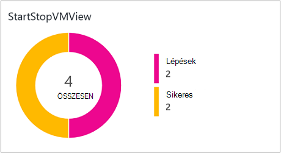

<properties
    pageTitle="Kezdési és befejezési VMs során munkaidőn kívüli [kép] megoldás |} Microsoft Azure"
    description="A virtuális megoldásokat elindul, és leállítja az Azure erőforrás-kezelő virtuális gépeken futó időközönként, és ezzel kapcsolatban beérkező figyelheti a napló Analytics."
    services="automation"
    documentationCenter=""
    authors="MGoedtel"
    manager="jwhit"
    editor=""
    />
<tags
    ms.service="automation"
    ms.workload="tbd"
    ms.tgt_pltfrm="na"
    ms.devlang="na"
    ms.topic="get-started-article"
    ms.date="10/07/2016"
    ms.author="magoedte"/>

# Kezdési és befejezési VMs alatt található automatizálás munkaidőn kívüli [kép] megoldás

A kezdési és befejezési VMs munkaidőn kívüli [kép] megoldás során elindítja az erőforrás-kezelő Azure virtuális gépeken futó leállítja a felhasználó által megadott időközönként, és a sikeres indítása és leállítása a virtuális gépeken futó MOBILE napló Analytics az automatizálási feladatok betekintést nyújt.  

## Előfeltételek

- A runbooks [Azure Futtatás mint fiók](automation-sec-configure-azure-runas-account.md)használata.  A Futtatás mint fiókot, az előnyben részesített hitelesítési módszer, mert a hitelesítési tanúsítványt használja helyett egy jelszót, előfordulhat, hogy lejárjon vagy gyakran módosulnak.  

- Ez a megoldás csak kezelheti VMs, amelyek a azonos előfizetés és erőforráscsoport, ahol az automatizálási fiókját.  

- Ez a megoldás csak a következő Azure régiók - Ausztrália Délkelet, kelet-Amerikai Egyesült Államok, Délkelet-ázsiai vagy nyugati Europe üzembe helyezése.  A virtuális ütemezés kezelő runbooks is Megcélozhat VMs bármelyik tartományban lévő.  

- Az indítási és leállítási virtuális runbooks befejezéséhez értesítő e-mailek küldéséhez üzleti szintű Office 365-előfizetésre szükség.  

## Megoldás-összetevők

Az alábbi források, amelyek importált, és a automatizálási fiók hozzáadva a megoldás áll.

### Runbooks

Runbook | Leírás|
--------|------------|
CleanSolution-MS-kezelése – virtuális | A runbook eltávolítja az összes tárolt erőforrások, és az ütemtervekről és a megoldás törlése az előfizetésből lép.|  
SendMailO365-MS-kezelése | Ez a runbook keresztül az Office 365 Exchange e-mail küldése.|
StartByResourceGroup-MS-kezelése – virtuális | A runbook íródott VMs indításához (mindkét klasszikus és ARM-alapú VMs), amely az Azure erőforrás csoportot adott között található.
StopByResourceGroup-MS-kezelése – virtuális | A runbook íródott VMs leállítása (mindkét klasszikus és ARM-alapú VMs), amely az Azure erőforrás csoportot adott között található.|
 

### Változók

Változó | Leírás|
---------|------------|
**SendMailO365-MS-kezelése** Runbook ||
SendMailO365-IsSendEmail-MS-kezelése | Itt adhatja meg, ha StartByResourceGroup-MS-kezelése – virtuális és StopByResourceGroup-MS-kezelése – virtuális runbooks befejeztével értesítő e-mailt küldhet.  Jelölje ki a **True** engedélyezése és **hamis** e-mail riasztási letiltása. Alapértelmezett értéke **hamis**.| 
**StartByResourceGroup-MS-kezelése – virtuális** Runbook ||
StartByResourceGroup-ExcludeList-MS-kezelése – virtuális | Írja be virtuális nevét kell zárni a műveletet kezelése; nevek külön semi-colon(;) használatával. Értékek és nagybetűk, és helyettesítő (csillag) támogatott.|
StartByResourceGroup-SendMailO365-EmailBodyPreFix-MS-kezelése | E-mail üzenet szövegében elejére fűzhetők szöveget.|
StartByResourceGroup-SendMailO365-EmailRunBookAccount-MS-kezelése | A neve, amely tartalmazza az e-mailek runbook automatizálási fiók.  **Ne módosítsa a változó.**|
StartByResourceGroup-SendMailO365-EmailRunbookName-MS-kezelése | Az e-mailek runbook nevét adja meg.  Ez a StartByResourceGroup-MS-kezelése – virtuális és használják StopByResourceGroup-MS-kezelése – virtuális runbooks küldhet e-mailt.  **Ne módosítsa a változó.**|
StartByResourceGroup-SendMailO365-EmailRunbookResourceGroup-MS-kezelése | Adja meg a csoport nevét, az erőforrás, amely tartalmazza az e-mailek runbook.  **Ne módosítsa a változó.**|
StartByResourceGroup-SendMailO365-EmailSubject-MS-kezelése | Itt adhatja meg az e-mailt az üzenet tárgysora szövegét.|  
StartByResourceGroup-SendMailO365-EmailToAddress-MS-kezelése | Adja meg a címzett(ek), az e-mailt.  Adja meg külön nevek semi-colon(;).|
StartByResourceGroup-TargetResourceGroups-MS-kezelése – virtuális | Műveletet kezelése; alól virtuális nevének megadása nevek külön semi-colon(;) használatával. Értékek és nagybetűk, és helyettesítő (csillag) támogatott.  Alapértelmezett értéket (csillag) az előfizetés tartalmazni fogja az összes erőforráscsoport.|
StartByResourceGroup-TargetSubscriptionID-MS-kezelése – virtuális | Itt adhatja meg az előfizetést, amely tartalmazza a megoldás által kezelt VMs.  Ez lehet az azonos előfizetés a megoldás automatizálási fiókjának helye.|
**StopByResourceGroup-MS-kezelése – virtuális** Runbook ||
StopByResourceGroup-ExcludeList-MS-kezelése – virtuális | Írja be virtuális nevét kell zárni a műveletet kezelése; nevek külön semi-colon(;) használatával. Értékek és nagybetűk, és helyettesítő (csillag) támogatott.|
StopByResourceGroup-SendMailO365-EmailBodyPreFix-MS-kezelése | E-mail üzenet szövegében elejére fűzhetők szöveget.|
StopByResourceGroup-SendMailO365-EmailRunBookAccount-MS-kezelése | A neve, amely tartalmazza az e-mailek runbook automatizálást fiók.  **Ne módosítsa a változó.**|
StopByResourceGroup-SendMailO365-EmailRunbookResourceGroup-MS-kezelése | Adja meg a csoport nevét, az erőforrás, amely tartalmazza az e-mailek runbook.  **Ne módosítsa a változó.**|
StopByResourceGroup-SendMailO365-EmailSubject-MS-kezelése | Itt adhatja meg az e-mailt az üzenet tárgysora szövegét.|  
StopByResourceGroup-SendMailO365-EmailToAddress-MS-kezelése | Adja meg a címzett(ek), az e-mailt.  Adja meg külön nevek semi-colon(;).|
StopByResourceGroup-TargetResourceGroups-MS-kezelése – virtuális | Írja be virtuális nevét kell zárni a műveletet kezelése; nevek külön semi-colon(;) használatával. Értékek és nagybetűk, és helyettesítő (csillag) támogatott.  Alapértelmezett értéket (csillag) az előfizetés tartalmazni fogja az összes erőforráscsoport.|
StopByResourceGroup-TargetSubscriptionID-MS-kezelése – virtuális | Itt adhatja meg az előfizetést, amely tartalmazza a megoldás által kezelt VMs.  Ez lehet az azonos előfizetés a megoldás automatizálást fiókjának helye.|  
 

### Kimutatások

Ütemterv | Leírás|
---------|------------|
StartByResourceGroup-ütemezés-MS-kezelése | Ütemezés StartByResourceGroup runbook, amely a kezeli a megoldás VMs indítása hajt végre.|
StopByResourceGroup-ütemezés-MS-kezelése | Ütemezés StopByResourceGroup runbook, amely a Leállítás kezeli a megoldás VMs hajt végre.|

### Hitelesítő adatok

Hitelesítő adatok | Leírás|
-----------|------------|
O365Credential | Megadja, hogy egy érvényes Office 365 felhasználói küldhet e-mailt.  Csak akkor szükséges ha változó SendMailO365-IsSendEmail-MS-kezelése értéke **Igaz**.

## Konfiguráció

A következő lépésekkel vehet fel a kezdési és befejezési VMs során munkaidőn kívüli [kép] megoldás automatizálási fiókját, és adja meg a változók a megoldás testreszabása.

1. A kezdőlap – képernyőn az Azure-portálon válassza a **piactér** csempére.  Ha a mozaik már nem rögzítve van a kezdőképernyőre, a bal oldali navigációs ablaktáblában válassza az **Új**.  
2. A Keresés mezőbe írja be a **Virtuális indítsa el** a piactér lap, és a keresési eredmények közül válassza ki a megoldást, **Kezdési és befejezési VMs során munkaidőn kívüli [kép]** .  
3. A **Kezdési és befejezési VMs során munkaidőn kívüli [kép]** lap a kijelölt megoldás tekintse át az összegzett adatokat, és kattintson a **Létrehozás**gombra.  
4. A **Megoldás hozzáadása** lap jelenik meg, ahol rákérdez, hogy a megoldás konfigurálása, importálhatja az automatizálási előfizetés előtt.     
5.  A **Megoldás hozzáadása** lap válassza ki a **munkaterület** , és itt választhatja ki az azonos Azure előfizetéséhez, amely az automatizálási fiók van csatolva, vagy hozzon létre egy új MOBILE munkaterület MOBILE munkaterület.  Ha nem rendelkezik egy MOBILE munkaterület, jelölje be az **Új munkaterület létrehozása** , és a **MOBILE munkaterület** lap tegye a következőket: 
   - Adjon egy nevet az új **Munkaterület MOBILE**.
   - Jelölje ki a csatolni kívánt jelöljön ki a legördülő listából, ha az alapértelmezett beállítás nem megfelelő **előfizetés** .
   - **Erőforráscsoport**hozzon létre egy új erőforráscsoport, és válassza a meglévő erőforráscsoport.  
   - Válasszon egy **helyet**.  A kijelölés csak helyeken jelenleg **Ausztrália Délkelet**, **Kelet-Amerikai Egyesült Államok**, **Délkelet-ázsiai**vagy **Nyugati Europe**.
   - Jelölje ki az egy **réteg árak**.  A megoldás a két rétegek kínálják: szabad, és a MOBILE kifizetett réteg.  A szabad réteg korlátozott naponta, Adatmegőrzés időtartama és runbook feladat futtatókörnyezet perc gyűjtött adatok mennyiségét van.  A kifizetett MOBILE réteg nincs korlátozás naponta gyűjtött adatok mennyiségét.  

        > [AZURE.NOTE]
        > A réteg kifizetett önálló lehetőség jelenik meg, miközben még nem felel meg Önnek.  Ha jelölje ki azt, és folytassa a megoldás létrehozása az előfizetését, akkor sikertelen lesz.  Ennek címzettje lesz a megoldás hivatalos megjelenésekor. A megoldás használata esetén azt csak használja automatizálási feladat perc, és jelentkezzen be a bevitel.  A megoldás nem adja hozzá további MOBILE csomópontok a környezetben.  

6. Miután kezeléséről a szükséges információkat a **MOBILE munkaterület** lap a, kattintson a **Létrehozás**gombra.  Az adatokat a rendszer ellenőrzi, és a munkaterület jön létre, miközben nyomon követése **értesítések** a meghívási folyamat a menüből.  Lesz, hogy a **Megoldás hozzáadása** lap adja vissza.  
7. Jelölje ki a **Megoldás hozzáadása** lap **Automatizálást fiókot**.  Új munkaterület MOBILE hoz létre, ha új automatizálási-fiókba új MOBILE megadott munkaterület korábbi, beleértve az Azure előfizetést, az erőforráscsoport és a régió lesznek társítva is létrehozásához szükséges fogja.  Jelölje be az **automatizálási fiók létrehozása** , és a **fiók hozzáadása az automatizálási** lap, adja meg a következőket: 
  - A **név** mezőbe írja be az automatizálási fiók nevét.

    Minden más beállítások automatikusan bekerülnek a kijelölt MOBILE munkaterület alapján, és ezeket a beállításokat nem lehet módosítani.  Azure Futtatás mint fiók az alapértelmezett hitelesítési módszer a runbooks a megoldásban.  Miután **az OK**gombra kattint, a beállítási lehetőségek érvényesítése, és az automatizálási fiók létrehozását.  **Értesítés** a meghívási folyamat követheti nyomon a menüből. 

    Egyéb esetben kijelölhet egy meglévő automatizálási Futtatás mint fiókot.  Megjegyzés, hogy a fiókot, akkor jelölje be nem már lehet csatolni egy másik MOBILE-munkaterület egyébként egy üzenet tájékoztatja, hogy a lap fognak szerepelni.  Ha meg van csatolva, meg kell jelölje be a Futtatás automatizálási más néven másik fiókkal, vagy hozzon létre egy újat.    

8. Végül válassza a **Megoldás hozzáadása** lap **konfigurációs** , és a **Paraméterek** lap jelenik meg.  Kattintson a **Paraméterek** lap rákérdez, hogy:  
   - Adja meg a **Cél ResourceGroup nevek**, amelyek egy erőforrás csoport neve, amely tartalmazza a megoldás által kezelt VMs.  Írja be a egynél több nevet, és külön az egyes pontosvesszőt (érték-és nagybetűk) használatával.  Helyettesítő karakter használata funkció használható, ha az előfizetés összes erőforrás csoport célhelyet VMs szeretne.
   - Jelölje ki az **Ütemezés** , amely egy ismétlődő dátumát és idejét indítása és leállítása a virtuális a cél erőforrás csoportot a.  

10. Miután elvégezte a szükséges a megoldást beállítása, válassza a **létrehozása**lehetőséget.  Összes beállítását ellenőrizni kell, és majd megkísérli megoldást üzembe helyez a a előfizetését.  Vehet igénybe néhány másodpercig befejezéséhez és **értesítések** a meghívási folyamat követheti a menüből. 

## A webhelycsoport gyakorisága

Automatizálást-feladat napló- és adatfolyamok van keresztül a szervezetbe történő MOBILE tárházba öt percenként.  

## A megoldás használata

A virtuális projektmenedzsment megoldás ad hozzá, a MOBILE munkaterületen a **StartStopVM nézet** csempe kerüljön a MOBILE irányítópult.  Ez a csempe jelzi a darab és a grafikus ábrázolása runbooks feladatok a megoldáshoz elindult, és sikeresen befejeződött.     

Az automatizálási fiókját megtekintheti és kezelheti a megoldást a **megoldások** csempét választva, majd a **megoldások** lap a listáról a megoldást **Start-leállítása virtuális [munkaterület]** .     

Jelölje ki a megoldást a **Kezdés-leállítása virtuális [Workspace** megoldás lap, ahol áttekintheti fontos részleteket, például a **StartStopVM** csempére, például a MOBILE munkaterületen található, amely megjeleníti a darab és a grafikus ábrázolása runbooks feladatok a megoldáshoz elindult, és sikeresen befejeződött a jeleníti meg.     

További lehetőségek is a MOBILE munkaterület megnyitása és részletes a feladat rekordok elemzéseket végezhet.  Csak kattintson a **minden beállításai**elemre, és a **Beállítások** lap, válassza a **Rövid útmutató** , és az **Első lépések** lap válassza **MOBILE portálon**.   Ezzel nyissa meg egy új lapon, vagy új böngésző-munkamenetet, és a MOBILE munkaterület társított automatizálási fiók és az előfizetés megosztása.  

### E-mail értesítések konfigurálása

Értesítő e-mailek engedélyezése, ha az indítási és leállítási virtuális runbooks befejezése után, a **O365Credential** módosítani kell a hitelesítő adatok és a minimum, a következő változók:

 - SendMailO365-IsSendEmail-MS-kezelése
 - StartByResourceGroup-SendMailO365-EmailToAddress-MS-kezelése
 - StopByResourceGroup-SendMailO365-EmailToAddress-MS-kezelése

Adja meg a **O365Credential** hitelesítő adatokat, hajtsa végre az alábbi lépéseket:

1. Az automatizálási fiókját kattintson a **Minden elérhető beállítás** , az ablak tetején. 
2. Kattintson a **Beállítások** lap **Automatizálási erőforrások**csoportban válassza ki az **eszközöket**. 
3. Az **eszközök** lap a **hitelesítő adatok** csempét, és a **hitelesítő adatok** lap, jelölje ki a **O365Credential**.  
4. Adja meg egy érvényes Office 365 rendszerbeli jelszavát, és kattintson a **Mentés** gombra a módosítások mentéséhez.  

A kiemelt korábbi változók beállításához hajtsa végre az alábbi lépéseket:

1. Az automatizálási fiókját kattintson a **Minden elérhető beállítás** , az ablak tetején. 
2. Kattintson a **Beállítások** lap **Automatizálási erőforrások**csoportban válassza ki az **eszközöket**. 
3. Kattintson az **eszközök** lap a **változók** csempét, és a **változók** lap, válassza a fent felsorolt változó, és módosítsa a követő érték, a leírás korábban megadott [változó](##variables) szakaszában.  
4. A módosítások mentéséhez a változó a **Mentés** gombra.   

### Az indítási és leállítási ütemezés módosítása

Ezeket a lépéseket a megoldás az indítási és leállítási ütemezés kezelése követi, az [Ütemezés az Azure automatizálás egy runbook](automation-scheduling-a-runbook.md)ismertetettek szerint.  Ne feledje, hogy az ütemezési beállítások nem módosíthatók.  Letiltása a meglévő ütemezés, majd hozzon létre egy újat és csatolja a **StartByResourceGroup-MS-kezelése – virtuális** vagy az ütemezés alkalmazni kívánt **StopByResourceGroup-MS-kezelése – virtuális** runbook kell.   

## Naplóbejegyzések Analytics

Automatizálási két típusú rekordok a MOBILE adattárban hoz létre.

### Feladat naplók

A tulajdonság | Leírás|
----------|----------|
Hívóazonosító |  A művelet kezdeményezett ki.  Lehetséges értékei a kívánt e-mail címet vagy a rendszer ütemezett feladatokhoz.|
Kategória | Milyen típusú adatokat besorolása.  Automatizálás, az érték JobLogs.|
CorrelationId | A korrelációs azonosító a runbook feladat GUID.|
JobId | GUID azonosítója a runbook feladatot.|
operationName | Adja meg az Azure-ban végrehajtott művelet.  Automatizálás, az az érték lesz feladatot.|
resourceId | Adja meg az erőforrás típusa Azure-ban.  Automatizálás, az érték a runbook társított automatizálást fiók.|
ResourceGroup | Itt adhatja meg az erőforráscsoport a runbook feladat nevét.|
ResourceProvider | Itt adhatja meg az Azure szolgáltatás, amely megadja az erőforrások, üzembe helyezéséhez és kezeléséhez.  Automatizálás, az érték Azure automatizálást.|
Erőforrástípus | Adja meg az erőforrás típusa Azure-ban.  Automatizálás, az érték a runbook társított automatizálási fiók.|
resultType | A runbook feladat állapotának.  Lehetséges értékek a következők: -Lépések -Leállítása -Felfüggesztett -Sikertelen -Sikeres|
resultDescription | A feladat runbook eredmény állapota ismerteti.  Lehetséges értékek a következők: -Feladat indítják -Nem sikerült projekt -Feladat végrehajtása|
RunbookName | A runbook nevét adja meg.|
SourceSystem | Meghatározza, hogy a forrás számára küldött adatok.  Automatizálás, az érték lesz: OpsManager|
StreamType | Adja meg az esemény. Lehetséges értékek a következők: -Részletes -Kimeneti -Hiba -Figyelmeztetés|
SubscriptionId | Adja meg a feladat előfizetés azonosítója.
Idő | Dátum és időpont, amikor a runbook feladatot végre.|

### Feladat adatfolyamok

A tulajdonság | Leírás|
----------|----------|
Hívóazonosító |  A művelet kezdeményezett ki.  Lehetséges értékei a kívánt e-mail címet vagy a rendszer ütemezett feladatokhoz.|
Kategória | Milyen típusú adatokat besorolása.  Automatizálás, az érték JobStreams.|
JobId | GUID azonosítója a runbook feladatot.|
operationName | Adja meg az Azure-ban végrehajtott művelet.  Automatizálás, az az érték lesz feladatot.|
ResourceGroup | Itt adhatja meg az erőforráscsoport a runbook feladat nevét.|
resourceId | Adja meg az erőforrás-azonosító Azure-ban.  Automatizálás, az érték a runbook társított automatizálási fiók.|
ResourceProvider | Itt adhatja meg az Azure szolgáltatás, amely megadja az erőforrások, üzembe helyezéséhez és kezeléséhez.  Automatizálás, az érték Azure automatizálási.|
Erőforrástípus | Adja meg az erőforrás típusa Azure-ban.  Automatizálás, az érték a runbook társított automatizálási fiók.|
resultType | Az eredmény a runbook feladat az esemény létrejöttének időben.  Lehetséges értékek a következők: -Esetbejegyzések|
resultDescription | A kimenet adatfolyam a runbook a tartalmazza.|
RunbookName | A runbook neve.|
SourceSystem | Meghatározza, hogy a forrás számára küldött adatok.  Automatizálás, az az érték lesz OpsManager|
StreamType | A feladat adatfolyam típusát. Lehetséges értékek a következők: -Folyamatban -Kimeneti -Figyelmeztetés -Hiba -Hibakeresési -Részletes|
Idő | Dátum és időpont, amikor a runbook feladatot végre.|

Bármely napló keresést, amely visszaadja a rekordok **JobLogs** vagy **JobStreams**kategóriájának hajt végre, ha a **JobLogs** vagy **JobStreams** nézet, amely jelenít meg a frissítéseket a keresés által visszaadott engedélyeiről csempék közül választhat.

## Minta napló keresések

Az alábbi táblázat ismerteti a minta napló megkeresi a feladat rekordok gyűjti össze a megoldást. 

Lekérdezés | Leírás|
----------|----------|
Feladatok keresse meg, hogy sikeresen befejeződött StartVM runbook | Kategória JobLogs RunbookName_s = "StartByResourceGroup-MS-kezelése – virtuális" ResultType = = sikeres & #124; mérték count() JobId_g szerint|
Feladatok keresse meg, hogy sikeresen befejeződött StopVM runbook | Kategória JobLogs RunbookName_s = "StartByResourceGroup-MS-kezelése – virtuális" ResultType = = nem sikerült & #124; mérték count() JobId_g szerint
StartVM és StopVM runbooks az idő múlásával a feladat állapotának megjelenítése | Kategória JobLogs RunbookName_s = "StartByResourceGroup-MS-kezelése – virtuális" vagy "StopByResourceGroup-MS-kezelése – virtuális" NOT(ResultType="started") = | 1 nap mérésére Count() ResultType időköze|

## Következő lépések

- Különböző keresési lekérdezések összeállításához, és tekintse át az automatizálási feladat naplók a napló Analytics kapcsolatban további információért lásd: a [napló keresések napló Analytics](../log-analytics/log-analytics-log-searches.md)
- További információ a névjegyek runbook végrehajtás módja a Lync-runbook feladatok és egyéb technikai részletek című témakörben talál [egy runbook feladat követése](automation-runbook-execution.md)
- További információ a MOBILE napló analitikai és a webhelycsoport adatforrások című témakörben talál [gyűjteni Azure tároló adatait a napló Analytics – áttekintés](../log-analytics/log-analytics-azure-storage.md)

   

