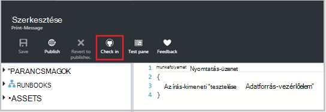
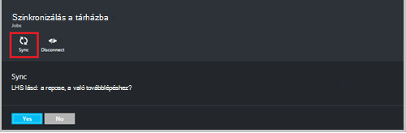

<properties 
    pageTitle=" Adatforrás-vezérlő integrálása az Azure automatizálás |} Microsoft Azure"
    description="Ez a cikk ismerteti a forrás vezérlőelem-integráció a GitHub az Azure automatizálás."
    services="automation"
    documentationCenter=""
    authors="mgoedtel"
    manager="jwhit"
    editor="tysonn" />    
<tags 
    ms.service="automation"
    ms.devlang="na"
    ms.topic="article"
    ms.tgt_pltfrm="na"
    ms.workload="infrastructure-services"
    ms.date="09/12/2016"
    ms.author="magoedte;sngun" />

# Forrás vezérlő integrálása az Azure automatizálás

Adatforrás-vezérlő integráció lehetővé teszi, hogy egy GitHub adatforrás-vezérlő tárházba automatizálási fiókban runbooks társítani. Adatforrás-vezérlő lehetővé teszi, hogy a csoportszintű együttműködéshez, változások követése, és visszaállíthatja a runbooks korábbi verzióiban. Például verziókövetést lehetővé teszi az adatforrás-vezérlő, a fejlesztés, tesztelése és gyártási automatizálási fiókokhoz, ezzel leegyszerűsítve előléptetése kódot, amely a fejlesztői környezet a termelési automatizálási fiók teszteléssel ággal szinkronizálása.

Adatforrás-vezérlő lehetővé teszi a kód leküldéses az Azure automatizálási az adatforrás-vezérlő, vagy húzza a runbooks az adatforrás-vezérlő Azure az automatizálás. Ez a cikk ismerteti, hogy miként állíthatja be az automatizálási Azure környezetben adatforrás-vezérlő. A Microsoft Azure automatizálási a GitHub tárházba eléréséhez, és különböző műveletek végezhetők végigvezetik konfigurálásával elkezdenek adatforrás-vezérlő integrációs használatával. 

>[AZURE.NOTE]Adatforrás-vezérlő támogatja az adatok és terjesztése [PowerShell munkafolyamat runbooks](automation-runbook-types.md#powershell-workflow-runbooks) , valamint a [PowerShell runbooks](automation-runbook-types.md#powershell-runbooks). [A grafikus runbooks](automation-runbook-types.md#graphical-runbooks) még nem támogatott.  

Állítsa be az automatizálási fiókját, és csak egy adatforrás-vezérlő, ha már van egy GitHub fiók szükséges két egyszerű lépésből áll. Ezek a következők:
## Lépés: 1 – GitHub tár létrehozása

Ha már van egy GitHub fiók és egy tárházba kívánt hivatkozás: Azure automatizálást, majd jelentkezzen be a meglévő fiókjába, és lépés: 2, az alábbi indítja el. Ellenkező esetben lépjen [GitHub](https://github.com/), jelentkezzen be egy új fiókot, és [Hozzon létre egy új tárban tárolnak](https://help.github.com/articles/create-a-repo/).

## Lépés: 2 – az Azure automatizálás adatforrás-vezérlő beállítása

1. Az automatizálási fiók fel az Azure portált, kattintson a **Verziókövetés beállítása.** 
 
    

2. Megnyílik a **Verziókövetés** lap, amelyen megadhatja a GitHub fiókadatokat. Az alábbi van a paraméterek beállítása listája:  

  	|**Paraméter**            |**Leírás** |
  	|:---|:---| 
  	|Forrás kiválasztása   | Jelölje be a forrás. Jelenleg csak **GitHub** használata támogatott. |
  	|Engedély | Kattintson az Azure automatizálási hozzáférést a GitHub tárházba **engedélyezése** gombra. Ha már bejelentkezett különböző ablakban GitHub fiókjához, a fiók hitelesítő adatait használhatók. Miután engedélyezési sikeres, a lap jelennek meg a **Engedélyezése tulajdonság**GitHub felhasználónevét. |
  	|Válassza a tárházba | Válassza ki a GitHub tárházba a rendelkezésre álló tárházakban listáját. |
  	|Fiók kiválasztása | Válassza ki a ág a rendelkezésre álló fiókok listáját. A **fő** ág jelenik meg, ha eddig nem hozott létre bármely használja. |
  	|Runbook mappa elérési útja | A runbook mappa elérési útvonala az elérési utat a GitHub tárat, amelyhez képest leküldéses, vagy húzza a kód adja meg. Kattintson a formátum **/foldername/subfoldername**kell megadni. Csak a runbook mappa elérési útját a runbooks alkalmazás szinkronizálja a automatizálást fiókjába. Az a runbook mappa elérési útját fog **nem** almappái Runbooks szinkronizálja a. Használat **/** szinkronizálás csoportban a tár összes runbooks. |

3. Például ha nevű **PowerShellScripts** egy **RootFolder**nevű mappát tartalmazó tár, amely tartalmaz egy mappát nevű **almappában**. A következő karakterláncok használatával szinttel minden mappa szinkronizálása:

    1. A **tárházba**runbooks szinkronizálásához runbook mappa elérési útja*/*
    2. A **RootFolder**runbooks szinkronizálásához runbook elérési utat kell */RootFolder*
    3. Az **almappa**runbooks szinkronizálásához a runbook mappa elérési útja */RootFolder/SubFolder*.
  

4. Miután beállította a paramétereket, jelennek meg a **verziókövetés megadása lap.**  
 
    

5. Kattintson az OK gombra, adatforrás-vezérlő integrációs most úgy van beállítva az automatizálási fiók, és frissíteni kell a GitHub adatokkal. Ebben a részben, az összes a forrás vezérlő szinkronizálási előzményeinek megtekintése most elemére.  

    

6. Adatforrás-vezérlő beállítása után a következő automatizálási erőforrások automatizálási fiókban jönnek létre:  
 Két [változó eszközökre](automation-variables.md) készült.  
      
    * A változó **Microsoft.Azure.Automation.SourceControl.Connection** tartalmazza a kapcsolati karakterláncot, az alább látható módon.  

  	|**Paraméter**            |**Érték** |
  	|:---|:---|
  	| név  | Microsoft.Azure.Automation.SourceControl.Connection |
  	| Típus | Karakterlánc |
  	| Érték  | {"Ág":\<*a fióknév*>, "RunbookFolderPath":\<*Runbook mappa elérési útja*>, "Szolgáltatótípus":\<*értéke 1 GitHub*>, "Tárházba":\<*nevét a tárházba*>, "Felhasználónév":\<*a GitHub felhasználónév*>} |   

    * Változó **Microsoft.Azure.Automation.SourceControl.OAuthToken**a OAuthToken biztonságos titkosított értékét tartalmazza.  

  	|**Paraméter**            |**Érték** |
  	|:---|:---|
  	| név  | Microsoft.Azure.Automation.SourceControl.OAuthToken |
  	| Típus | Unknown(Encrypted) |
  	| Érték | <*Titkosított OAuthToken*> |  

      

    * **Automatizálási adatforrás-vezérlő** bekerül a GitHub fiókjába hivatalos alkalmazásként. Az alkalmazás megtekintése: a kezdőlapról a GitHub, nyissa meg a **profil** > **Beállítások** > **alkalmazásokat**. Ez az alkalmazás lehetővé teszi, hogy az Azure automatizálási szinkronizálni a GitHub tárházba automatizálási-fiókjába.  

    

## Verziókövetés található automatizálás segítségével

### Beadás egy runbook az Azure automatizálási az adatforrás-vezérlő

Runbook beadás lehetővé teszi a végrehajtott módosítások szeretne egy runbook az Azure automatizálás történő az adatforrás-vezérlő tárházba leküldéses. Az alábbiakban a lépéseket követve beadás egy runbook:

1. Az automatizálási fiókja, [Hozzon létre egy új szöveges runbook](automation-first-runbook-textual.md)vagy [egy már meglévő, szöveges runbook szerkesztése](automation-edit-textual-runbook.md). Ez a runbook lehet PowerShell munkafolyamat vagy egy PowerShell-parancsprogramot runbook.  

2. A runbook szerkesztése, után mentse, és kattintson a **Beadás** a **Szerkesztés** lap a.  

    

     >[AZURE.NOTE] Beadás az Azure automatizálást felülírja a kódot, amely jelenleg csak az adatforrás-vezérlő. **Mely számjegy hozzáadása + mely számjegy jóváhagyás + mely számjegy leküldéses** található a beadás mely számjegy egyenértékű parancssori utasítás  

3. Amikor a **Beadás**gombra kattint, egy megerősítést kérő üzenet a rendszer rákérdez, kattintson az Igen gombra a folytatáshoz.  

    

4. Beadás elindítja az adatforrás-vezérlő runbook: **Szinkronizálás-MicrosoftAzureAutomationAccountToGitHubV1**. A runbook GitHub csatlakozik, és ezt az Azure automatizálási, a tárházba nyújtja módosításokat. A beadás előzményeinek megtekintése, térjen vissza az **Adatforrás-vezérlő integráció** fülre, és a gombra kattintva nyissa meg a tárházba szinkronizálás lap. Ez a lap az adatforrás-vezérlő feladatok láthatók.  Jelölje be a feladat szeretné tekinteni, és kattintson a részletek megjelenítéséhez.  

    

    >[AZURE.NOTE] Adatforrás-vezérlő runbooks olyan speciális automatizálási runbooks, hogy nem lehet megtekinteni vagy szerkeszteni. Ezek nem jelennek meg a runbook listájában, amíg jelenik meg a feladatok lista a szinkronizálási feladatok jelenik meg.
 
5. A módosított runbook nevét a beadás runbook bemeneti paraméterként küldi. A **Tárházba szinkronizálás** lap runbook kibontása is [megtekintheti a projekt adatait](automation-runbook-execution.md#viewing-job-status-using-the-azure-management-portal) .  

    

6. Frissítse a GitHub tárházba, ha a feladat befejeződött, a módosítások megtekintéséhez.  Kell lennie a jóváhagyás a jóváhagyás üzenettel tárházba: * *Frissített *Runbook nevét* az Azure Automation.* *  

### Szinkronizálási runbooks az adatforrás-vezérlő Azure az automatizálás 

A Szinkronizálás gombra a tárházba szinkronizálás lap lehetővé teszi, hogy lekérje a összes runbooks a runbook mappa elérési útját a tárházba automatizálási fiókjára. Az azonos tárházba több automatizálási fiókja is szinkronizálja. A szinkronizálás a runbook lépései a következők:

1. Az automatizálási fiókjából, ahol beállítása az adatforrás-vezérlő, a **forrás vezérlő integrációs/tárházba szinkronizálás lap** megnyitása és kattintson a **szinkronizálás** gombra, majd felkéri a program egy megerősítést kérő üzenet kattintson az **Igen gombra** a folytatáshoz.  

    

2. Szinkronizálási elindítja a runbook: **Szinkronizálás-MicrosoftAzureAutomationAccountFromGitHubV1**. Ez a runbook GitHub csatlakozik, és gyűjti össze a módosításokat a tárházba az Azure az automatizálás. Új feladat megtalálja az ehhez a művelethez a **Tárházba szinkronizálás** lap a. A szinkronizálási feladat adatainak megtekintéséhez kattintson a feladat részletei lap megnyitásához.  
 
    

 
    >[AZURE.NOTE] A szinkronizálást a forrás-ellenőrzésből felülírja az **összes** runbooks az éppen adatforrás-vezérlő automatizálási fiókja jelenleg megtalálható runbooks piszkozat verzióját. Található **mely számjegy ki** szinkronizálásra mely számjegy egyenértékű parancssori utasítás

## Adatforrás-vezérlő problémák elhárítása

A beadás vagy a szinkronizálás feldolgozás hiba történik, ha fel kell függeszteni a feladat állapotát, és a feladat lap megtekintheti a hiba olvashat bővebben.  Az **Összes naplók** részét láthatja, hogy a feladathoz kapcsolódó összes PowerShell adatfolyamok. Ez az szükséges segít bármely beadás vagy a szinkronizálási problémák adataival szolgáltatja. Azt is megtudhatja, a műveleteket, amelyeket történt szinkronizálásának vagy ellenőrzése a egy runbook sorrendjét.  

## Adatforrás-vezérlő leválasztása

A GitHub fiók leválasztása nyissa meg a tárházba szinkronizálás lap, és kattintson a **Leválasztás**parancsra. Leválasztja az adatforrás-vezérlő, miután, amely a korábban voltak szinkronizált runbooks automatizálási fiókja továbbra is megmarad, de nem engedélyezi a tárházba szinkronizálás lap.  

  

## Következő lépések

Adatforrás-vezérlő integrációs olvashat az alábbi forrásokban talál:  
- [Azure automatizálási: Forrás vezérlő integrálása az Azure automatizálás](https://azure.microsoft.com/blog/azure-automation-source-control-13/)  
- [A gyakran használt forrás-ellenőrzési rendszer szavazhat](https://www.surveymonkey.com/r/?sm=2dVjdcrCPFdT0dFFI8nUdQ%3d%3d)  
- [Azure automatizálást: Integrálásához Runbook adatforrás-vezérlő Visual Studio Team Services használatával](https://azure.microsoft.com/blog/azure-automation-integrating-runbook-source-control-using-visual-studio-online/)  
