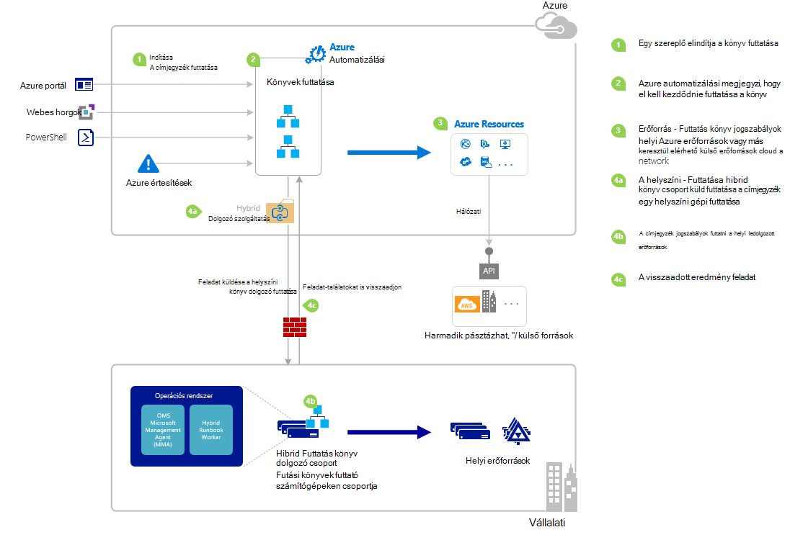

<properties
   pageTitle="Egy runbook kezdése az Azure automatizálási |} Microsoft Azure"
   description="Összefoglalja a különböző módszereket szeretne indítani egy runbook Azure automatizálási is használható, és ez a témakör részletes az Azure-portál és a Windows PowerShell használatával."
   services="automation"
   documentationCenter=""
   authors="mgoedtel"
   manager="jwhit"
   editor="tysonn" />
<tags
   ms.service="automation"
   ms.devlang="na"
   ms.topic="article"
   ms.tgt_pltfrm="na"
   ms.workload="infrastructure-services"
   ms.date="10/08/2016"
   ms.author="magoedte;bwren"/>

# <a name="starting-a-runbook-in-azure-automation"></a>Egy runbook kezdése az Azure automatizálást

Az alábbi táblázat segítséget szeretne indítani egy runbook Azure automatizálási, amely az adott forgatókönyv a legalkalmasabb módszer. Ez a cikk részletes tudnivalókat a runbook kezdve, az Azure-portálra, és a Windows PowerShell tartalmazza. Más módszerek a részletek más érhető el az alábbi hivatkozásokat dokumentációját szerepelnek.

| **A MÓDSZER**                                                                    | **JELLEMZŐIKET BEFOLYÁSOLJÁK**                                                                                                                                                                                                                                                                                                                                                |
|-------------------------------------------------------------------------------|--------------------------------------------------------------------------------------------------------------------------------------------------------------------------------------------------------------------------------------------------------------------------------------------------------------------------------------------------------------------|
| [Azure portál](#starting-a-runbook-with-the-azure-portal)                     | <li>Interaktív felhasználói felülettel legegyszerűbb módja.<br> <li>Adja meg a egyszerű paraméteres értékeket képernyőt.<br> <li>Könnyen nyomon követheti a feladat állapota.<br> <li>Azure bejelentkezési hitelesíteni a hozzáférést.                                                                                                                                                                               |
| [A Windows PowerShell](https://msdn.microsoft.com/library/dn690259.aspx)        | <li>Hívja fel a parancssorból a Windows PowerShell-parancsmagok.<br> <li>Az automatikus megoldás több lépésben beépíthetők.<br> <li>Tanúsítvány vagy OAuth felhasználói fő / szolgáltatási kérelem hitelesített egyszerű.<br> <li>Egyszerű vagy összetett paraméterértékek megadása.<br> <li>Nyomon követheti a feladat állapota.<br> <li>Az ügyfél PowerShell-parancsmagok szükséges. |
| [Azure automatizálási API](https://msdn.microsoft.com/library/azure/mt662285.aspx) | <li>Leginkább rugalmas módszer, de a legtöbb komplex is.<br> <li>Hívja fel, hogy HTTP-kérések egyéni kódrészleteket.<br> <li>Hitelesített tanúsítvány vagy Oauth felhasználói fő / szolgáltatási kérelem egyszerű.<br> <li>Egyszerű vagy összetett paraméterértékek megadása.<br> <li>Nyomon követheti a feladat állapota.                                                                          |
| [Webhooks](automation-webhooks.md)                                            | <li>Indítsa el a runbook egyetlen HTTP kérést.<br> <li>Az URL-CÍMÉT a biztonsági jogkivonat hitelesíteni.<br> <li>Ügyfél webhook létrehozásakor megadott paraméterértékeket nem felülbírálása. Runbook határozhatja meg, hogy HTTP kérés részleteinek kitölti egyetlen paramétert.<br> <li>Nincs lehetőség nyomon követheti a feladat állapota webhook URL-CÍMEN keresztül.                                      |
| [Válasz Azure jelzésére](../log-analytics/log-analytics-alerts.md)               | <li>Indítsa el a runbook Azure értesítésre válaszul.<br> <li>Állítsa be a webhook runbook és a felhasználó mutató hivatkozás.<br> <li>Az URL-CÍMÉT a biztonsági jogkivonat hitelesíteni.<br> <li>Jelenleg csak tesz lehetővé értesítés mérési módja miatt.                                                                                                                                                       |
| [Ütemterv](automation-schedules.md)                                | <li>Automatikus indítása runbook óránkénti, napi vagy heti ütemezés.<br> <li>Kezelheti az ütemezés Azure portál PowerShell-parancsmagok és Azure API keresztül.<br> <li>Adja meg az ütemterv használandó paraméterértékeket.                                                                                                                                               |
| [A másik Runbook](automation-child-runbooks.md)                          | <li>Egy runbook használja egy másik runbook tevékenységet.<br> <li>Több runbooks által használt funkciók esetében hasznos lehet.<br> <li>Adja meg a gyermek runbook paraméterértékeket, és a kimeneti szülő runbook használja.                                                                                                                                                               |

Az alábbi képen részletes, lépésenkénti folyamatot egy runbook az életciklusának mutatja be. Egy runbook elindul az Azure automatizálás, összetevők szükséges hibrid Runbook dolgozó Azure automatizálást runbooks és más összetevőket közötti kölcsönhatás végrehajtásához többféleképpen is tartalmazza. Automatizálási runbooks végrehajtása a adatközpontban kapcsolatos további tudnivalókért olvassa el [a hibrid runbook dolgozók](automation-hybrid-runbook-worker.md) számára



## <a name="starting-a-runbook-with-the-azure-portal"></a>Egy runbook kezdve az Azure-portálra

1.  Az Azure-portálon jelölje be az **automatizálási** , és kattintson majd automatizálási fiók nevére.
2.  Jelölje ki a **Runbooks** fülre.
3.  Jelölje ki a runbook, és kattintson a **Start**gombra.
4.  Ha a runbook paraméterek tartalmaz, a rendszer kéri egy szövegdobozban értékek küldje el az egyes paraméterek. Lásd: [Runbook paraméterek](#Runbook-parameters) alatti további részleteket a paraméterek.
5.  Vagy válassza a **Feladat megtekintése** a **kezdési** runbook üzenet melletti vagy a **feladatok** lapon a runbook a runbook feladat állapotának megtekintéséhez.

## <a name="starting-a-runbook-with-the-azure-portal"></a>Egy runbook kezdve az Azure-portálra

1.  Automatizálási fiókjából kattintson a megnyitni a **Runbooks** lap **Runbooks** részére.
2.  Kattintson egy runbook annak **Runbook** lap megnyitásához.
3.  Kattintson a **Start**gombra.
4.  Ha a runbook paraméterek nélkül, a rendszer kéri győződjön meg arról, hogy szeretné-e elindítani. A runbook paraméterek van, ha a **Runbook indítsa el** a lap nyílik meg, a paraméter értéke lehet nyújtani. Lásd: [Runbook paraméterek](#Runbook-parameters) alatti további részleteket a paraméterek.
5.  A **feladat** lap van megnyitva, így nyomon követheti a feladat állapota.

## <a name="starting-a-runbook-with-windows-powershell"></a>A Windows PowerShell egy runbook kezdve

A [Kezdés-AzureRmAutomationRunbook](https://msdn.microsoft.com/library/mt603661.aspx) egy runbook indítása a Windows PowerShell is használhatja. A példa a próba-Runbook nevű runbook kezdődik.

```
Start-AzureRmAutomationRunbook -AutomationAccountName "MyAutomationAccount" -Name "Test-Runbook" -ResourceGroupName "ResourceGroup01"
```

Kezdés-AzureRmAutomationRunbook egy feladat-objektum, amelyek segítségével nyomon követheti az állapotát, a runbook elindul, amint adja eredményül. Kattintson a feladat objektum segítségével a [Get-AzureRmAutomationJob](https://msdn.microsoft.com/library/mt619440.aspx) határozza meg a projektet, és a [Get-AzureRmAutomationJobOutput](https://msdn.microsoft.com/library/mt603476.aspx) az eredményt megszerezni állapotának. A példa a próba-Runbook, amíg befejeződött, és megjeleníti az eredményt vár nevű runbook kezdődik.

```
$runbookName = "Test-Runbook"
$ResourceGroup = "ResourceGroup01"
$AutomationAcct = "MyAutomationAccount"

$job = Start-AzureRmAutomationRunbook –AutomationAccountName $AutomationAcct -Name $runbookName -ResourceGroupName $ResourceGroup

$doLoop = $true
While ($doLoop) {
   $job = Get-AzureRmAutomationJob –AutomationAccountName $AutomationAcct -Id $job.JobId -ResourceGroupName $ResourceGroup
   $status = $job.Status
   $doLoop = (($status -ne "Completed") -and ($status -ne "Failed") -and ($status -ne "Suspended") -and ($status -ne "Stopped"))
}

Get-AzureRmAutomationJobOutput –AutomationAccountName $AutomationAcct -Id $job.JobId -ResourceGroupName $ResourceGroup –Stream Output
```

Ha a runbook paramétereket igényel, majd meg kell adnia őket, ahol a hashtable kulcsának egyező paraméter neve és a paraméter értéke egy [hashtable](http://technet.microsoft.com/library/hh847780.aspx) . A következő példa bemutatja egy runbook indítása Utónév és Vezetéknév, RepeatCount nevű egész szám és a Megjelenítés nevű logikai paraméter nevű két karakterlánc paraméterrel. További információt a paraméterek lásd: az alábbi [Runbook paramétereket](#Runbook-parameters) .

```
$params = @{"FirstName"="Joe";"LastName"="Smith";"RepeatCount"=2;"Show"=$true}
Start-AzureRmAutomationRunbook –AutomationAccountName "MyAutomationAccount" –Name "Test-Runbook" -ResourceGroupName "ResourceGroup01" –Parameters $params
```

## <a name="runbook-parameters"></a>Runbook paraméterei

Egy runbook az Azure-portálon vagy a Windows PowerShell indításakor utasítás küldi el a Azure automatizálási webes szolgáltatáson keresztül. Ez a szolgáltatás nem támogatja a paramétereket összetett adattípusú. Ha összetett paraméter adjon meg egy értéket kell majd meg kell hívni azt beágyazott egy másik runbook a [gyermek runbooks az Azure automatizálás](automation-child-runbooks.md)ismertetett módon.

Az Azure automatizálási webszolgáltatás adattípusa bizonyos az alábbi szakaszokban ismertetett módon paraméterekkel különleges szolgáltatásokat nyújt.

### <a name="named-values"></a>Megnevezett értékek

Ha a paraméter adattípus [objektum], majd küldje el a megnevezett értékek listáját a következő JSON formátumban is használhatja: *{Név1: "Érték1", Név2: "Érték2", Name3: "Érték3"}*. Ezek az értékek egyszerű típusú kell lennie. A runbook pedig egy [PSCustomObject](https://msdn.microsoft.com/library/system.management.automation.pscustomobject%28v=vs.85%29.aspx) tulajdonságok, amelyek megfelelnek a következő elnevezett értékét kapja meg a paramétert.

Vegye figyelembe az alábbi próba runbook, fogadja el a felhasználó neve paraméter.

```
Workflow Test-Parameters
{
   param (
      [Parameter(Mandatory=$true)][object]$user
   )
    $userObject = $user | ConvertFrom-JSON
    if ($userObject.Show) {
        foreach ($i in 1..$userObject.RepeatCount) {
            $userObject.FirstName
            $userObject.LastName
        }
    }
}
```

Az alábbi szöveget is használható a felhasználó paramétert.

```
{FirstName:'Joe',LastName:'Smith',RepeatCount:'2',Show:'True'}
```

Ennek eredményeképpen a következő eredményt.

```
Joe
Smith
Joe
Smith
```

### <a name="arrays"></a>Tömb

Ha a paraméter egy tömb, például a [tömb] és [karakterlánc []], majd küldje el az értékek listáját a következő JSON formátumban is használhatja: *[érték1, érték2, érték3]*. Ezek az értékek egyszerű típusú kell lennie.

Vegye figyelembe az alábbi próba runbook, fogadja el a *felhasználó*neve paraméter.

```
Workflow Test-Parameters
{
   param (
      [Parameter(Mandatory=$true)][array]$user
   )
    if ($user[3]) {
        foreach ($i in 1..$user[2]) {
            $ user[0]
            $ user[1]
        }
    }
}
```

Az alábbi szöveget is használható a felhasználó paramétert.

```
["Joe","Smith",2,true]
```

Ennek eredményeképpen a következő eredményt.

```
Joe
Smith
Joe
Smith
```

### <a name="credentials"></a>Hitelesítő adatok

Ha a paraméter adattípus **PSCredential**, majd lehet nyújtani Azure automatizálási [hitelesítőadat-eszköz](automation-credentials.md)nevét. A runbook beolvassa a hitelesítő adatokat a megadott névvel.

Vegye figyelembe az alábbi próba runbook, fogadja el a hitelesítő adatok nevű paraméter.

```
Workflow Test-Parameters
{
   param (
      [Parameter(Mandatory=$true)][PSCredential]$credential
   )
   $credential.UserName
}
```

Az alábbi szöveget a felhasználó paraméter feltételezve, hogy nincs-e a *Saját hitelesítő adatok*nevű hitelesítő eszköz használható.

```
My Credential
```

Feltételezve, hogy a hitelesítő adatok felhasználónév *jsmith*volt, ennek eredményeképpen a következő eredményt.

```
jsmith
```

## <a name="next-steps"></a>Következő lépések

-   A jelen cikkben runbook architektúráját áttekintést kaphat a magas szintű runbooks az Azure és a van, a hibrid Runbook dolgozó erőforrások kezelésére.  Automatizálási runbooks végrehajtása a adatközpontban kapcsolatos további tudnivalókért olvassa el [a hibrid Runbook dolgozók](automation-hybrid-runbook-worker.md)számára.
-   Az egyedi vagy közös funkciók más runbooks által használandó létrehozása elemes runbooks kapcsolatos további információért olvassa el a [Gyermek Runbooks](automation-child-runbooks.md).
