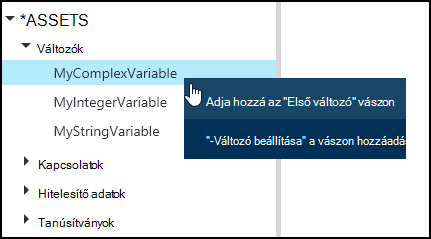
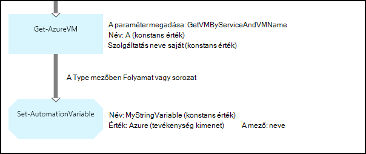
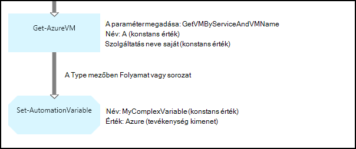
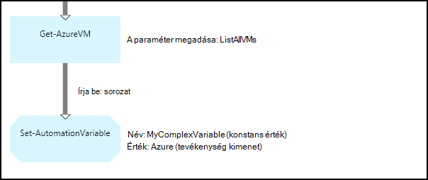
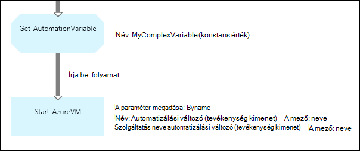
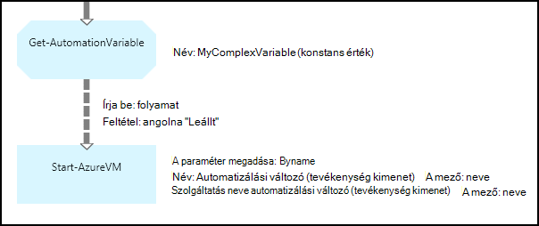

<properties 
   pageTitle="Azure automatizálási változó eszközök |} Microsoft Azure"
   description="Változó eszközök értékeket érhetők el az összes runbooks és Azure automatizálást DSC beállításai.  Ez a cikk ismerteti a részletek változók és hogyan kell a szöveget, és a grafikus szerzői dolgozik velük."
   services="automation"
   documentationCenter=""
   authors="mgoedtel"
   manager="jwhit"
   editor="tysonn" />
<tags 
   ms.service="automation"
   ms.devlang="na"
   ms.topic="article"
   ms.tgt_pltfrm="na"
   ms.workload="infrastructure-services"
   ms.date="05/24/2016"
   ms.author="magoedte;bwren" />

# Azure automatizálási változó eszközök

Változó eszközök értékeket érhetők el az összes runbooks és automatizálási fiókban DSC konfigurációk. Is létrehozott, módosított, és az Azure portálról, a Windows PowerShell, és a programból beolvasni a runbook vagy a DSC konfiguráció. Automatizálási változók az alábbi esetekben hasznosak:

- Ossza meg több runbooks vagy DSC beállítások között megadott értékkel.

- Ossza meg a azonos runbook vagy DSC konfigurációs több feladat közötti értékkel.

- A portálról, vagy a Windows PowerShell-parancssorból runbooks vagy DSC konfigurációk által használt érték kezelése

Automatizálási változók, hogy továbbra is elérhető, még akkor is, ha a runbook vagy DSC konfigurálása sikertelen, is vannak állandó.  Ez egy runbook, majd használja egy másik, vagy használja az azonos runbook vagy DSC konfigurációs a későbbiekben, akkor futtatott beállítandó érték is lehetővé teszi.

Változó létrehozásakor adhatja meg, hogy meg kell tárolni titkosított.  Változó titkosított Azure automatizálási biztonságosan van tárolva, és az érték nem lehet beolvasni a [Get-AzureAutomationVariable](http://msdn.microsoft.com/library/dn913772.aspx) parancsmag az Azure PowerShell-modult részeként.  A **Get-AutomationVariable** tevékenység runbook vagy DSC konfigurációs csak úgy tudja visszaszerezni titkosított érték van.

>[AZURE.NOTE]Azure automatizálási biztonságos eszközök hitelesítő adatokat, a tanúsítványok, a kapcsolatok és a titkosított változók tartalmazza. Ezek az eszközök titkosított és tárolja az Azure automatizálási generált egyedi kulcs minden automatizálási fiók segítségével. A kulcs fő tanúsítvány által titkosított és Azure automatizálási tárolja. Egy biztonságos eszköz tárolja, mielőtt a kulcs az automatizálási fiók visszafejtett fő tanúsítvány használatával, és kattintson az eszköz titkosítására használt.

## Változó típusai

Változó Azure Portal létrehozásakor a portálon jelenítheti meg a megfelelő vezérlőelemet a változó érték beírása, meg kell adnia egy adattípust a legördülő listából. A változó nem az adattípus korlátozott, de a Windows PowerShell szolgáltatással, ha meg szeretné adni egy értéket egy másik típusú változó meg kell. Ha **nincs megadva**adja meg, majd változó értékre állítja be **$null**, és be kell az értéket a [Set-AzureAutomationVariable](http://msdn.microsoft.com/library/dn913767.aspx) parancsmag vagy a **Set-AutomationVariable** tevékenység.  Nem hozható létre, vagy módosítsa az értéket a portálon komplex változó típusú, de megadhatja a Windows PowerShell használatá bármilyen típusú értéket. Összetett típusú fog kell egy [PSCustomObject](http://msdn.microsoft.com/library/system.management.automation.pscustomobject.aspx)adja vissza.

Több érték egy változó egy tömb vagy hashtable létrehozása és mentse a változó tárolhat.

## Parancsmagok és a munkafolyamat-tevékenységek

A parancsmagok az alábbi táblázat létrehozása és kezelése a Windows PowerShell automatizálási változók szolgálnak. Azok az automatizálási runbooks és DSC konfigurációs használható [Azure PowerShell-modult](../powershell-install-configure.md) részét képezi.

|A parancsmagok|Leírás|
|:---|:---|
|[Get-AzureAutomationVariable](http://msdn.microsoft.com/library/dn913772.aspx)|Egy meglévő változó érték olvassa be.|
|[Új AzureAutomationVariable](http://msdn.microsoft.com/library/dn913771.aspx)|Új változót hoz létre, és beállítja értékére.|
|[Eltávolítás-AzureAutomationVariable](http://msdn.microsoft.com/library/dn913775.aspx)|Egy meglévő változó eltávolítja.|
|[Set-AzureAutomationVariable](http://msdn.microsoft.com/library/dn913767.aspx)|Egy meglévő változó értékre állítja.|

A munkafolyamat-tevékenységek, az alábbi táblázat a runbook automatizálási változók eléréséhez használt. Csak akkor érhetők runbook vagy DSC konfigurációs használatra, és nem a Azure PowerShell-modult részét képezi.

|Munkafolyamat-tevékenységek|Leírás|
|:---|:---|
|Get-AutomationVariable|Egy meglévő változó érték olvassa be.|
|Set-AutomationVariable|Egy meglévő változó értékre állítja.|

>[AZURE.NOTE] Változók kerülje a paraméterben – nevét a **Get-AutomationVariable** runbook vagy DSC konfigurációs, mivel ez megnehezítheti felfedezése függőségeket runbooks vagy DSC konfigurációs és automatizálási változók tervezéskor.

## Új automatizálást változó létrehozása

### Új változó létrehozása az Azure portálján

1. Automatizálási fiókjából kattintson az **eszközök** , az ablak tetején.
1. Az ablak alján kattintson a **Beállítás hozzáadása**lehetőséget.
1. Kattintson a **változó hozzáadása**gombra.
1. A varázsló, és mentse az új változó jelölőnégyzetre.

### Új változó létrehozása az Azure portálján

1. Automatizálási fiókjából kattintson a kattintva nyissa meg az **eszközök** lap **eszközök** részére.
1. Kattintson a **változók** részére a **változók** lap megnyitásához.
1. Kattintson a **Hozzáadás változó** elemre a lap tetején.
1. Töltse ki az űrlapot, és mentse az új változó **létrehozása** gombra.

### A Windows PowerShell új változó létrehozásához

A [New-AzureAutomationVariable](http://msdn.microsoft.com/library/dn913771.aspx) parancsmag változót hoz létre új, és a kezdeti értékkel állítja be. Az érték a [Get-AzureAutomationVariable](http://msdn.microsoft.com/library/dn913772.aspx)használatával meghallgathatja. Ha az érték egy egyszerű típus, hogy azonos típusú ad vissza. Ha összetett típusú, a **PSCustomObject** ad vissza.

A következő példa parancsok bemutatják, hogyan hozhat létre a karakterlánc típusú változóban tárolhatja, és kattintson az eredmény.

    New-AzureAutomationVariable –AutomationAccountName "MyAutomationAccount" –Name 'MyStringVariable' –Encrypted $false –Value 'My String'
    $string = (Get-AzureAutomationVariable –AutomationAccountName "MyAutomationAccount" –Name 'MyStringVariable').Value

A következő példa parancsok megjelenítése változó létrehozása egy összetett típusú, és térjen vissza a tulajdonságait. Ebben az esetben a **Get-AzureVM** virtuális gép objektumot használják.

    $vm = Get-AzureVM –ServiceName "MyVM" –Name "MyVM"
    New-AzureAutomationVariable –AutomationAccountName "MyAutomationAccount" –Name "MyComplexVariable" –Encrypted $false –Value $vm
    
    $vmValue = (Get-AzureAutomationVariable –AutomationAccountName "MyAutomationAccount" –Name "MyComplexVariable").Value
    $vmName = $vmValue.Name
    $vmIpAddress = $vmValue.IpAddress

## Változó runbook vagy DSC konfiguráció használata

A **Set-AutomationVariable** tevékenység segítségével egy automatizálási változó értékének beállítása egy runbook vagy DSC konfigurációs és a **Get-AutomationVariable** beolvasásához, azt.  A **Set-AzureAutomationVariable** vagy a **Get-AzureAutomationVariable** parancsmagok runbook vagy DSC konfigurációs kerülni a Webhelyfiókok használatát, mivel a kisebb hatékonyabb, mint a munkafolyamat-tevékenységek.  Az érték a **Get-AzureAutomationVariable**biztonságos változót is nem lehet beolvasni.  A [New-AzureAutomationVariable](http://msdn.microsoft.com/library/dn913771.aspx) parancsmag csak úgy lehet hozzon létre egy új változó runbook vagy DSC konfigurációs környezetbe.

### Szöveges runbook minták

#### Beállításával és a változó egyszerű érték beolvasása

A következő példa parancsok bemutatják, hogyan beállítása, valamint a szöveges runbook egy változó. Ez a példa a tekinti, hogy az egész típusú változók nevű *NumberOfIterations* és *NumberOfRunnings* és elnevezett *SampleMessage* már korábban elkészült karakterlánc típusú változóban tárolhatja.

    $NumberOfIterations = Get-AutomationVariable -Name 'NumberOfIterations'
    $NumberOfRunnings = Get-AutomationVariable -Name 'NumberOfRunnings'
    $SampleMessage = Get-AutomationVariable -Name 'SampleMessage'
    
    Write-Output "Runbook has been run $NumberOfRunnings times."
    
    for ($i = 1; $i -le $NumberOfIterations; $i++) {
       Write-Output "$i`: $SampleMessage"
    }
    Set-AutomationVariable –Name NumberOfRunnings –Value ($NumberOfRunnings += 1)

#### És egy összetett objektum típusú változóban beolvasása

A példa szemlélteti, hogyan lehet be kell írnia a egy szöveges runbook az összetett értéket tartalmazó. Az ebben a példában az Azure virtuális gép **Get-AzureVM** keresi, és egy meglévő automatizálási változó mentett.  [Változó típusok](#variable-types)leírtak Ez egy PSCustomObject tárolja.

    $vm = Get-AzureVM -ServiceName "MyVM" -Name "MyVM"
    Set-AutomationVariable -Name "MyComplexVariable" -Value $vm

A következő kódrészlet az érték beolvasása a változó és a virtuális gép elindításához használt.

    $vmObject = Get-AutomationVariable -Name "MyComplexVariable"
    if ($vmObject.PowerState -eq 'Stopped') {
       Start-AzureVM -ServiceName $vmObject.ServiceName -Name $vmObject.Name
    }

#### És a webhelycsoport típusú változóban beolvasása

A következő példa kódot megtudhatja, hogy miként változó használata összetett értékek egy szöveges runbook gyűjteménye. Ez a példa a több Azure virtuális gépeken futó beolvasni a **Get-AzureVM** és egy meglévő automatizálási változó mentett.  [Változó típusok](#variable-types)leírtak ez PSCustomObjects gyűjteménye tárolja.

    $vms = Get-AzureVM | Where -FilterScript {$_.Name -match "my"}     
    Set-AutomationVariable -Name 'MyComplexVariable' -Value $vms

A következő kódrészlet a gyűjtemény a változó beolvasása, és virtuális gépeken elindításához használt.

    $vmValues = Get-AutomationVariable -Name "MyComplexVariable"
    ForEach ($vmValue in $vmValues)
    {
       if ($vmValue.PowerState -eq 'Stopped') {
          Start-AzureVM -ServiceName $vmValue.ServiceName -Name $vmValue.Name
       }
    }

### A grafikus runbook minták

A grafikus runbook hozzáadja a **Get-AutomationVariable** vagy a **Set-AutomationVariable** a változó grafikus szerkesztő a könyvtár ablakban a jobb gombbal, és válassza a kívánt tevékenységet.

#### Értékek megadása a változó

Az alábbi képen látható, be kell írnia egy egyszerű érték egy grafikus runbook a minta tevékenységeket. Ebben a példában az egyetlen Azure virtuális gép a **Get-AzureVM** program keresi, és egy meglévő automatizálási változót egy karakterlánc típusú menti a számítógép nevét.  Mindegy, hogy a [hivatkozás egy folyamat vagy a sorozat](automation-graphical-authoring-intro.md#links-and-workflow) óta csak egyetlen objektum várhatóan az eredményben.

Az alábbi képen látható az a változó frissíthetők egy grafikus runbook az összetett értéket tartalmazó tevékenységek. Csak a változás az előző példában van nem adja meg egy **mező elérési útját** a **Set-AutomationVariable** tevékenységet a **tevékenység kimeneti** , hogy az objektumot tárolja az objektum egy tulajdonsága helyett.  [Változó típusok](#variable-types)leírtak Ez egy PSCustomObject tárolja.

Az alábbi képen látható a hasonló funkciókat, mint az előző példában az a változó mentett több virtuális gépeken futó.  [Sorozat hivatkozás](automation-graphical-authoring-intro.md#links-and-workflow) itt kell használni, hogy a **Set-AutomationVariable** tevékenység kap egy webhelycsoport teljes készlete virtuális gépeken futó.  [Folyamat hivatkozás](automation-graphical-authoring-intro.md#links-and-workflow) használatakor a **Set-AutomationVariable** tevékenység volna futtassa külön-külön az egyes objektumokra eredményét, hogy csak a legutolsó virtuális gép a gyűjteményben menti.  [Változó típusok](#variable-types)leírtak ez PSCustomObjects gyűjteménye tárolja.

#### Értékek lekérése változó

Az alábbi képen látható a minta és tevékenységek beolvasásához, és a grafikus runbook változó használja.  Az első tevékenységhez olvassa be az előző példában az a változó mentett virtuális gépeken futó.  A hivatkozás kell lennie a [folyamat](automation-graphical-authoring-intro.md#links-and-workflow) , hogy minden küldött a **Get-AutomationVariable** tevékenység objektum egyszer fut a **Kezdés-AzureVM** tevékenység.  Ez lesz ugyanúgy működik, hogy egy egyetlen objektum vagy több objektum tárolja a változó.  A **Kezdés-AzureVM** tevékenységet a PSCustomObject, amely a virtuális gépeken tulajdonságait használja. 

Az alábbi képen látható az objektumok egy olyan grafikus runbook változó tárolt szűrése.  [Feltétel](automation-graphical-authoring-intro.md#links-and-workflow) bekerül az előző példában, csak ezek azok le változó beállításakor a virtuális gépek szűrése a hivatkozást.

## Következő lépések

- További információk a tevékenységek közös grafikus szerzői csatlakozik, a [grafikus szerzői hivatkozásokra kattintva](automation-graphical-authoring-intro.md#links-and-workflow) tájékozódhat
- Első lépések a grafikus runbooks, lásd: [az első grafikus runbook](automation-first-runbook-graphical.md) 
