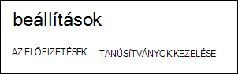
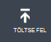
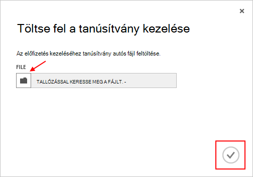

<properties 
    pageTitle="Töltse fel az Azure kezelése API-tanúsítványt |} A Microsoft Azure" 
    description="Ismerje meg, hogy az Azure klasszikus portálon feltöltése a athe Management API-tanúsítvány." 
    services="cloud-services" 
    documentationCenter=".net" 
    authors="Thraka" 
    manager="timlt" 
    editor=""/>

<tags 
    ms.service="na" 
    ms.workload="tbd" 
    ms.tgt_pltfrm="na" 
    ms.devlang="na" 
    ms.topic="article" 
    ms.date="04/18/2016"
    ms.author="adegeo"/>

# Töltse fel az Azure felügyeleti API Management tanúsítvány

Adatkezelési tanúsítványok teszi lehetővé az Azure által nyújtott szolgáltatás felügyeleti API-val hitelesítést végezni. Számos programok és eszközök (például a Visual Studio vagy az Azure SDK) fogja használni a tanúsítványok automatizálása konfigurálása és üzembe Azure szolgáltatást. **Ez csak az Azure klasszikus portálra vonatkozik**. 

>[AZURE.WARNING] légy óvatos! Tanúsítványok az ilyen típusú engedélyezése bárki, aki hitelesíti a velük társított azokat az előfizetés kezeléséhez. 

Azure tanúsítványok (beleértve a önaláírt tanúsítvány létrehozása) további információt a rá szükség esetén [érhető el](cloud-services/cloud-services-certs-create.md#what-are-management-certificates) .

[Azure Active Directory](/services/active-directory/) hitelesítést végezni az ügyfél-kód automatizálási célra is használhatja.

## Töltse fel a tanúsítvány kezelése

Ha már létrehozott management tanúsítvány, (csak a nyilvános kulccsal .cer fájl), töltse fel őket a portálra. A tanúsítvány a portálon érhető el, ha bárki, akinek van egy megfelelő certficiate (titkos kulcs) az adatkezelési API protokollal csatlakozzon, és az erőforrásokhoz társított előfizetéshez férjenek hozzá.

1. Jelentkezzen be az [Azure klasszikus portálon](http://manage.windowsazure.com).

2. Győződjön meg róla, hogy a helyes előfizetés tanúsítvány társítani kívánt. Nyomja le a **előfizetések** szöveg, a felső sarkában látható a portálon.

    

3. Után a helyes-e kijelölve előfizetés, nyomja meg a **Beállítások** (, előfordulhat, hogy kell görgetnie) a portál bal oldalán. 
    
    

4. Nyomja le a **Kezelés tanúsítványok** fülre.

    
    
5. Kattintson a **Feltöltés** gombra.

    
    
6. Adja meg a párbeszédpanel adatait, és nyomja le a kész **be van jelölve**.

    

## Következő lépések

Most, hogy van egy olyan előfizetéséhez társított adatkezelési tanúsítvány, is (miután telepítette a megfelelő tanúsítvány helyben) programozottan csatlakoztatása a [Szolgáltatás felügyeleti REST API -val](https://msdn.microsoft.com/library/azure/mt420159.aspx) és a különböző Azure erőforrásokhoz társított is, hogy az előfizetés automatizálása. 