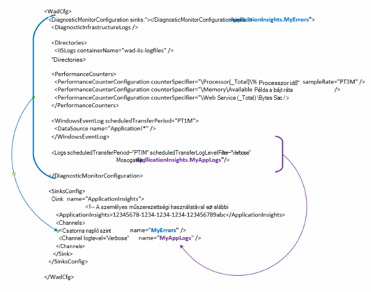

<properties
   pageTitle="Azure diagnosztikai adatok küldése a hírcsatornájában alkalmazás beállítása |} Microsoft Azure"
   description="Frissítse az Azure diagnosztika nyilvános konfigurációs adatok küldése a alkalmazás az összefüggéseket."
   services="multiple"
   documentationCenter=".net"
   authors="sbtron"
   manager="douge"
   editor="" />
<tags
   ms.service="application-insights"
   ms.devlang="na"
   ms.topic="article"
   ms.tgt_pltfrm="na"
   ms.workload="na"
   ms.date="12/15/2015"
   ms.author="saurabh" />

# Adatok küldése a alkalmazás háttérismeretek Azure diagnosztika konfigurálása

Azure diagnosztika Azure tároló táblák adatait tárolja.  Azonban is megtekintheti az összes függőleges vonás vagy az adatok mélyebb alkalmazás részhalmazát konfigurálásával "Mosogatók" és "csatornák" a konfigurációban Azure diagnosztika bővítmény 1.5-ös vagy újabb verzió használata esetén.

Ez a cikk ismerteti, hogyan hozhat létre az Azure diagnosztika bővítmény nyilvános konfigurációja, hogy a konfigurált adatok küldése a alkalmazás az összefüggéseket.

## Alkalmazás az összefüggéseket a gyűjtő beállítása

Az Azure diagnosztika bővítmény 1,5 vezet be a **<SinksConfig>** a nyilvános konfiguráció elemét. A további *gyűjtő* , ahol az Azure diagnosztikai adatok elküldésének határozza meg. Megadhatja, hogy az alkalmazás az összefüggéseket erőforrás, amelyre az Azure diagnosztikai adatok küldése a részeként részleteit **<SinksConfig>**.
Példa **SinksConfig** így néz ki-  

    <SinksConfig>
        <Sink name="ApplicationInsights">
          <ApplicationInsights>{Insert InstrumentationKey}</ApplicationInsights>
          <Channels>
            <Channel logLevel="Error" name="MyTopDiagData"  />
            <Channel logLevel="Verbose" name="MyLogData"  />
          </Channels>
        </Sink>
      </SinksConfig>

Az **gyűjtő** elemet a *név* attribútum Itt adhatja meg a gyűjtő egyedileg hivatkozni használt szöveges értékként.
A **ApplicationInsights** elem műszerezettségi kulcsot, ahova az Azure diagnosztika adatokat küldi, az alkalmazás az összefüggéseket erőforrásnak adja meg. Ha nincs telepítve a meglévő alkalmazás háttérismeretek erőforrás, talál további információt a erőforrás létrehozása és a műszerezettségi kulcs első [létrehozása új alkalmazás háttérismeretek erőforrás](./application-insights/app-insights-create-new-resource.md) .

Ha egy felhőalapú szolgáltatásba projekt Azure SDK 2,8 a műszerezettségi kulcs automatikusan kitölti a rendszer a nyilvános konfigurációs **APPINSIGHTS_INSTRUMENTATIONKEY** konfigurációs beállításával alapul, amikor a felhőalapú szolgáltatás project csomagolást. Lásd: [Használata alkalmazás háttérismeretek az Azure diagnosztika Felhőszolgáltatásba problémák megoldásához](./cloud-services/cloud-services-dotnet-diagnostics-applicationinsights.md).

A **csatornák** elem meghatározhatja, hogy az adatok, amelyek a gyűjtő küld egy vagy több **csatorna** elemet. A csatorna úgy működik, mint a szűrőt, és lehetővé teszi, hogy jelölje ki a használni kívánt szeretné küldeni a gyűjtő egyedi naplófájl szintek. Például képes részletes naplógyűjtés, és küldje el nekik tárhely, de úgy lehetett dönt, hogy egy csatornát, a hiba, és keresztül naplók küldése, hogy csak a csatorna hibanaplók adott gyűjtő küld egy naplózási szintjének meghatározása.
A **csatorna** a *név* attribútum használatos csatorna egyedileg hivatkozik.
A *loglevel* attribútum a naplózási szintjének, amely lehetővé teszi, hogy a csatorna megadását teszi lehetővé. A rendelkezésre álló hibakeresési szintek leginkább legalább információkat sorrendben
 - Részletes
 - Információk
 - Figyelmeztetés
 - Hibaüzenet
 - Kritikus

## Adatok küldése a alkalmazás háttérismeretek gyűjtő a
Miután meghatározta a alkalmazás háttérismeretek gyűjtő küldhet adatok adott gyűjtő az elemeket a **DiagnosticMonitorConfiguration** csomópont alatt a *gyűjtő* attribútum hozzáadásával. A *Mosogatók* elem felvétele az egyes csomópontra Itt adhatja meg a csomópontra, és szeretné megkapni, a megadott gyűjtő bármely csomópontját gyűjtött adatokat.

Például ha el szeretné küldeni az Azure diagnosztika összegyűjtött adatokat, felveheti a *gyűjtő* attribútum közvetlenül az a **DiagnosticMonitorConfiguration** csomópontot. *Mosogatók* értékének beállítása a **SinkConfig**megadott gyűjtő nevére.

    <DiagnosticMonitorConfiguration overallQuotaInMB="4096" sinks="ApplicationInsights">

Ha el szeretné-e küldeni, csak az alkalmazás mélyebb hibanaplók gyűjtése, akkor beállíthatja, hogy a *mosdók* értékét a gyűjtő nevét, majd a csatorna nevét, pontosvesszővel ponttal ("."). A hiba csak naplók küldése az alkalmazás mélyebb például gyűjtő használja a MyTopDiagdata csatorna, amely adták meg a fenti SinksConfig.  

    <DiagnosticMonitorConfiguration overallQuotaInMB="4096" sinks="ApplicationInsights.MyTopDiagdata">

Ha csak a részletes alkalmazás naplók küldése alkalmazás mélyebb majd vegyen fel a *Mosogatók* attribútum a **Naplók** csomópontra.

    <Logs scheduledTransferPeriod="PT1M" scheduledTransferLogLevelFilter="Verbose" sinks="ApplicationInsights.MyLogData"/>

Több mosdók a konfigurációban a hierarchia különféle szintű is tartalmazhatnak. Ebben az esetben a hierarchia legfelső szintjén megadott gyűjtő működik-e a globális és az egyik, például egy adott globális beállítás be az adott elem elem jogszabályok megadott.    

Itt látható a teljes a nyilvános konfigurációs fájl, amely (a **DiagnosticMonitorConfiguration** csomópontot a megadott) alkalmazás háttérismeretek és ezeken részletes szintű naplók összes hibát küld az alkalmazás naplók (a **Naplók** csomópontot a megadott).

    <WadCfg>
      <DiagnosticMonitorConfiguration overallQuotaInMB="4096"
           sinks="ApplicationInsights.MyTopDiagData"> <!-- All info below sent to this channel -->
        <DiagnosticInfrastructureLogs />
        <PerformanceCounters>
          <PerformanceCounterConfiguration counterSpecifier="\Processor(_Total)\% Processor Time" sampleRate="PT3M" sinks="ApplicationInsights.MyLogData/>
          <PerformanceCounterConfiguration counterSpecifier="\Memory\Available MBytes" sampleRate="PT3M" />
          <PerformanceCounterConfiguration counterSpecifier="\Web Service(_Total)\Bytes Total/Sec" sampleRate="PT3M" />
        </PerformanceCounters>
        <WindowsEventLog scheduledTransferPeriod="PT1M">
          <DataSource name="Application!*" />
        </WindowsEventLog>
        <Logs scheduledTransferPeriod="PT1M" scheduledTransferLogLevelFilter="Verbose"
                sinks="ApplicationInsights.MyLogData"/> <!-- This specific info sent to this channel -->
      </DiagnosticMonitorConfiguration>

    <SinksConfig>
        <Sink name="ApplicationInsights">
          <ApplicationInsights>{Insert InstrumentationKey}</ApplicationInsights>
          <Channels>
            <Channel logLevel="Error" name="MyTopDiagData"  />
            <Channel logLevel="Verbose" name="MyLogData"  />
          </Channels>
        </Sink>
      </SinksConfig>
    </WadCfg>

Vannak bizonyos korlátozások, ezekkel a funkciókkal tudatában kell lennie

- Csatornák csak naplófájl típusa és nem a teljesítmény számláló van kialakítva. Ha egy teljesítményét számláló elem figyelmen kívül csatorna adja meg.
- A naplózási szintjének csatornára nem haladhatja meg a mi Azure diagnosztika gyűjtött a naplózási szintjének. Példa: nem naplók eleme hibák alkalmazás naplózása összegyűjtése és részletes kísérel meg az alkalmazás betekintést gyűjtő naplók. A *scheduledTransferLogLevelFilter* attribútum mindig összegyűjtése egyenlő vagy küldhet egy gyűjtő próbálja a naplókat-nél több naplók.
- Nem lehet küldeni blob-adatokról Azure diagnosztika bővítmény által gyűjtött alkalmazás az összefüggéseket. Ha például semmit a *könyvtárak* csomópont csoportban megadott. Az összeomlást kiírása a tényleges összeomlik kiírása továbbra is küld blob-tároló, és csak, hogy történt-e az összeomlást kiírása értesítést küld alkalmazás az összefüggéseket.

## Következő lépések

- Az alkalmazás az Azure diagnosztika bővítmény engedélyezése a [PowerShell](./cloud-services/cloud-services-diagnostics-powershell.md) használatával. 
- Használja a [Visual Studio](vs-azure-tools-diagnostics-for-cloud-services-and-virtual-machines.md) ahhoz, hogy az alkalmazás az Azure diagnosztika bővítmény
