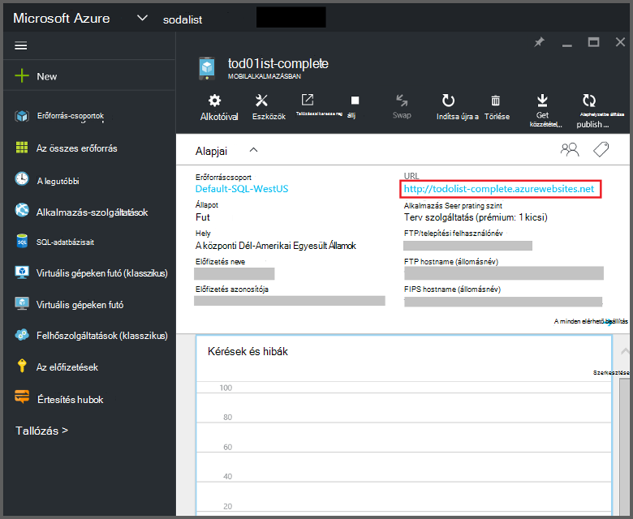
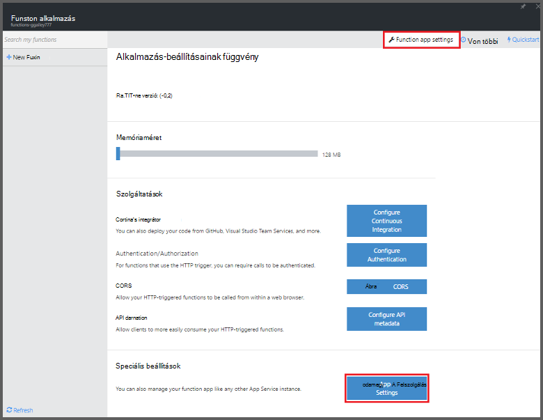
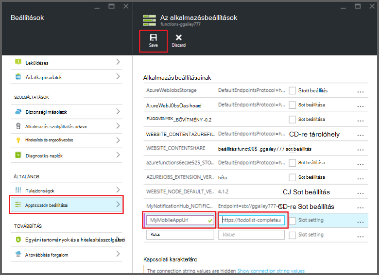

<properties
    pageTitle="Azure függvények Mobile-alkalmazások kötések |} Microsoft Azure"
    description="Megtudhatja, hogyan kötések Azure Mobile-alkalmazások használata a függvények Azure."
    services="functions"
    documentationCenter="na"
    authors="ggailey777"
    manager="erikre"
    editor=""
    tags=""
    keywords="Azure funkciók esemény feldolgozása, dinamikus számítási, kiszolgáló nélküli architektúráját, függvények"/>

<tags
    ms.service="functions"
    ms.devlang="multiple"
    ms.topic="reference"
    ms.tgt_pltfrm="multiple"
    ms.workload="na"
    ms.date="08/30/2016"
    ms.author="glenga"/>

# Azure függvények Mobile-alkalmazások kötések

[AZURE.INCLUDE [functions-selector-bindings](../../includes/functions-selector-bindings.md)]

Ez a cikk ismerteti, hogy konfigurálása és a kód Azure Mobile-alkalmazások kötések Azure-függvényekkel. 

[AZURE.INCLUDE [intro](../../includes/functions-bindings-intro.md)] 

Azure Service Mobile Alkalmazásindítónalkalmazások végpont Táblázatadatok mobilügyfelek elérhetővé teszi lehetővé. Az azonos táblázatos adatok mindkét a beviteli kínál, és Azure-függvényekkel kötések kimeneti. Dinamikus séma támogat, mert Node.js kódmentes mobilalkalmazásban ideális közzéteszi táblázatadatokat a funkciók való használatra. Dinamikus séma alapértelmezés szerint engedélyezve van, és munkakörnyezeti mobilalkalmazásban kell tiltható. Végpont táblát egy Node.js kódmentes kapcsolatos további tudnivalókért lásd [áttekintése: műveletek táblázat](../app-service-mobile/app-service-mobile-node-backend-how-to-use-server-sdk.md#TableOperations). Mobile-alkalmazások a Node.js kódmentes támogatja a portálon böngészési, és a tábla szerkesztése. További információt [a portálon szerkesztése](../app-service-mobile/app-service-mobile-node-backend-how-to-use-server-sdk.md#in-portal-editing) a Node.js SDK témakörben talál. Az Azure függvények .NET kódmentes mobilalkalmazásban használja, kézzel kell frissítenie az adatmodell igény szerint a függvény. Táblázat végpontok .NET kódmentes mobilalkalmazásban további információkért lásd [hogyan: megadása egy táblázat vezérlő](../app-service-mobile/app-service-mobile-dotnet-backend-how-to-use-server-sdk.md#define-table-controller) a .NET kódmentes SDK témakörben. 

## Hozzon létre egy környezeti változóba a mobilalkalmazásban kódmentes URL-címe

Mobile-alkalmazások kötések jelenleg csak a hozzon létre egy környezeti változó, amely visszaadja a mobilalkalmazásban kódmentes magát URL-CÍMÉT. Ez az URL a mobilalkalmazásban megkeresése, majd a lap az [Azure portálon](https://portal.azure.com) található.

Ha hozzá szeretné adni ez az URL-környezet változó, a függvény alkalmazásban:

1. A függvény alkalmazásban az [Azure függvények portált](https://functions.azure.com/signin), kattintson a **függvény alkalmazás beállításainak** > **Nyissa meg az App szolgáltatás beállításai**. 

    

2. A függvény alkalmazásban kattintson **a minden elérhető beállítás**, görgessen le a **alkalmazás beállításait**, majd a típus **alkalmazás beállításainak** egy új **nevet** a környezeti változóba, illessze be az **értéket**, ügyelve arra használja a HTTPS-sémát, majd kattintson a **Mentés** gombra, és zárja be a függvény a alkalmazás lap, a függvények portál való visszatéréshez.   

    

Most már beállíthatja, hogy ez új környezeti változó a *kapcsolat* mezőt a kötések a.

## A Mobile-alkalmazások táblázat végpontok hozzáférésének biztonságossá tételét API kulcsot használni.

Azure-függvényekkel mobil táblázat kötések megadhatja egy API-ja kulcs, amely egy megosztott titkos, hogy a nem kívánt access-alkalmazásokból a funkciók nem használható. Mobile-alkalmazások nem rendelkezik beépített támogatása a fő API-hitelesítést. Azonban alkalmazhat egy API-ja kulcs a Node.js kódmentes mobilalkalmazásban a példák az [Azure alkalmazás szolgáltatás Mobile-alkalmazások kódmentes végrehajtása egy API-ja kulcs](https://github.com/Azure/azure-mobile-apps-node/tree/master/samples/api-key)követve. A [.NET kódmentes mobilalkalmazás](https://github.com/Azure/azure-mobile-apps-net-server/wiki/Implementing-Application-Key)hasonló módon alkalmazhat egy API-ja kulcs.

>[AZURE.IMPORTANT] A API kulcs nem kell a mobilalkalmazásban ügyfelek eloszlású, meg kell csak juttatni biztonságosan szolgáltatás mellett ügyfelek esetén például az Azure függvények. 

## A szövegbeviteli kötés Azure Mobile-alkalmazások

Beviteli kötések rekord betöltése egy mobil táblázat végpontot, és közvetlenül a kötelező át is. A rekord Azonosítóját határozza meg, hogy a meghívott a függvény az eseményindító alapján. C# függvény a rekord módosításait automatikusan elküldi vissza a tábla esetén a függvény kijelentkezik a sikeres.

#### a szövegbeviteli kötés Function.JSON Mobile-appokról

A *function.json* fájl támogatja a következő tulajdonságokat:

- `name`: Változó nevét a kód függvény az új rekord.
- `type`: Biding típusú meg kell *mobileTable*.
- `tableName`: A táblázat, ahol hozható létre az új rekord.
- `id`: A rekord azonosítója beolvasásához. Ez a tulajdonság kötések hasonló módon támogatja `{queueTrigger}`, amely a karakterláncérték az várólista üzenet fog használni a rekord azonosítójával.
- `apiKey`: Olyan karakterlánc, amely az alkalmazás-beállítás, amely megadja a választható API kulcsot a mobile alkalmazáshoz. Szükség, ha a mobilalkalmazásban függvényt használja az API-ja kulcs ügyfél-hozzáférési korlátozása.
- `connection`: Olyan karakterlánc, amely a környezeti változó Alkalmazásbeállítások, amely meghatározza az URL-CÍMÉT a mobilalkalmazásban kódmentes nevét.
- `direction`: Meg kell *a*kötelező irányba.

Példa *function.json* fájl:

    {
      "bindings": [
        {
          "name": "record",
          "type": "mobileTable",
          "tableName": "MyTable",
          "id" : "{queueTrigger}",
          "connection": "My_MobileApp_Url",
          "apiKey": "My_MobileApp_Key",
          "direction": "in"
        }
      ],
      "disabled": false
    }

#### Azure Mobile-alkalmazások példa C# várólista eseményindítók

A példa function.json a fenti Mobile-alkalmazások a bejegyzés táblázat, amely megfelel a várólista üzenet karakterlánc, és átadja a *rekord* paraméter azonosítójú végpontot, a bemeneti kötés kérdezi le alapján. Nem található meg a bejegyzést, ha a paraméter értéke null. A rekord majd frissül az új *szöveges* értéket tartalmazó kijelentkezik a függvény.

    #r "Newtonsoft.Json"    
    using Newtonsoft.Json.Linq;
    
    public static void Run(string myQueueItem, JObject record)
    {
        if (record != null)
        {
            record["Text"] = "This has changed.";
        }    
    }

#### Azure Mobile-alkalmazások példa Node.js várólista eseményindítók

A példa function.json a fenti Mobile-alkalmazások a bejegyzés táblázat, amely megfelel a várólista üzenet karakterlánc, és átadja a *rekord* paraméter azonosítójú végpontot, a bemeneti kötés kérdezi le alapján. Node.js funkciók, a frissített rekordok nem kerülnek vissza a táblázat. A példa a beolvasott rekord a napló ír.

    module.exports = function (context, input) {    
        context.log(context.bindings.record);
        context.done();
    };

## Azure Mobile-alkalmazások kimeneti kötése

A függvény a Mobile-alkalmazások táblázat végpont egy kimeneti kötés használata tud írni egy rekordot. 

#### a Mobile-alkalmazások Function.JSON kimeneti kötése

A function.json fájl támogatja a következő tulajdonságokat:

- `name`: Változó nevét a kód függvény az új rekord.
- `type`: Kötelező típusa, amely a *mobileTable*értékre kell állítani.
- `tableName`: A táblázat, ahol az új rekordot hoz létre.
- `apiKey`: Olyan karakterlánc, amely az alkalmazás-beállítás, amely meghatározza a mobilalkalmazás a választható API billentyűjét. Szükség, ha a mobilalkalmazásban függvényt használja az API-ja kulcs ügyfél-hozzáférési korlátozása.
- `connection`: Olyan karakterlánc, amely a környezeti változó Alkalmazásbeállítások, amely meghatározza az URL-CÍMÉT a mobilalkalmazásban kódmentes nevét.
- `direction`: Meg kell *ki*kötelező irányba.

Példa function.json:

    {
      "bindings": [
        {
          "name": "record",
          "type": "mobileTable",
          "tableName": "MyTable",
          "connection": "My_MobileApp_Url",
          "apiKey": "My_MobileApp_Key",
          "direction": "out"
        }
      ],
      "disabled": false
    }

#### Azure Mobile-alkalmazások példa C# várólista eseményindítók

A C# kód példa egy Mobile-alkalmazások táblázat végpontot egy *szöveges* tulajdonság a táblázatba, ha a fenti kötés megadott új rekord szúr be.

    public static void Run(string myQueueItem, out object record)
    {
        record = new {
            Text = $"I'm running in a C# function! {myQueueItem}"
        };
    }

#### Azure Mobile-alkalmazások példa Node.js várólista eseményindítók

A Node.js példa egy új rekord egy Mobile-alkalmazások táblázat végpontot egy *szöveges* tulajdonság a táblázatba, ha a fenti kötés megadott szúr be.

    module.exports = function (context, input) {
    
        context.bindings.record = {
            text : "I'm running in a Node function! Data: '" + input + "'"
        }   
    
        context.done();
    };

## Következő lépések

[AZURE.INCLUDE [next steps](../../includes/functions-bindings-next-steps.md)]
