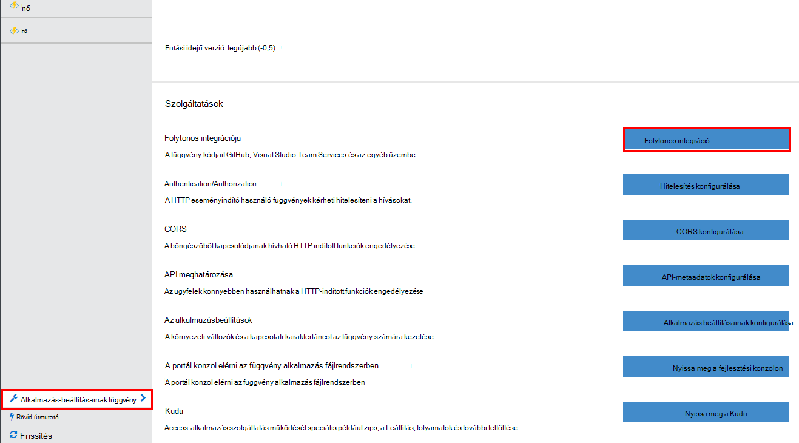
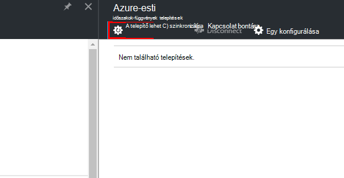
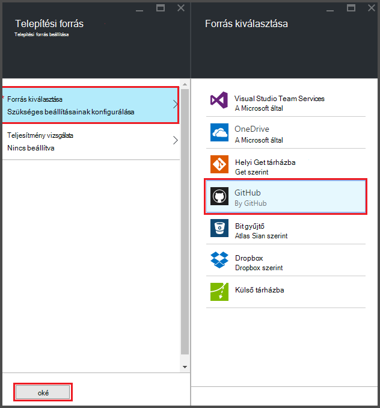
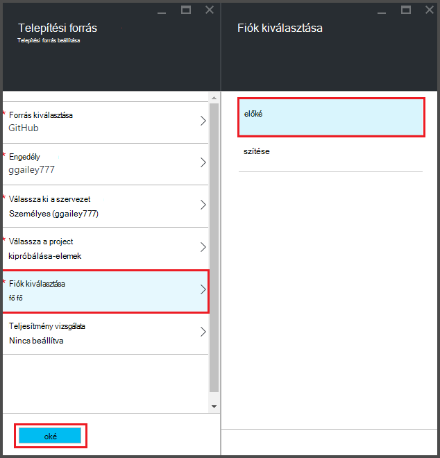
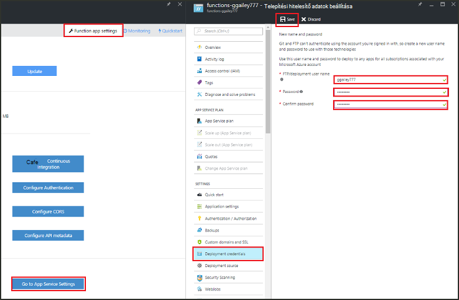
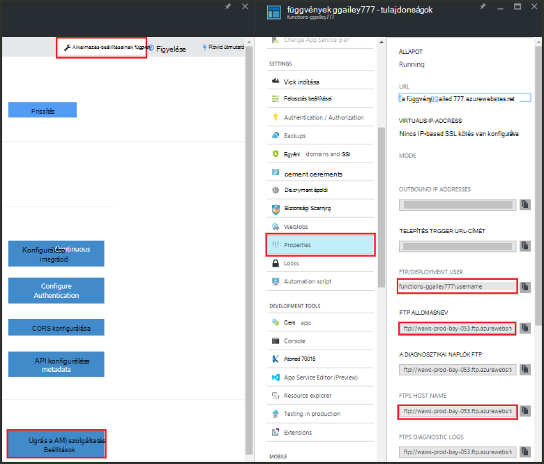
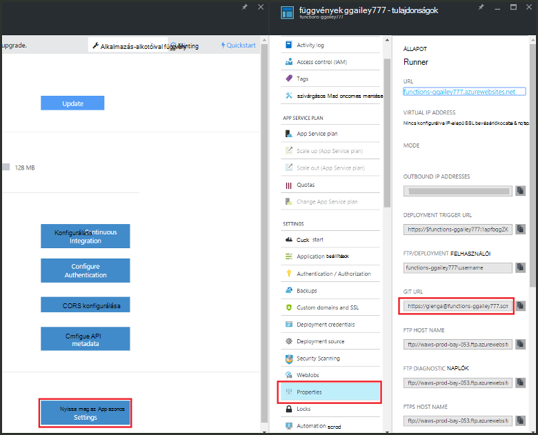

<properties
   pageTitle="Azure függvények folyamatos telepítésének |} Microsoft Azure"
   description="Folytonos telepítési létesítményekhez Azure alkalmazás szolgáltatás használatával az Azure függvények közzététele."
   services="functions"
   documentationCenter="na"
   authors="ggailey777"
   manager="erikre"
   editor=""
   tags=""
   />

<tags
   ms.service="functions"
   ms.devlang="multiple"
   ms.topic="article"
   ms.tgt_pltfrm="multiple"
   ms.workload="na"
   ms.date="09/25/2016"
   ms.author="glenga"/>

# Folytonos telepítésének Azure függvények 

Azure függvények egyszerűen a függvény alkalmazás folyamatos telepítésének konfigurálásához. Függvények Azure App integrációja BitBucket, Dropbox, GitHub és a Visual Studio csapat szolgáltatások (VSTS) ahhoz, hogy hol Azure gyűjti össze a frissítéseket a függvények kódra az alábbi szolgáltatások közül való közzétételkor folyamatos telepítési munkafolyamat használja. Ha még kezdő az Azure függvények, kezdje a [Azure függvények áttekintése](functions-overview.md).

Folytonos telepítési remek lehetőség projektekhez ahol több és gyakori adományok integrált. Azt is lehetővé teszi a függvények kód a verziókövetés karbantartása. Az alábbi telepítési források jelenleg támogatott:

+ [Bitbucket](https://bitbucket.org/)
+ [Dropbox](https://bitbucket.org/)
+ [Helyi repó mely számjegy](../app-service-web/app-service-deploy-local-git.md)
+ Külső repó mely számjegy
+ [GitHub]
+ Külső repó Mercurial
+ [Onedrive-on](https://onedrive.live.com/)
+ Visual Studio Team Services

Telepítési környezetének konfigurálták per-függvény-app alapon. Folytonos telepítési engedélyezése után a portálon függvény kód hozzáférést értéke *csak olvasható*.

## Folytonos telepítési követelmények

A telepítési forrást beállítva, és a függvények kód a telepítési forrást, beállítási folyamatos telepítés előtt kell rendelkeznie. Az egy adott funkció alkalmazások telepítésének minden függvény abban egy névvel ellátott alkönyvtárába, és a könyvtár nevét a függvény neve. Ez a mappa struktúra lényegében a webhely-kód. 

[AZURE.INCLUDE [functions-folder-structure](../../includes/functions-folder-structure.md)]

## Folytonos telepítési felállítása

Az alábbi eljárással meglévő függvény alkalmazás folyamatos telepítésének konfigurálásához:

1. A függvény alkalmazásban az [Azure függvények portált](https://functions.azure.com/signin), kattintson a **függvény alkalmazás beállításainak** > **konfigurálása folyamatos integrációs** > **beállítása**.

    
    
    
    
    Akkor is is megnyithatja a telepítés lap a függvények quickstart útmutató **indítása az adatforrás-vezérlő**gombra kattintva.

2. A telepítés lap, **Válassza ki a forrást**, ezután a választott telepítési forrást adatait fill-in gombra, és kattintson az **OK gombra**.

    

Folytonos telepítési beállítása után minden módosításokat a telepítési forrást a Másolás a függvény alkalmazásba, és a teljes webhely üzembe induljanak. A webhely üzlethez van, a forrásban fájlok frissítésekor.

##Telepítési lehetőségek

Az alábbiakban néhány tipikus telepítési alkalmazási helyzetek:

+ 

###Hozzon létre egy átmeneti tárolásra szolgáló telepítés

Alkalmazások függvény egyelőre nem támogatja a telepítési helyek. Azonban továbbra is kezelheti külön átmeneti és üzemi telepítések folyamatos integrációs használatával.

A folyamat beállítása és használata az átmeneti tárolásra szolgáló telepítés általában formátumban jelennek meg:

1. Hozzon létre két függvény alkalmazás az előfizetését, egy gyártási kódját, és egy átmeneti. 

2. Telepítési forrás, létrehozása, ha még nem rendelkezik. [GitHub]fogjuk használni.
 
3. A gyártási függvény alkalmazás hajtsa végre a fenti **felállításának folyamatos** környezetben, és állítsa a telepítési ág a fő részlege a GitHub repó.

    

4. Ismételje meg ezt a lépést az átmeneti tárolásra szolgáló függvény alkalmazást, de ez esetben válassza a GitHub repó az átmeneti tárolásra szolgáló ág. Ha a telepítési forrást nem támogatja az elágaztatási, használja a másik mappát.
 
5. Az átmeneti tárolásra szolgáló mappa vagy ág a kód frissítéseket, majd ellenőrizze, hogy azok tükröződni fognak a átmeneti tárolásra szolgáló példányban.

6. Tesztelés, után egyesítése módosítja az átmeneti tárolásra szolgáló ág a fő ág be. Ez elindítja a termelési függvény alkalmazásba történő telepítéséhez. A telepítési forrást nem támogatja a használja, ha a termelési mappában lévő fájlok felülírása az átmeneti tárolásra szolgáló mappa a fájlokat.

###Folytonos telepítési meglévő függvények áthelyezése

Ha már létrehozott és karbantartani a portálon, le kell töltenie a meglévő függvény kód fájlok FTP használatával, vagy a helyi mely számjegy tárházba, mielőtt is lehet beállítani a folyamatos telepítési fentebb ismertetett meglévő függvényeket. Ehhez a alkalmazás szolgáltatás beállításait az függvény számára. Után a fájlok letöltését a választott folyamatos telepítési forrást feltöltheti őket.

>[AZURE.NOTE]Folytonos integráció után már nem fogja tudni a függvények portálon a forrás-fájlokat szeretne szerkeszteni.

####Útmutató: telepítési hitelesítő adatok beállítása
Mielőtt fájlokat letöltheti az függvény-alkalmazás, meg kell adnia a hitelesítő adatait, és nyissa meg a webhelyet, amely végezheti el a portálon. Hitelesítő adatok függvény alkalmazás szinten vannak beállítva.

1. A függvény alkalmazásban az [Azure függvények portált](https://functions.azure.com/signin), kattintson a **függvény alkalmazás beállításainak** > **Nyissa meg az App szolgáltatás beállításai** > **telepítési hitelesítő adatait**.

    

2. Írja be a felhasználónevet és jelszót, majd kattintson a **Mentés**gombra. Ezek a hitelesítő adatok hozzáférhet az függvény alkalmazás FTP- vagy a beépített mely számjegy repó most már használhatja.

####Útmutató: a FTP-fájlok letöltéséről

1. A függvény alkalmazásban az [Azure függvények portált](https://functions.azure.com/signin), kattintson a **függvény alkalmazás beállításainak** > **Nyissa meg az App szolgáltatás beállításai** > **tulajdonságainak** és az **FTP/központi felhasználói**, **FTP állomásnév**és **FTPS állomásnév**másolja az értékeket.  
Az alkalmazás neve például az FTP-kiszolgáló a megfelelő környezet biztosítása érdekében a portálon megjelenő **FTP/központi felhasználói** kell megadni.

    
    
2. A kapcsolat adatait használja az FTP-ügyfél, a csatlakozás az alkalmazást, és töltse le a forrásfájlokat a függvények összegyűjtötte.

####Útmutató: a fájlok használata a helyi mely számjegy folyamattárházzal letöltése

1. A függvény alkalmazásban az [Azure függvények portált](https://functions.azure.com/signin), kattintson a **függvény alkalmazás beállításainak** > **konfigurálása folyamatos integrációs** > **beállítása**.

2. A telepítés lap, **Válassza ki a forrást**, **helyi mely számjegy tárházba**, kattintson a, majd kattintson az **OK gombra**.
 
3. Kattintson az **Ugrás alkalmazás szolgáltatás beállításai** > **Tulajdonságok** és a megjegyzések mely számjegy URL-cím értékét. 
    
    

4. A parancssor mely számjegy-et vagy a kedvenc mely számjegy-eszköz használata a helyi számítógépen repó klónozhatja. A mely számjegy adatfeliratsor parancs formátumban, például a következőket:

        git clone https://username@my-function-app.scm.azurewebsites.net:443/my-function-app.git

5. Fájlok lehívása az függvény alkalmazás az adatfeliratsor a helyi számítógépen, a következő példának megfelelően:

        git pull origin master

    Ha szükséges, adja meg a felhasználónevét és jelszavát, a függvény alkalmazás telepítéshez.  

[GitHub]: https://github.com/
