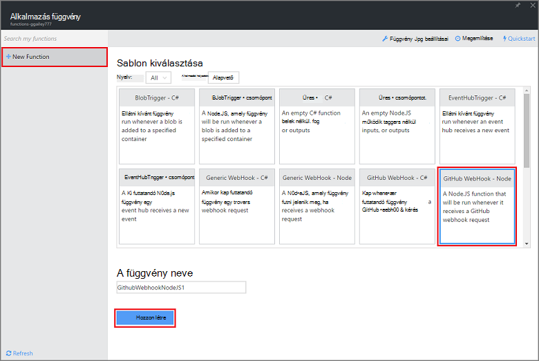
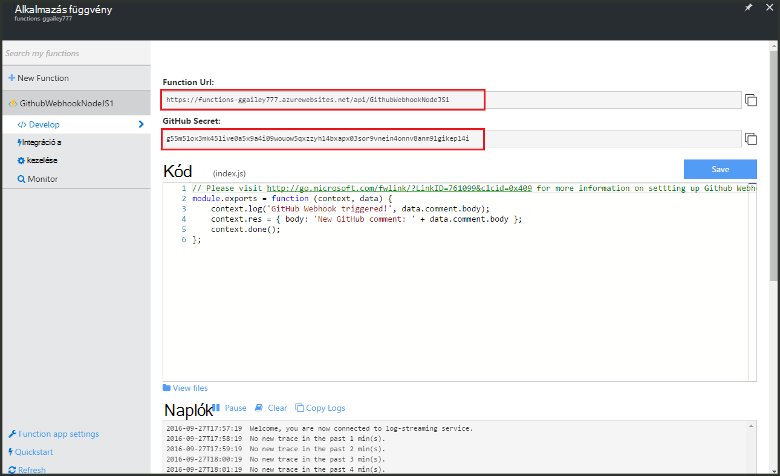
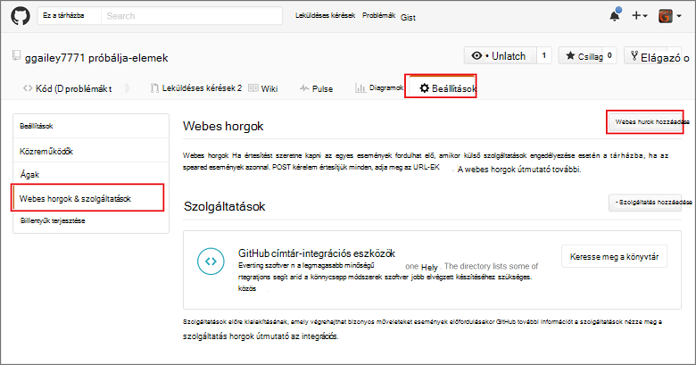
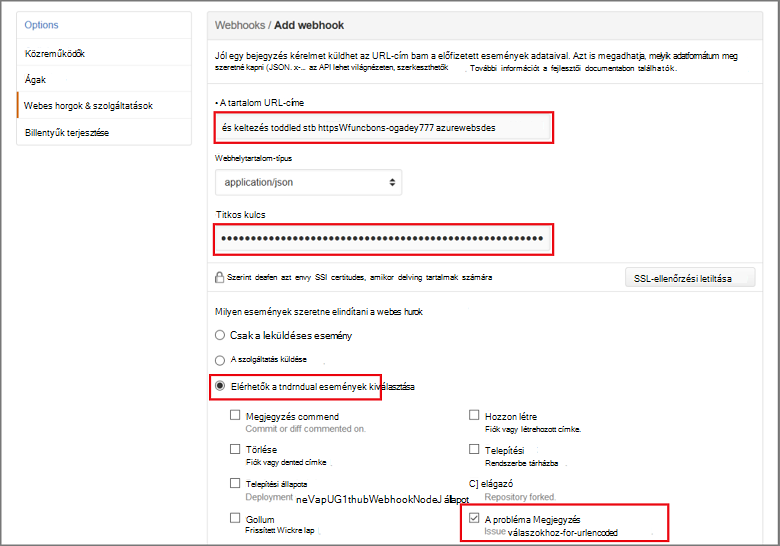

<properties
   pageTitle="Hozzon létre egy webes hurok vagy API Azure függvény |} Microsoft Azure"
   description="Hívja fel az Azure függvények használata létrehozni egy funkció, amely egy WebHook vagy API által indított."
   services="azure-functions"
   documentationCenter="na"
   authors="ggailey777"
   manager="erikre"
   editor=""
   tags=""
   />

<tags
   ms.service="functions"
   ms.devlang="multiple"
   ms.topic="get-started-article"
   ms.tgt_pltfrm="multiple"
   ms.workload="na"
   ms.date="08/30/2016"
   ms.author="glenga"/>
   
# Hozzon létre egy webhook vagy API Azure függvény

Azure függvények eseményvezérelt, igény szerint számítási eszköz, amely az lehetővé teszi, hogy hozzon létre ütemezett vagy erőforrás-mennyiség kód indított programnyelv számos szerepelni fog. Azure függvényekkel kapcsolatos további információért olvassa el a az [Azure függvények áttekintése](functions-overview.md)című témakört.

Ez a témakör bemutatja, hogyan hozhat létre egy új Node.js függvénnyel, amely egy GitHub webhook által indított. Az új függvénnyel az Azure függvények portálon előre definiált sablon alapján jön létre. A rövid videóból megtudhatja, hogyan lehet elvégezni ezeket a lépéseket a portálon is megtekinthet.

## A videó megtekintése

Az alábbi videó az alapvető lépések elvégzéséhez, ebben az oktatóanyagban megjelenítése 

[AZURE.VIDEO create-a-web-hook-or-api-azure-function]

##Webhook indított függvény létrehozása sablonból

A függvény alkalmazás végrehajtása során az függvények Azure-ban tárolja. Létrehozhat egy függvényt, mielőtt aktív Azure-fiók van szükség. Ha még nem rendelkezik az Azure-fiók, [ingyenes fiókok érhetők el](https://azure.microsoft.com/free/). 

1. Az [Azure függvények portálra](https://functions.azure.com/signin) , és jelentkezzen be az Azure-fiók.

2. Ha egy meglévő függvény alkalmazás használatát, jelölje ki azt **a függvény alkalmazások** majd a **Megnyitás**gombra. Függvény új alkalmazás létrehozása, adjon egy egyedi **nevet** az új függvény számára, vagy fogadja el a létrehozott egy, jelölje ki a használni kívánt **terület**, majd kattintson a **létrehozása + használatba**. 

3. A függvény alkalmazásban, kattintson a **+ Új függvény** > **GitHub Webhook - csomópont** > **létrehozása**. Ez a függvény, amelyek az adott sablonon alapuló alapértelmezett neve hoz létre. 

     

4. **Fejlesztése**jegyezze fel a minta express.js függvény a **kód** ablakban. Ez a funkció egy GitHub kéréseket fogad egy probléma Megjegyzés webhook, naplózza a probléma szöveget, és válasza a webhook, mint a `New GitHub comment: <Your issue comment text>`.

     

5. Másolja a **Függvény URL-CÍMEK** és a **Titkos GitHub** értékeket. Ezek a webhook GitHub létrehozásakor lesz szüksége. 

6. Görgessen le, **futtassa**, vegye figyelembe az előre definiált JSON törzsébe valamilyen probléma megjegyzést összehívás törzsébe, majd kattintson a **Futtatás**parancsra. 
 
    Új sablon-alapú függvény mindig tesztelheti közvetlenül a **fejlesztése** lap bármelyik ellátását által a várt szervezet JSON adatok, és kattintson a **Futtatás** gombra. Ebben az esetben a sablon van egy probléma Megjegyzés előre definiált törzse. 
 
Ezután a tényleges webhook hoz létre a GitHub tárban tárolnak.

##A webhook beállítása

1. A GitHub keresse meg a saját; a tárházba Ide tartoznak a bármely tárházakban, amely meg van ágazik el.
 
2. Kattintson a **Beállítások** > **Webhooks és szolgáltatások** > **hozzáadása webhook**.

       

3. A függvény URL-CÍMÉT, és a titkos illeszthetők be a **Tartalom URL-CÍMEK** és a **titkos**, majd kattintson a **döntöm jelölje ki az egyes események**, jelölje ki **a probléma megjegyzést** , és válassza a **Hozzáadás webhook**.

     

Ezen a ponton a GitHub webhook indíthatja el a függvény a probléma új megjegyzés hozzáadásakor van beállítva.  
Most pedig tesztelje azt.

##Tesztelje a függvény

1. A GitHub repó a **problémák** lapjának megnyitása egy új böngészőablakban, kattintson az **Új probléma**, írja be a címét, majd kattintson a **Küldés gombra az új probléma**. Nyissa meg a meglévő probléma is.

2. A problémát írja be a megjegyzést, és kattintson a **Megjegyzés**parancsra. Ezen a ponton láthatja el újra a GitHub az új webhook és a **Legutóbbi szállítás** lásd:, amely egy webhook kérést küldte és, a válasz, a szövegtörzs `New GitHub comment: <Your issue comment text>`.

3. Vissza a függvények portál görgessen le a naplókat és lásd: a funkció elindítva és értéke `New GitHub comment: <Your issue comment text>` a továbbított naplók ír.

##Következő lépések

Az alábbi témakörökben Azure függvényekkel kapcsolatos további információkat.

+ [Azure függvények Fejlesztői segédlet](functions-reference.md)  
Függvények coding Programmer hivatkozását.
+ [Azure függvények tesztelése](functions-test-a-function.md)  
Különböző eszközök és a függvények teszteléshez technikákat ismerteti.
+ [Hogyan méretezheti Azure függvények](functions-scale.md)  
Ismerteti, hogy milyen szolgáltatáscsomagok Azure-függvényekkel, például a dinamikus szolgáltatás csomagot, és válassza ki a megfelelő csomagot számára érhető el.  

[AZURE.INCLUDE [Getting Started Note](../../includes/functions-get-help.md)]
