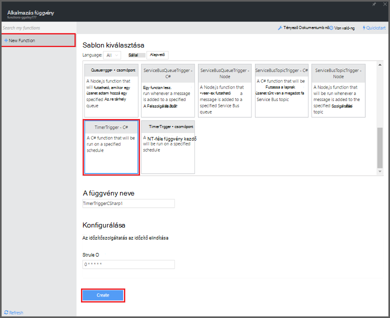
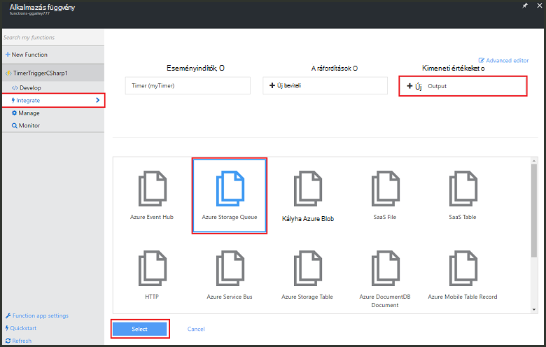
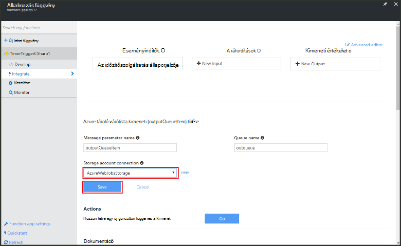

<properties
   pageTitle="Feldolgozási függvény esemény létrehozása |} Microsoft Azure"
   description="Azure függvények használata futó alapján egy esemény időzítő C# függvény létrehozása."
   services="functions"
   documentationCenter="na"
   authors="ggailey777"
   manager="erikre"
   editor=""
   tags=""
   />

<tags
   ms.service="functions"
   ms.devlang="multiple"
   ms.topic="get-started-article"
   ms.tgt_pltfrm="multiple"
   ms.workload="na"
   ms.date="09/25/2016"
   ms.author="glenga"/>
   
# Azure függvény feldolgozása esemény létrehozása

Azure függvények eseményvezérelt, igény szerint számítási eszköz, amely az lehetővé teszi, hogy hozzon létre ütemezett vagy kód egységeinek indított programnyelv számos szerepelni fog. Azure függvényekkel kapcsolatos további információért olvassa el a az [Azure függvények áttekintése](functions-overview.md)című témakört.

Ez a témakör bemutatja, hogyan hozhat létre egy új függvény a C# végrehajtó egy esemény időzítő üzenetek hozzáadásához tároló várólista alapján. 

## Előfeltételek 

Létrehozhat egy függvényt, mielőtt aktív Azure-fiók van szükség. Ha még nem rendelkezik az Azure-fiók, [ingyenes fiókok érhetők el](https://azure.microsoft.com/free/).

## Az időzítőszolgáltatás indított függvény létrehozása a sablon alapján

A függvény alkalmazás végrehajtása során az függvények Azure-ban tárolja. Létrehozhat egy függvényt, mielőtt aktív Azure-fiók van szükség. Ha még nem rendelkezik az Azure-fiók, [ingyenes fiókok érhetők el](https://azure.microsoft.com/free/). 

1. Az [Azure függvények portálra](https://functions.azure.com/signin) , és jelentkezzen be az Azure-fiók.

2. Ha egy meglévő függvény alkalmazás használatát, jelölje ki azt **a függvény alkalmazások** majd a **Megnyitás**gombra. Függvény új alkalmazás létrehozása, adjon egy egyedi **nevet** az új függvény számára, vagy fogadja el a létrehozott egy, jelölje ki a használni kívánt **terület**, majd kattintson a **létrehozása + használatba**. 

3. A függvény alkalmazásban, kattintson a **+ Új függvény** > **TimerTrigger - C#** > **létrehozása**. Ez a függvény a percenként egyszer alapértelmezett időbeosztását futó alapértelmezett névvel hoz létre. 

    

4. Kattintson az új függvénnyel **Integrate** lapra > **Új kimeneti** > **Azure tárolás várólista** > **Jelölje ki**.

    

5. **Azure tároló várólista kimeneti**jelölje be a meglévő **tároló fiók kapcsolata**, vagy hozzon létre egy újat, majd kattintson a **Mentés**gombra. 

    

6. Vissza a **fejlesztése** lap cserélje ki a **a kódablakában** meglévő C# parancsfájl a következő kódot:

        using System;
        
        public static void Run(TimerInfo myTimer, out string outputQueueItem, TraceWriter log)
        {
            // Add a new scheduled message to the queue.
            outputQueueItem = $"Ping message added to the queue at: {DateTime.Now}.";
            
            // Also write the message to the logs.
            log.Info(outputQueueItem);
        }

    Kód hozzáadása a várólista az aktuális dátum és idő, a függvény végrehajtása esetén az új üzenet.

7. Kattintson a **Mentés** gombra, és figyelje a **Naplók** windows következő függvény végrehajtása.

8. (Nem kötelező) Keresse meg a tárterület-fiókot, és ellenőrizze, hogy a várakozási sorban található üzenetek hozzáadott.

9. Térjen vissza az **Integrate** fülre, és módosíthatja az ütemterv mezőt `0 0 * * * *`. A funkció most futtatja óránként. 

Ez nagyon egyszerűsített az időzítő az eseményindító és a tárhely várólista példája kimeneti kötése. További tudnivalókért lásd: az [Azure függvények időzítő eseményindító](functions-bindings-timer.md) és az [Azure függvények eseményindítók és Azure tárolására kötések](functions-bindings-storage.md) témakörök is.

##Következő lépések

Az alábbi témakörökben Azure függvényekkel kapcsolatos további információkat.

+ [Azure függvények Fejlesztői segédlet](functions-reference.md)  
Függvények kódolási és eseményindítók és kötések definiáló Programmer hivatkozását.
+ [Azure függvények tesztelése](functions-test-a-function.md)  
Különböző eszközök és a függvények teszteléshez technikákat ismerteti.
+ [Hogyan méretezheti Azure függvények](functions-scale.md)  
Ismerteti, hogy milyen szolgáltatáscsomagok Azure-függvényekkel, például a dinamikus szolgáltatás csomagot, és válassza ki a megfelelő csomagot számára érhető el.  

[AZURE.INCLUDE [Getting Started Note](../../includes/functions-get-help.md)]
