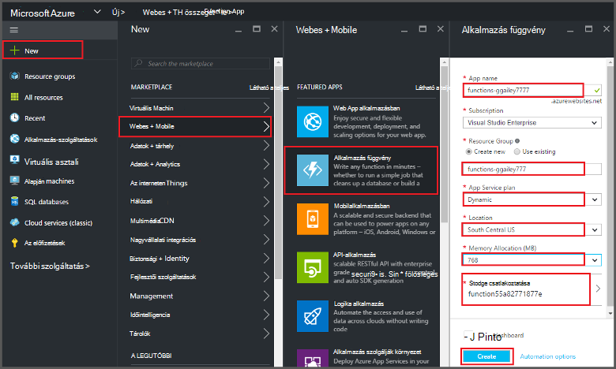
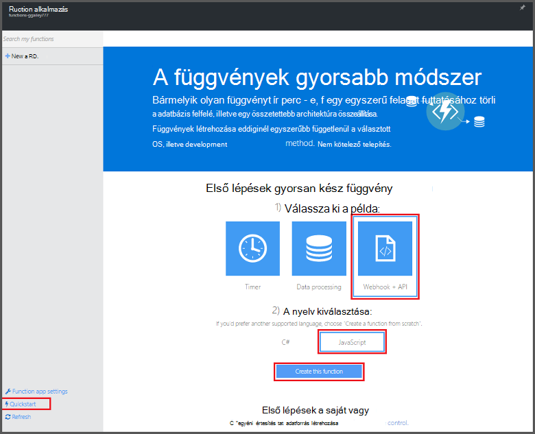
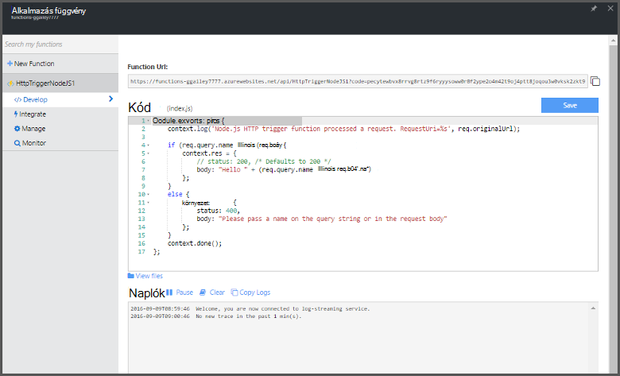

<properties
   pageTitle="Függvény létrehozása az Azure portálról |} Microsoft Azure"
   description="Az első Azure függvény, a kiszolgáló nélküli alkalmazás két perc összeállítása."
   services="functions"
   documentationCenter="na"
   authors="ggailey777"
   manager="erikre"
   editor=""
   tags=""
/>

<tags
   ms.service="functions"
   ms.devlang="multiple"
   ms.topic="article"
   ms.tgt_pltfrm="multiple"
   ms.workload="na"
   ms.date="09/08/2016"
   ms.author="glenga"/>

#Függvény létrehozása az Azure portálról

##– Áttekintés
Azure függvények eseményvezérelt, igény szerint számítási funkcióit, a meglévő alkalmazás Azure platform kód más Azure szolgáltatások, a szoftver termékek és a helyszíni rendszerek bekövetkezett esemény által indított végrehajtásához funkciókhoz nyúló. Azure függvényekkel az alkalmazások alapján igény szerint átméretezheti, vagy ha Ön felhasználása erőforrásokért. Azure függvény lehetővé teszi, hogy hozhat létre az ütemezett vagy egységek különböző programozási nyelven végrehajtott kód indított. Azure függvényekkel kapcsolatos további információért olvassa el a az [Azure függvények áttekintése](functions-overview.md)című témakört.

Ez a témakör bemutatja, hogyan az Azure portal segítségével hozzon létre egy egyszerű "Helló, világ" Node.js Azure függvény, amely a HTTP-eseménykód által indított. Előtt függvény az Azure-portálon hozhat létre, létre kell hoznia egy függvény alkalmazás kifejezetten Azure alkalmazás szolgáltatás. Rendelkezik a függvény alkalmazásával jött létre automatikusan, olvassa el [a másik Azure függvények quickstart útmutató oktatóprogram során](functions-create-first-azure-function.md), mely egy egyszerűbb quickstart útmutató felület és a videó tartalmazza.

##Függvény-alkalmazás létrehozása

A függvény alkalmazás végrehajtása során az függvények Azure-ban tárolja. Kövesse ezeket a lépéseket követve függvény alkalmazás létrehozása az Azure-portálon.

Mielőtt az első függvény hozhat létre, active Azure-fiók van szükség. Ha még nem rendelkezik az Azure-fiók, [ingyenes fiókok érhetők el](https://azure.microsoft.com/free/).

1. Az [Azure-portálra](https://portal.azure.com) , és jelentkezzen be az Azure-fiók.

2. Kattintson a **+ Új** > **webes + Mobile** > **Függvény alkalmazást**, válassza az **előfizetés**, írjon be egy egyedi **alkalmazás neve** , amely azonosítja az függvény-alkalmazást, majd adja meg a következő beállításokat:

    + **[Erőforráscsoport](../azure-portal/resource-group-portal.md/)**: jelölje be az **Új létrehozása** , és írjon be egy nevet az új erőforrás csoport. Egy meglévő erőforráscsoport is választhat, azonban nem lehet a függvény alkalmazás dinamikus alkalmazás szolgáltatás tervet készíthet.
    + **[Alkalmazás szolgáltatáscsomagja](../app-service/azure-web-sites-web-hosting-plans-in-depth-overview.md)**: Jelölje ki a *dinamikus* , vagy a *Klasszikus*. 
        + **Dinamikus**: Azure függvények alapértelmezett terv típusát. Ha úgy dönt, hogy egy dinamikus tervet, kell is válassza ki azt a **helyet** , és beállítani az **Memóriafoglalást** (MB). Információ a memóriafoglalást költségek, című témakörből [Azure függvények árak](https://azure.microsoft.com/pricing/details/functions/). 
        + **Klasszikus**: klasszikus alkalmazás szolgáltatáscsomagja kéri az **alkalmazás terv/SRV** létrehozásához, vagy jelöljön ki egy meglévőt. Ezek a beállítások határozzák meg a [helyet, funkcióiról, költség, és erőforrások kiszámítására](https://azure.microsoft.com/pricing/details/app-service/) az alkalmazással társított.  
    + **Tárterület-fiók**: minden függvény alkalmazás tárterület-fiók szükséges. Válasszon ki egy meglévő tárterület-fiókot, vagy hozzon létre egy újat. 

    

3. Kiépítése kattintson a **Létrehozás** gombra, és telepítse az új függvény alkalmazást.  

Most, hogy a függvény alkalmazás már kiépítve, az első függvény hozhat létre.

## Hozzon létre egy függvény

Ezeket a lépéseket a függvény az Azure függvények quickstart útmutató hozható létre.

1. **Quickstart útmutató** lapján kattintson a **WebHook + API-val** és a **JavaScript**, majd **létrehozása függvényt**. Új előre definiált Node.js függvényt jön létre. 

    

2. (Nem kötelező) Ezen a ponton a quickstart útmutató a megadhatja a portálon Azure függvények funkcióinak rövid bemutatóra.   Miután befejeződött, vagy a kihagyott a bemutatót, a HTTP eseményindító használatával tesztelheti az új függvénnyel.

##Tesztelje a függvény

Mivel az Azure függvények QuickStarts csomagban funkcionális kódot tartalmaznak, az új függvénnyel azonnal tesztelheti.

1. A **fejlesztése** lapon tekintse át a **kódot** ablak, és figyelje meg, hogy Node.js kód HTTP felkérés vár, az üzenet törzsébe, vagy egy lekérdezési karakterláncban átadott érték *nevét* . Ha a függvény fut, ez a visszaadott érték a válaszüzenetben.

    

2. Görgessen le a **szervezet kérése** szövegdobozra, módosítsa a *name* tulajdonság értékét meg a nevét, és kattintson a **Futtatás**parancsra. Jelenik meg, hogy próba HTTP kérelem végrehajtás induljanak, az adatokat írja be a továbbított naplókat, és a **kimeneti**megjelenik a "hello" választ. 

3. Indíthatja el az azonos függvény egy másik böngészőablakban vagy lap végrehajtását, a **Függvény URL-címe** értéket másolja a **fejlesztése** lap illessze be a böngésző címsorában, majd a lekérdezés karakterláncérték hozzáfűző `&name=yourname` , és nyomja le az enter. Az azonos adatokat írja be a naplókat, és a böngészőben jeleníti meg a "hello" válasz előtt.

##Következő lépések

Ez a quickstart útmutató egy egyszerű HTTP indított függvény rendkívül egyszerű végrehajtását mutatja be. Az alábbi témakörökben további információt a power Azure függvények az alkalmazás használatáról.

+ [Azure függvények Fejlesztői segédlet](functions-reference.md)  
Függvények kódolási és eseményindítók és kötések definiáló Programmer hivatkozását.
+ [Azure függvények tesztelése](functions-test-a-function.md)  
Különböző eszközök és a függvények teszteléshez technikákat ismerteti.
+ [Hogyan méretezheti Azure függvények](functions-scale.md)  
Ismerteti, hogy milyen szolgáltatáscsomagok Azure-függvényekkel, például a dinamikus szolgáltatás csomagot, és válassza ki a megfelelő csomagot számára érhető el. 
+ [Mi az Azure alkalmazás szolgáltatás?](../app-service/app-service-value-prop-what-is.md)  
Azure függvények alapvető funkcionalitást, például a telepítések, környezeti változók és diagnosztika az Azure alkalmazás szolgáltatás platformot használja. 

[AZURE.INCLUDE [Getting Started Note](../../includes/functions-get-help.md)]
