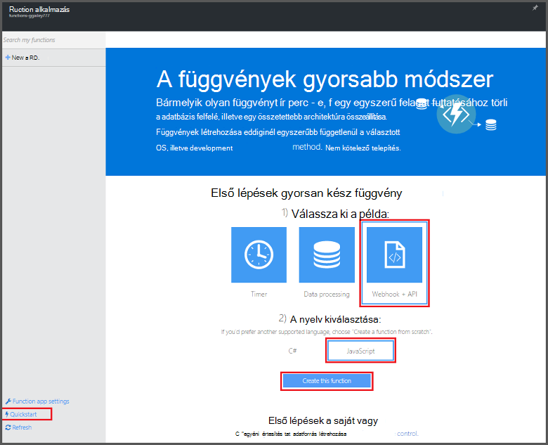
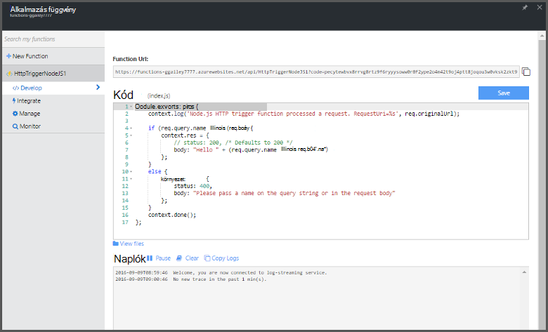

<properties
   pageTitle="Az első Azure függvény létrehozása |} Microsoft Azure"
   description="Az első Azure függvény, a kiszolgáló nélküli alkalmazás két perc összeállítása."
   services="functions"
   documentationCenter="na"
   authors="ggailey777"
   manager="erikre"
   editor=""
   tags=""
/>

<tags
   ms.service="functions"
   ms.devlang="multiple"
   ms.topic="hero-article"
   ms.tgt_pltfrm="multiple"
   ms.workload="na"
   ms.date="09/08/2016"
   ms.author="glenga"/>

#Az első Azure függvény létrehozása

##– Áttekintés
Azure függvények eseményvezérelt, igény szerint számítási funkcióit, a meglévő alkalmazás Azure platform kód más Azure szolgáltatások, a szoftver termékek és a helyszíni rendszerek bekövetkezett esemény által indított végrehajtásához funkciókhoz nyúló. Azure függvényekkel az alkalmazások alapján igény szerint átméretezheti, vagy ha Ön felhasználása erőforrásokért. Azure függvény lehetővé teszi, hogy hozhat létre az ütemezett vagy indított egységeinek programnyelv számos szerepelni fog kódot. Azure függvényekkel kapcsolatos további információért olvassa el a az [Azure függvények áttekintése](functions-overview.md)című témakört.

Ez a témakör bemutatja, hogyan az Azure függvények quickstart útmutató a portálon létrehozásához használandó egyszerű "Helló, világ" Node.js függvény, amely a HTTP-eseménykód által indított. A rövid videóból megtudhatja, hogyan lehet elvégezni ezeket a lépéseket a portálon is megtekinthet.

## A videó megtekintése

Az alábbi videó bemutatják, hogyan ebben az oktatóprogramban az alapvető lépések végrehajtásához. 

[AZURE.VIDEO create-your-first-azure-function-simple]

##A függvény a quickstart útmutató létrehozása

A függvény alkalmazás végrehajtása során az függvények Azure-ban tárolja. Kövesse ezeket a lépéseket követve hozzon létre egy új függvény alkalmazást, valamint az új függvénnyel. Az új alkalmazás függvényt jön létre az alapértelmezett beállításokkal. Példa bemutatja, hogyan kifejezetten a függvény-alkalmazás létrehozása, akkor olvassa el [a másik Azure függvények quickstart útmutató oktatóprogram során](functions-create-first-azure-function-azure-portal.md).

Mielőtt az első függvény hozhat létre, aktív Azure-fiók van szükség. Ha még nem rendelkezik az Azure-fiók, [ingyenes fiókok érhetők el](https://azure.microsoft.com/free/).

1. Az [Azure függvények portálra](https://functions.azure.com/signin) , és jelentkezzen be az Azure-fiók.

2. Adjon egy egyedi **nevet** az új függvény számára, vagy fogadja el a létrehozott egy, jelölje ki a használni kívánt **terület**, majd kattintson **létrehozása + használatba**. 

3. **Quickstart útmutató** lapján kattintson a **WebHook + API-val** és a **JavaScript**, majd **létrehozása függvényt**. Új előre definiált Node.js függvényt jön létre. 

    

4. (Nem kötelező) Ezen a ponton a quickstart útmutató a megadhatja a portálon Azure függvények funkcióinak rövid bemutatóra.   Miután befejeződött, vagy a kihagyott a bemutatót, a HTTP eseményindító használatával tesztelheti az új függvénnyel.

##Tesztelje a függvény

Mivel az Azure függvények QuickStarts csomagban funkcionális kódot tartalmaznak, az új függvénnyel azonnal tesztelheti.

1. A **fejlesztése** lapon tekintse át a **kódot** ablak, és figyelje meg, hogy Node.js kód HTTP felkérés vár, az üzenet törzsébe, vagy egy lekérdezési karakterláncban átadott érték *nevét* . Ha a függvény fut, ez a visszaadott érték a válaszüzenetben.

    

2. Görgessen le a **szervezet kérése** szövegdobozra, módosítsa a *name* tulajdonság értékét meg a nevét, és kattintson a **Futtatás**parancsra. Láthatja, hogy próba HTTP kérelem végrehajtás induljanak, az adatokat írja be a továbbított naplókat, és a **kimeneti**megjelenik a "hello" választ. 

3. Indíthatja el az azonos függvény egy másik böngészőablakban vagy lap végrehajtását, a **Függvény URL-címe** értéket másolja a **fejlesztése** lap illessze be a böngésző címsorában, majd a lekérdezési karakterlánc érték `&name=yourname` , és nyomja le az enter. Az azonos adatokat írja be a naplókat, és a böngészőben jeleníti meg a "hello" válasz előtt.

##Következő lépések

Ez a quickstart útmutató egy egyszerű HTTP indított függvény rendkívül egyszerű végrehajtását mutatja be. Az alábbi témakörökben további információt a power az alkalmazások az Azure függvények használata.

+ [Azure függvények Fejlesztői segédlet](functions-reference.md)  
Függvények kódolási és eseményindítók és kötések definiáló Programmer hivatkozását.
+ [Azure függvények tesztelése](functions-test-a-function.md)  
Különböző eszközök és a függvények teszteléshez technikákat ismerteti.
+ [Hogyan méretezheti Azure függvények](functions-scale.md)  
Ismerteti, hogy milyen szolgáltatáscsomagok Azure-függvényekkel, például a dinamikus szolgáltatás csomagot, és válassza ki a megfelelő csomagot számára érhető el. 
+ [Mi az Azure alkalmazás szolgáltatást?](../app-service/app-service-value-prop-what-is.md)  
Azure függvények az Azure alkalmazás szolgáltatás platform az alapvető funkcionalitást, például a telepítések, környezeti változók és diagnosztika használja. 

[AZURE.INCLUDE [Getting Started Note](../../includes/functions-get-help.md)]
