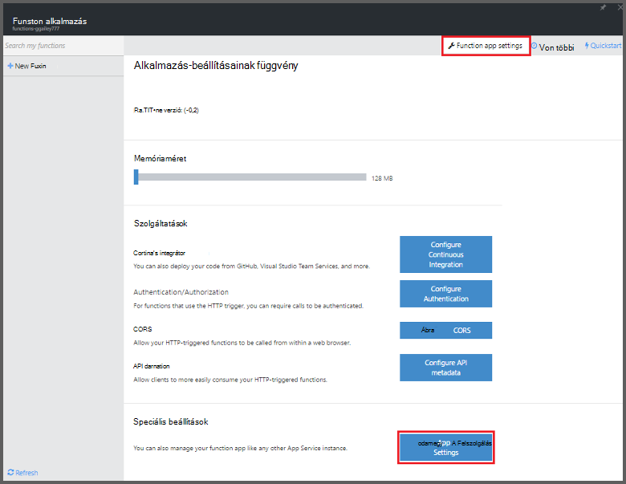
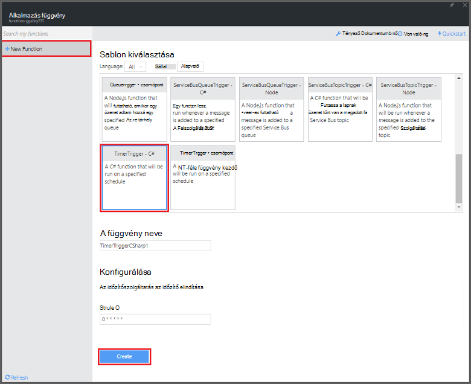

<properties
   pageTitle="Azure függvények használata a karbantartási ütemezett feladat elvégzéséhez |} Microsoft Azure"
   description="Azure függvények használata futó alapján egy esemény időzítő C# függvény létrehozása."
   services="functions"
   documentationCenter="na"
   authors="ggailey777"
   manager="erikre"
   editor=""
   tags=""
   />

<tags
   ms.service="functions"
   ms.devlang="multiple"
   ms.topic="article"
   ms.tgt_pltfrm="multiple"
   ms.workload="na"
   ms.date="09/26/2016"
   ms.author="glenga"/>
   
# Azure függvények használata a karbantartási ütemezett feladat végrehajtása

Ez a témakör bemutatja, hogyan Azure függvények használatával hozzon létre egy új függvény C# futó alapján egy esemény időzítő a karbantartási adatbázis tábla sorainak. Az új függvénnyel az Azure függvények portálon előre definiált sablon alapján jön létre. A támogatási ebben az esetben, meg kell adnia egy adatbázis-kapcsolati karakterláncot alkalmazás szolgáltatásként beállítása a függvény alkalmazásban. 

## Előfeltételek 

Létrehozhat egy függvényt, mielőtt aktív Azure-fiók van szükség. Ha még nem rendelkezik az Azure-fiók, [ingyenes fiókok érhetők el](https://azure.microsoft.com/free/).

Ez a témakör bemutatja, hogyan végrehajtja a tömeges törlési műveletet *TodoItems* SQL-adatbázisban nevű táblába Transact-SQL nyelvben parancs. A TodoItems táblázatból, amelyben az [Azure alkalmazás szolgáltatás Mobile-alkalmazások quickstart útmutató oktatóprogram](../app-service-mobile/app-service-mobile-ios-get-started.md)befejezésekor jön létre. Akkor is használhatja az mintaadatbázis, ha úgy dönt, hogy egy másik tábla használja, meg kell módosítani a parancsot.

A kapcsolati karakterlánc, egy mobilalkalmazás kódmentes **minden**beállítás a portálon által használt elérheti > **Alkalmazásbeállítások** > **csatlakozási_karakterlánc** > **kapcsolati karakterláncot az értékek megjelenítése** > **MS_TableConnectionString**. Is megnyithatja a kapcsolati karakterlánc közvetlenül a portálon az **összes beállítások**SQL-adatbázisból > **Tulajdonságok** > **adatbázis csatlakozási_karakterlánc megjelenítése** > **ADO.NET (SQL-hitelesítés)**.

Ebben a példában az adatbázison tömeges műveletet. Ahhoz, hogy a függvény folyamat egyes CRUD műveletek Mobile-alkalmazások táblázatban, helyette Mobile táblázat kötelezővé kell használni.

## Kapcsolati karakterlánc SQL-adatbázis megadása a függvény alkalmazásban

A függvény alkalmazás végrehajtása során az függvények Azure-ban tárolja. A legjobb megoldás csatlakozási_karakterlánc és a többi titkos kulcsok tárolását a függvény alkalmazás beállításainak. Ha leállítja a függvény kód felfelé egy repó valahol a így véletlen közzétételét. 

1. Az [Azure függvények portálra](https://functions.azure.com/signin) , és jelentkezzen be az Azure-fiók.

2. Ha egy meglévő függvény alkalmazás használatát, jelölje ki azt **a függvény alkalmazások** majd a **Megnyitás**gombra. Függvény új alkalmazás létrehozása, adjon egy egyedi **nevet** az új függvény számára, vagy fogadja el a létrehozott egy, jelölje ki a használni kívánt **terület**, majd kattintson a **létrehozása + használatba**. 

3. A függvény alkalmazásban, kattintson a **függvény alkalmazás beállításainak** > **Nyissa meg az App szolgáltatás beállításai**. 

    

4. A függvény alkalmazásban kattintson **a minden elérhető beállítás**, görgessen le az **alkalmazás beállításait**, majd a **kapcsolati karakterlánc** típus `sqldb_connection` **nevét**, illessze be a kapcsolati karakterlánc **értéket**, kattintson a **Mentés**gombra, majd zárja be a függvény a alkalmazás lap a függvények portál való visszatéréshez.

    

Most a C# függvény kódot, amely csatlakozik az SQL-adatbázishoz is hozzáadhat.

## Az időzítőszolgáltatás indított függvény létrehozása a sablon alapján

1. A függvény alkalmazásban, kattintson a **+ Új függvény** > **TimerTrigger - C#** > **létrehozása**. Ez a függvény a percenként egyszer alapértelmezett időbeosztását futó alapértelmezett névvel hoz létre. 

    

2. A **kód** ablaktáblában **fejlesztése** lapján a következő összeállítás hivatkozások hozzáadása a meglévő függvény kódot tetején:

        #r "System.Configuration"
        #r "System.Data"

3. Adja hozzá a következő `using` kimutatások, a függvény:

        using System.Configuration;
        using System.Data.SqlClient;
        using System.Threading.Tasks; 

4. A meglévő **futtatása** függvény cserélje ki a következő kódot:

        public static async Task Run(TimerInfo myTimer, TraceWriter log)
        {
            var str = ConfigurationManager.ConnectionStrings["sqldb_connection"].ConnectionString;
            using (SqlConnection conn = new SqlConnection(str))
            {
                conn.Open();
                var text = "DELETE from dbo.TodoItems WHERE Complete='True'";
                using (SqlCommand cmd = new SqlCommand(text, conn))
                {
                    // Execute the command and log the # rows deleted.
                    var rows = await cmd.ExecuteNonQueryAsync();
                    log.Info($"{rows} rows were deleted");
                }
            }
        }

5. Kattintson a **Mentés**gombra, megtekintés a következő függvény végrehajtása a **Naplók** windows, és jegyezze fel a TodoItems táblából törölt sorok számát.

6. (Nem kötelező) A [Mobile-alkalmazások quickstart útmutató alkalmazást](../app-service-mobile/app-service-mobile-ios-get-started.md)használ, megjelölése további elemek "befejeződött" majd térjen vissza a **Naplók** ablakban, és a Megtekintés azonos számú sorok vehet a függvény a következő végrehajtás során. 

##Következő lépések

Az alábbi témakörökben Azure függvényekkel kapcsolatos további információkat.

+ [Azure függvények Fejlesztői segédlet](functions-reference.md)  
Függvények kódolási és eseményindítók és kötések definiáló Programmer hivatkozását.
+ [Azure függvények tesztelése](functions-test-a-function.md)  
Különböző eszközök és a függvények teszteléshez technikákat ismerteti.
+ [Hogyan méretezheti Azure függvények](functions-scale.md)  
Ismerteti, hogy milyen szolgáltatáscsomagok Azure-függvényekkel, például a dinamikus szolgáltatás csomagot, és válassza ki a megfelelő csomagot számára érhető el.  

[AZURE.INCLUDE [Getting Started Note](../../includes/functions-get-help.md)]